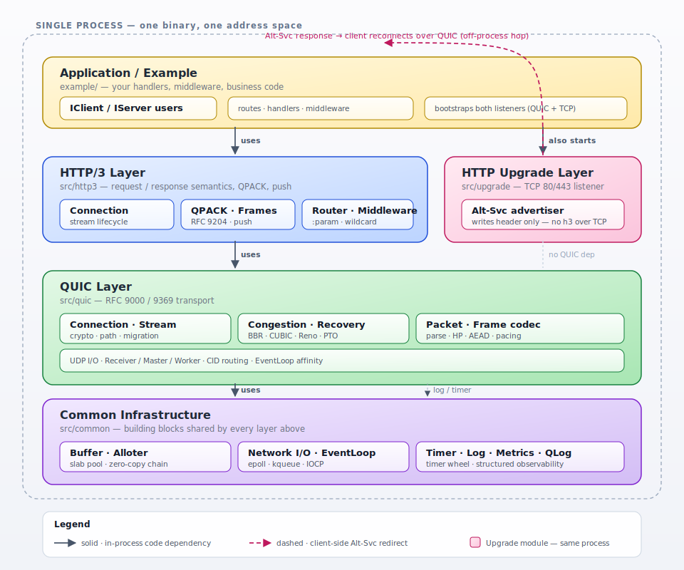

<p align="left"></p>

<p align="left">
  <a href="https://opensource.org/licenses/BSD-3-Clause"></a>
  
  
  
  
</p>

[English](./README.md)
---

**QuicX** 是一套自包含的 C++17 QUIC / HTTP/3 协议栈：从 UDP socket、TLS 1.3（BoringSSL）、QUIC 流，一路到 HTTP/3 路由、QPACK 与服务端推送，全部在同一个仓库里实现，不依赖任何外部 HTTP 框架。

它的目标是**读得懂、跑得通**——一份清晰的代码带你看清一个数据包从网卡到 HTTP/3 handler 的完整生命周期，背后有 1196+ 单元测试、干净的 ASan / UBSan / TSan 结果，以及与主流实现 91.7% 的互通通过率。它**唯一还没做的**，是承载大规模生产流量；请把它当作一份可信的参考实现来用、来学、来扩展。

---

## 架构

QuicX 是**单进程架构**：Application、HTTP/3、HTTP Upgrade、QUIC、Common 五个源码模块全部链接进同一地址空间。

<p align="center">
  
</p>

请求沿实线自上而下流动：用户的 `IServer` handler → HTTP/3 Connection / QPACK / Router → QUIC 流与拥塞控制 → Common 层网络与缓冲 → UDP 出网卡。

**HTTP Upgrade 与 HTTP/3 同级**：在 TCP 80/443 上开第二个 listener，唯一职责就是回写一个 `Alt-Svc` 响应头；它**不依赖** QUIC 层、不在 TCP 上跑 h3。图中那根虚线是**客户端层面的一跳**，不是进程内调用——浏览器收到头之后改用 UDP/QUIC 重新建连。

> 想看一个数据包从 UDP 到 HTTP/3 handler 的完整路径与沿途不变量：[`packet lifecycle`](./docs/zh/design/packet_lifecycle.md)。

---

## 功能特性

### QUIC（RFC 9000 / RFC 9369）

| 功能域 | 说明 |
|---|---|
| **TLS** | BoringSSL 上的 TLS 1.3；0-RTT / 1-RTT；会话票据缓存；SSLKEYLOGFILE |
| **协议版本** | QUIC v1 (`0x00000001`) 与 v2 (`0x6b3343cf`)，支持版本协商 |
| **连接** | 多连接管理；优雅 `CONNECTION_CLOSE`；Retry 防放大攻击 |
| **连接迁移** | 主动迁移（§9）；NAT 重绑定检测；`PATH_CHALLENGE` / `PATH_RESPONSE` 路径验证 |
| **流** | 双向 / 单向流；流级 + 连接级流量控制 |
| **拥塞控制** | BBR v1/v2/v3、CUBIC、Reno（按连接工厂选择）；内置 packet pacer |
| **丢包恢复** | 基于 ACK 的丢包检测；PTO；按加密级别追踪重传 |
| **其他** | 可选 ECN；可选自动密钥更新 |

### HTTP/3

| 功能域 | 说明 |
|---|---|
| **QPACK** | 静态 + 动态表（RFC 9204）；Huffman 编解码 |
| **流** | 请求 / 响应、控制、编码器 / 解码器、可选服务端推送流 |
| **路由** | 路径参数（`:param`）、通配（`*`）、按方法注册 |
| **中间件** | 按 HTTP 方法生效的 Before / After 链 |
| **处理器模式** | **完整模式**（缓冲完整 body）/ **流式模式**（`IAsyncServerHandler` / `IAsyncClientHandler` 按块接收） |
| **HTTP 方法** | GET、HEAD、POST、PUT、DELETE、CONNECT、OPTIONS、TRACE、PATCH |
| **服务端推送** | `PUSH_PROMISE`；客户端可配置接受 / 拒绝回调 |
| **HTTP 升级** | HTTP/1.1 → HTTP/3 升级路径（`src/upgrade`） |

### 核心基础设施

| 组件 | 说明 |
|---|---|
| **内存** | Slab 分配器（`NormalAlloter`）；池化 `BufferChunk` 链；接近零拷贝 I/O |
| **网络** | 跨平台 UDP I/O（Linux / macOS / Windows）；非阻塞事件循环 |
| **线程** | 单线程或多线程；可配 worker 数 |
| **定时器** | 分层时间轮（连接空闲、PTO、应用层定时器） |
| **日志 & QLog** | 分级日志；可选 RFC 9001 QLog 跟踪（`-DQUICX_ENABLE_QLOG=ON`） |
| **指标** | 内置 Metrics 注册表，覆盖 UDP / QUIC / HTTP/3 / 拥塞 / 内存 / TLS / 迁移 / Retry |

> 已实现 / 部分实现 清单见 [`support matrix`](./docs/zh/reference/support_matrix.md)。

---

## 互通测试

QuicX 持续使用 [`quic-interop-runner`](https://github.com/quic-interop/quic-interop-runner) 与主流 QUIC 实现互通——**14 场景 × 12 对端 × 2 方向 = 每轮 322 个测试组合**。最近一次跑测：

| 指标 | 值 |
|---|---|
| 通过 | **222** |
| 失败 | **20** |
| 不支持 | 94 |
| **通过率**（剔除不支持） | **91.7%** |

按对端实现统计（`通过 / 有效执行`，少于 14 表示某些场景被任一端标为不支持）：

| 对端 | QuicX 作 Server | QuicX 作 Client | 通过率 |
|---|:--:|:--:|:--:|
| **picoquic** | 13/14 | 12/13 | 96.2% |
| **ngtcp2**   | 12/12 | 11/11 | 100% |
| **quic-go**  | 10/10 |  9/9  | 100% |
| **neqo**     | 10/10 |  9/10 | 95.0% |
| **lsquic**   | 10/10 |  9/10 | 95.0% |
| **aioquic**  | 10/10 |  9/10 | 95.0% |
| **quiche**   |  7/7  |  8/8  | 100% |
| **msquic**   |  8/10 | 10/10 | 90.0% |
| **quinn**    | 14/14 |  9/9  | 100% |
| **mvfst**    |  4/6  |  1/6  | 41.7% |
| **s2n-quic** |  0/6  |  9/10 | 56.3% |

覆盖场景：`handshake`、`transfer`、`retry`、`resumption`、`zerortt`、`http3`、`multiconnect`、`versionnegotiation`、`chacha20`、`keyupdate`、`v2`、`rebind-port`、`rebind-addr`、`connectionmigration`。

完整报告与失败根因分析：[`interop status`](./docs/zh/reports/interop_status.md)
本地复现：[`interop runbook`](./docs/zh/guide/interop_runbook.md)。

---

## 上手

所有示例位于 `example/`，开启 `-DBUILD_EXAMPLES=ON` 即可编译。建议从 `hello_world` 开始；按场景挑选：

- **请求 / 响应基础**：`hello_world`、`restful_api`、`error_handling`
- **流式与大文件**：`streaming_api`、`file_transfer`、`bidirectional_comm`
- **连接行为**：`connection_lifecycle`、`concurrent_requests`、`server_push`
- **运维与可观测**：`metrics_monitoring`、`qlog_integration`、`performance_benchmark`、`load_testing`
- **协议升级与工具**：`upgrade_h3`、`quicx_curl`（类 curl 命令行客户端）

### 测试

```bash
# 单元测试
./build/bin/quicx_utest

# 集成测试（需要本地 server / client）
python3 run_tests.py

# 拥塞控制模拟器
./build/bin/cc_simulator

# 模糊测试（需要 Clang + libFuzzer）
cmake -B build_fuzz -DENABLE_FUZZING=ON -DCMAKE_CXX_COMPILER=clang++
cmake --build build_fuzz
```

---

## 可观测性

**Metrics** — 内置 `MetricsRegistry`，覆盖 UDP 收发与丢包、QUIC 连接 / 包 / 流、流量控制阻塞、HTTP/3 请求与状态码分桶、拥塞窗口与 pacing、RTT 与 ACK 延迟、内存池、TLS 握手与会话恢复、连接迁移、Retry 等维度。运行时直接读取 `MetricsRegistry`，或通过 `Http3ServerConfig::metrics_` / `Http3ClientConfig::metrics_` 暴露 HTTP 端点。

**QLog** — 编译开启 `-DQUICX_ENABLE_QLOG=ON` 并在 `QuicConfig::qlog_config_` 中配置输出路径即可，生成的跟踪文件兼容 [qvis](https://qvis.quictools.info/) 和 Wireshark。

---

## 进一步阅读

- 中文文档入口：[`README`](./docs/zh/README.md)（`getting-started/` · `tutorial/` · `guide/` · `reference/` · `reports/` · `design/`）
- 变更历史：[`CHANGELOG.md`](./CHANGELOG.md)
- 安全披露：[`SECURITY.md`](./SECURITY.md)
- 参与贡献：[`CONTRIBUTING.md`](./CONTRIBUTING.md)

---

## 许可证

BSD 3-Clause License — 详见 [LICENSE](LICENSE)。
