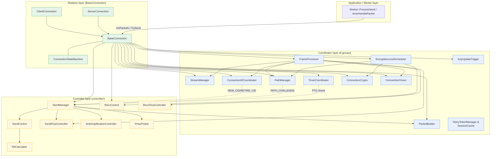

# Connection Anatomy: Skeleton / Coordinators / Controllers

`src/quic/connection/` is the largest subtree in the repository (28 cpp files plus a `controller/` subdirectory). Anyone opening it for the first time is drowned by similarly-named classes — what do `ConnectionIDManager` / `ConnectionIDCoordinator` each manage? `SendManager` / `SendControl` / `SendFlowController` all carry "send" in their names; who calls whom?

This document draws a map. After reading it you should be able to:

- Describe how, after `BaseConnection` receives `OnPackets`, the actual work is dispatched to 11 internal components;
- Distinguish the boundary between **coordinators** (coordinator/manager, "decide what to do") and **controllers** (controller, "keep the books and execute by the rules");
- Know exactly which file to open when looking for a specific feature (CID rotation / PTO / flow-control credit / Anti-Amp / PMTU probing / Key Update).

This document does not repeat [`packet_lifecycle.md`](packet_lifecycle.md) (the receive path) or [`handshake_state_machine.md`](handshake_state_machine.md) (the handshake); those care about "where packets come from / how encryption levels advance" — this one cares about **once inside the connection, who is responsible for what**.

---

## 1. The Three-Layer Structure at a Glance



The three layers' responsibilities in one sentence each:

| Layer | Responsibility | Typical Verbs |
| :--- | :--- | :--- |
| Skeleton | Owns all coordinators and controllers; the single object exposed to the Worker | forward, assemble, lifecycle |
| Coordinator (Coordinator / Manager) | "Decide what to do" — break requests into multi-step actions per RFC rules, scheduling several lower-level modules to cooperate | schedule, decide, account |
| Controller (Controller) | "Execute by the rules" — single-responsibility algorithm or state machine, no cross-module cooperation | compute, limit, track |

**A rule of thumb**: when a component needs to "call other components" to fulfill its duty, it is a coordinator; when it only does bookkeeping or computation within one scope, it is a controller. §3 and §4 give concrete examples.

---

## 2. Skeleton Layer: BaseConnection / Client / Server / StateMachine

### 2.1 Class Hierarchy

```
IConnection (internal interface, src/quic/connection/if_connection.h)
   ▲
   │
BaseConnection (connection_base.{h,cpp})
   ▲
   ├──── ServerConnection (connection_server.{h,cpp})
   └──── ClientConnection (connection_client.{h,cpp})
```

`BaseConnection` owns all coordinators and controllers as member variables (see the protected member section starting around line 600 of [`connection_base.h`](../../../src/quic/connection/connection_base.h)):

| Member | Type | Note |
| :--- | :--- | :--- |
| `state_machine_` | `ConnectionStateMachine` | Value type; just the 5-state enum + transition checks |
| `timer_coordinator_` | `unique_ptr<TimerCoordinator>` | Coordinator |
| `cid_coordinator_` | `unique_ptr<ConnectionIDCoordinator>` | Coordinator |
| `path_manager_` | `unique_ptr<PathManager>` | Coordinator |
| `stream_manager_` | `unique_ptr<StreamManager>` | Coordinator |
| `connection_closer_` | `unique_ptr<ConnectionCloser>` | Coordinator |
| `frame_processor_` | `unique_ptr<FrameProcessor>` | Coordinator |
| `encryption_scheduler_` | `unique_ptr<EncryptionLevelScheduler>` | Coordinator |
| `packet_builder_` | `unique_ptr<PacketBuilder>` | Coordinator |
| `connection_crypto_` | `ConnectionCrypto` | Value type; crypto coordinator |
| `send_manager_` | `SendManager` | Value type; send-side coordinator (aggregates several controllers) |
| `recv_control_` | `RecvControl` | Value type; controller |
| `send_flow_controller_` | `SendFlowController` | Value type; controller |
| `recv_flow_controller_` | `RecvFlowController` | Value type; controller |
| `key_update_trigger_` | `KeyUpdateTrigger` | Value type; controller |
| `tls_connection_` | `shared_ptr<TLSConnection>` | TLS adapter of the crypto module |

`BaseConnection` itself **hardly handles protocol logic directly** — its duties are:

1. Receiving the Worker's two main calls: `OnPackets()` (receive) and `TrySend()` (send);
2. Inside `OnPackets`/`TrySend`, deciding via state-machine gates whether to process, then forwarding to the matching coordinator;
3. Providing callback relay: both the `IConnectionStateListener` and `IConnectionEventSink` interfaces are implemented by `BaseConnection`; coordinators bounce events back to the connection through them.

### 2.2 ConnectionStateMachine

Defined in [`connection_state_machine.h`](../../../src/quic/connection/connection_state_machine.h), five states:

| State | Meaning |
| :--- | :--- |
| `kStateConnecting` | Handshaking |
| `kStateConnected` | Handshake complete, normal send/receive |
| `kStateClosing` | **Local end** closing; CONNECTION_CLOSE sent, waiting 1×PTO |
| `kStateDraining` | **Peer** closed; peer's CONNECTION_CLOSE received, no more sending, waiting 3×PTO |
| `kStateClosed` | Terminal state; resources can be released |

Transitions are triggered by the four events `OnHandshakeDone()` / `OnClose()` / `OnConnectionCloseFrameReceived()` / `OnCloseTimeout()`; `BaseConnection` implements `IConnectionStateListener` to observe transitions and broadcast to the coordinators (typical example: `OnStateToDraining` triggers `connection_closer_->StorePeerCloseInfo` and `timer_coordinator_->StopIdleTimer`).

### 2.3 ServerConnection vs ClientConnection Differences

Looking only at the methods the derived classes write themselves:

| Method | Server Behavior | Client Behavior |
| :--- | :--- | :--- |
| `OnRetryPacket` | Cannot be received (disabled) | Switch token, resend Initial |
| `OnVersionNegotiationPacket` | Not handled (a server can never receive one) | Pick a new version, reconnect |
| `WriteCryptoData` | Server-side TLS flow | Client-side TLS flow (one extra step: token caching) |
| Handshake start | Constructed by the worker upon receiving an Initial | Initiated actively by `QuicClient::Connect` |

The differences are small — QUIC's server/client are largely symmetric after 1-RTT, diverging only in the early handshake and exception paths.

---

## 3. Coordinator Layer: 8 + 3 Coordinators

Ordered by "protocol main path → auxiliary roles". For each coordinator, the "why it exists" matters more than "its method signatures" — look signatures up in the headers.

### 3.1 FrameProcessor — Dispatching Received Frames

[`connection_frame_processor.{h,cpp}`](../../../src/quic/connection/connection_frame_processor.cpp)

After successful decryption, `BaseConnection::OnPackets` calls `OnFrames(frames, crypto_level)`, which is just a forward to `FrameProcessor::OnFrames`. FrameProcessor receives the decrypted `vector<IFrame>` and dispatches by `FrameType` switch. The full mapping table is in `packet_lifecycle.md` §6.3.

It **makes no protocol judgments itself**; all RFC rules live in the callees (StreamManager / SendManager / FlowController…). FrameProcessor's value is extracting the hundreds of lines of switch out of `BaseConnection` into its own class, keeping the connection body thin.

### 3.2 StreamManager — The Full Stream Lifecycle

[`connection_stream_manager.{h,cpp}`](../../../src/quic/connection/connection_stream_manager.cpp)

| Responsibility | Key Method |
| :--- | :--- |
| Synchronous stream creation | `MakeStreamWithFlowControl(StreamDirection)` |
| Async stream creation (queued when the stream-ID limit is exhausted) | `MakeStreamAsync(direction, callback)` |
| Retrying queued requests after receiving `MAX_STREAMS` | `RetryPendingStreamRequests()` |
| Stream-ID limit management (bidirectional / unidirectional / self-initiated / peer) | `StreamIDGenerator` |
| Routing data-ACK notifications to a specific stream | `OnStreamDataAcked(stream_id, off, len, has_fin)` |

Key invariant: **all stream creation/destruction happens on the EventLoop thread**; `MakeStreamAsync` queues and returns via the `IConnectionEventSink::OnStreamReady` callback; external threads must not hold IStream objects directly.

### 3.3 ConnectionIDCoordinator — Coordinating the Local / Peer CID Managers

[`connection_id_coordinator.{h,cpp}`](../../../src/quic/connection/connection_id_coordinator.cpp)

It **coordinates** two instances of [`ConnectionIDManager`](../../../src/quic/connection/connection_id_manager.cpp): the local CID pool (local — self-generated, registered with the peer) + the remote CID pool (remote — peer-generated, used locally as DCID).

| Coordinator | Manager |
| :--- | :--- |
| Decides **when to mint a new CID**, when to **send a NEW_CONNECTION_ID frame**, when to **send a RETIRE_CONNECTION_ID frame** | Maintains one CID pool: add/remove/query, sequence allocation, rotation-sequence window |
| Calls up to `BaseConnection::AddConnectionId` so the worker writes the CID into the master's `cid_worker_map_` | Knows nothing about workers/masters; just a data structure |
| Replenishes when the pool drops below the threshold (kMinLocalCIDPoolSize=3) | Provides APIs like `Add/Pop/GetActive` |

This distinction **is the cleanest example of the "coordinator vs manager/controller" split from §1**: the Coordinator cooperates across modules (asks SendManager to send frames, asks BaseConnection to register), the Manager keeps books on a single data structure.

### 3.4 PathManager — Path Validation and Connection Migration (RFC 9000 §9)

[`connection_path_manager.{h,cpp}`](../../../src/quic/connection/connection_path_manager.cpp)

Its 6 dependencies are injected at construction via the `PathManager::Deps` struct (previously an 8-parameter constructor, refactored into a named struct — see the lifetime contract in the `Deps` comment of the header).

Main scenarios:

| Scenario | Entry Point | Description |
| :--- | :--- | :--- |
| Received `PATH_CHALLENGE` | `OnPathChallenge` | Immediately generate a PATH_RESPONSE, echo it verbatim |
| Active migration to a new local address | `InitiateMigrationToAddress` | Create a new socket → rotate the DCID → `StartPathValidationProbeWithPreRotation` |
| Detected peer address change (NAT rebinding) | `OnObservedPeerAddress` | Enqueue the candidate address, send PATH_CHALLENGE |
| Received `PATH_RESPONSE`, validation succeeded | `OnPathResponse` | Switch the primary path, exit anti-amp, notify the application via callback |

PathManager itself **does not do** anti-amp accounting (that is the job of the [`anti_amplification_controller`](../../../src/quic/connection/controller/anti_amplification_controller.cpp) controller), but it **decides when** to enter/exit the anti-amp state.

### 3.5 TimerCoordinator — Centralized Connection-Level Timers

[`connection_timer_coordinator.{h,cpp}`](../../../src/quic/connection/connection_timer_coordinator.cpp)

| Timer | Responsibility |
| :--- | :--- |
| Idle timer | RFC 9000 §10.1; close the connection on communication timeout |
| PTO check | RFC 9002; too many consecutive PTOs trigger an idle close |
| User-defined timers | Callbacks registered by the application via `IConnection::AddTimer` |
| Thread-migration hooks | `OnThreadTransferBefore/After`: when the master reassigns the connection to another worker, first detach all TimerTasks from the old EventLoop, then reattach to the new one |

Note: the **retransmission / loss / ACK delay** timers are **not** in TimerCoordinator; each is maintained inside `SendControl` / `RecvControl`. TimerCoordinator only manages "is the connection as a whole alive" plus application-registered timers.

> On the time-wheel vs treemap two-tier timer tradeoff, see [`design/timer_design.md`](timer_design.md).

### 3.6 ConnectionCrypto — TLS and Multi-Epoch Keys

[`connection_crypto.{h,cpp}`](../../../src/quic/connection/connection_crypto.cpp)

| Responsibility | Note |
| :--- | :--- |
| Owns `TLSConnection` (wrapping BoringSSL's QUIC interface) | Received CRYPTO frames → fed to `tls_connection_->ProcessCryptoData(level, buf)` |
| Maintains one `ICryptographer` per encryption level | Initial / Handshake / 0-RTT / 1-RTT |
| Key Update (RFC 9001 §6) | `TriggerKeyUpdate()` flips the phase; passive update when decryption fails + a key phase flip is detected |
| Initial-secret DCID tracking | Used by the server to validate Initial packets per RFC 9001 §5.2; switched by the client after Retry |

Its relation to `EncryptionLevelScheduler`: crypto answers "does the key exist / which one to use", the scheduler answers "which level should send now". The former is data, the latter policy.

> For key derivation and the Key Update state machine see [`handshake_state_machine.md`](handshake_state_machine.md); for TLS keying details see [`crypto_keying.md`](crypto_keying.md).

### 3.7 EncryptionLevelScheduler — Which Level the Next Packet Uses

[`encryption_level_scheduler.{h,cpp}`](../../../src/quic/connection/encryption_level_scheduler.cpp)

Historical baggage: "which level to send with" used to be scattered across `BaseConnection::GetCurEncryptionLevel()` and `GenerateSendData()`, with muddled rules (cross-level ACK priority, 0-RTT must send Initial first, PATH_CHALLENGE forced to Application level, …).

The scheduler centralizes the decision: `GetNextSendContext()` returns a `SendContext{ level, has_pending_ack, ack_space, is_path_probe }`. Priorities (high to low):

1. Cross-level pending ACK (the most serious impact on the peer's congestion control)
2. Path validation (PATH_CHALLENGE / RESPONSE must be Application level)
3. 0-RTT early data (if conditions are met)
4. Current encryption level (normal flow)

After one round of `TrySend`, the next round is not necessarily on the same level.

### 3.8 PacketBuilder — Unified Packet Assembly

[`packet_builder.{h,cpp}`](../../../src/quic/connection/packet_builder.cpp)

Previously `SendManager::MakePacket` and `BaseConnection::SendImmediateAckAtLevel` each carried their own assembly logic, duplicated and occasionally inconsistent (typical bug: the 1200-byte padding of Initial packets added in one place but forgotten in the other). PacketBuilder uses a `BuildContext` struct to list all inputs explicitly (encryption_level / cryptographer / frame_visitor / both CID managers / token / padding flag / quic_version), with a single exit point, eliminating the duplication entirely.

### 3.9 ConnectionCloser — Graceful and Immediate Close

[`connection_closer.{h,cpp}`](../../../src/quic/connection/connection_closer.cpp)

Two close paths:

| Path | Trigger | Behavior |
| :--- | :--- | :--- |
| Graceful | The application calls `IConnection::Close()` | Wait for all stream data to be ACKed → send CONNECTION_CLOSE → enter Closing → wait 1×PTO → Closed |
| Immediate | Protocol error (decode failure / FlowControl overrun / TLS alert…) | Send CONNECTION_CLOSE immediately → enter Closing → wait 1×PTO → Closed |

Receiving the peer's CONNECTION_CLOSE takes a third path: **Draining** — send nothing more (including ACKs), release resources after 3×PTO (RFC 9000 §10.2). This transition is made by `state_machine_->OnConnectionCloseFrameReceived()`, with the closer recording the peer's reported error via `StorePeerCloseInfo`.

### 3.10 KeyUpdateTrigger — Active Key Update Decisions

[`key_update_trigger.{h,cpp}`](../../../src/quic/connection/key_update_trigger.cpp)

Just a "should key update trigger now" judgment based on bytes sent / packet numbers sent / time. When it judges true, `BaseConnection::TriggerKeyUpdate` calls `connection_crypto_.TriggerKeyUpdate()` to actually flip the phase.

**It knows nothing about what the keys are** — it is a lightweight controller-style decision that merely lives in the connection directory because its lifetime is bound to the connection's.

### 3.11 RetryTokenManager + SessionCache — Auxiliary Roles

| Component | Responsibility |
| :--- | :--- |
| [`retry_token_manager`](../../../src/quic/connection/retry_token_manager.cpp) | Server side: generate/validate Retry tokens with HMAC-SHA256 (RFC 9000 §8.1.4). The token binds the client IP + original DCID + timestamp. Thread-safe (multiple workers share the same secret, rotated periodically). |
| [`session_cache`](../../../src/quic/connection/session_cache.cpp) | Client side: caches NEW_TOKEN (for the next connection's 0-RTT) + a snapshot of the remote transport params. RFC 9000 §7.4.1 / §8.1.3. |

These two face **outside a single session** (one is a token spanning connections, the other a session ticket spanning connections), which is why they do not appear in the center of the §1 overview diagram — they are **auxiliaries beside the coordinators**.

---

## 4. Controller Layer: the controller/ Subdirectory

[`src/quic/connection/controller/`](../../../src/quic/connection/controller) holds 8 groups of classes (16 files, .h + .cpp in pairs), all single-responsibility "keep the books or compute by the rules" classes:

| Controller | Responsibility | RFC |
| :--- | :--- | :--- |
| [`SendControl`](../../../src/quic/connection/controller/send_control.cpp) | Send-side packet number tracking, PTO/loss timers, loss detection, ACK processing bounced to RTT and cwnd | RFC 9002 §6 |
| [`RecvControl`](../../../src/quic/connection/controller/recv_control.cpp) | Receive-side packet number sets, ACK aggregation thresholds, max_ack_delay timer, ACK frame generation | RFC 9000 §13.2 |
| [`SendFlowController`](../../../src/quic/connection/controller/send_flow_controller.cpp) | Connection-level send window (credited by the peer's MAX_DATA), sent-byte accounting, DATA_BLOCKED when blocked | RFC 9000 §4 |
| [`RecvFlowController`](../../../src/quic/connection/controller/recv_flow_controller.cpp) | Connection-level receive window (credited to the peer locally), consumed-byte accounting, MAX_DATA at the low watermark | RFC 9000 §4 |
| [`RttCalculator`](../../../src/quic/connection/controller/rtt_calculator.cpp) | latest/min/smoothed RTT, RTT VAR, PTO computation (with consecutive-PTO backoff, max 2^6×) | RFC 9002 §5/§6.2 |
| [`AntiAmplificationController`](../../../src/quic/connection/controller/anti_amplification_controller.cpp) | Accounting of the server's 3×bytes cap for unvalidated addresses | RFC 9000 §8 |
| [`PmtuProber`](../../../src/quic/connection/controller/pmtu_prober.cpp) | PMTU probing: pick target sizes, record probe packet numbers, judge results by ACK coverage | RFC 8899 |
| [`SendManager`](../../../src/quic/connection/controller/send_manager.cpp) | **A coordinator**: aggregates the 4 controllers above (SendControl + SendFlowController + Anti + Pmtu) plus PacketBuilder, exposing a unified `GetSendOperation` / `MakePacket` / `ToSendFrame` to BaseConnection | —— |

Note: strictly speaking `SendManager` **is a coordinator**; it physically lives in the `controller/` subdirectory only for historical reasons (everything send-related was there early on). Its job is assembling what the next frame/packet sends, querying the 4 controllers for constraints (cwnd / fc window / amp cap / pmtu limit), and finally producing packets with PacketBuilder. **Every send-side path goes through SendManager first**.

### 4.1 SendControl and RttCalculator

```
SendControl
   │
   ├── owns RttCalculator (single instance)
   │        │
   │        └── UpdateRtt(send_time, now, ack_delay)  ← called when an ACK arrives
   │
   ├── owns the PacketNumber → SentPacketInfo table (packet number space × 3)
   │
   ├── PTO timer: expiry → OnPTOExpired → RttCalculator.OnPTOExpired (backoff++)
   │
   └── loss timer: expiry → mark expired in-flight packets lost → notify the cc module
```

ACK path: `FrameProcessor` receives an ACK frame → `SendManager::OnPacketAck` → `SendControl::OnAck` → calls `RttCalculator.UpdateRtt` + marks ACKed in-flight packets as acknowledged + updates cwnd.

### 4.2 Flow Control vs Congestion Control

Two easily confused things:

|  | SendFlowController | Congestion Control |
| :--- | :--- | :--- |
| Where the limit comes from | The peer's transport param `initial_max_data` + subsequent MAX_DATA frames | Estimated locally from RTT / loss conditions |
| Unit | Bytes | Bytes (but via the cwnd variable) |
| When blocked | Sends a DATA_BLOCKED frame | Sends no signal at all; just waits |
| Where implemented | `controller/send_flow_controller.{h,cpp}` | `src/quic/congestion_control/` (Reno / Cubic / BBR) |

`SendManager` is subject to both limits at once — `GetAvailableWindow()` returns the minimum of the two.

> For congestion-control algorithm selection and the pluggable mechanism see [`congestion_control.md`](congestion_control.md).

---

## 5. End-to-End Walkthrough of a Complete Request

Taking "a client issues an H3 GET and receives the response" as the example, watch the 11+8 components above cooperate.

### 5.1 Issuing the Request (Send Side)

```
Application → http3::Client → write HTTP frames via the stream API
         │
         ▼
StreamManager::MakeStreamWithFlowControl  ← check the stream-ID limit
         │
         ▼
SendStream::Write                         ← data enters the stream send buffer
         │
         ▼ (callback)
BaseConnection::ActiveSendStream → ActiveSend → worker.active_set
         │
         ▼
Worker::ProcessSend → BaseConnection::TrySend
         │
         ▼
TrySendNew:
  1. EncryptionLevelScheduler::GetNextSendContext  → level=1-RTT
  2. SendManager::GetAvailableWindow               → cwnd ∩ fc ∩ amp ∩ pmtu
  3. FrameVisitor collects: StreamManager's stream data + RecvControl's ACK + other pending frames
  4. PacketBuilder.BuildPacket(ctx)                → the encrypted 1-RTT packet
  5. SendBuffer → sender_->Send (or pushed into the sendmmsg sink)
  6. SendControl registers the send (packet number / sent_time / ack-eliciting)
  7. SendFlowController accumulates the sent bytes
  8. KeyUpdateTrigger.OnBytesSent                  → whether to trigger key update
```

### 5.2 Receiving the Response (Receive Side)

`packet_lifecycle.md` §6 describes the socket → frames chain. This section only looks at what happens after frames enter the connection:

```
BaseConnection::OnPackets → decrypt → OnFrames (FrameProcessor)
   │
   ├── ACK         → SendManager::OnPacketAck
   │                    └── SendControl.OnAck
   │                             ├── RttCalculator.UpdateRtt
   │                             ├── remove ACKed in-flight packets from the table
   │                             ├── feed back to the cc module (Reno/Cubic/BBR)
   │                             └── fire StreamDataAckCallback → StreamManager.OnStreamDataAcked
   │
   ├── STREAM      → StreamManager.OnStreamFrame → RecvStream receives data
   │                    ├── check and debit the RecvFlowController window
   │                    └── data readable → application read callback
   │
   ├── MAX_DATA    → SendFlowController.OnMaxDataUpdate (unblock)
   │
   └── PATH_RESPONSE → PathManager.OnPathResponse
                          └── switch primary path → AntiAmp.ExitUnvalidatedState
                                       → notify migration_callback

Then:
   RecvControl.OnPacketRecv (packet number → pending-ACK queue)
   RecvControl.MayGenerateAckFrame (whether to send an ACK immediately)
   timer_coordinator_->ResetIdleTimer
```

Every frame type has its own small path, but **the pattern is identical**: FrameProcessor dispatches → the coordinator breaks down the decision → the controller keeps the books.

---

## 6. Key Invariants

Constraints spanning all modules, for easier debugging and modification:

1. **Coordinators never own each other** — all coordinators are owned by `BaseConnection`; when coordinator A needs coordinator B's capability, B is injected by reference or callback (see `PathManager::Deps` for a typical example).
2. **Cross-thread consistency of the CID tables** relies on EventLoop serialization: local CID addition goes `BaseConnection::AddConnectionId` → `Worker::HandleAddConnectionId` → the master's `cid_worker_map_` update, all on its own EventLoop.
3. **Every packet is registered in SendControl exactly once**. If a send path bypasses SendManager (temporary early code once did), the ACK arrives to find no sent_time, and RTT estimation silently fails.
4. **The two entries of the close path must stay mutually exclusive**: after local `Close()`, receiving the peer's CONNECTION_CLOSE takes the `Closing → Draining` transition; if the peer closed first and the local end then calls `Close()`, it takes `Draining → Draining` (a no-op transition). This is the key judgment inside `OnConnectionCloseFrameReceived` and `OnClose` in `connection_state_machine.cpp`.
5. **The `shared_from_this` convention**: `BaseConnection` inherits `enable_shared_from_this`; any callback that keeps accessing the connection (e.g. timer callbacks) holds it via a `weak_from_this()` weak reference and calls `lock()` at fire time to check liveness — avoiding destruction races.
6. **The coordinators' `unique_ptr` choice is deliberate**: coordinators live and die with the connection; no external component should ever hold a shared_ptr to a coordinator itself. All external code that wants to "hold the connection" can only hold `shared_ptr<IConnection>`.

---

## 7. Related Documents

- [`packet_lifecycle.md`](packet_lifecycle.md) — from socket to frame; the "upstream" of this document.
- [`handshake_state_machine.md`](handshake_state_machine.md) — the protocol-side details of ConnectionCrypto / EncryptionLevelScheduler.
- [`loss_recovery.md`](loss_recovery.md) — the algorithm-side details of SendControl + RttCalculator (PTO / loss / spurious detection).
- [`congestion_control.md`](congestion_control.md) — the cwnd module outside SendControl.
- [`ownership_and_memory.md`](ownership_and_memory.md) — why BaseConnection / IStream use weak_ptr<IEventLoop>.
- [`timer_design.md`](timer_design.md) — the two-tier timer mechanism underneath TimerCoordinator.
- [`process_model.md`](process_model.md) — where BaseConnection sits in the master+worker model.
- [`crypto_keying.md`](crypto_keying.md) — key derivation, packet protection and Key Update.

---

## 8. Related RFCs

- [RFC 9000 §4](https://www.rfc-editor.org/rfc/rfc9000.html#name-flow-control) — Flow Control (SendFlowController / RecvFlowController)
- [RFC 9000 §5.1.1](https://www.rfc-editor.org/rfc/rfc9000.html#name-issuing-connection-ids) — Issuing Connection IDs (ConnectionIDCoordinator)
- [RFC 9000 §8](https://www.rfc-editor.org/rfc/rfc9000.html#name-address-validation) — Address Validation (AntiAmplificationController + RetryTokenManager)
- [RFC 9000 §9](https://www.rfc-editor.org/rfc/rfc9000.html#name-connection-migration) — Connection Migration (PathManager)
- [RFC 9000 §10](https://www.rfc-editor.org/rfc/rfc9000.html#name-connection-termination) — Connection Termination (ConnectionCloser + StateMachine)
- [RFC 9000 §13.2](https://www.rfc-editor.org/rfc/rfc9000.html#name-generating-acknowledgements) — Generating Acks (RecvControl)
- [RFC 9001 §6](https://www.rfc-editor.org/rfc/rfc9001.html#name-key-update) — Key Update (KeyUpdateTrigger + ConnectionCrypto)
- [RFC 9002 §5/§6](https://www.rfc-editor.org/rfc/rfc9002.html#name-estimating-the-round-trip-t) — RTT Estimation / PTO (RttCalculator + SendControl)
- [RFC 8899](https://www.rfc-editor.org/rfc/rfc8899.html) — Datagram PMTUD (PmtuProber)
