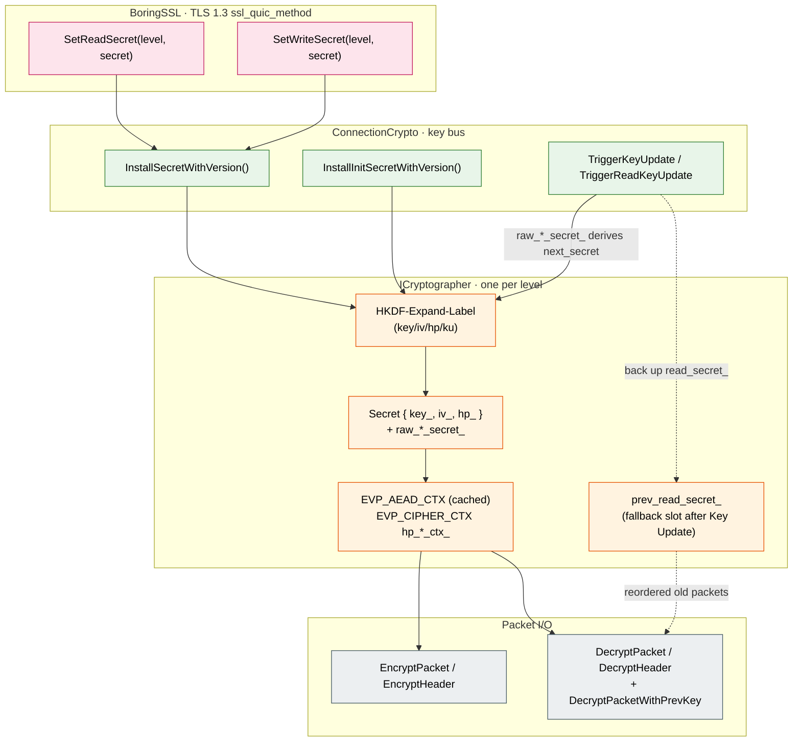

# TLS Key Derivation, Packet Protection and Key Update

This document covers quicX's key hierarchy: how the TLS traffic secret derives the AEAD key / IV / HP key trio for each encryption level, and how keys rotate on Key Update. It attempts to answer the following questions:

1. **Which keys derive from which secret?** — the TLS traffic secret → AEAD key / IV / HP key trio, one set per encryption level; plus the exceptional HKDF-Extract(salt, DCID) path for Initial;
2. **Why isn't the nonce just the packet number?** — the IV ⊕ big-endian(pn) algorithm of RFC 9001 §5.3; getting it wrong means nonce reuse = AEAD failure;
3. **How does Key Update avoid losing reordered packets?** — the `prev_read_secret_` + `HasPrevReadKey()` dual-window mechanism; the hard constraint that the HP key is never updated;
4. **Why do v1 and v2 label sets differ?** — RFC 9369's anti-middlebox-ossification design; labels change from `"tls13 quic key"` to `"tls13 quicv2 key"`, and the salt is swapped.

Out of scope: handshake state advancement and TransportParam negotiation (see [`handshake_state_machine.md`](handshake_state_machine.md)), CRYPTO frames and CryptoStream (see [`packet_lifecycle.md`](packet_lifecycle.md)); this document focuses on the closed loop of "**where keys come from / how they are derived / used / rotated**".

---
## 1. Overview: The Key Stack and Four Data-Flow Layers



**The four layers**:

| Layer | Role | Key Products |
| :--- | :--- | :--- |
| **TLS 1.3 (BoringSSL)** | Handshake negotiation + traffic secret derivation | Calls `SetReadSecret` / `SetWriteSecret` to deliver client/server traffic secrets |
| **ConnectionCrypto** | Key bus; manages the 4-level cryptographer array | Routes secrets to the matching level + triggers Key Update |
| **ICryptographer** | One per level; HKDF-Expand derives AEAD key/IV/HP key | Caches EVP_AEAD_CTX / EVP_CIPHER_CTX for hot-path reuse |
| **Packet I/O** | EncryptPacket / DecryptPacket / Header Protection | nonce = IV ⊕ pn; mask = ECB(hp_key, sample) |

**The four key levels (RFC 9001 §2.1)**:

| Level | EncryptionLevel | Long/Short Header | AEAD Algorithm | When Ready |
| :--- | :--- | :--- | :--- | :--- |
| Initial | `kInitial = 0` | Long | **Always AES-128-GCM** (RFC 9001 §5.2 mandate) | The client's first Initial sent / the server receiving the client's Initial |
| 0-RTT | `kEarlyData = 1` | Long (type=0x01) | TLS-negotiated suite | TLS calls `SetWriteSecret(kEarlyData, …)` |
| Handshake | `kHandshake = 2` | Long (type=0x10) | TLS-negotiated suite | TLS calls `SetReadSecret/SetWriteSecret(kHandshake, …)` |
| Application | `kApplication = 3` | **Short** (1-RTT) | TLS-negotiated suite | TLS calls `SetReadSecret/SetWriteSecret(kApplication, …)` |

How the handshake state machine decides **which level the current outbound packet uses** is covered in [`handshake_state_machine.md`](handshake_state_machine.md) §3.3; this document continues downward from there.

---

## 2. HKDF-Expand-Label: The Sole Primitive of QUIC Key Derivation

### 2.1 The RFC 8446 §7.1 Byte Layout

QUIC reuses TLS 1.3's HKDF-Expand-Label wholesale; every key derivation constructs an `HkdfLabel` byte string:

```
struct {
    uint16 length = Length;            // 2 bytes, big-endian, expected output length
    opaque label<7..255> = "tls13 " + Label;   // QUIC labels **already include** the "tls13 " prefix
    opaque context<0..255> = Context;   // QUIC always uses an empty context
} HkdfLabel;
```

The implementation in `hkdf.cpp`:

```cpp
// the actual hkdf_label constructed:
//   [length_hi][length_lo][labellen][label_bytes...][0x00]
//                                                    ^^^^^ empty context length
hkdf_label[0] = (destlen >> 8) & 0xFF;
hkdf_label[1] = destlen & 0xFF;
hkdf_label[2] = labellen;
memcpy(hkdf_label + 3, label, labellen);   // label already includes the "tls13 " prefix
hkdf_label[3 + labellen] = 0;              // empty context
```

> **Design pitfall**: the label arrays in `type.h` **already include** the `"tls13 "` prefix (e.g. `kTlsLabelKeyV1 = "tls13 quic key"`); callers must not add the prefix again, otherwise you get `"tls13 tls13 quic key"` and the handshake fails. This reads confusingly against RFC 8446's "label = 'tls13 ' + Label".

### 2.2 Label Sets v1 vs v2 (RFC 9001 / RFC 9369)

```
                 v1 (RFC 9001)               v2 (RFC 9369)
key derivation   "tls13 quic key"            "tls13 quicv2 key"
iv  derivation   "tls13 quic iv"             "tls13 quicv2 iv"
hp  derivation   "tls13 quic hp"             "tls13 quicv2 hp"
ku  derivation   "tls13 quic ku"             "tls13 quicv2 ku"
Initial salt     38 76 2c f7 ... 7f 0a       0d ed e3 de ... 2e d9
Retry key        be 0c 69 ...                8f b4 b0 ...
Retry nonce      46 15 99 ...                d8 69 69 ...
```

Why does v2 swap both labels and salt instead of just bumping a version number? — **Anti-ossification**: years after v1 shipped, carrier middleboxes began hard-coding parses of the `"tls13 quic"` literal and the v1 salt (when greasing wasn't enough). RFC 9369 uses completely different literals so middleboxes that "identify QUIC traffic by matching key-derivation material" misjudge v2 traffic as garbled encrypted packets and become ineffective.

`type.h` uses a `QuicLabels` struct + a `GetQuicLabels(version)` factory to confine version differences to one place; the three entry points `InstallSecretWithVersion / KeyUpdateWithVersion / InstallInitSecretWithVersion` all take a version parameter — **single-point versioned derivation**.

### 2.3 One InstallSecret Derives the Trio

`AeadBaseCryptographer::InstallSecretWithVersion` expands the traffic secret handed over by TLS (32 bytes for SHA-256; 48 for SHA-384) into three independent keys:

```cpp
// 1) AEAD packet protection key —— with the "tls13 quic key" label
HKDF-Expand(secret, "tls13 quic key",  aead_key_length_) → key_
// 2) AEAD IV —— with the "tls13 quic iv" label
HKDF-Expand(secret, "tls13 quic iv",   aead_iv_length_)  → iv_
// 3) Header Protection key —— with the "tls13 quic hp" label
HKDF-Expand(secret, "tls13 quic hp",   cipher_key_length_) → hp_
```

After derivation, two things are done **at once**:

1. **Save the raw traffic secret** (`raw_read_secret_ / raw_write_secret_`) — later Key Updates must derive `next_secret` from the raw secret, **not** from the already-expanded `key_/iv_/hp_` byte strings (that would produce wrong keys).
2. **Pre-create and cache EVP_AEAD_CTX and EVP_CIPHER_CTX** (`read_aead_ctx_ / hp_read_ctx_` etc.) — amortizing the AES key schedule and cipher init into the single InstallSecret call, instead of redoing AES_set_encrypt_key per packet at 1 Gbps (profiling once showed this path at 20% of client CPU; the note survives at `aead_base_cryptographer.cpp:62-87`).

### 2.4 The Special Derivation of Initial Keys: HKDF-Extract(salt, DCID)

`InstallInitSecret` is a separate path:

```
initial_secret    = HKDF-Extract(salt = kInitialSaltVx, IKM = client_DCID)
client_secret     = HKDF-Expand(initial_secret, "tls13 client in", 32)
server_secret     = HKDF-Expand(initial_secret, "tls13 server in", 32)
then each side runs InstallSecret(client_secret or server_secret) → the key/iv/hp trio
```

Three special points:

- **Algorithm fixed to AES-128-GCM** (RFC 9001 §5.2) — even if TLS later negotiates AES-256-GCM or ChaCha20, the Initial level is always AES-128-GCM. `connection_crypto.cpp:159` directly calls `MakeCryptographer(kCipherIdAes128GcmSha256)`.
- **Digest fixed to SHA-256** (same section) — `aead_base_cryptographer.cpp:193` hard-codes `EVP_sha256()`, not reading the `digest_` member.
- **client/server labels used in reverse**: the server must decrypt the client's Initial packets, so its `read_label = "tls13 client in"`; the client vice versa. `InstallInitSecret` uses the `is_server` flag to swap.

### 2.5 The Asymmetric Initial Re-derivation After Retry

After the server sends a Retry forcing the client to reconnect ([`packet_lifecycle.md`](packet_lifecycle.md) §Retry), the client's Initial keys become **asymmetric**:

- **Write** key: derived from the **Retry packet's Source CID** — the Initial packets the client sends are encrypted with this
- **Read** key: derived from the client's **own local CID** — the server uses this to decrypt subsequent client Initials

The two-step implementation of `InstallInitSecretForRetryWithVersion`:

```cpp
// Step 1: full install with read_cid (read correct, write wrong)
cryptographer->InstallInitSecret(read_cid, …, is_server=false);
// Step 2: separately re-derive client_secret with write_cid, overwriting the write slot
HKDF-Extract(write_cid, salt) → init_secret
HKDF-Expand(init_secret, "tls13 client in") → write_secret
cryptographer->InstallSecretWithVersion(write_secret, …, is_write=true);
```

This is one of the few legitimate paths that **update only one side's secret** (the other two are Key Update's separate read/write updates).

---

## 3. Packet Protection: AEAD Encrypt/Decrypt + Header Protection

### 3.1 Packet Encryption: AEAD with Associated Data

```
ciphertext = AEAD_Seal(
    key   = key_,                              // HKDF-Expand("quic key")
    nonce = MakePacketNonce(iv_, pn),          // see §3.2
    plaintext = packet_payload,
    aad   = packet_header_with_unprotected_pn  // see §3.4
)
```

Implementation notes (`EncryptPacket / DecryptPacket`):

- **AAD range**: from the first byte to the end of the packet number, **excluding** the payload. The first byte and PN are **not yet** Header-Protected at this point (HP is the outermost operation around AEAD; see §3.5).
- **EVP_AEAD_CTX reuse**: `read_aead_ctx_ / write_aead_ctx_` are already built at `InstallSecret`; the hot path reuses them directly. The lazy fallback survives only for diagnostic paths that never went through InstallSecret; production should not hit it.
- **out_plaintext / out_ciphertext are IBuffer**: call `MoveWritePt(out_length)` to advance the write pointer; the caller must guarantee `GetWritableSpan()` capacity ≥ plaintext + tag_length.

### 3.2 The Exact Nonce Construction (RFC 9001 §5.3)

QUIC's nonce is not the packet number directly, but **IV XOR big-endian-encoded pn**:

```cpp
// 12-byte nonce, first bytes copied directly from the IV
memcpy(nonce, iv.data(), 12);

// convert the 64-bit pn to big-endian
uint64_t be_pn = byte_swap_64(pkt_number);

// XOR be_pn into the last 8 bytes of the nonce
for (i = 0..7) nonce[12 - 8 + i] ^= ((uint8_t*)&be_pn)[i];
```

**Why must it be done this way?** Three reasons:

1. **Using pn alone causes cross-level nonce reuse**: each encryption level (Initial/Handshake/Application) has an independent pn space; pn=1 appears in both Initial and Handshake; if the nonce equaled the pn, the same traffic secret across levels would reuse nonces → catastrophic AEAD failure. After XOR-ing the IV, each level's IV differs (same HKDF-Expand label but different traffic secrets), so nonces separate naturally.
2. **Anti-truncation / replay**: the pn is plaintext (after de-protection) and fully attacker-controllable; but the IV is a secret derived from keys, so an attacker changing the pn still cannot predict the nonce.
3. **AEAD security premise**: GCM / ChaCha20-Poly1305 security presumes (key, nonce) never repeats; a monotonically increasing pn + a fixed IV suffices to guarantee that.

### 3.3 Packet Number Encoding and Recovery (RFC 9000 Appendix A)

On the send side the pn is 64-bit monotonically increasing, but the on-wire pn field is only 1/2/3/4 bytes (truncated); the receiver must recover the full pn using `largest_received_pn`:

- **The PnLen field**: the low 2 bits of the long/short header's first byte encode `actual_length - 1`. RFC 9000 deliberately uses (len-1) rather than len: 4 values 0x0/0x1/0x2/0x3 map to lengths 1/2/3/4, saving a bit.
- **Two-step recovery**: first undo HP to get PnLen and read truncated_pn from the wire; then use `PacketNumber::Decode(largest_received_pn, truncated_pn, pn_bits)` to compute the nearest integer whose low bits match truncated_pn (the packet-number wraparound window).
- **largest_received_pn must be that level's**: `PacketNumberManager` buckets by pns (packet number space); Initial / Handshake / Application each have their own; never use across buckets.

### 3.4 The Exact AAD Range

```
AAD = [Flag byte][rest of header...][unprotected packet number]
```

Key point: the AAD does **not** include the token or anything beyond the length field; a short header's AAD is `[Flag][DCID][PN]`; a long header's AAD runs from the first byte all the way through length+pn. **`packet_payload`** is the ciphertext after the AAD; the tag is the last 16 bytes of the AEAD output.

### 3.5 Header Protection: A Double Shell

QUIC uses **HP** to add another XOR layer over the low 4 bits of the first byte (long header) / low 5 bits (short header) and the entire packet number field, so middleboxes **cannot see the pn** (avoiding pn-based ossified inference and first-byte-flag-based parsing).

```
mask = HP_function(hp_key, sample)
// sample = ciphertext[pn_offset+4 .. pn_offset+4+16], fixed 16 bytes
//          note: taken from the position assuming PnLen=4; even if PnLen=1, the sample still spans it

first_byte ^= mask[0] & (is_short ? 0x1f : 0x0f)
for i in 0..pn_len:
    pn_bytes[i] ^= mask[i+1]
```

**The HP algorithm depends on the cipher**:

| AEAD | HP Function | Implementation |
| :--- | :--- | :--- |
| AES-128-GCM | AES-128-ECB(hp_key, sample[16])[0..4] | `AeadBaseCryptographer::MakeHeaderProtectMask` AES-ECB path + `EVP_CIPHER_CTX` cache |
| AES-256-GCM | AES-256-ECB(hp_key, sample[16])[0..4] | Same |
| ChaCha20-Poly1305 | ChaCha20(hp_key, sample[0..3] as counter, sample[4..16] as nonce) ⊕ 5 zero bytes | overridden by `ChaCha20Poly1305Cryptographer::MakeHeaderProtectMask` |

**Performance optimization**: the `EVP_CIPHER_CTX` for the AES-ECB path is initialized once in `InstallSecretWithVersion` (AES key schedule already run); afterwards each packet does a single 16-byte ECB block encryption. Profiling of the previously uncached version showed this path at 20% of a 1 Gbps client's CPU. The `cached_hp_ctx` parameter of `MakeHeaderProtectMask` is the entry of this optimization; a slow path (creating a temporary ctx) is kept for compatibility, taken only when nothing is cached.

### 3.6 The Two Steps of Decryption: HP First / AEAD Second

```
1. DecryptHeader(ciphertext, sample, pn_offset, &out_pn_len, is_short)
   → compute the mask from the sample, XOR-restore the first byte and the pn field
   → only after the first byte is restored can PnLen be read from the low 2 bits
2. read PnLen from the restored first byte, read truncated_pn from the wire
3. recover the full pn with PacketNumber::Decode
4. DecryptPacket(pn, ad_span, payload, plaintext_buffer)
   → AEAD_Open(key, nonce(iv,pn), payload, ad_span)
```

**The order cannot be reversed**: the sample is taken at a fixed offset from the ciphertext (`pn_offset + 4`) and does not depend on PnLen; only after the first byte is restored is the real PnLen known (which affects the AAD boundary); only with the full pn can the nonce be computed.

---

## 4. Key Update: Generational Rotation of the 1-RTT Keys

### 4.1 Trigger Conditions and KeyUpdateTrigger

RFC 9001 §6 allows either end to **actively** rotate keys during 1-RTT, and requires **passive** follow-up when the peer's Key Phase flips. `KeyUpdateTrigger` is the active trigger; `OnBytesSent / OnPacketSent` accumulate two kinds of thresholds:

| Threshold | Default | Checked When | Hit Means |
| :--- | :--- | :--- | :--- |
| `bytes_threshold_` | 512 KB | `OnBytesSent(packet_size)` after every send | "The AEAD has been in use long enough; rotate preemptively" |
| `pn_threshold_` | 1000 packets | `OnPacketSent(pn)` after every send | "The packet-number gap is big enough; add freshness" |

`enabled_` defaults to false (turned on at server/client startup by `WorkerConfig::enable_key_update_`), because:

1. **Interoperability**: some early implementations handled Key Update brittlely and dropped the connection when triggered; keeping it opt-in is production caution.
2. **Test control**: disabled, unit tests can pin the key environment, keeping irrelevant Key Updates out of test assertions.

A single `triggered_` flag prevents **repeated** triggering within an RTT; `MarkTriggered` is set after a successful `TriggerKeyUpdate` + `Reset()` clears the byte counter. Note `Reset()` does **not** clear `key_update_count_` (a cumulative statistic across the connection's lifetime).

### 4.2 Active Key Update: TriggerKeyUpdate

```
1) fetch cryptographers_[kApplication]   // only the Application level can Key Update
2) cryptographer->KeyUpdateWithVersion(nullptr, 0, is_write=true,  version)   // update write
3) cryptographer->KeyUpdateWithVersion(nullptr, 0, is_write=false, version)   // update read
4) current_key_phase_ ^= 1   // flip the key phase
5) qlog writes a "1rtt key_update" event, trigger="key_update"
```

`KeyUpdateWithVersion(nullptr, 0, …)` means "use my own saved raw_*_secret_ as the base":

```cpp
const auto& raw = is_write ? raw_write_secret_ : raw_read_secret_;
next_secret = HKDF-Expand-Label(raw, "tls13 quic ku", "", hash_len)   // 32 / 48 bytes
// then re-run InstallSecret with next_secret (deriving new key/iv, **but hp saved and restored separately**)
```

**The hard constraint that the HP key is not updated** (RFC 9001 §6 mandate): the Header Protection key stays unchanged for the whole connection lifetime. The HP algorithm draws its sample from the ciphertext, which already covers the Key Update's AEAD key change; rotating the HP key too would be redundant security plus added complexity (worse, it would break reordering tolerance).

Implementation detail (`KeyUpdateWithVersion`):

```cpp
saved_hp     = current_secret.hp_;      // back up the current HP key
saved_hp_ctx = std::move(hp_ctx_ref);   // back up the HP cipher context
InstallSecretWithVersion(next_secret)   // this re-derives hp_, which is actually wrong
current_secret.hp_   = saved_hp;        // restore it
hp_ctx_ref           = saved_hp_ctx;    // restore the cipher context
```

Why not just add a "skip hp" branch inside InstallSecret? — Consistency first: `InstallSecret` always derives the full trio; "HP not updated" doesn't exist outside the KeyUpdate path. Keeping InstallSecret's invariant (always derive key/iv/hp) and wrapping KeyUpdate with save/restore avoids polluting the base primitive.

### 4.3 Passive Key Update: TriggerReadKeyUpdate

Upon receiving a 1-RTT packet, after HP is undone, look at bit 2 of the first byte (the KeyPhase bit):

```cpp
// rtt_1_packet.cpp:148
bool key_phase_changed = (received_key_phase != expected_key_phase_);
```

- **Unchanged**: decrypt with the current read key; on failure fall back to `prev_read_secret_` (see §4.4).
- **Changed**: save the original buffer state (`saved_payload_start_/saved_ad_start_/...`), raise the `key_phase_changed_` flag to the connection, and do **not** swap keys directly.

Why not swap directly? — **The decision belongs to BaseConnection**: `On1rttPacket`, upon receiving the flag, calls `connection_crypto_.TriggerReadKeyUpdate()`, which updates both the read **and** write keys (RFC 9001 §6.2 SHOULD), then calls `rtt_1_packet->RetryPayloadDecrypt()` to re-decrypt the payload with the new key (the header was already processed in the previous step). Splitting "swap key" and "re-decrypt" across two layers is because `Rtt1Packet` does not own `ConnectionCrypto` and cannot swap by itself; meanwhile keeping the retry ability lets the upper layer still record the original state if the key swap fails.

### 4.4 prev_read_secret_: The Fallback for Reordered Old Packets

In the short window after a Key Update, packets **the peer sent before its own Key Update** may still arrive (pn ordering scrambled); these are still encrypted with the previous key generation. When updating the read side, `AeadBaseCryptographer::KeyUpdateWithVersion`:

```cpp
if (!update_write) {
    CleanSecret(prev_read_secret_);            // clear the even-older prev (keep at most one generation)
    prev_read_secret_ = read_secret_;          // current read → prev
    prev_read_aead_ctx_ = std::move(read_aead_ctx_);   // transfer the AEAD ctx
    read_secret_ = Secret();                   // empty the current (no cleanse; data already moved)
}
// then InstallSecretWithVersion(next_secret) derives the new-generation read
```

The fallback path at `rtt_1_packet.cpp:181-191`:

```cpp
result = crypto_grapher_->DecryptPacket(pn, ad, payload, plaintext);   // current read key
if (result != kOk) {
    if (crypto_grapher_->HasPrevReadKey()) {   // the previous-generation read key still exists
        // retry with prev
        result = crypto_grapher_->DecryptPacketWithPrevKey(pn, ad, payload, plaintext);
    }
}
```

**Only one generation of prev is kept**: each Key Update discards the current prev outright, and the new current becomes prev. RFC 9001 §6.6's argument: the interval between two consecutive Key Updates should be far larger than the RTT, so the probability of a reordered old packet spanning two generations is negligible; keeping two or more generations would only widen the key-exposure window.

**The HP key does not participate in prev**: since the HP key is never updated, no `prev_hp_ctx_` is needed; `prev_read_secret_.hp_` is left empty (the comment is explicit: HP not updated during Key Update).

---

## 5. Algorithm Adaptation: The Three ICryptographer Families

```
ICryptographer  (interface)
  └─ AeadBaseCryptographer  (HKDF + EVP_AEAD + EVP_CIPHER common skeleton)
       ├─ Aes128GcmCryptographer       // aead = AES-128-GCM, hp = AES-128-ECB
       ├─ Aes256GcmCryptographer       // aead = AES-256-GCM, hp = AES-256-ECB
       └─ ChaCha20Poly1305Cryptographer // aead = ChaCha20-Poly1305
                                       // hp overridden: CRYPTO_chacha_20()
```

`MakeCryptographer(SSL_CIPHER*)` goes through BoringSSL's cipher id → quicX internal enum mapping:

| BoringSSL Constant | quicX Enum | Class |
| :--- | :--- | :--- |
| `TLS1_CK_AES_128_GCM_SHA256` | `kCipherIdAes128GcmSha256` | Aes128Gcm |
| `TLS1_CK_AES_256_GCM_SHA384` | `kCipherIdAes256GcmSha384` | Aes256Gcm |
| `TLS1_CK_CHACHA20_POLY1305_SHA256` | `kCipherIdChaCha20Poly1305Sha256` | ChaCha20Poly1305 |

Each subclass constructor only sets the three EVP handles `aead_ / cipher_ / digest_`; the remaining fields (key length, IV length, tag length) are fetched live from EVP functions; the common logic (HKDF / Install / Encrypt / Decrypt) lives entirely in the base. This **algorithm-as-handles** design avoids code bloat from three independent implementations.

`ChaCha20Poly1305Cryptographer::MakeHeaderProtectMask` is the only override — because ChaCha20's HP algorithm is completely different from AES-ECB (use the sample's first 4 bytes as counter, the last 12 as nonce, and ChaCha20-encrypt a 5-byte zero block to get the mask):

```cpp
const uint8_t* sample_pos = sample.GetStart();
uint32_t* counter = (uint32_t*)sample_pos;          // sample[0..3] as counter
sample_pos += sizeof(uint32_t);                     // skip 4 bytes
CRYPTO_chacha_20(out_mask, kHeaderMask=0x0..0, 5, key, sample_pos /*nonce*/, *counter);
```

Note `*counter` is read directly as little-endian memory (the x86 default layout), matching ChaCha20 RFC 7539's 32-bit LE counter convention.

---

## 6. The Retry Integrity Tag: Another AEAD Path

`RetryCrypto::ComputeRetryIntegrityTag` (`retry_crypto.cpp:55-102`) is an **independent** AEAD call that does **not** go through the ICryptographer interface:

```
Retry Pseudo-Packet = ODCID_Len(1B) || ODCID || Retry_Packet_Without_Tag

Tag = AEAD-AES-128-GCM_Seal(
    key       = kRetryIntegrityKeyVx,    // public constants of RFC 9001 / RFC 9369
    nonce     = kRetryIntegrityNonceVx,  // ditto, public constants
    plaintext = ""                        // empty
    aad       = Retry Pseudo-Packet
).tag                                     // take the 16-byte tag of the AEAD output
```

Four counter-intuitive points:

1. **The key is a public constant, not a secret** — it protects not confidentiality but **packet-origin authenticity**: the tag's AAD includes the ODCID (the client's original DCID); a middlebox that doesn't know the ODCID cannot forge a legitimate Retry.
2. **The plaintext is empty** — AEAD is used here as "an authentication function over the AAD", taking only the tag, no ciphertext.
3. **It does not reuse cryptographers_[kInitial]** — the Retry tag's key and the Initial packet-protection key are semantically completely different (the former a network-wide shared public constant, the latter one per connection); sharing one object would blur the layers.
4. **v1 / v2 grouping**: `kRetryIntegrityKeyV1/V2` and `kRetryIntegrityNonceV1/V2` are two fully different constant strings (RFC 9369 defined a new set). `SelectRetryKeyAndNonce(version)` dispatches at a single point.

`VerifyRetryIntegrityTag` internally calls `ComputeRetryIntegrityTag` to compute the expected tag, then does a **constant-time** comparison (hand-written XOR-accumulate + a single result==0, to prevent timing side channels from leaking the tag).

---

## 7. Key Invariants
1. **The traffic secret must be saved**: `InstallSecretWithVersion` must `raw_*_secret_.assign(secret, ...)`, otherwise Key Update has no base and `KeyUpdate(nullptr, 0, …)` returns `kNotInitialized`.
2. **The HP key does not participate in Key Update**: in `KeyUpdateWithVersion`, `current_secret.hp_` must be backed up then restored; breaking this invariant → the peer cannot de-protect the first byte → the connection dies.
3. **prev_read_secret_ holds at most one generation**: every read-side KeyUpdate must `CleanSecret(prev_read_secret_)`; keeping two generations doubles the key-exposure window.
4. **Initial is always AES-128-GCM + SHA-256**: even if after TLS negotiation cryptographers_[kHandshake/kApplication] is ChaCha20, cryptographers_[kInitial] must stay AES-128-GCM.
5. **The nonce's last 8 bytes are IV ⊕ be(pn)**: `MakePacketNonce` must `byte_swap` the pn to big-endian; writing it in native endianness misaligns the nonce.
6. **The AAD includes the unencrypted first byte and pn**: when decrypting, the AAD must use the **HP-deprotected** first byte and the **recovered** full pn bytes; computing the AAD with the HP-protected ciphertext first byte = AEAD decryption failure.
7. **The Key Phase bit is read from the HP-deprotected first byte**: `rtt_1_packet.cpp:145-147` must DecryptHeader before reading bit 2; the reverse order reads ciphertext as plaintext, and forged data triggers spurious Key Updates.
8. **TriggerReadKeyUpdate also updates write**: RFC 9001 §6.2 SHOULD — after receiving the peer's Key Phase flip, your own subsequent sends must use the new phase; the double KeyUpdate call at `connection_crypto.cpp:341-354` must not miss the second.
9. **The Retry tag's AEAD key is a public constant**: do not try to replace `kRetryIntegrityKeyV1` with a connection-level key; that would break Retry interoperability.
10. **HKDF labels already contain the "tls13 " prefix**: all `kTlsLabel*` in `type.h` are complete strings like `"tls13 quic key"`; upper layers calling HkdfExpand must not add the prefix again.

---

## 8. Related Documents

- [`handshake_state_machine.md`](handshake_state_machine.md) — the two-layer handshake state and encryption-level advancement; this document's §1 follows its §3.3.
- [`packet_lifecycle.md`](packet_lifecycle.md) — the Retry packet's format and flow; this document's §6 follows its "Retry" section.
- [`connection_anatomy.md`](connection_anatomy.md) — where `ConnectionCrypto` sits inside the connection object and its dependencies.
- [`ownership_and_memory.md`](ownership_and_memory.md) — ownership of `cryptographers_[]` / `crypto_stream_`.
- [`loss_recovery.md`](loss_recovery.md) — pn monotonic increase, largest_received_pn maintenance and the pn recovery of §3.3.
- [`stream_state_machine.md`](stream_state_machine.md) — the special stream CRYPTO frames travel on (unrelated to stream ids 0/1/2/3), orthogonal to the 4 encryption levels of §1.

---

## 9. Related RFCs

- **RFC 9001 §5** — Packet Protection (key/iv/hp derivation, AAD, nonce algorithm)
- **RFC 9001 §5.2** — Initial Secrets (the special HKDF-Extract(salt, DCID) path)
- **RFC 9001 §5.3** — AEAD Usage (nonce = IV ⊕ pn big-endian encoding)
- **RFC 9001 §5.4** — Header Protection (sample offset, mask application, the ECB / ChaCha20 families)
- **RFC 9001 §5.8** — Retry Packet Integrity (public-key AEAD authentication)
- **RFC 9001 §6** — Key Update (key_phase bit, prev key fallback, the no-HP-update constraint)
- **RFC 9001 §4.8 / RFC 9000 §20.1** — TLS Alert → CRYPTO_ERROR 0x0100 + alert_code
- **RFC 9369 §3** — QUIC v2 label set and salt ("tls13 quicv2 key/iv/hp/ku" + new Initial salt)
