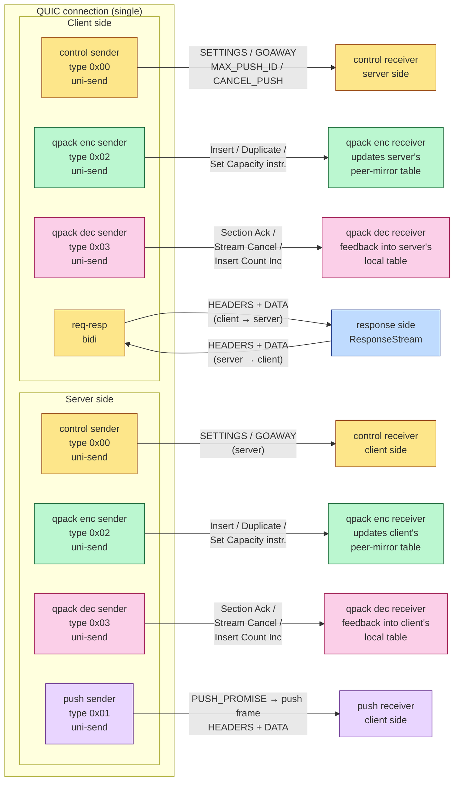
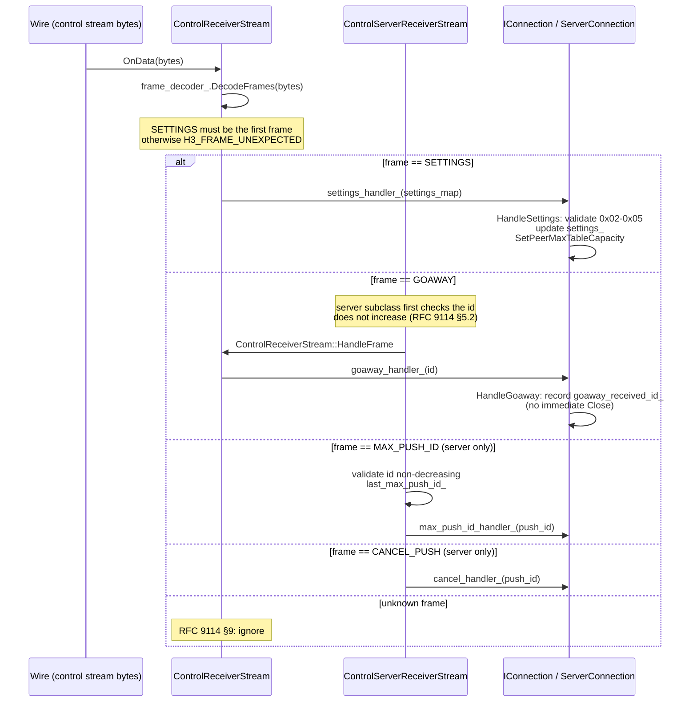

# HTTP/3 Connection: Multi-Stream Cooperation

This document covers the HTTP/3 implementation from the "**connection**" perspective: on a single QUIC connection, how does HTTP/3 assemble a complete protocol session out of **6 classes of stream**. The per-stream send / receive dual state machines are covered in [`stream_state_machine.md`](stream_state_machine.md) and the dynamic table's two-pass encoding in [`qpack_dynamic_table.md`](qpack_dynamic_table.md); this document does not repeat them. It attempts to answer the following questions:

1. **How many kinds of HTTP/3 stream are there? Why not one?** — 6 classes, each carrying a protocol task that never competes with the others; merged into one, HTTP/2's frames queue on the same stream and head-of-line blocking returns;
2. **Isn't QPACK just one table? Why does `IConnection` hold `qpack_encoder_` and `qpack_decoder_`, two instances?** — each connection needs two independent dynamic tables: the local encoder's, plus a mirror of the one the peer's encoder writes to;
3. **Do the client and server stream topologies match?** — no: the server proactively opens 5 unidirectional streams, the client only 3, with qpack-dec-receiver created reactively once the server opens its encoder stream;
4. **When is the "stream type" field on a unidirectional stream identified? What if identified too early?** — an `UnidentifiedStream` placeholder holds the slot until enough varint bytes arrive; early identification interprets wire bytes as the wrong stream type, e.g. decoding a control frame as a QPACK instruction.

---
## 1. Overview: The 6-Class Stream Topology of an H3 Connection



**The 5 colors map one-to-one to the 5 stream classes** (unidentified is a transient state, not drawn). **Note three asymmetries**:

1. **The server builds no push receiver**: push is a server→client unidirectional stream; the server side can never "receive push"; likewise the **client builds no push sender**.
2. **Each side has 3 senders** (control + QPACK enc + QPACK dec), but **receivers are built reactively**: when the QUIC layer reports "the peer opened a new unidirectional stream", the local end parks an `UnidentifiedStream`, reads out the stream type, and only then decides which receiver class to build.
3. **The `qpack-encoder` stream and the `qpack-decoder` stream run in opposite directions** — the encoder stream goes from the "writer" side to the "reader" side (A→B); the decoder stream goes from the "reader giving feedback" side back to the "writer" side (B→A). So **each side holds "its own enc-sender + its own dec-sender"** — both in the sender direction, but carrying opposite semantics.

---

## 2. Design Motivation: Why 6 Stream Classes, Not Fewer?

### 2.1 The Control Stream Must Stand Alone

The `control` stream carries **SETTINGS / GOAWAY / MAX_PUSH_ID / CANCEL_PUSH**. It cannot be reused for business streams, for three reasons:

1. **SETTINGS must be the first frame on the control stream** (RFC 9114 §6.2.1 / §7.2.4). If control frames were stuffed into req-resp streams, SETTINGS would have to be re-sent before each req-resp stream — wasteful and semantically murky.
2. **GOAWAY is a connection-level event** — it belongs to no single request. Placing it in a request stream is semantically wrong.
3. **CANCEL_PUSH references other streams** — it targets a push_id; stuffing it into a push stream would make it self-referential.

### 2.2 The QPACK Encoder and Decoder Streams Must Be **Opposite and Independent**

RFC 9204 §4:

- **The encoder stream**: local encoder → peer decoder, carrying dynamic-table update instructions (`Insert with Name Ref` / `Insert without Name Ref` / `Duplicate` / `Set Dynamic Table Capacity`). Each side has one **self-owned sender** (`QpackEncoderSenderStream`) + one **reactively built receiver** (`QpackEncoderReceiverStream`, updating `qpack_decoder_`, i.e. the peer-mirror table).
- **The decoder stream**: local decoder → peer encoder, carrying feedback frames (`Section Ack` / `Stream Cancel` / `Insert Count Increment`). Each side has one **self-owned sender** (`QpackDecoderSenderStream`) + one **reactive receiver** (`QpackDecoderReceiverStream`).

Why not merge into one "QPACK stream"? Because **each side holds 2 tables**, and **the priority and blocking models of encoding vs feedback differ completely**:

- Encoder instructions must be **strictly ordered** (the dynamic table is written sequentially; cross-packet reordering misaligns RIC/Base) → ordering on a dedicated stream comes for free.
- Decoder feedback is **event-driven** — one section ack per decoded header section. Squeezed onto the encoder stream, the local encoder's instruction writing would be interrupted to write feedback, making the dynamic table's commit semantics hard to pin down.
- **Deadlock defense**: when the encoder stream is blocked (the receiver's dynamic table full), the decoder feedback stream must **keep flowing**, letting the peer know which sections we've acked (which triggers dynamic-table eviction) → if the feedback stream also jammed, you'd get a circular lock. With two separate streams there is only the single degraded path "encoder stream blocked" — not a deadlock.

### 2.3 Why Is the Push Stream Unidirectional? Why server→client Rather Than Bidirectional?

RFC 9114 §4.6: server push is a predictive response. The push frame's "request body" is the PUSH_PROMISE (on a req-resp stream); the "response body" is the push stream (HEADERS + DATA + the embedded push_id).

- Unidirectional: push needs no "client sending"; it is pure server→client delivery, and a unidirectional stream saves half a state machine.
- Not reusing req-resp streams: push is not part of a "client-initiated request-response pair"; the server initiates it. Stuffing it into a req-resp stream would require a new "one bidirectional stream carrying multiple responses" semantics, conflicting with the existing "one req-resp pair" model.

### 2.4 Why `kReqResp = 0xFF` and `kUnidentified = 0xFFFF` Are Not Valid Wire Types

```cpp
enum class StreamType {
    kControl      = 0x00,  // wire
    kPush         = 0x01,  // wire
    kQpackEncoder = 0x02,  // wire
    kQpackDecoder = 0x03,  // wire
    kReqResp      = 0xFF,   // internal marker: bidirectional streams need no type field
    kUnidentified = 0xFFFF, // internal marker: awaiting identification
};
```

req-resp is a **bidirectional stream** — RFC 9114 §6.1 says bidi streams carry no stream type (the bidirectional direction semantics *is* the type). `0xFF` is a repo-internal marker and never touches the wire. `0xFFFF` (the `UnidentifiedStream` placeholder) is likewise internal. Both values are outputs of `IStream::GetType()`, and **`HasInFlightRequests()` uses them for drain decisions** — long-lived control / qpack streams don't count as "in-flight requests"; only `kReqResp` / `kPush` do (see §6, the GOAWAY drain).

---

## 3. `IConnection`'s 6-Stream Assembly and Lifecycle

### 3.1 Two-Phase Construction: ctor + `Init()`

```cpp
// The IConnection constructor CANNOT call weak_from_this():
// std::enable_shared_from_this is only valid once make_shared<T>() completes.
// So all wiring that needs weak_self closures is deferred to Init().

auto conn = std::make_shared<ServerConnection>(...);  // step 1: construct
conn->Init();                                          // step 2: assemble
```

What `Init()` does (`connection_server.cpp:42-135`):

1. **Base `IConnection::Init()`**: registers `SetStreamStateCallBack` (the QUIC → H3 "the peer opened a new stream" callback) + starts `cleanup_timer` (ticking every 100 ms, doing deferred stream destruction + GOAWAY drain probes).
2. **Build the control sender**: `MakeStream(kSend)` → `ControlClientSenderStream` (note: the server also uses this name, because the server's control sender still sends control frames to the client; the content (SETTINGS / GOAWAY) is **opposite in direction but identical in frame family**) → immediately `SendSettings()`.
3. **The `qpack_enabled` check**: `(qpack_max_table_capacity > 0 || qpack_blocked_streams > 0)`. If false, QPACK stream assembly is skipped — though RFC 9204 strictly says "QPACK streams MUST be created", this repo omits them only when the dynamic table is fully off. This is a **conformance shortcut**: a dynamic table with zero capacity is equivalent to "static table only"; even if created, the QPACK streams could carry only empty instructions — saving a pair of unidirectional streams is a reasonable optimization (the comment at `connection_client.cpp:67-71` admits this).
4. **Build the QPACK enc sender + dec sender**: each sender injects a `weak_ptr` into the encoder's `SetInstructionSender` lambda, avoiding a connection→stream→lambda→shared_ptr<connection> self-cycle (`ownership_and_memory.md` §2.2).
5. **Wire decoder feedback**: `qpack_decoder_->SetDecoderFeedbackSender(...)` sends the three feedback kinds (Section Ack / Stream Cancel / Insert Count Increment) out via `qpack_dec_sender_stream` — the switch fans out inside the lambda.

### 3.2 Reactive Stream Creation: `HandleStream` → `UnidentifiedStream` → `OnStreamTypeIdentified`

When the QUIC layer reports "the peer opened a new stream", the callback enters `HandleStream(stream, error_code)`. The flow depends on the stream's direction:

```cpp
if (stream->GetDirection() == StreamDirection::kBidi) {
    // server: a client request stream; build a ResponseStream
    // client: the server must not open bidi proactively (kStreamCreationError); compat path kept
} else if (stream->GetDirection() == StreamDirection::kRecv) {
    // unidirectional, type unknown → park an UnidentifiedStream, await the first bytes
    streams_[id] = make_shared<UnidentifiedStream>(stream, ..., on_type_identified);
}
```

`UnidentifiedStream::OnData` gets the first chunk of data and tries `DecodeVarint(stream_type)`:

- Not enough bytes yet → return (keep waiting for the next OnData; a stream type varint can be up to 8 bytes);
- Once decoded, **deregister its own read callback** (`SetStreamReadCallBack(nullptr)`) and call `type_callback_(stream_type, stream_, remaining_data)`;
- `OnStreamTypeIdentified` uses a switch to build the right typed stream (`ControlServerReceiverStream` / `QpackEncoderReceiverStream` / `QpackDecoderReceiverStream` / `PushReceiverStream`), replaces `streams_[id]`, and **feeds the already-read remaining_data back** into the new stream: `typed_stream->OnData(remaining_data, false, 0)`.

> Key invariant: **the stream type byte is a prefix, not framing** — it belongs to **no HTTP/3 frame**. After decoding the varint, `UnidentifiedStream` has already moved the read offset past the prefix, so `remaining_data` fed to the typed stream starts at the first frame byte. This mirrors the write side's `ISendStream::EnsureStreamPreamble`: the `wrote_type_` flag guarantees the prefix is written exactly once, with subsequent frames going into `frame->Encode(buffer)` (`if_send_stream.cpp:8-40`).

### 3.3 Illegal Stream Types on the Server: the Client Cannot Open a Push Stream

In `OnStreamTypeIdentified`, the server-side `case kPush` goes straight to `HandleError(kStreamCreationError)` — RFC 9114 §4.6: the client MUST NOT initiate a push stream; this is a protocol violation, closing the connection with H3_STREAM_CREATION_ERROR (`connection_server.cpp:369-374`).

---

## 4. The QPACK Dual-Table Model at the Connection Layer

### 4.1 Which Two Tables Do the Two `QpackEncoder` Instances Carry?

| Field | What It Holds | Who Writes It? | Who Reads It? |
| :--- | :--- | :--- | :--- |
| `qpack_encoder_` | **the local encoder's dynamic table** ("which entries I've pushed to the peer") | appended on demand when the local end calls `Encode(headers, ...)` → sent to the peer via `instruction_sender_` | `qpack_decoder_->Decode()` doesn't read it; only the local encode path does |
| `qpack_decoder_` | **a mirror of the peer encoder's dynamic table** ("which entries the peer told us it pushed") | `QpackEncoderReceiverStream` receives encoder instructions → calls `qpack_decoder_->DecodeEncoderInstructions()` to append | indexed by RIC/Base when the local end runs `Decode(headers)` |

> **The root of the naming confusion**: the `QpackEncoder` class can both encode and decode, so both instances share one type — but the **dynamic-table semantics they carry are inverted**. Keep this mapping table in mind when reading the code.

### 4.2 The Three-Way Capacity Negotiation

After `HandleSettings` receives the peer's SETTINGS it calls `qpack_encoder_->SetPeerMaxTableCapacity(peer_cap)`:

```cpp
// RFC 9204 §3.2.3: the encoder's effective capacity = min(local, peer)
SetLocalMaxTableCapacity(local_cap)  → RecomputeMaxTableCapacity()
SetPeerMaxTableCapacity(peer_cap)    → RecomputeMaxTableCapacity()

void RecomputeMaxTableCapacity() {
    if (peer_cap_known_) {
        max_table_capacity_ = min(local, peer);
    } else {
        max_table_capacity_ = local_cap;  // use local for now
    }
    dynamic_table_.UpdateMaxTableSize(max_table_capacity_);
}
```

**Order-independence from SETTINGS vs Init()**: Init first calls `SetMaxTableCapacity` (= setting local), then `HandleSettings` calls `SetPeerMaxTableCapacity`; if some test harness delivers the peer's SETTINGS earlier, it's the reverse — `local_max_table_capacity_` is still the constructor's initial 1024, and once Init runs, it converges back to min. Both orders converge to `min(local, peer)`; no ordering assumption needed.

### 4.3 The blocked_streams Registry

`QpackBlockedRegistry` is the connection-level **single** instance (not per-stream). `SetMaxBlockedStreams` comes from SETTINGS_QPACK_BLOCKED_STREAMS. Note: **the value 0 = "no blocking allowed at all"** (every `Add` fails), not "unlimited" — for unlimited, pass `UINT64_MAX` explicitly (comment at `blocked_registry.h:24-29`). This matches the implied logic of `enable_dynamic_table_=false`: with zero table capacity / zero blocked streams, you've degenerated to static-table-only.

---

## 5. The Asymmetry of Client vs Server Stream Layouts

### 5.1 The Streams the Client's `Init()` Actually Builds (`connection_client.cpp:45-140`)

| # | Class | Direction | Type | Built By |
| :---: | :--- | :--- | :--- | :--- |
| 1 | `ControlClientSenderStream` | uni-send | 0x00 | `Init()`, proactive |
| 2 | `QpackEncoderSenderStream` | uni-send | 0x02 | `Init()`, proactive |
| 3 | `QpackDecoderSenderStream` | uni-send | 0x03 | `Init()`, proactive |
| 4 | `ControlReceiverStream` | uni-recv | 0x00 | **reactive**: built by `OnStreamTypeIdentified` when the server opens its control stream |
| 5 | `QpackEncoderReceiverStream` | uni-recv | 0x02 | reactive |
| 6 | `QpackDecoderReceiverStream` | uni-recv | 0x03 | reactive |
| 7 | `PushReceiverStream` | uni-recv | 0x01 | reactive (only when push is enabled) |
| 8 | `RequestStream` | bidi | — | triggered by `DoRequest()`, N of them |

### 5.2 The One Extra Stream the Server's `Init()` Builds Proactively (`connection_server.cpp:42-135`)

The server additionally **proactively** builds a `QpackDecoderReceiverStream` (the third entry into streams_). Look at the code:

```cpp
auto qpack_dec_stream = quic_connection_->MakeStream(StreamDirection::kRecv);
auto decoder_receiver = std::make_shared<QpackDecoderReceiverStream>(
    std::dynamic_pointer_cast<IQuicRecvStream>(qpack_dec_stream), ...);
streams_[decoder_receiver->GetStreamID()] = decoder_receiver;
```

This is a **symmetry bug** — the server builds a recv stream for itself, violating RFC 9114 §6.2's "the initiator of a unidirectional stream fixes its direction by stream type". Semantically, this `MakeStream(kRecv)` calls the QUIC layer, but the H3 qpack-decoder stream should be initiated by the **peer** (the client) — the server should receive the client's 0x03 stream reactively, not build one itself. This is registered in the known divergences of `learning_project_roadmap.md` §2. **Externally the behavior is correct**: the client also proactively opens a 0x03 sender, and when the server receives it reactively it **overwrites** this pre-built entry; the pre-build is a placeholder that never actually sends or receives. When reading the code, remember this is a historical "double wiring": both sides' `qpack_decoder_` mirrors are still fed by the 0x03 stream the client actually opens (the `case kQpackDecoder` path of `OnStreamTypeIdentified` overwrites `streams_[id]`).

### 5.3 Root Causes of the Asymmetry

- **Protocol rules**: the server never receives a push stream; the client never receives a client→server push (push is server-initiated).
- **MAX_PUSH_ID / CANCEL_PUSH asymmetry**: sent by the client to the server on the control stream; the server sends GOAWAY to the client on the control stream. `ControlClientSenderStream` exposes `SendMaxPushId` / `SendCancelPush`; the base `ControlSenderStream` exposes only `SendSettings` / `SendGoaway` / `SendQpackInstructions`. This is **inheritance-split** interface isolation: client-only frame methods live only on the client class, preventing the server from calling them by mistake (`control_client_sender_stream.h`).
- **GOAWAY's semantics differ**: the server's GOAWAY id is "the largest processed stream id" (`max_seen_bidi_stream_id_ + 4`, telling the client which requests were definitely dropped); the client's GOAWAY id is "the largest accepted push_id" (`advertised_max_push_id_`, telling the server not to push beyond it). Same frame, different semantics — when reading the wire, the interpretation of the id must follow the **sender** (`connection_server.cpp:438-452` vs `connection_client.cpp:479-484`).

---

## 6. Connection-Level Frame Dispatch: From the Control Stream to `IConnection` Hooks

Every frame on the control stream eventually reaches some virtual function of `IConnection` or a subclass. The dispatch path has two segments: **`ControlReceiverStream`** (the base) handles SETTINGS / GOAWAY; **`ControlServerReceiverStream`** (the subclass) additionally handles MAX_PUSH_ID / CANCEL_PUSH.



### 6.1 SETTINGS' Two-Level Validation

- **Wire layer**: `SettingsFrame::Decode` rejects the illegal IDs 0x02-0x05 (HTTP/2 legacy).
- **Connection layer**: `HandleSettings` re-validates the same set and escalates to an H3_SETTINGS_ERROR connection close. The two layers look redundant, but the wire layer can only reject **the current frame** (no Close); the connection layer upgrades it to a **connection-level error** — a reasonable split.

### 6.2 The GOAWAY Drain State Machine

`Shutdown()` → `SendGoawayFrame(id)` → `goaway_sent_id_ = id; draining_ = true;` → if `HasInFlightRequests() == false` right now, `Close(0)` immediately; otherwise the `cleanup_timer` (100ms ticks) polls until `HasInFlightRequests()` reaches zero, then `Close(0)` (emitting `CONNECTION_CLOSE(H3_NO_ERROR)`).

`HasInFlightRequests()`'s default implementation iterates `streams_`, counting **only** `t == kReqResp || t == kPush`:

```cpp
// Long-lived control / qpack streams must not block drain — they persist until Close(),
// otherwise the drain never completes (deadlock).
StreamType t = kv.second->GetType();
if (t == StreamType::kReqResp || t == StreamType::kPush) {
    return true;
}
```

During the drain:

- `IsAcceptingNewRequests() == false` → `DoRequest` synchronously returns false with a `kRequestRejected` callback.
- `IsAcceptingNewPushes() == false` → the server declines new pushes.
- Incoming client request streams are `Reset(kRequestRejected)` directly by the server (the `if (draining_)` branch in `HandleStream`).

### 6.3 GOAWAY's Non-Increasing id, Defended on Both Sides

- **Sending side**: `Shutdown()` guarantees single-shot via `if (draining_) return;`.
- **Receiving side**: `HandleGoaway` validates `if (goaway_received_id_ != kNoGoaway && id > goaway_received_id_) Close(kIdError);` — RFC 9114 §5.2 requires GOAWAY ids to be monotonically non-increasing (the same side may only re-send a smaller or equal id). Violation closes the connection with H3_ID_ERROR.
- **Wire layer**: `ControlServerReceiverStream::HandleFrame` adds one more layer (non-decreasing for MAX_PUSH_ID, non-increasing for GOAWAY). Three layers of defense.

---

## 7. Multi-Stream Concurrency Safety: All `streams_` Operations on the Loop Thread

The `streams_` map is not thread-safe. All writes (insertions from `HandleStream`, deletions from `HandleError` / `ScheduleStreamRemoval`, sweeps by `CleanupDestroyedStreams`) come from QUIC-layer callbacks and are **necessarily on the loop thread**. What about reads?

`ClientConnection::DoRequest` is called on the user thread and **deliberately does not read** `streams_.size()` — it defers the size check into the loop-thread callback of `MakeStreamAsync`:

```cpp
auto weak_self = std::weak_ptr<IConnection>(shared_from_this());
return quic_connection_->MakeStreamAsync(
    StreamDirection::kBidi, [weak_self, request, handler](std::shared_ptr<IQuicStream> stream) {
        // ↓ this lambda already runs on the loop thread
        if (self->streams_.size() >= self->max_concurrent_streams_) {
            handler(nullptr, kInternalError);
            return;
        }
        self->CreateAndSendRequestStream(...);
    });
```

The comment names the reason: **TSan measured** a race between the user thread reading `streams_.size()` and the loop thread's `_M_erase` (`if_connection.cpp:213` _M_erase vs `connection_client.cpp:193` size). The fix is **trampolining all streams_ accesses onto the loop thread** — one extra cross-thread post buys a simple memory model.

The `weak_from_this()` template + `WeakSelfAs<T>()` is used uniformly in stream / timer closures — avoiding shared_self cycles and avoiding raw-`this` UAF (comment at `if_connection.h:171-205` + `ownership_and_memory.md` §3.1 / §5).

---

## 8. Metrics Mapping

H3 connection counters (`src/common/metrics/metrics_std.h:50-58, 107-110`):

| Metric | Type | Emit Site | Diagnostic Meaning |
| :--- | :--- | :--- | :--- |
| `Http3RequestsTotal` | Counter | `CreateAndSendRequestStream` | total requests; overall client throughput |
| `Http3RequestsActive` | Gauge | `CreateAndSendRequestStream` ↑ / `HandleError` ↓ | in-flight requests; approaching `max_concurrent_streams_` means the application layer is jammed |
| `Http3RequestsFailed` | Counter | `HandleError(error_code != 0 && != kNoError)` | failure rate; compare against Total for protocol-error density |
| `Http3RequestDurationUs` | Gauge | `HandleError`, `(now - request_start_times_[id]) * 1000` | per-request latency; when P99 spikes, check RIC blocking per `qpack_dynamic_table.md` §10 |
| `Http3ResponseBytesRx` | Counter | response stream receiving DATA | inbound business traffic |
| `Http3ResponseBytesTx` | Counter | server sending DATA | outbound business traffic |
| `Http3PushPromisesRx` | Counter | `HandlePushPromise` | PUSH_PROMISEs received by the client |
| `Http3PushPromisesTx` | Counter | server sending PUSH_PROMISE | server-initiated pushes |
| `Http3Responses{2,3,4,5}xx` | Counter | bucketed after the response decodes :status | business health |

> There are no "control-stream frame count / qpack instruction count" metrics — they're low-level infrastructure with low monitoring value (orders of magnitude below business requests). To observe QPACK hit rate, see the dynamic-table-hit-ratio self-instrumentation scheme in `qpack_dynamic_table.md` §9.

---

## 9. Key Invariants

1. **Exactly these 6 stream classes**: control / push / qpack-encoder / qpack-decoder / req-resp / unidentified. Stream types 0x04+ MUST be ignored (§6.2).
2. **The stream type byte is written exactly once** (`wrote_type_`); everything after is frames. The read side mirrors this: `UnidentifiedStream` decodes the varint once, then deregisters itself via `SetStreamReadCallBack(nullptr)`.
3. **req-resp is bidi** with no stream type byte; the other 5 classes all have one.
4. **SETTINGS must be the control stream's first frame** (RFC 9114 §6.2.1); a non-SETTINGS first frame → H3_FRAME_UNEXPECTED.
5. **SETTINGS may appear exactly once** (§7.2.4); a second appearance → H3_SETTINGS_ERROR.
6. **SETTINGS 0x02-0x05 are forbidden** (§7.2.4.1); rejected once at the wire layer and once at the connection layer.
7. **GOAWAY ids don't increase** (§5.2): on send via `draining_`, on receipt via id comparison.
8. **MAX_PUSH_ID never decreases** (§7.2.7): `ControlServerReceiverStream` compares `last_max_push_id_`.
9. **Each side holds 2 dynamic tables** (§3.2.3); the effective cap = min(local, peer), regardless of SETTINGS arrival order.
10. **`streams_` is accessible only from the loop thread** — user APIs trampoline via `MakeStreamAsync`; closures use `weak_self` against UAF.
11. **Long-lived streams don't block the drain**: `HasInFlightRequests` counts only `kReqResp` / `kPush`; control / qpack streams may live until `Close(0)`.
12. **The client cannot open a push stream**; the server receiving a client push stream type closes the connection with H3_STREAM_CREATION_ERROR.

---

## 10. Related Documents

| Document | Relation |
| :--- | :--- |
| [`stream_state_machine.md`](stream_state_machine.md) | the per-stream send/receive dual state machines; this document is their upper-level "multi-stream cooperation" |
| [`qpack_dynamic_table.md`](qpack_dynamic_table.md) | the QPACK dynamic table + RIC/Base encoding details; this document covers the dual-table assembly from the connection's view |
| [`process_model.md`](process_model.md) | the EventLoop / Worker threading model; the root cause of `streams_` being loop-thread-only |
| [`ownership_and_memory.md`](ownership_and_memory.md) §2.2 / §3.1 / §5 | the weak_ptr + closure patterns; cited by §3.1 / §7 here |
| [`packet_lifecycle.md`](packet_lifecycle.md) | the single-packet path; this document is its multi-stream landing at the H3 application layer |
| [`connection_anatomy.md`](connection_anatomy.md) | the QUIC-layer connection structure; an H3 connection wraps a QUIC connection |
| [`metrics.md`](metrics.md) | the metrics catalog; §8 here cross-references it |

---

## 11. Related RFCs

- **RFC 9114** — HTTP/3
  - §4.1 bidirectional streams / the basic request-response model
  - §4.6 Server Push
  - §5.2 GOAWAY / Graceful Shutdown
  - §6.2 unidirectional stream type identification (first-byte varint)
  - §6.2.1 the control stream (SETTINGS first)
  - §7.2.4 / §7.2.4.1 SETTINGS (including forbidden IDs)
  - §7.2.6 GOAWAY frame encoding
  - §7.2.7 MAX_PUSH_ID / CANCEL_PUSH
  - §8.1 the H3_REQUEST_REJECTED error code
  - §9 unknown frame types MUST be ignored
- **RFC 9204** — QPACK
  - §3.2.3 capacity negotiation: encoder cap ≤ min(local, peer SETTINGS_QPACK_MAX_TABLE_CAPACITY)
  - §4.2 the directions and frame families of the encoder / decoder streams
  - §4.4.1 / §4.4.2 Section Ack / Stream Cancellation matching on the stream-id dimension
  - §5 SETTINGS_QPACK_BLOCKED_STREAMS (value 0 = blocking disabled)
- **RFC 9000** — QUIC §2.1: bidi/uni stream id encoding (client-bidi 4n / client-uni 4n+2 / server-bidi 4n+1 / server-uni 4n+3). The server's `ComputeGoawayId() = max + 4` here exploits the client-bidi 4-step.
