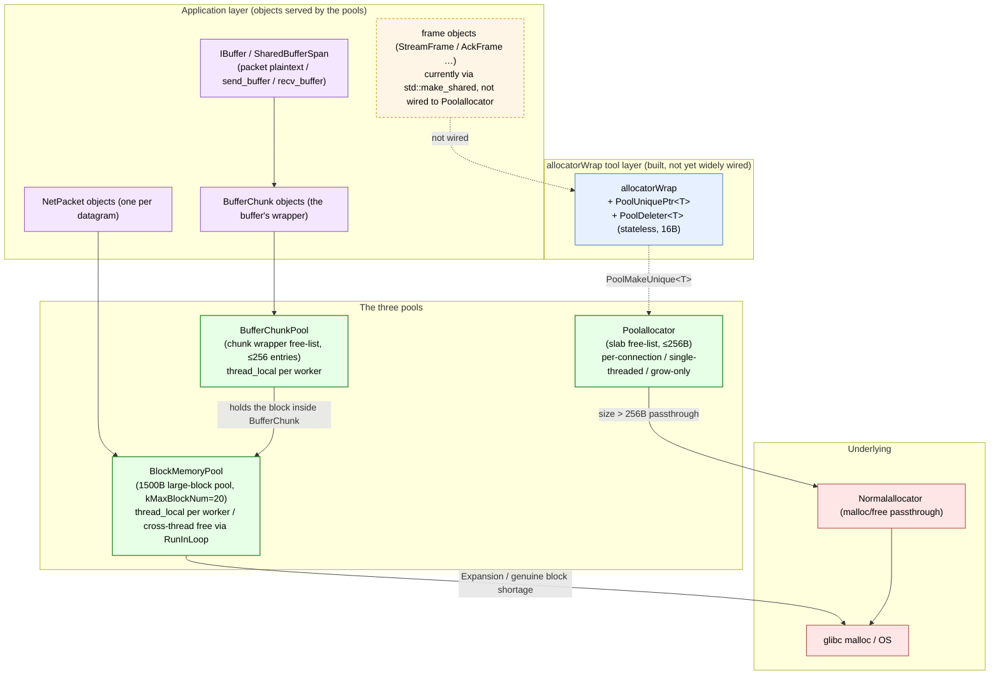

# Memory Pool Design: Three Pools, Why They're Split This Way, and the Deferred Frame-Pooling Decision

quicX's "memory pool" is actually **three mutually independent pools** in the source, each solving allocation problems of different sizes / ownership / heat; none is a "universal pool":

- **`Poolallocator`** (`src/common/allocator/`) — a small-object slab free-list allocator (≤256B), **per-connection, single-threaded, grow-only during the connection's lifetime**. Designed with the interface ready "for future pooling of small objects like frames", but *not yet wired into product code* (the decision is in `pool_allocator_frame_optimization.md`).
- **`BlockMemoryPool`** (`src/common/allocator/pool_block.h`) — the 1500B large-block pool, `thread_local` per worker, **the one actually carrying traffic**: the plaintext/ciphertext buffer of every QUIC datagram, every stream's send buffer, and every `NetPacket`'s `IBuffer` ultimately get their blocks from it.
- **`BufferChunkPool`** (`src/common/buffer/buffer_chunk_pool.h`) — a thread-local free list for the `BufferChunk` *object wrapper* (built atop `BlockMemoryPool`); it recycles the ~80B wrapper object itself (the `shared_ptr` control block is still allocated per call — already the minimum reachable overhead on the current path).

This document answers four questions:

- What sizes / who owns / who heats each of the three pools, and why they can't be merged into one;
- What the `Iallocator` interface + `allocatorWrap` + `PoolUniquePtr<T>` toolkit prepares, and what it avoids;
- Why the most natural target of the "small-object slab" — frames — *currently does not* use `Poolallocator`, and how that reconciles with the deferral decision in `pool_allocator_frame_optimization.md`;
- The invariants of the three pools across threading / shutdown order / failure modes.

While reading, open these three spots: `src/common/allocator/`, `src/common/buffer/buffer_chunk_pool.{h,cpp}`, `src/quic/quicx/global_resource.{h,cpp}`.

---

## 1. The Three Pools at a Glance



Four things the diagram makes obvious:

1. **The three pools target different sizes**: `Poolallocator` locks onto ≤256B small objects; `BlockMemoryPool` locks onto 1500B large blocks (hugging the Ethernet MTU); `BufferChunkPool` recycles the `BufferChunk` *wrapper object itself* (~80B of metadata; the block is still managed by `BlockMemoryPool`).
2. **Lifetime / thread-affinity / shrink policies all differ**: `Poolallocator` is per-connection single-threaded and grow-only for the connection's life; `BlockMemoryPool` is per-worker thread_local with cross-thread free going through `RunInLoop`, and proactively shrinks via `ReleaseHalf` past `kMaxBlockNum`; `BufferChunkPool` is a thread_local free list with a 256 cap — overflow is a plain `delete` (its inner block returns to `BlockMemoryPool` in passing).
3. **`allocatorWrap` and `PoolUniquePtr<T>` are a pre-built "zero-overhead RAII bridge"**, but product code **hasn't wired frames onto it yet** — not an oversight, but the conclusion of the cost/risk assessment already done in `pool_allocator_frame_optimization.md`.
4. **The one actually carrying traffic is `BlockMemoryPool`**: every outbound QUIC datagram, every inbound NetPacket, every stream's send/recv buffer ultimately gets its 1500B block from it. `Poolallocator`, however elegant, is for now more like "a reserved seat" in the current stack.

---

## 2. The `Iallocator` Interface and the `allocatorWrap` Toolkit

Source: `src/common/allocator/if_allocator.h`. `Iallocator` is the allocator abstraction (`Malloc / MallocAlign / MallocZero / Free`); `allocatorWrap` is the convenience layer for consumers.

### 2.1 The `Iallocator` Abstraction

```cpp
class Iallocator {
public:
    virtual void* Malloc(uint32_t size) = 0;
    virtual void* MallocAlign(uint32_t size) = 0;        // aligned to sizeof(unsigned long)
    virtual void* MallocZero(uint32_t size) = 0;
    virtual void Free(void* &data, uint32_t len = 0) = 0;  // note: by reference; nulled after Free
protected:
    uint32_t Align(uint32_t size) { return (size + kAlign - 1) & ~(kAlign - 1); }
};
```

Two details embody the "misuse-proofing" philosophy:

- `Free(void*&)` takes a reference: after Free completes it **forcibly nulls the caller's pointer**, cutting off the most common source of use-after-free.
- `Free`'s second parameter `len`: when `Poolallocator` frees a small object it **must know the original size** to locate the free-list bucket (`FreeListIndex(len)`); `len = 0` is explicitly treated as "I don't know the size, take the fallback" (forwarded straight to `Normalallocator`), preventing `(0 + 7) / 8 - 1` from underflowing to `UINT32_MAX` and indexing the vector out of bounds.

### 2.2 `PoolUniquePtr<T>` — Zero-Overhead RAII

```cpp
template<typename T>
class PoolDeleter {
    Iallocator* allocator_;          // one bare pointer, no atomic refcount
public:
    void operator()(T* p) const noexcept {
        if (!p) return;
        p->~T();
        void* data = static_cast<void*>(p);
        allocator_->Free(data, sizeof(T));   // sizeof(T) supplies len; Free naturally takes the free list
    }
};

template<typename T>
using PoolUniquePtr = std::unique_ptr<T, PoolDeleter<T>>;
```

`sizeof(PoolUniquePtr<T>)` = 16B (one `T*` + one `Iallocator*`). One notch below `shared_ptr<T>`'s 16B (pointer + control-block pointer): **no control block, no atomic inc/dec**.

### 2.3 The Deprecated `PoolNewSharePtr`

`allocatorWrap::PoolNewSharePtr` / `PoolMallocSharePtr` are both marked `[[deprecated]]`, with a blunt rationale:

> The shared_ptr control block is allocated by the default allocator (NOT the pool), completely bypassing pooling.

So `PoolNew + PoolDelete` or `PoolMakeUnique` is the correct hot-path idiom — with `shared_ptr`, even if the outer object is pooled, the control block still goes through glibc malloc, dissolving most of the supposed "pooling".

### 2.4 `kAlign` and Alignment Details

`kAlign = sizeof(unsigned long)` (8B on 64-bit Linux). `Poolallocator`'s free-list buckets are also sliced in `kAlign` steps:

| Platform | `kAlign` | Bucket Count = `kDefaultMaxBytes / kAlign` |
| :--- | :--- | :--- |
| 64-bit Linux | 8 | 256/8 = 32 |
| 32-bit | 4 | 256/4 = 64 |

`MallocAlign(size)` is internally `Malloc(Align(size))` — aligning size up to a `kAlign` multiple before entering the free list.

---

## 3. `Poolallocator` — the Small-Object Slab (Built, Not Yet Wired)

Source: `src/common/allocator/pool_allocator.{h,cpp}`, ~150 lines. The algorithm descends from the classic STL slab allocator (the same idea as `__gnu_cxx::__pool_alloc`).

### 3.1 Data Structures

```cpp
class Poolallocator : public Iallocator {
private:
    union MemNode {
        MemNode*    next_;     // acts as the list pointer while free
        uint8_t     data_[1];  // acts as the object's base address while in use
    };

    uint8_t*  pool_start_;                  // start of the current unsliced big chunk
    uint8_t*  pool_end_;                    // end of the current unsliced big chunk
    std::vector<MemNode*>     free_list_;   // 32 buckets (@8B alignment), one singly-linked list each
    std::vector<uint8_t*>     malloc_vec_;  // every big chunk ever requested (for one-shot free in ~Poolallocator)
    std::shared_ptr<Iallocator> allocator_;     // backend = Normalallocator
};
```

**Why `free_list` has 32 buckets**: `kDefaultMaxBytes = 256`, `kAlign = 8`, so `[8B, 16B, 24B, …, 256B]` gives 32 buckets. Requests `>256B` are **forwarded directly to the `Normalallocator` backend** (both `Malloc` and `Free` have this fallback) — `Poolallocator` handles only *small* objects.

### 3.2 The Three Main Paths

**Malloc(size)**:

```text
size > 256B   →  forward to Normalallocator (malloc passthrough)
otherwise     →  bucket = FreeListIndex(size)
                free_list_[bucket] non-empty  → pop the head node, O(1)
                free_list_[bucket] empty      → ReFill: slice 20 nodes of that size from the
                                               big chunk and chain them into a new free list
```

**Free(data, len)**:

```text
data == nullptr     →  no-op
len == 0 || > 256B  →  forward to Normalallocator (defense + fallback)
otherwise           →  bucket = FreeListIndex(len)
                       push data onto the head of free_list_[bucket], O(1)
                       null data (interface contract)
```

**ReFill(size, num=20)** + **ChunkAlloc**: the core slicer. First check whether the current big chunk's remainder suffices:
- Enough for 20 pieces → slice 20 in one go;
- Only enough for 1~19 → take as many as fit;
- Not enough at all → hang the remaining tail onto the matching bucket (avoiding internal-fragmentation waste), then request a fresh `20 * size`-byte big chunk from `Normalallocator` and recurse to slice again.

Every newly requested big chunk is registered in `malloc_vec_`; the destructor frees them all back to the system in one sweep.

### 3.3 Three Invariants

1. **Single-threaded exclusive**: `Poolallocator` carries *no locks at all*; the docs state "intentionally NOT thread-safe". The design model is "one Poolallocator per Connection", with the connection pinned to a single I/O thread by the framework.
2. **Grow-only**: within the connection's lifetime `malloc_vec_` only grows; `Free` returns nodes to the free list but **never to the system**. This matches the connection-level "drop the whole arena when done" semantics — at connection close, `~Poolallocator` hands all big chunks back to glibc in one shot.
3. **`Free` must receive the exact `len`**: callers are obligated to remember the object's original size (which is why `PoolDeleter::operator()` uses `sizeof(T)` rather than 0).

### 3.4 `Poolallocator`'s Current Wiring in Product Code

```text
$ grep -rn MakePoolallocatorPtr src/
src/common/allocator/pool_allocator.h:    std::shared_ptr<Iallocator> MakePoolallocatorPtr();
src/common/allocator/pool_allocator.cpp:  std::shared_ptr<Iallocator> MakePoolallocatorPtr() { ... }
```

**Only present at its own definition; zero calls in product code**. `PoolUniquePtr` also has zero uses in product code — the toolkit is laid out, but no caller has pulled frames and the like onto it yet. The reasons unfold in the next section.

---

## 4. Why Frames Don't Use `Poolallocator`: Deferral Decision Summary

The full decision dossier is in `docs/internal/pool_allocator_frame_optimization.md` (~250 lines). Here the conclusions *relevant to the design tradeoff* are compressed into one section, lest readers finish this document thinking "Poolallocator is an orphan":

| Dimension | Conclusion |
| :--- | :--- |
| **Technical feasibility** | ✅ Feasible. `PoolDeleter` / `PoolUniquePtr` / `PoolMakeUnique` are in place (inside `if_allocator.h`). |
| **Refactor scale** | A full conversion touches ~25 files / ~2000 lines: 23 `dynamic_pointer_cast<XFrame>` sites become `dynamic_cast`; `recv_stream::out_order_frame_` / `crypto_stream::out_order_frame_` out-of-order caches change from `shared_ptr` to `PoolUniquePtr`, forcing move semantics; `packet::frames_list_` / `OnFrames` / `wait_frame_list_` signatures ripple through the whole chain. |
| **Real heat** | Measured send-side frame lifetime = a single `TrySend` iteration (after `packet->SetPayload(frame_visitor->GetBuffer())` the packet **does not hold the frame**); the gains come mainly from the shared_ptr control block (16~24B) + atomic inc/dec (ns scale). Beneficial in ACK-dense / small-packet scenarios; a limited share in bulk-transfer scenarios. |
| **Current-stage priority** | Interop / stability over micro-optimizations. `ThreadLocalBlockPool` already covers the 1500B BufferChunk (the bigger traffic target); frame pooling is a "marginal improvement". |
| **Decision** | **Deferred**. Restart triggers: `make_shared` exceeding 5% of the frame stack in perf flame graphs, or memory jitter at 50K connections with high PPS. |
| **If restarted** | Recommended **P0: convert only send-side temporary frames** (4~5 files, no receive-side changes, no `wait_frame_list_` changes, none of the 23 `dynamic_pointer_cast` sites), covering ~70% of the benefit. |

> **Take-away**: `Poolallocator` is not "abandoned" but "assessed and deferred". The division between this document and `pool_allocator_frame_optimization.md`: this one covers the *mechanism*, that one the *decision*.

---

## 5. `BlockMemoryPool` — the 1500B Large-Block Pool (the Real Workhorse)

Source: `src/common/allocator/pool_block.{h,cpp}` + `src/quic/quicx/global_resource.{h,cpp}`.

### 5.1 Shape

```cpp
class BlockMemoryPool : public std::enable_shared_from_this<BlockMemoryPool> {
public:
    BlockMemoryPool(uint32_t large_sz, uint32_t add_num);
    void* PoolLargeMalloc();              // pop a block from free_mem_vec_; if empty, Expansion()
    void PoolLargeFree(void*& m);         // return to free_mem_vec_; past kMaxBlockNum=20 triggers ReleaseHalf
    void SetEventLoop(std::shared_ptr<IEventLoop> loop);   // for cross-thread free via RunInLoop
    void ReleaseHalf();                   // proactive shrink: release the first 50% of blocks to glibc
    void Expansion(uint32_t num = 0);     // request add_num blocks at once
private:
    uint32_t large_size_;                 // 1500 (bytes per block)
    uint32_t number_large_add_nodes_;     // 4 (blocks per expansion)
    std::vector<void*> free_mem_vec_;
    std::weak_ptr<IEventLoop> event_loop_;
};
```

### 5.2 Global Wiring: `thread_local` per Worker

The two core lines of `global_resource.cpp`:

```cpp
thread_local std::shared_ptr<common::BlockMemoryPool> pool_;
thread_local std::shared_ptr<quic::IPacketallocator>    packet_allocator_;
```

Each QUIC worker thread lazily creates its own on first access:

```cpp
return common::MakeBlockMemoryPoolPtr(/*large_sz=*/1500, /*add_num=*/4);
```

**Why 1500B**: the source comment says it plainly —
> 1500B aligns with typical Ethernet MTU and is required by the outbound packet build path: `BaseConnection::TrySend` allocates a BufferChunk from this same pool to serialize the entire encrypted QUIC packet (header + STREAM frame payload up to 1300B + AEAD tag). Shrinking this below ~1350B causes BuildDataPacket to fail once STREAM payload approaches the 1300B cap. Also satisfies RFC9000 minimum datagram size of 1200B.

**Why thread_local**: `BlockMemoryPool`'s own `free_mem_vec_` is a plain `std::vector<void*>` with no lock. The worker threading model (see `process_model.md`) pins a connection to one worker, so `Malloc/Free` completing on the same thread is the norm — **zero synchronization overhead**.

### 5.3 The fast/slow Paths of Cross-Thread Free

Although 99% of product paths free on the same thread, **shutdown / migration / exception paths** can release the last BufferChunk reference on another thread (the buffer's holder isn't necessarily on the pool's worker). `PoolLargeFree` branches explicitly:

```cpp
auto loop = event_loop_.lock();
if (loop && !loop->IsInLoopThread()) {
    // Slow path: PostTask serializes the free_mem_vec_ write back onto the owning thread
    auto weak_self = weak_from_this();
    loop->RunInLoop([weak_self, ptr]() mutable {
        auto self = weak_self.lock();
        if (!self) { free(ptr); return; }      // pool destroyed; return straight to the system
        self->free_mem_vec_.push_back(ptr);
        if (self->free_mem_vec_.size() > kMaxBlockNum) self->ReleaseHalf();
    });
    m = nullptr;
    return;
}
// Fast path: same thread, plain push_back, zero synchronization
free_mem_vec_.push_back(m);
m = nullptr;
if (free_mem_vec_.size() > kMaxBlockNum) ReleaseHalf();
```

Design points:

- **Fast path: 0 atomics / 0 lambdas**: the source comment explains specifically — "inside `RunInLoop` one must allocate a std::function (potential heap) + copy a weak_ptr (atomic op) + re-lock a shared_ptr inside the lambda (another atomic) — all pure overhead when on the same thread".
- **The slow path must go through weak_ptr**: with cross-thread free the pool may be mid-destruction; a failed `weak_self.lock()` just `free(ptr)`s back to the system, avoiding use-after-free.

### 5.4 Proactive Shrink: `ReleaseHalf` and `kMaxBlockNum=20`

When `free_mem_vec_.size() > 20`, `ReleaseHalf` fires immediately, returning the first 50% of blocks to glibc. This avoids the classic free-list-pool defect of "after one traffic burst the pool stays at peak size forever".

### 5.5 Metrics Hooks

Every alloc/free path emits 4 metrics (see `design/metrics.md` §11): `MemPoolAllocatedBlocks` / `MemPoolFreeBlocks` (gauges) + `MemPoolAllocations` / `MemPoolDeallocations` (counters). This is the pool layer's **only** observability entry point; OOM / jitter investigations start here.

### 5.6 LSan Suppression: the Price of thread_local

`test/perf/lsan_suppressions.txt` explicitly suppresses `BlockMemoryPool`'s global/thread-local leaks — `thread_local shared_ptr<BlockMemoryPool>` gets falsely reported when thread-exit order diverges from LSan's scan order. This is compatible with the "zero reference cycles" promise of `ownership_and_memory.md` §13: the pool's memory **has a destination** (at thread exit `~ThreadLocalFreeList` chains into `~BlockMemoryPool`, returning all blocks to the system); LSan just can't see the timing.

---

## 6. `BufferChunkPool` — the `BufferChunk` Wrapper Free List

Source: `src/common/buffer/buffer_chunk_pool.{h,cpp}`. This pool layer **doesn't manage blocks** (those belong to `BlockMemoryPool`); it manages the **wrapper objects**.

### 6.1 Why This Layer Exists

The comment states the background clearly:

> Hot paths (per-packet plaintext buffers in the QUIC decoder) construct a fresh `BufferChunk` for every datagram, which produces ~167K `BufferChunk(pool)` ctor invocations per 50MB download (and a matching number of `shared_ptr` control-block allocations).
> The underlying memory blocks are already pooled by `BlockMemoryPool`, but the BufferChunk *object* itself is freshly allocated each time.

The `BufferChunk` wrapper (~80B of metadata — freeze count, write floor, read/write pointers, pool pointer, `enable_shared_from_this` ctrl, etc.) used to be new'd + delete'd per datagram. This pool layer recycles the object's lifetime too.

### 6.2 Shape: thread_local + a Minimal Free List with a 256 Cap

```cpp
thread_local ThreadLocalFreeList tls;   // one vector<BufferChunk*>, 256 cap

shared_ptr<BufferChunk> Acquire(pool):
    if !tls.empty():  pop the tail, reuse
    else:             new BufferChunk(pool) (still takes its block from BlockMemoryPool)
    returns a shared_ptr with custom deleter = Recycle

Recycle(raw):
    if !raw->Valid():           delete raw (block already freed by BlockMemoryPool; drop the wrapper too)
    elif tls.size() >= 256:     delete raw (full; don't cache)
    else:                       tls.push_back(raw) (cache for reuse)
```

### 6.3 The Key Dependency: freeze_count Self-Clearing

The comment stresses repeatedly: "by the time the deleter fires, every `SharedBufferSpan` that referenced this chunk has already been destroyed, so `freeze_count_` is guaranteed to be 0 ... No manual reset is required."

This bases the chunk pool's safe object reuse on another `BufferChunk` contract — `FreezeUpTo/Unfreeze` clears state automatically on the last unfreeze. Otherwise a recycled object could be reused carrying dirty freeze state, pushing later writers to a wrong floor.

### 6.4 The Control Block Is Still Allocated per Call

The last comment line admits it honestly:

> `shared_ptr`'s control block is the only remaining per-call heap allocation in this path; it is unavoidable without a more invasive intrusive_ptr refactor.

In other words, the *last* heap allocation on the `BufferChunkPool::Acquire` path is the `shared_ptr` control block. Removing it would require converting `BufferChunk` to `intrusive_ptr` — in the same "assessed, deferred" bucket as frame pooling.

---

## 7. `PoolPacketallocator` — the `NetPacket` Object Pool

Source: `src/quic/udp/pool_packet_allocator.{h,cpp}`. This is a higher-level wrapper over `BlockMemoryPool`:

```cpp
PoolPacketallocator():
    pool_(MakeBlockMemoryPoolPtr(kPacketBufferSize, kPacketPoolBlockCount))
    for i in [0, kPacketPoolSize):
        chunk = make_shared<BufferChunk>(pool_)
        buffer = make_shared<SingleBlockBuffer>(chunk)
        pkt = new NetPacket(); pkt->SetData(buffer)
        packet_queue_.Push(pkt)            // ThreadSafeQueue

Malloc():
    if packet_queue_.Pop(pkt):
        return shared_ptr<NetPacket>(pkt, custom deleter = Free)
    else:
        return NormalPacketallocator::Malloc()    // pool drained; fallback

Free(pkt):
    if queue_size < kPacketPoolSize:
        pkt->GetData()->Clear()      // reset the buffer, re-enqueue
        packet_queue_.Push(pkt)
    else:
        delete pkt
```

Characteristics:

- **Pre-allocates N NetPacket objects** (`kPacketPoolSize` of them); each bound to a `BufferChunk + SingleBlockBuffer`. This differs from `BlockMemoryPool`'s on-demand free-list policy — the packet count is *bounded and controllable*, and pre-allocation drives first-allocation tail latency to 0 as well.
- **`ThreadSafeQueue`**: because receiver and worker cross threads (one receive thread feeding several workers), the queue must be thread-safe (unlike `BlockMemoryPool`'s single-thread exclusivity).
- **Delete when full**: requests beyond `kPacketPoolSize` come from abnormal paths (short bursts); the pool isn't allowed to balloon indefinitely.

`PoolPacketallocator` is the concrete implementation of the "`PoolPacketallocator`, whose underlying chunks come from `common::BlockMemoryPool`" mentioned in `packet_lifecycle.md` §2.4.

---

## 8. The Three Pools Side by Side

| Dimension | `Poolallocator` | `BlockMemoryPool` | `BufferChunkPool` | `PoolPacketallocator` |
| :--- | :--- | :--- | :--- | :--- |
| **Target object** | any small object ≤256B | 1500B data blocks | the `BufferChunk` wrapper (~80B) | `NetPacket` + bound buffer |
| **Allocation granularity** | 32-bucket free list (@8B steps) | single size (1500B) | single size (chunk objects) | single size (NetPacket objects) |
| **Ownership model** | per-connection (by design) | thread_local per worker | thread_local per thread | global / `ThreadSafeQueue` |
| **Threading** | **never cross-thread** (lock-free) | same-thread free fast path / cross-thread RunInLoop | single-threaded (acquire & deleter on one thread) | **multi-thread safe** (queue) |
| **Shrink policy** | none (one sweep at connection end) | `> kMaxBlockNum=20` triggers `ReleaseHalf` | `> 256` → plain `delete` (no caching) | `> kPacketPoolSize` → plain `delete` |
| **Failure / oversize** | `>256B` → `Normalallocator` | `Expansion` failure logged and skipped | block allocation failure → `nullptr` | empty queue → `NormalPacketallocator` |
| **Wiring depth** | **0 product-code uses** (toolkit only) | high (packet / buffer / send_buffer all use it) | high (every packet plaintext path) | high (receiver hot path) |
| **Metrics** | none | the 4 `MemPool*` series | none | none |
| **Related design doc** | this doc + `pool_allocator_frame_optimization.md` | `packet_lifecycle.md`, `metrics.md` | `packet_lifecycle.md` §2.4 | `packet_lifecycle.md` |

Read horizontally, **the three pools truly cannot merge**:

- `Poolallocator` and `BlockMemoryPool` differ by ~6× in size class (256B vs 1500B), and their free-list policies (multi-bucket @8B steps) and single-size policy (1500B only) are naturally mutually exclusive.
- `BufferChunkPool` must sit *on top of* `BlockMemoryPool`: it manages "the objects that carry blocks" while itself still drawing blocks from `BlockMemoryPool`.
- `PoolPacketallocator` is cross-thread, complementing `BlockMemoryPool`'s thread_local model — the receiver thread takes empty packets from the pool → worker threads consume → frees return to the queue.

---

## 9. Key Invariants

After understanding these pools, re-reading the code, these hold across all paths:

- **`Free(void*&)` forcibly nulls** — the caller *cannot* reuse the old pointer after `Free` (the interface contract disarms the footgun).
- **`Poolallocator::Free` must receive the exact `len`**; otherwise `len=0` takes the fallback, `len>256` also takes the fallback — the free list can never be fed into the wrong bucket.
- **`Poolallocator` is single-threaded exclusive / non-shrinking** — paired with the "one allocator per Connection" model; if frame pooling is ever restarted, **sharing an allocator instance across threads is forbidden**.
- **`BlockMemoryPool` is thread_local + same-thread fast path** — cross-thread free must go through `RunInLoop`, so the `free_mem_vec_` `std::vector` never needs a lock.
- **`BlockMemoryPool` shrinks proactively** (`ReleaseHalf` at `kMaxBlockNum=20`) — pool occupancy tracks the traffic curve; there is no "one peak, never returned".
- **`BufferChunkPool` relies on `BufferChunk`'s automatic state clearing** (the last unfreeze clears the freeze count) — recycled objects are never reused with dirty state.
- **`PoolPacketallocator` deletes when full** — bursts are not allowed to balloon the object pool; excess requests naturally fall back to `NormalPacketallocator::Malloc`.
- **The `shared_ptr` control block always lives on the glibc heap** — on any "pooled shared_ptr" path the control block is unpooled; this is the root reason `PoolNewSharePtr` was abandoned and `BufferChunkPool`'s comment says "control block still allocated per call".

---

## 10. Related Designs

- [`packet_lifecycle.md`](packet_lifecycle.md) — where `NetPacket::buffer_` comes from (`PoolPacketallocator` + `BlockMemoryPool`); its §2.4 pairs with this document's §7.
- [`ownership_and_memory.md`](ownership_and_memory.md) — LSan's suppression of `BlockMemoryPool` (pairs with §5.6 here); and why "pooled or not, reference cycles must still be avoided".
- [`metrics.md`](metrics.md) — §11 lists the four `MemPool*` metrics, `BlockMemoryPool`'s only observability entry.
- [`process_model.md`](process_model.md) — explains why `BlockMemoryPool` can be `thread_local`: the worker model + connection-to-thread pinning.
- `buffers.md` (not yet written) — the semantics of `BufferChunk` / `IBuffer` / `SharedBufferSpan`, the objects `BufferChunkPool` serves.
- Internal decision dossier: `docs/internal/pool_allocator_frame_optimization.md` — why `Poolallocator` isn't wired to frames yet, and which P0 path a restart would take.

---

## 11. Related RFCs

- The classic STL slab allocator: `__gnu_cxx::__pool_alloc` (GCC libstdc++) — `Poolallocator`'s free-list / chunk-alloc structure shares its lineage.
- Bonwick, J. "The Slab Allocator: An Object-Caching Kernel Memory Allocator." USENIX 1994 — the foundational paper of the "object pool + free list" idea, aligned with `BufferChunkPool`'s philosophy.
- The thread-cache idea of jemalloc / tcmalloc — `BlockMemoryPool`'s thread_local + cross-thread RunInLoop is a simplified version.
- RFC 9000 §14 (Datagram Size) — the RFC basis for `BlockMemoryPool`'s 1500B block choice (minimum 1200B + AEAD overhead + IP/UDP headers).
