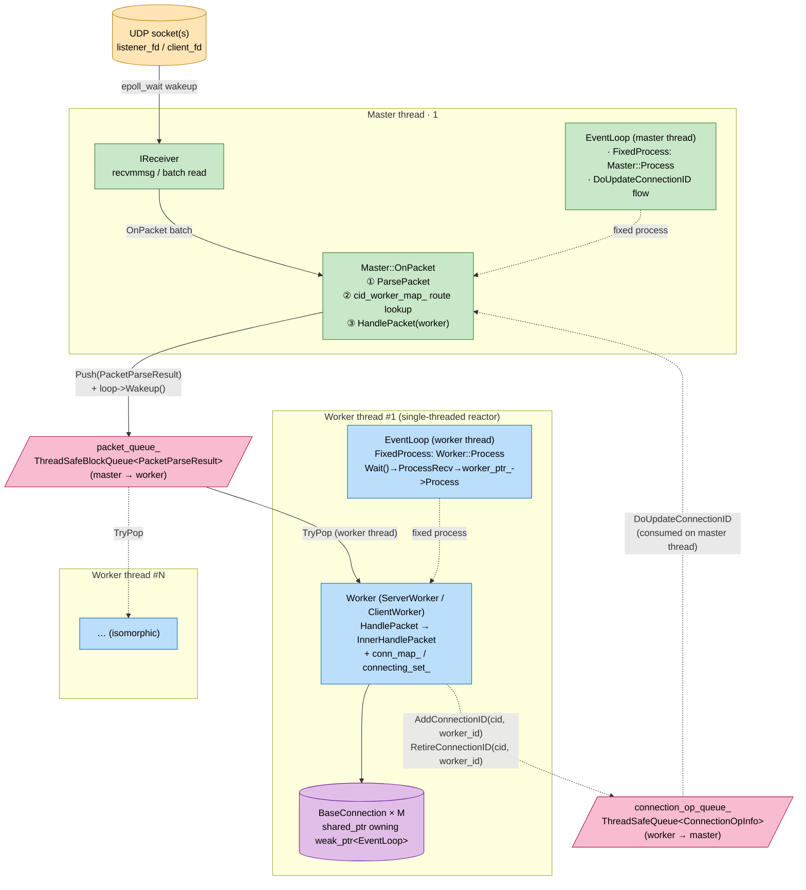

# Process Model: master + worker, Single-Threaded Reactors, and Why Not a Thread Pool

quicX's execution skeleton is **one master + N workers**, each worker running a single-threaded reactor internally. This is a fairly common choice among QUIC implementations, but the concrete design tradeoffs still hide a few non-obvious decisions in the code. This document tries to answer:

- What master and worker **each own**, and why workers don't `recvfrom` themselves;
- How many layers and thread hops a UDP datagram passes through between the socket and `BaseConnection::OnPackets()`;
- Given that all workers do work, why **not a thread pool** but binding each connection permanently to one worker;
- When single-threaded and multi-threaded **deployment modes** share the same class hierarchy, where `*_with_thread.h` comes in and where things degrade to same-thread.

While reading, keep `src/quic/quicx/master.h` / `master_with_thread.h` / `worker.h` / `worker_with_thread.h` open — together they are < 350 lines and the part of the whole picture most worth your time.

---

## 1. Overview: Five Lines in One Diagram



The three colored blocks correspond to three roles:

- 🟧 **IO layer**: UDP sockets (possibly several: listener, client, temporary fds for connection migration);
- 🟩 **master thread**: `Master` + the single `IReceiver` + the single `EventLoop`, **doing only packet receive and routing**;
- 🟦 **worker threads**: N copies, each owning its own `EventLoop` and `Worker` object (actually `ServerWorker` or `ClientWorker`), **hosting all connection state machines**.

The two pink pipes, `connection_op_queue_` and `packet_queue_`, are the **only** two cross-thread channels between master and workers — beyond them, the two sides share no mutable state.

---

## 2. master: Doing Only "Listen + Dispatch"

### 2.1 The master's Responsibility List

`src/quic/quicx/master.h`:

```cpp
class Master:
    public IMaster,
    public IPacketReceiver,
    public IConnectionIDNotify,
    public std::enable_shared_from_this<Master> {
    // ...
    void OnPacket(std::shared_ptr<NetPacket>& pkt) override;  // IPacketReceiver

    void AddConnectionID(ConnectionID& cid, const std::string& worker_id) override;
    void RetireConnectionID(ConnectionID& cid, const std::string& worker_id) override;

protected:
    bool ecn_enabled_;
    std::shared_ptr<IReceiver> receiver_;
    std::unordered_map<uint64_t, std::string> cid_worker_map_;       // CID hash → worker
    std::unordered_map<std::string, std::shared_ptr<IWorker>> worker_map_;
    mutable std::mutex cid_map_mutex_;                               // protects cid_worker_map_
};
```

It carries only three duties:

| Duty | Implementation | Key Point |
| :--- | :--- | :--- |
| Own the UDP sockets, receive in batches | `IReceiver` (wrapping `recvmmsg`/`recvfrom`) | Attached to the master's own loop via `EventLoop::RegisterFd` |
| Routing (CID → worker) | `Master::OnPacket` (`master.cpp:94-139`) | Hash lookup → dispatch; on miss, deterministically pick a worker by packet DCID hash (Initial packets only, see §2.2) |
| Maintain the routing table | `cid_worker_map_` (guarded by `cid_map_mutex_`) | Workers **notify back** to update the table when NEW_CONNECTION_ID / RETIRE_CONNECTION_ID arrive |

### 2.2 Routing: the Core of `Master::OnPacket`

```cpp
void Master::OnPacket(std::shared_ptr<NetPacket>& pkt) {
    // ...
    PacketParseResult packet_info;
    if (MsgParser::ParsePacket(pkt, packet_info)) {
        std::shared_ptr<IWorker> worker;
        {
            std::lock_guard<std::mutex> lock(cid_map_mutex_);
            auto iter = cid_worker_map_.find(packet_info.cid_.Hash());
            if (iter != cid_worker_map_.end()) {
                auto w = worker_map_.find(iter->second);
                if (w != worker_map_.end()) worker = w->second;   // known connection: precise routing
            }
        }

        if (!worker) {
            // deterministic pick: choose a worker by packet DCID hash modulo
            // (typically the server receiving an Initial)
            size_t idx = packet_info.cid_.Hash() % worker_map_.size();
            auto iter = worker_map_.begin();
            std::advance(iter, idx);
            worker = iter->second;
        }
        worker->HandlePacket(packet_info);
    }
}
```

Two things to note:

- `MsgParser::ParsePacket` neither decrypts nor parses frames; it only strips the short/long header to extract the DCID. **Full decryption happens inside the worker** — the master never touches encryption keys. This is the key constraint keeping all keys inside workers; §5 revisits its implications.
- The unknown-CID branch is **not a random pick** but a deterministic route by packet DCID hash: retransmissions of the same connection's Initial (reusing the same DCID) must land on the same worker. A former `rand()` implementation let retransmitted Initials land on different workers under multi-worker setups, creating duplicate `ServerConnection`s and breaking the handshake outright.

### 2.3 Routing-Table Updates: the worker → master Back-Channel

Workers need the master to add a new CID to the routing table on these occasions:

- The server first constructs a `ServerConnection` and issues the SCID to the client (the master can subsequently receive packets carrying this CID);
- A `NEW_CONNECTION_ID` frame arrives from the peer;
- Connection migration / preferred_address scenarios.

The worker notifies the master through the `IConnectionIDNotify` interface (`if_worker.h:12-16`). In multi-threaded mode this call path crosses threads:

```cpp
// master_with_thread.cpp:61
void MasterWithThread::AddConnectionID(ConnectionID& cid, const std::string& worker_id) {
    connection_op_queue_.Push({ADD_CONNECTION_ID, cid, worker_id});  // enqueue (lock-free contention domain)
    if (auto loop = event_loop_.lock()) loop->Wakeup();              // wake the master
}

// Consumed in the FixedProcess phase of the master loop (master thread)
void MasterWithThread::DoUpdateConnectionID() {
    ConnectionOpInfo op_info;
    while (connection_op_queue_.Pop(op_info)) {
        if (op_info.operation_ == ADD_CONNECTION_ID)
            Master::AddConnectionID(op_info.cid_, op_info.worker_id_);
        else
            Master::RetireConnectionID(op_info.cid_, op_info.worker_id_);
    }
}
```

This means that in multi-threaded mode, all updates to `cid_worker_map_` converge onto the master thread. On top of that, `Master` still guards every read/write explicitly with `cid_map_mutex_` (`master.h:50-55`) — a hard insurance: should any caller bypass the queue and invoke `Master::AddConnectionID` directly cross-thread, concurrent access to the lock-free unordered_map under multi-worker load would cause mis-routing and random handshake failures. Workers never touch the table directly; they can only update it indirectly through `connection_op_queue_`.

---

## 3. worker: Single-Threaded Reactor + All Connection State

### 3.1 Class Hierarchy

```text
         IWorker (if_worker.h)                common::Thread (common/thread/thread.h)
            │                                          │
            ▼                                          │
         Worker (worker.h)         ┌────────  WorkerWithThread (worker_with_thread.h) ────┐
            │   ↑ owns                                                                 │
            │   └─────────────── owns worker_ptr_ ───────────────────────────────────────┘
            ├── ServerWorker (worker_server.h) —— Retry / IP rate limiter / handshake watchdog
            └── ClientWorker (worker_client.h) —— version negotiation / connect timeout
```

`Worker` is the real business core holding the connections; `WorkerWithThread` is merely a thin shell that **wraps it into an independent thread + EventLoop**. In single-threaded mode `WorkerWithThread` is never constructed; `Worker` runs attached directly to the master's EventLoop (see §4).

### 3.2 The worker's Core Members

`worker.h:83-116`:

```cpp
bool do_send_;
bool ecn_enabled_;
bool enable_key_update_;
uint32_t quic_version_;
std::string worker_id_;

std::shared_ptr<ISender> sender_;
std::shared_ptr<TLSCtx> ctx_;

common::DoubleBuffer<std::shared_ptr<IConnection>> active_send_connections_;
std::unordered_set<std::shared_ptr<IConnection>> connecting_set_;
std::unordered_map<uint64_t, std::shared_ptr<IConnection>> conn_map_;

connection_state_callback connection_handler_;
std::weak_ptr<common::IEventLoop> event_loop_;     // observer, non-owning
RegisterSocketCallback register_socket_cb_;
```

Key points:

- **`conn_map_` is worker-private**, indexing connections by CID hash; only the worker's own thread accesses it.
- **`active_send_connections_` uses a double buffer**: one buffer holds the current round's "connections pending send", the other is where "connections with new send needs" hook in — `Worker::Process()` swaps the two buffers at the end of each EventLoop round, avoiding iterator invalidation from inserting while traversing the send list.
- **`event_loop_` uses `weak_ptr`**: ownership belongs to `QuicClient` / `QuicServer`; the worker is just an observer. This choice shares its rationale with `BaseConnection::event_loop_` — see [`ownership_and_memory.md`](ownership_and_memory.md).

### 3.3 The worker's Main Loop (Multi-Threaded Mode)

`worker_with_thread.cpp:40-58`:

```cpp
void WorkerWithThread::Run() {
    auto loop = event_loop_.lock();
    if (!loop || !loop->Init()) {
        ready_promise_.set_value(false); return;
    }
    ready_promise_.set_value(true);          // wake the main thread: worker is ready

    while (!Thread::IsStop()) {
        loop->Wait();                        // ① epoll_wait (with the nearest timer's deadline)
        ProcessRecv();                       // ② feed packets from packet_queue_ to worker_ptr_->HandlePacket
        if (worker_ptr_) worker_ptr_->Process();  // ③ fire the worker's ProcessSend / heartbeats
    }
}
```

One `Wait()` cycle **does three things** (`event_loop.h:30`):

1. Run expired timers;
2. `epoll_wait` until the next timer deadline;
3. Dispatch IO callbacks + drain the `PostTask` queue.

`ProcessRecv` drains **in budgeted batches** (budget = `kMaxRecvBatch`, i.e. 64 packets):

```cpp
// worker_with_thread.cpp:73
void WorkerWithThread::ProcessRecv() {
    // ...
    const uint32_t kDrainBudget = kMaxRecvBatch;
    PacketParseResult packet_info;
    for (uint32_t i = 0; i < kDrainBudget; ++i) {
        if (!packet_queue_.TryPop(packet_info)) {
            return;                     // queue empty: return normally
        }
        worker_ptr_->HandlePacket(packet_info);
    }
    // budget exhausted but queue non-empty: actively Wakeup so the next loop round keeps draining
    if (!packet_queue_.Empty()) {
        if (auto loop = event_loop_.lock()) loop->Wakeup();
    }
}
```

Why "budget + re-wakeup" instead of either extreme? Because both extremes were vetoed in practice:

- **A single TryPop** (the old implementation) collapsed throughput: `UdpReceiver::OnRead()` receives up to 64 packets per batch and calls `Wakeup()` per packet, but kqueue's wakeup pipe gets fully drained by one `read()` — 64 producer wakeups collapse into 1 consumer wakeup. In measurements the server processed only 64 packets per ~1.3s, and a client's Initial sat in the queue ~9s before the PTO gave up three times (fixed);
- **Unbounded draining** starves timers: with 10,000 packets arriving back to back, timers and `Worker::Process()` never get a turn.

The budget of 64 aligns exactly with the receive batch size; when the budget is exhausted while the queue is non-empty, an active `Wakeup()` balances "drain the queue promptly" against "timer fairness".

### 3.4 The Ingress Queue: `packet_queue_`

`worker_with_thread.h:46`:

```cpp
common::ThreadSafeBlockQueue<PacketParseResult> packet_queue_;
```

`ThreadSafeBlockQueue` (`common/structure/thread_safe_block_queue.h`) is the plainest mutex + std::queue + condition_variable implementation. Push/Pop are both O(1) but take a lock each time. Not using a lock-free MPSC ring buffer here is deliberate:

- **There is exactly one producer** (the master thread) and one consumer (the worker thread) — an SPSC scenario;
- Even under SPSC, the mutex version already exceeds 10⁶ packets/second, far above real QUIC packet rates (tens to hundreds of thousands);
- The complexity saved (no lock-free code to write, no ABA to handle) matters far more than the few hundred ns saved.

When you need to swap in an SPSC ring buffer for a production performance scenario, **the interface boundary is clean**: only the implementation type of `packet_queue_` changes; neither the `HandlePacket` / `ProcessRecv` call sites move.

---

## 4. Single-Threaded vs Multi-Threaded: Two Deployments of the Same Classes

quicX supports both deployment modes:

| Mode | master Class | worker Class | EventLoops | Threads |
| :--- | :--- | :--- | :--- | :--- |
| Single-threaded | `Master` | `Worker` (directly, no `WorkerWithThread` wrapper) | 1 | 1 |
| Multi-threaded | `MasterWithThread` | `WorkerWithThread` wrapping `Worker` | N+1 | N+1 |

### 4.1 Single-Threaded Mode

master and worker share one EventLoop. The worker attaches as a fixed callback via `event_loop_->AddFixedProcess(shared_from_this(), Worker::Process)`. After `Master::OnPacket` parses out a `PacketParseResult` it calls `worker->HandlePacket(...)` **directly and synchronously** — it never enters `packet_queue_` at all.

This mode has no cross-thread channels whatsoever, but all work is serialized: UDP recv, unpacking, HandlePacket, connection state machines, encryption, sending all happen on the same thread. **Its greatest value is simplifying lifetimes** — the window where an `event_loop_` weak_ptr fails to lock nearly vanishes; unit tests and local examples can focus on business logic.

### 4.2 Multi-Threaded Mode

master and each worker each run a `Thread + EventLoop`. After parsing the packet, `Master::OnPacket` calls `WorkerWithThread::HandlePacket`:

```cpp
// worker_with_thread.cpp:33
void WorkerWithThread::HandlePacket(PacketParseResult& packet_info) {
    packet_queue_.Emplace(std::move(packet_info));   // cross-thread enqueue
    if (auto loop = event_loop_.lock()) loop->Wakeup(); // wake the target worker
}
```

Note that `WorkerWithThread` here is both a `Thread` and an `IWorker`: what the master sees as "the worker" is actually it, while the business core `Worker` is owned by it. `Master::OnPacket` doesn't need to know whether we're in single- or multi-threaded mode; dispatch always calls `IWorker::HandlePacket` — in multi-threaded mode the override in `WorkerWithThread` turns that into enqueue + Wakeup.

`Master` itself has the same structure: `MasterWithThread` inherits `Master + Thread`, also hanging `Master::Process` as a FixedProcess on its own thread. `master_with_thread.cpp:37`:

```cpp
loop->AddFixedProcess(shared_from_this(),
                      [this]() { Process(); });
```

### 4.3 Choosing the Mode

`QuicClient` / `QuicServer` decide at construction from `QuicConfig::worker_thread_count`:

- `worker_thread_count == 0` (default) → single-threaded mode (master and the single worker share an EventLoop);
- `worker_thread_count >= 1` → multi-threaded mode (master + N independent worker threads).

---

## 5. Why Not a Thread Pool?

This section answers: **given N worker threads, why not simply toss each packet into a work pool to fight over?**

### 5.1 Connection Thread Affinity

QUIC connections are stateful — one connection owns:

- The TLS handshake state machine + encryption keys (4 packet number spaces × 2 directions);
- Congestion-control state (cwnd / pacing / RTT estimate);
- Flow-control windows (per-stream + connection-level);
- A set of timers (idle / loss detection / PTO / handshake watchdog);
- Send/recv buffers and reordering queues for dozens of streams.

If two packets land on different workers, then either all of the above state must be lock-protected (extremely heavy lock contention under QUIC's high-frequency events), or a cross-thread state-synchronization protocol is required (complexity explosion).

quicX takes the **third road**: CID hash → fixed worker. Once a connection is established on some worker, it is **forever processed only on that worker**. This thread affinity is enforced by `cid_worker_map_`: after master routing, a packet always lands on the worker that once registered its CID.

### 5.2 The Benefits of the In-Worker Single-Threaded Reactor

Once bound to a single thread:

- **Lock-free**: everything inside a worker — `Worker::conn_map_`, every `BaseConnection`, every `Stream` — is single-threaded; the whole worker contains **not a single mutex** (except the ingress `packet_queue_`);
- **Deterministic state-advance order**: if packet A arrives before packet B, then A's cwnd update certainly precedes what B sees — a natural protection for algorithms **sensitive to event ordering** like loss recovery / pacers;
- **`EventLoop::AssertInLoopThread()` guards the boundary**: calling `EventLoop::AddTimer` / `RegisterFd` inside a worker asserts that the current thread is the loop thread; any wrong call aborts immediately, exposing the bug at the first scene (see the Shutdown-section comment at `if_worker.h:50-57`).

### 5.3 The Cost of a Thread Pool

Switching to a thread pool would force a QUIC implementation into one of these:

- One big lock per connection — lock contention + cache-line bouncing on the hot packet path cost ~5× throughput;
- Fine-grained locks per state field — complexity explosion, races nearly guaranteed;
- An "event queue + worker preemption" per connection — equivalent to degrading each connection to single-threaded, but with higher management overhead.

Among industrial implementations, NGINX, HAProxy, msquic and quiche all use **CID affinity + single-threaded reactors**, for the same reasons.

### 5.4 The Cost: Load Imbalance

The cost of affinity binding is that **load across the N workers can be uneven** — CID hash distribution is approximately random but high-variance on small samples. This is most visible when some connections are high-volume long-lived flows (audio/video streaming).

quicX currently hashes `cid.Hash() → worker_id` directly onto strings, with no weighted rebalancing. In a learning implementation this is a reasonable simplification; a production implementation would do **worker switching triggered by connection migration + master-maintained per-worker load counters** — quicX leaves that to future extension (no TODO, no FIXME, just an open boundary).

---

## 6. End-to-End Walkthrough: One UDP Datagram from Socket to Frame

Using the **multi-threaded server** mode, follow a 1-RTT packet carrying a STREAM frame:

```text
① Master thread · UDP socket readable
   epoll_wait wakes → IReceiver::ReceiveBatch(recvmmsg) fetches N NetPackets
   ↓
② Master::OnPacket(pkt) (once per packet)
   · ParsePacket: strip the header, take the DCID
   · cid_worker_map_.find(DCID.Hash()) → "worker_id_3"
   · worker_map_["worker_id_3"]->HandlePacket(packet_info)
       ↑ the actual type here is WorkerWithThread
   ↓
③ WorkerWithThread::HandlePacket (still executing on the master thread)
   · packet_queue_.Emplace(std::move(packet_info))    [cross-thread enqueue]
   · loop->Wakeup()                                    [pipe write wakes the worker]
   ↓
   ━━━━━━━━━━━━━━━ thread switch: master → worker #3 ━━━━━━━━━━━━━━━
   ↓
④ Worker thread · EventLoop::Wait returns
   ↓
⑤ WorkerWithThread::ProcessRecv
   · packet_queue_.TryPop(packet_info)
   · worker_ptr_->HandlePacket(packet_info)
       ↑ the actual type here is ServerWorker (inherits Worker)
   ↓
⑥ Worker::HandlePacket → ServerWorker::InnerHandlePacket
   · conn_map_.find(DCID.Hash()) → BaseConnection*
   · conn->OnPackets(...)
   ↓
⑦ Internal dispatch inside BaseConnection
   (the rest of the path: packet_lifecycle.md / connection_anatomy.md §5)
   · DecryptPacket → FrameProcessor → StreamManager → fires SendControl::OnPacketAcked / OnPacketSent ...
   · anything to send back is registered via active_send_connections_
   ↓
⑧ Worker::Process (executed at the end of the same loop round)
   · double buffer swap
   · iterate active connections → conn->BuildPackets() → sender_->Send(...)
   ↓
⑨ sender_->Send writes the datagram back to the UDP socket
   (note sender_ is shared; concurrent writes to the same socket by multiple
    workers are made atomic by the kernel)
```

Across the whole path, only ②→③ and ⑨ are **true cross-thread points**: the former is a one-way master→worker delivery, the latter multiple workers calling one sender to write the socket. Inside the worker, ⑤ through ⑧ are fully serialized single-threaded and lock-free.

---

## 7. Key Invariants
Facts that always hold when writing / reading / changing this code:

1. **`cid_worker_map_` is guarded by `cid_map_mutex_`** — in multi-threaded mode workers must update it indirectly via `connection_op_queue_` (updates converge onto the master thread); never hold a bare `Master*` pointer and call `AddConnectionID` without the lock.
2. **Every connection is bound to one worker for life** — the CID routing table only appends / removes entries, it never "migrates" them (connection migration at the QUIC protocol layer is address migration, not worker migration).
3. **No locks inside a worker** — the three layers `Worker::conn_map_` / `BaseConnection` / `Stream` all assume single-threaded access. Any code wanting to reach connection state from outside the worker must go through `EventLoop::PostTask`.
4. **EventLoop ownership belongs to the host** — `QuicClient` / `QuicServer` create and exclusively own `shared_ptr<IEventLoop>`; master/worker/connection/stream all reference it via `weak_ptr`. This avoids reference cycles.
5. **There is exactly one ingress queue** — `packet_queue_`. Besides it, master and workers share no mutable state. `connection_op_queue_` is the small reverse channel and carries no hot data.
6. **The master never touches encryption keys** — it only strips headers to extract the CID. Any decryption path must happen inside a worker.

---

## 8. Related Documents

- [`packet_lifecycle.md`](packet_lifecycle.md) — the path after step ⑦ enters `BaseConnection::OnPackets()`.
- [`connection_anatomy.md`](connection_anatomy.md) — the structure of the `BaseConnection` subtree a worker holds.
- [`ownership_and_memory.md`](ownership_and_memory.md) — why `Worker::event_loop_` uses `weak_ptr`, and why `Worker::Shutdown()` must be called after join.
- [`timer_design.md`](timer_design.md) — the two-tier timer mechanism used inside `EventLoop::Wait`.
- [`metrics.md`](metrics.md) — how per-worker queue depth / packet-rate metrics are exposed.

---

## 9. Related RFCs

The process model itself is outside the scope of RFC 9000 — the QUIC protocol **does not prescribe** an implementation's concurrency model. But the following clauses shape this design:

- **RFC 9000 §5.1** Connection ID: the legitimacy source of the `cid_worker_map_` routing table;
- **RFC 9000 §5.2** Matching Packets to Connections: before an Initial packet uses a server-chosen DCID, one "unknown CID" dispatch is needed, corresponding to the deterministic-pick branch of §2.2;
- **RFC 9000 §9** Connection Migration: the CID stays unchanged during address migration, so the worker need not migrate — this is precisely why affinity binding can coexist with migration.
