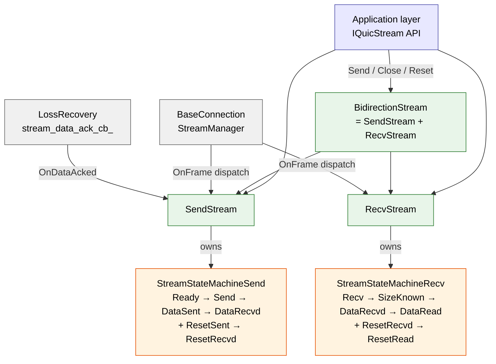

# Stream Dual State Machine Design (RFC 9000 §3)

This document translates quicX's stream state machines from RFC 9000 §3's "two diagrams plus a pile of SHOULD/MUST" into "one table, one diagram, one paragraph" that a code reader can match directly against the source. It attempts to answer the following questions:

1. Why does quicX split one bidirectional stream into **two independent state machines** (`StreamStateMachineSend` + `StreamStateMachineRecv`) instead of one big diagram?
2. For every frame type received / sent, **which states accept it, which reject it, and where does it transition**? Why are `OnFrame()` and `CheckCanSendFrame()` **two** methods instead of one?
3. **Terminal-state closure** conditions: the send side needs "all ACKed to reach Data Recvd", the receive side needs "app drained to reach Data Read" — how does `BidirectionStream::CheckStreamClose()` AND the two sides together? What race would keep a stream from ever being released?
4. Why does the **stream id encoding** bake starter / direction into the low two bits? The peek vs next difference?

Neighboring docs each cover one slice: this document covers stream-internal state transitions and bidirectional closure (mechanism); the stream's ownership and lifecycle pipeline inside the connection is in [`connection_anatomy.md`](connection_anatomy.md) §B-3 (integration); `OnDataAcked`'s selective-range algorithm in [`loss_recovery.md`](loss_recovery.md) §3 (ACK flow-back); the weak_self pattern of stream callbacks in [`ownership_and_memory.md`](ownership_and_memory.md) §5 (lifetime safety); the `RunInLoop` hand-off path for cross-thread `Send` / `Close` / `Reset` in [`process_model.md`](process_model.md) (threading model).

---
## 1. Overview: Why "Dual State Machines"

RFC 9000 §3.1 / §3.2 draws one state diagram each for the sending stream and the receiving stream — deliberately separate, for two reasons:

1. **A unidirectional stream physically has only one side**. A client-initiated `0x02` (client unidirectional) has only the send side; a server-initiated `0x03` only the recv side. One merged diagram would have half its states unreachable.
2. **The two sides of a bidirectional stream race independently**: while the send side sits in *Data Sent* waiting for all ACKs, the receive side may still be in *Recv* waiting for data; when the receive side has already reached *Data Read*, the send side may still be stuck retransmitting under a cwnd limit. The transition conditions, trigger events and terminal timing of the two sides are uncoupled; forcing them into one diagram only adds invalid transitions.

quicX copies this split verbatim:

```
src/quic/stream/
  if_state_machine.h          ← IStreamStateMachine interface (OnFrame / CheckCanSendFrame)
  state_machine_send.{h,cpp}  ← StreamStateMachineSend (5 states + AllAckDone)
  state_machine_recv.{h,cpp}  ← StreamStateMachineRecv (6 states + RecvAllData / AppReadAllData)
  if_stream.h                 ← IStream (with frames_list_ + active_send_cb_)
  send_stream.{h,cpp}         ← SendStream     —— owns send_machine_
  recv_stream.{h,cpp}         ← RecvStream     —— owns recv_machine_
  bidirection_stream.{h,cpp}  ← BidirectionStream (multiple inheritance of SendStream + RecvStream)
  stream_id_generator.{h,cpp} ← stream id encoding
  type.h                      ← StreamState enum (bitmask-style)
```

The hierarchy:



**Key judgment**: BidirectionStream is **not** "another state machine" — it merely multiple-inherits SendStream and RecvStream together; state transitions remain managed separately. The only addition is `CheckStreamClose()`, the logical-AND closure hook (§5).

---

## 2. The Interface Contract: `IStreamStateMachine`

### 2.1 Two Methods, Clearly Separated

```cpp
class IStreamStateMachine {
public:
    // Handle a frame that has been decided to be sent / has been received;
    // returning false means the current state rejects the frame
    virtual bool OnFrame(uint16_t frame_type) = 0;

    // Ask whether the current state allows sending this frame "right now"; does not mutate state
    virtual bool CheckCanSendFrame(uint16_t frame_type) = 0;

    StreamState GetStatus() { return state_; }
    void SetStateChangeCB(StateChangeCB cb, uint64_t stream_id);  // qlog hook
};
```

Why **two** methods instead of one?

| Scenario | Call |
| :--- | :--- |
| Before the application's `Send()` | `CheckCanSendFrame(kStream)` — only asks whether writing is allowed; if not, directly `return -1`, **must not mutate state** |
| After `TrySendData()` actually feeds the frame to the visitor | `OnFrame(frame_type)` — the frame is already pressed into the packet buffer; the state machine registers "it has been sent" |
| `OnFrame()` on the receive side (peer packet arrived) | `OnFrame(frame_type)` — the packet is already in; the state machine decides "accept" or reject, but cannot "ACK first, decide later" |

Mixing them breeds bugs: an early version called `OnFrame` at the `Send` entry; when packet encoding then failed (`kInsufficientSpace`), the state machine had already moved from `Ready` to `Send`; on retry `CheckCanSendFrame` saw `kSend` and still allowed it — **the logic was fine**, but after `kDataSent` a retry wrongly assumed FIN had already been sent. The fix: **encode successfully first, then `OnFrame`** — `send_stream.cpp:409-424` is this order.

### 2.2 The State Enum (Bitmask Style)

```cpp
// type.h
enum class StreamState: uint16_t {
    kUnknown     = 0,
    // sending stream states
    kReady       = 0x0001,
    kSend        = 0x0002,
    kDataSent    = 0x0004,
    kResetSent   = 0x0008,
    // receiving stream states
    kRecv        = 0x0010,
    kSizeKnown   = 0x0020,
    kDataRead    = 0x0040,
    kResetRead   = 0x0080,
    // common termination states
    kDataRecvd   = 0x0100,
    kResetRecvd  = 0x0200,
};
```

Design points:

- **Bitmask rather than sequential enum**: convenient for qlog's bitwise queries ("is it any terminal state") and for future `state & TerminalMask` extensions.
- **`kDataRecvd` / `kResetRecvd` shared across both sides**: the send side reaching *Data Recvd* ("everything I sent got ACKed") and the receive side reaching *Reset Recvd* ("I received the peer's RESET") use the same enum value — because both semantically mean "this direction is finished", and the code **always** disambiguates context explicitly via `send_machine_->GetStatus()` or `recv_machine_->GetStatus()`, so they never mix.
- **`kUnknown = 0`**: compatible with default construction, but before real use both state machines are explicitly constructed as `kReady` / `kRecv` (see `state_machine_send.h:50` / `state_machine_recv.h:47`).

### 2.3 The qlog Hook

```cpp
void SetStateChangeCB(StateChangeCB cb, uint64_t stream_id) {
    state_change_cb_ = cb;
    stream_id_ = stream_id;
}
protected:
void NotifyStateChange(StreamState old_state, StreamState new_state) {
    if (state_change_cb_ && old_state != new_state) {
        state_change_cb_(stream_id_, old_state, new_state);
    }
}
```

Every transition point calls `state_ = new_state; NotifyStateChange(old_state, state_);` as a pair — this is the source of qlog's `transport:stream_state_updated` event. **Key discipline**: Notify only on successful transition; failures (the default `LOG_ERROR` branch) do not Notify, keeping "state didn't change but broadcast anyway" dirty events out of qlog.

---

## 3. The Send-Side State Machine (RFC 9000 §3.1)

### 3.1 State Diagram

```
       ┌─────────┐
       │  Ready  │ ← initial state at construction
       └────┬────┘
            │
   ┌────────┼─────────────────────┐
   │ STREAM │ STREAM_DATA_BLOCKED │ RESET_STREAM
   │ (no    │                     │
   │  FIN)  │                     │
   ▼        ▼                      ▼
┌────────┐               ┌─────────────┐
│  Send  │ ── RESET ──→  │ Reset Sent  │
└────────┘               └──────┬──────┘
   │                            │
   │ STREAM + FIN               │ AllAckDone
   ▼                            ▼
┌──────────┐              ┌─────────────┐
│ DataSent │              │ Reset Recvd │
└────┬─────┘              └─────────────┘
     │ AllAckDone
     ▼
┌──────────┐
│ DataRecvd│  ← terminal: every byte sent + FIN has been ACKed
└──────────┘
```

### 3.2 `OnFrame()` Transition Table (`state_machine_send.cpp:16-65`)

| Current State | Trigger Frame | Target State | Note |
| :--- | :--- | :--- | :--- |
| `Ready` | `STREAM` (no FIN) | `Send` | |
| `Ready` | `STREAM` + FIN | `DataSent` | RFC 9000 §3.1 allows *Ready → Data Sent* in one step |
| `Ready` | `STREAM_DATA_BLOCKED` | `Send` | counts as "started sending data" |
| `Ready` | `RESET_STREAM` | `ResetSent` | |
| `Send` | `STREAM` (no FIN) | `Send` (self-loop) | |
| `Send` | `STREAM` + FIN | `DataSent` | |
| `Send` | `RESET_STREAM` | `ResetSent` | |
| `DataSent` | `RESET_STREAM` | `ResetSent` | RFC 9000 §3.5: a reset triggered by `STOP_SENDING` may be **deferred** in *DataSent* (see §3.6) |
| Other | Any | `LOG_ERROR` | |

### 3.3 The `CheckCanSendFrame()` Matrix (`state_machine_send.cpp:67-80`)

```cpp
bool CheckCanSendFrame(uint16_t frame_type) {
    // RFC 9000 §3.3: no frame may be sent from a terminal state
    if (state_ == kResetRecvd || state_ == kDataRecvd) return false;

    // RFC 9000 §3.1: in ResetSent or DataSent, no more STREAM / STREAM_DATA_BLOCKED
    if (IsStreamFrame(frame_type) || frame_type == kStreamDataBlocked) {
        return state_ != kResetSent && state_ != kDataSent;
    }

    return true;
}
```

Note that `RESET_STREAM` is **not** on the forbidden list: `DataSent → ResetSent` is legal (§3.6).

### 3.4 `AllAckDone()`: Terminal Closure (`state_machine_send.cpp:82-98`)

```cpp
bool AllAckDone() {
    switch (state_) {
        case kDataSent:  state_ = kDataRecvd;  break;
        case kResetSent: state_ = kResetRecvd; break;
        default: return false;  // other states don't allow AllAckDone
    }
    return true;
}
```

**What actually drives this transition is not the state machine itself but `SendStream::OnDataAcked` → `CheckAllDataAcked()`**:

```cpp
// send_stream.cpp:562
void CheckAllDataAcked() {
    // both closure conditions are required:
    if (fin_sent_ && acked_offset_ >= send_data_offset_) {
        send_machine_->AllAckDone();   // ← triggers DataSent → DataRecvd
    }
}
```

- `fin_sent_`: FIN has already gone onto the wire (set at either the §4.5 ack path or the send path);
- `acked_offset_ >= send_data_offset_`: the contiguous ACKed prefix has covered up to the send watermark.

### 3.5 Selective ACK and "False Terminal States"

`acked_ranges_` is a `std::map<offset, end>` disjoint interval set — it **must not** be degraded to a single high-water mark. Reason: an aioquic-style peer may ACK the packet carrying `(5MB, FIN)` while a gap remains before it; judging by high-water mark alone would wrongly conclude "everything arrived", stop retransmitting, and hang the connection until idle_timeout.

The full algorithm (`send_stream.cpp:504-560`):

1. Insert the new ACK range `[start, start+length)` into the map, **merging** any adjacent or overlapping old ranges;
2. Recompute `acked_offset_` = the first range's end (**provided** that range starts at 0);
3. Track `fin_sent_` separately (set idempotently on both the ACK path and the original send path);
4. Fire `CheckAllDataAcked()`.

> For PN migration details (how `stream_data` moves from the old PN to the new one on retransmission, so that ACKs still flow back after a retransmit) see [`loss_recovery.md`](loss_recovery.md) §3.

### 3.6 The `STOP_SENDING` Special Case

`OnStopSendingFrame` (`send_stream.cpp:476-502`) contains a very important piece of RFC 9000 §3.5 compliance:

```cpp
auto current_state = send_machine_->GetStatus();
if (current_state == kReady || current_state == kSend) {
    // MUST send RESET_STREAM in Ready or Send state
    SendStream::Reset(err);
}
// In Data Sent state: defer RESET_STREAM (RFC 9000 allows this)
// FIN has already been sent; some implementations (e.g. quic-go) interpret a
// late RESET_STREAM as "request cancelled" and stop sending the response.
// We deliberately do not send it.
```

The sentence in that comment — "*some implementations interpret it as 'request cancelled' and stop sending the response*" — is a battle scar from the HTTP/3 interop testbed: without this check, an HTTP/3 client that finishes its FIN and then calls `Cancel` makes the server receive RESET_STREAM and immediately drop the response, truncating half of a 5MB file transfer.

---

## 4. The Recv-Side State Machine (RFC 9000 §3.2)

### 4.1 State Diagram

```
       ┌─────────┐
       │  Recv   │ ← initial state at construction
       └────┬────┘
            │
   ┌────────┼──────────────┐
   │ STREAM │ RESET_STREAM │
   │ + FIN  │              │
   ▼        ▼              ▼
┌────────────┐       ┌─────────────┐
│ SizeKnown  │──RST──│ Reset Recvd │
└─────┬──────┘       └──────┬──────┘
      │                     │
      │ RecvAllData         │ AppReadAllData
      ▼                     ▼
┌──────────┐         ┌─────────────┐
│ DataRecvd│         │ Reset Read  │ ← terminal
└─────┬────┘         └─────────────┘
      │ AppReadAllData
      ▼
┌──────────┐
│ DataRead │ ← terminal
└──────────┘
```

### 4.2 `OnFrame()` Transition Table (`state_machine_recv.cpp:16-74`)

| Current State | Trigger Frame | Target State | Note |
| :--- | :--- | :--- | :--- |
| `Recv` | `STREAM` (no FIN) | `Recv` | self-loop, just returns true |
| `Recv` | `STREAM` + FIN | `SizeKnown` | |
| `Recv` | `STREAM_DATA_BLOCKED` | `Recv` | self-loop |
| `Recv` | `RESET_STREAM` | `ResetRecvd` | side effect `is_reset_received_ = true` |
| `SizeKnown` | `STREAM` | `SizeKnown` | accepts gap-filling data |
| `SizeKnown` | `STREAM_DATA_BLOCKED` | `SizeKnown` | |
| `SizeKnown` | `RESET_STREAM` | `ResetRecvd` | |
| `ResetRecvd` | `STREAM` | `ResetRecvd` | RFC 9000 §3.2 optional: stream frames may still be accepted after reset (for final_size validation) |
| `DataRecvd` / `DataRead` | `STREAM` / `RESET_STREAM` | self-loop | RFC 9000 §4.5: terminal states must still validate final_size |

### 4.3 `CheckCanSendFrame()` (`state_machine_recv.cpp:76-87`)

The receive side can "send" only two kinds of frames — window updates / active shutdown:

```cpp
if (frame_type == kMaxStreamData) {
    // RFC 9000 §3.2: send only in Recv / SizeKnown
    return state_ == kRecv || state_ == kSizeKnown;
}
if (frame_type == kStopSending) {
    // RFC 9000 §3.2: sendable except from ResetRecvd / ResetRead
    return state_ != kResetRead && state_ != kResetRecvd;
}
return false;
```

### 4.4 Two-Phase Terminal States: `RecvAllData()` + `AppReadAllData()`

On the receive side, RFC 9000 deliberately splits "data fully received" and "app fully drained" into two states:

| Phase | Trigger | Transition |
| :--- | :--- | :--- |
| `SizeKnown → DataRecvd` | `RecvAllData()`: `final_offset_ != 0 && except_offset_ == final_offset_` | Checked automatically by `RecvStream::OnStreamFrame` after writing the buffer |
| `DataRecvd → DataRead` | `AppReadAllData()`: `recv_cb_` fired **and** returned success | Guarded by `recv_machine_->CanAppReadAllData()`, idempotent |
| `SizeKnown / Recv → ResetRecvd` | Received `RESET_STREAM` | automatic |
| `ResetRecvd → ResetRead` | Application acknowledges (also `AppReadAllData()`) | terminal |

**The role of `is_reset_received_`** (`state_machine_recv.h:65`): when `RecvAllData()` fires in `SizeKnown` and a `RESET_STREAM` was **already** received earlier (accepted per the last row of §4.2 but still recorded in `is_reset_received_`), the transition goes to `ResetRecvd` instead of `DataRecvd` — preventing the user's application from seeing a stream that "all arrived but was actually reset" and mistaking it for success.

### 4.5 Out-of-Order Buffering and Final-Size Validation (`recv_stream.cpp:114-271`)

The core loop for receiving a stream frame:

1. **`OnFrame()` guard**: if the state machine doesn't accept it, drop directly (`recv_stream.cpp:115`);
2. **Integer overflow check**: `offset + length` overflowing uint64_t → `FlowControlError`, close the connection (`recv_stream.cpp:124-134`);
3. **Flow-control check**: `frame_end > local_data_limit_` → `FlowControlError` (same path);
4. **final_size consistency**: the FIN packet's `offset+length` must equal `final_offset_` (whatever final_offset is already known), otherwise `FinalSizeError`;
5. **In-order match**: `offset == except_offset_` takes the fast path (deep-copy into `buffer_`, fire `recv_cb_`), otherwise goes into `out_order_frame_`;
6. **Out-of-order confluence**: after every contiguous segment lands, loop over `out_order_frame_[except_offset_]` to flush whatever can now be stitched;
7. **Callback closure**: with `is_last == true`, call `recv_machine_->RecvAllData()` (`SizeKnown → DataRecvd`), then `CanAppReadAllData()` → `AppReadAllData()` (`DataRecvd → DataRead`).

### 4.6 The Active Window-Advance Policy (`recv_stream.cpp:238-265`)

```cpp
const uint64_t kWindowThreshold = local_data_limit_ / 4;       // trigger at 25% remaining
const uint64_t kWindowIncrement = kStreamWindowIncrement;       // a large increment each time

if (remaining_window < kWindowThreshold) {
    if (recv_machine_->CheckCanSendFrame(kMaxStreamData)) {
        // ... compute needed, widen the window, queue MAX_STREAM_DATA into frames_list_
    }
}
```

Design points:

- **25% early trigger**: waiting until 0% to send MAX_STREAM_DATA makes the sender silently stall for an RTT;
- **Large increments**: grow by at least `kStreamWindowIncrement` (typically 2MB) each time, reducing frame count;
- **State guard**: `CheckCanSendFrame(kMaxStreamData)` rejects sending after `DataRecvd` — explicitly required by RFC 9000 §3.2.

---

## 5. Bidirectional Stream Closure: `CheckStreamClose()`

`BidirectionStream` is assembled via multiple inheritance:

```cpp
class BidirectionStream:
    public virtual IStream,         // common base, avoiding the diamond
    public virtual SendStream,
    public virtual RecvStream {
};
```

The only new logic is `CheckStreamClose()` — **ANDing the two sides' terminal states together**:

```cpp
// bidirection_stream.cpp:154
void CheckStreamClose() {
    bool send_terminal = (send_machine_->GetStatus() == kDataRecvd ||
                          send_machine_->GetStatus() == kResetRecvd);
    bool recv_terminal = (recv_machine_->GetStatus() == kDataRead ||
                          recv_machine_->GetStatus() == kResetRead);
    if (send_terminal && recv_terminal) {  // ← AND, not OR
        if (stream_close_cb_) stream_close_cb_(stream_id_);
    }
}
```

**Trigger points** (4 groups, `bidirection_stream.cpp:43, 67, 109, 118, 125, 151`):

| Call Site | When |
| :--- | :--- |
| Inside `Close()` | Right after the application actively closes the send side, try once (in most cases it won't pass yet — ACKs are still pending) |
| Inside `Reset(error)` | Try once after the application actively resets both sides |
| After `OnFrame(RESET_STREAM)` | Peer reset received; recursed into `OnResetStreamFrame`, changing the recv state |
| After `OnFrame(STOP_SENDING)` | Triggers a local reset, changing the send state |
| After `OnFrame(STREAM)` | The recv side may reach DataRead directly via FIN + full drain |
| After `OnDataAcked()` | The send side may reach DataRecvd via full ACK |

**Why it must be AND**:

- Unidirectional streams don't have this problem: IStream is send-only or recv-only, one terminal condition;
- For a bidirectional stream where the send side is already DataRecvd but the recv side is still SizeKnown, the application is still waiting for data; using OR would close too early — after the stream_id is released, later packets find no matching stream (StreamManager drops or creates anew) — and against quic-go you'd observe truncated responses.

### 5.1 The Frame Dispatch of `OnFrame`

```cpp
// bidirection_stream.cpp:98
uint32_t OnFrame(std::shared_ptr<IFrame> frame) {
    switch (frame->GetType()) {
        case kStreamDataBlocked: OnStreamDataBlockFrame(frame); break;     // → recv side
        case kResetStream:       OnResetStreamFrame(frame); CheckStreamClose(); break;
        case kMaxStreamData:     OnMaxStreamDataFrame(frame); break;       // → send side
        case kStopSending:       OnStopSendingFrame(frame); CheckStreamClose(); break;
        default:
            if (StreamFrame::IsStreamFrame(frame->GetType())) {
                result = OnStreamFrame(frame);  // → recv side
                CheckStreamClose();
                return result;
            }
    }
}
```

**A pinned invariant**: every branch that **can change a terminal state** is followed by a `CheckStreamClose()`. Missing one causes the stream to hang until idle_timeout. This is a common source of historical bugs; any change to bidirection_stream.cpp must self-check "terminal-state trigger points ≥ 4".

### 5.2 The Two-Side Order of `TrySendData()`

```cpp
// bidirection_stream.cpp:134
TrySendResult TrySendData(IFrameVisitor* visitor, EncryptionLevel level) {
    auto recv_result = RecvStream::TrySendData(visitor);   // send the recv side's MAX_STREAM_DATA first
    if (recv_result == TrySendResult::kFailed) return recv_result;
    return SendStream::TrySendData(visitor, level);        // then the send side's data
}
```

**Why the recv side goes first**: MAX_STREAM_DATA is a window update for the peer; if the packet budget were spent entirely on our own STREAM data, the peer might stop sending because its window isn't updated — creating the deadlock of "I have space but never announced it / the peer stopped sending / I have nothing to read". Putting window updates first keeps both pipelines unblocked.

---

## 6. Stream ID Encoding: `StreamIDGenerator`

### 6.1 The Bit Encoding of RFC 9000 §2.1

```
Meaning of the low two bits of a Stream ID (62-bit varint):
  bit 0 (Initiator): 0 = Client-initiated, 1 = Server-initiated
  bit 1 (Direction): 0 = Bidirectional,    1 = Unidirectional
```

quicX's implementation (`stream_id_generator.cpp:14-30`):

```cpp
uint64_t NextStreamID(StreamDirection direction) {
    uint64_t next = (direction == kBidirectional) ?
                    cur_bidirectional_id_++ : cur_unidirectional_id_++;
    next = next << 2 | (direction | starter_);
    return next;
}
```

- `<< 2`: the high bits are the sequence number;
- `| (direction | starter_)`: the low 2 bits hold the encoding. `StreamDirection::kBidirectional = 0x0` / `kUnidirectional = 0x2` align exactly with bit 1; `StreamStarter::kClient = 0x0` / `kServer = 0x1` align exactly with bit 0.

### 6.2 `PeekNextStreamID` vs `NextStreamID`

```cpp
uint64_t PeekNextStreamID(StreamDirection direction) const;  // does not increment
uint64_t NextStreamID(StreamDirection direction);            // increments
```

**Why Peek exists**: before `MakeStream`, you must first validate "would opening one more stream exceed the peer's `initial_max_streams_*` limit". If you Next first and the validation then fails, the sequence has already skipped a number and the next Next leaves a hole — the peer sees stream id 16 never appear and jump straight to 20, treating 16 as "implicitly opened" per RFC 9000 §3.1, breaking the stream count. Peek runs the same bit-encoding logic but **does not touch the counters**, letting the caller Next only after the limit check passes.

### 6.3 Static Reverse Decoding

```cpp
static StreamDirection GetStreamDirection(uint64_t id) {
    if (id & StreamDirection::kUnidirectional) return kUnidirectional;
    return kBidirectional;
}
```

Only looks at bit 1. Reverse decoding of the initiator is not in this class; `BaseConnection::IsLocalStreamID(id)` does it by comparing `(id & 0x1) == starter_` (see [`connection_anatomy.md`](connection_anatomy.md)).

---

## 7. `IStream` Common Infrastructure

`IStream` (`if_stream.h:19`) is the common base of SendStream / RecvStream, providing four things:

```cpp
class IStream: public virtual IQuicStream, public std::enable_shared_from_this<IStream> {
    // 1. stream id + event_loop weak_ptr
    uint64_t stream_id_;
    std::weak_ptr<common::IEventLoop> event_loop_;

    // 2. pending-frames queue (control frames like MAX_STREAM_DATA / STOP_SENDING / RESET_STREAM)
    std::list<std::shared_ptr<IFrame>> frames_list_;

    // 3. active flag + three callbacks
    bool is_active_send_ = false;
    std::function<void(std::shared_ptr<IStream>)> active_send_cb_;
    std::function<void(uint64_t stream_id)> stream_close_cb_;
    std::function<void(uint64_t err, uint16_t frame_type, const std::string&)> connection_close_cb_;

    // 4. the common TrySendData edge + two helper methods
    enum class TrySendResult { kSuccess, kFailed, kBreak, kFlowControlBlocked };
    void ToClose();
    void ToSend();
};
```

### 7.1 The Four Return Values of `TrySendResult`

| Value | Meaning | StreamManager / Connection Reaction |
| :--- | :--- | :--- |
| `kSuccess` | All frames pressed into the current packet | Removed from the active list (unless send_buffer still has data) |
| `kFailed` | Permanent error (encoding failure etc.) | Removed from the active list; may trigger connection close |
| `kBreak` | Packet full / more data remains | **Kept** on the active list, to fill the next packet |
| `kFlowControlBlocked` | Stream-level FC blocked | Kept on the active list, waiting for MAX_STREAM_DATA |

The **precise distinction** between `kBreak` and `kFlowControlBlocked` was the root of a historical bug (see the long comment at `send_stream.cpp:343-401`): early versions didn't differentiate and treated a conn-level cwnd limit as stream FC, emitting a spurious STREAM_DATA_BLOCKED that a quic-go peer saw as "limit=524288 but offset=388276" — protocol noise.

### 7.2 The `RunInLoop` Hand-Off for Cross-Thread Entries

`SendStream::Send` / `Close` / `Flush`, `RecvStream::Reset`, `BidirectionStream::Reset` — every application-facing call first does:

```cpp
auto loop = event_loop_.lock();
if (!loop) return -1;
if (!loop->IsInLoopThread()) {
    auto weak_self = weak_from_this();
    loop->RunInLoop([weak_self, ...]() {
        auto self = weak_self.lock();
        if (!self) return;
        // the real work
    });
    return success_marker;  // pretend success; already queued
}
// Inside the EventLoop thread: do it directly
```

**Why queuing is mandatory**: the state machines themselves carry no locks — RFC 9000 state transitions are a product of EventLoop single-threaded scheduling. If the application called `OnFrame` directly from another thread, both the state machine and send_buffer would race. The `weak_from_this` + `lock()` combo is the standard weak-self pattern of `ownership_and_memory.md` §5: if the stream is already destructed, the lambda safely no-ops.

---

## 8. Key Invariants
| # | Invariant | Consequence If Violated |
| :--- | :--- | :--- |
| 1 | State transitions must **always** encode successfully before `OnFrame()`; never "transition first, send later" | State machine misaligned on retry; FIN retransmission rejected |
| 2 | `CheckCanSendFrame()` does **not** mutate state; only `OnFrame()` does | A failed application `Send` pollutes the state machine |
| 3 | Bidirectional closure must be send_terminal **AND** recv_terminal | Early close → later packets find no stream |
| 4 | Every **terminal-changing branch** of `BidirectionStream::OnFrame` must be followed by `CheckStreamClose()` | Stream hangs until idle_timeout before release |
| 5 | `CheckAllDataAcked()` must check both `fin_sent_` and `acked_offset_ >= send_data_offset_` | A lost FIN-only packet never reaches DataRecvd |
| 6 | `acked_ranges_` must stay disjoint and **must not** degrade to a high-water mark | aioquic-style ACK of `(5MB, FIN)` stops retransmission |
| 7 | Application-thread entries must first hand off via `RunInLoop` to the EventLoop thread | Races on state machine + send_buffer |
| 8 | Recv-side window threshold of 25% + large increments | A 0% trigger stalls the sender for an RTT |
| 9 | `StreamIDGenerator` must use `Peek`, not `Next`, when validation may fail | Sequence skips; peer misjudges implicit opening |
| 10 | `STOP_SENDING` in `DataSent` defers the `RESET_STREAM` reply | A quic-go peer treats it as "request cancelled" and drops the response |

---

## 9. Related Documents

- [`connection_anatomy.md`](connection_anatomy.md) §B-3 — the stream's ownership inside the connection, StreamManager's dispatch chain
- [`loss_recovery.md`](loss_recovery.md) §3 — `OnDataAcked`'s selective-range algorithm, PN migration, stream_data_ack_cb_
- [`ownership_and_memory.md`](ownership_and_memory.md) §5 — the weak_self pattern of stream callbacks
- [`process_model.md`](process_model.md) — the RunInLoop hand-off path for cross-thread `Send` / `Close` / `Reset`
- [`packet_lifecycle.md`](packet_lifecycle.md) — where `TrySendData` sits in the connection's send main loop
- [`pool_allocator.md`](pool_allocator.md) §5 — stream `send_buffer` / `buffer_` memory comes from BlockMemoryPool

---

## 10. Related RFCs

- **RFC 9000 §3** *Stream States* — the source this document mirrors; `§3.1` send side, `§3.2` receive side, `§3.3` Permitted Frame Types, `§3.5` Solicited State Transitions (STOP_SENDING), `§4.5` Final Size.
- **RFC 9000 §2.1** *Stream Types and Identifiers* — the low-2-bit stream id encoding.
- **RFC 9000 §4** *Flow Control* — the semantic boundary of MAX_STREAM_DATA / STREAM_DATA_BLOCKED, partially coordinating with §4.6.
- **RFC 9000 §19.4 / §19.5 / §19.13** — field semantics of RESET_STREAM / STOP_SENDING / STREAM_DATA_BLOCKED respectively.
