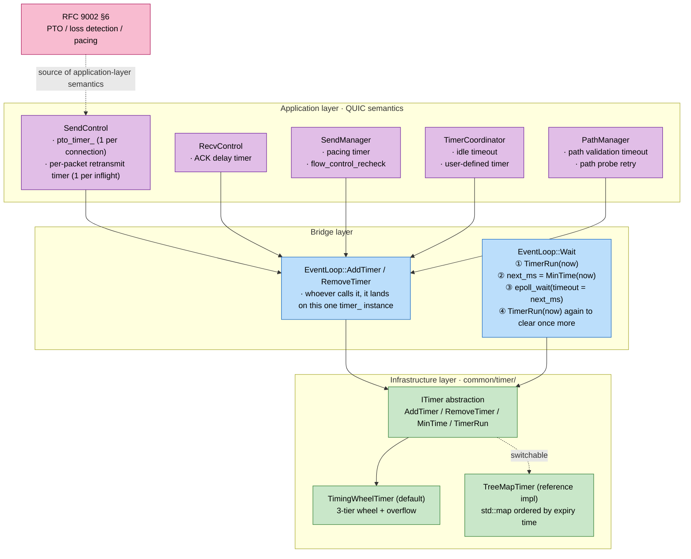

# Timer Design: Dual Implementations, Tiered Structure, and Why a Timing Wheel

quicX uses timers at two levels:

- **Infrastructure layer**: `common/timer/` provides the `ITimer` interface with two implementations (`TreeMapTimer` / `TimingWheelTimer`); each `EventLoop` holds one instance — the sole channel connecting "how long until the next earliest event" to the `epoll_wait` timeout;
- **Application layer**: nearly every "do something after another while" QUIC semantic over a connection's lifetime (PTO, ACK delay, pacing, flow-control recheck, idle timeout, path validation retry, …) registers onto this same underlying timer via `EventLoop::AddTimer()`.

This document answers four questions:

- Why `MakeTimer()` returns the timing wheel by default, and what the treemap is kept for;
- How the timing wheel achieves O(1) add / O(1) remove, and what cascade and overflow are about;
- How `EventLoop::Wait` kneads this timer into the reactor;
- What each application-level timer (PTO in particular) looks like at the bottom layer, and how this forms an "application → infrastructure" two-layer closed loop with `loss_recovery.md`.

While reading, open the 5 files under `src/common/timer/` (`if_timer.h` / `timer_task.h` / `timing_wheel_timer.{h,cpp}` / `treemap_timer.{h,cpp}`), plus `src/common/network/event_loop.cpp` and `src/quic/connection/controller/send_control.cpp`.

---

## 1. Overview



Four things to focus on:

1. **There is exactly one ITimer**: each `EventLoop` holds one `timer_`, shared by all application-level timers; there is no multi-timer split like "PTO uses one timer, idle uses another".
2. **`EventLoop::Wait` is the sole driver**: the underlying timer never runs its own thread nor preempts the main loop; it relies entirely on `Wait()` running one round before and after `epoll_wait`.
3. **`MakeTimer()` currently hard-codes a `TimingWheelTimer` return** (`timer.cpp:8-10`). The treemap implementation is kept as a reference and fallback option.
4. **The application layer only sees `EventLoop::AddTimer/RemoveTimer/AddTimerTask`** (`event_loop.cpp:300-380`), never `ITimer` directly; this bridging layer also absorbs memory details like "one-shot timers must not retain callbacks" (see the P4 note in §5).

---

## 2. The Interface Contract: `ITimer`'s Four Actions

`if_timer.h` is 33 lines total and pins the semantics down hard:

```cpp
class ITimer {
public:
    virtual uint64_t AddTimer(TimerTask& task, uint32_t time, uint64_t now = 0) = 0;
    virtual bool     RemoveTimer(TimerTask& task) = 0;
    virtual int32_t  MinTime(uint64_t now = 0) = 0;   // <0 no timer; ==0 already due; >0 this many ms remain
    virtual void     TimerRun(uint64_t now = 0) = 0;  // fire all due callbacks
    virtual bool     Empty() = 0;
};
```

Four actions, one data vehicle (`TimerTask`):

```cpp
class TimerTask {
public:
    std::function<void()> tcb_;            // user callback
    // the 5 fields below are private "position metadata", filled back by the implementation
    uint64_t time_;                        // absolute expiry instant (ms)
    uint64_t id_;                          // unique id (used by remove)
    int8_t   wheel_idx_;                   // the wheel's 0/1/2/3; -1 means unregistered
    uint32_t slot_idx_;
    std::list<TimerTask>::iterator list_it_;
    friend class TreeMapTimer;
    friend class TimingWheelTimer;
};
```

Value type + friend: the caller owns the `TimerTask` (e.g. `SendControl::pto_timer_` is a member variable); the implementation stores a copy of it internally and uses `id_` to look the copy up in `location_map_` and erase it in O(1) — the physical basis of O(1) Remove.

`AddTimer` / `MinTime` / `TimerRun` all accept `now=0` meaning "fetch the time yourself". `EventLoop::Wait()` always takes `now` once at the top of the loop and passes it down, avoiding repeated syscalls inside the loop.

---

## 3. The Timing Wheel Implementation (Default): 3 Tiers + Overflow

### 3.1 Geometric Parameters

`timing_wheel_timer.h:53-68`:

| Tier | Slots | Duration per Slot | Coverage |
| :--- | :---: | :---: | :--- |
| L0 | 256 | 1 ms | 0 ~ 256 ms |
| L1 | 64  | 256 ms | 256 ms ~ 16.4 s |
| L2 | 64  | 16.4 s | 16.4 s ~ ~17.5 min |
| overflow | — | — | > 17.5 min |

The slot counts are all powers of two, so every "compute the slot index" action degenerates into shifts and masks — which is why the source is full of `>> kL0Bits`, `& kL1Mask` idioms.

L0's "1 ms per cell" matters for QUIC: **PTO's minimum resolvable granularity is exactly 1 ms** (the PTO formula in loss_recovery outputs milliseconds), landing directly in an L0 slot with no time scaling needed.

### 3.2 Data Structures (the Point)

```cpp
std::array<Slot, 256> wheel0_;          // Slot = std::list<TimerTask>
std::array<Slot, 64>  wheel1_;
std::array<Slot, 64>  wheel2_;
Slot                  overflow_;

// occupancy bitmaps: bit s == 1 means the corresponding slot is non-empty
std::array<uint64_t, 4> wheel0_occ_;    // 4*64 = 256 bits
uint64_t                wheel1_occ_;
uint64_t                wheel2_occ_;
bool                    overflow_nonempty_;

// per-slot "earliest expiry in this slot" caches for L1/L2/overflow (L0 cells are 1 ms; no cache needed)
std::array<uint64_t, 64> wheel1_slot_min_;
std::array<uint64_t, 64> wheel2_slot_min_;
uint64_t                  overflow_slot_min_;

// whole-wheel minimum-expiry cache (recomputed when dirty)
uint64_t min_deadline_cache_;
bool     cache_dirty_;

// id → list iterator, for O(1) Remove
std::unordered_map<uint64_t, std::list<TimerTask>::iterator> location_map_;
```

The three classes of auxiliary indexes (occupancy bitmaps, per-slot minima, the global minimum cache) exist so that **MinTime never has to scan the lists of 384 slots** — this path runs on every `EventLoop::Wait()` and is a performance hotspot ("once cost ~20% CPU", per the comment at `timing_wheel_timer.cpp:418-422`).

### 3.3 Add / Remove: How O(1) Is Achieved

**AddTimer** (`timing_wheel_timer.cpp:42-79`):

```
1. now      = (passed-in now != 0) ? now : UTCTimeMsec();
2. id       = random uint64
3. deadline = now + time_ms
4. delta    = deadline - reference
5. place into wheel0_/1/2 or overflow by delta:
     delta < 256        → wheel0_[ deadline & 0xFF ]
     delta < 16384      → wheel1_[ (deadline >> 8) & 0x3F ]
     delta < 1048576    → wheel2_[ (deadline >> 14) & 0x3F ]
     else               → overflow_
6. push_back a copy, write back list_it_/wheel_idx_/slot_idx_, fill location_map_
7. opportunistically update that tier's occupancy bit, the slot-min cache, the global minimum cache
```

**RemoveTimer** (same file, 86-160):

```
1. location_map_.find(id) → list iterator
2. pick the slot by wheel_idx_, slot.erase(it) — O(1)
3. maintain the occupancy bit / per-slot min (when the removed one was the slot's
   minimum, rescan just that one slot)
4. if the removed one was the global minimum, set cache_dirty_ = true
```

Note step 3: **per-slot minima rescan at most one slot's list on removal**; a QUIC slot typically holds single-digit timers, so despite the theoretical O(k) list scan, real behavior stays at O(1) scale.

### 3.4 Cascade: When L0 Completes a Revolution

`Tick` (same file, 335-378) steps by ms; each step:

```
c0 = current_ms_ & 0xFF        # L0 slot
c1 = (current_ms_ >> 8) & 0x3F # L1 slot
c2 = (current_ms_ >> 14) & 0x3F# L2 slot

if c0 == 0:                     # L0 finished a revolution (256 ms)
    if c1 == 0:                 # L1 also finished one (16.4 s)
        if c2 == 0:             # L2 also finished one (17.5 min)
            Cascade(3 = overflow → re-tier)
        Cascade(2, c2)          # re-insert L2's current-slot timers (most land in L1/L0)
    Cascade(1, c1)              # re-insert L1's current-slot timers (most land in L0)

# then pop the entire list of wheel0_[c0], calling tcb_() one by one
current_ms_ += 1
```

Cascade's cost is amortized into the AddTimer from long ago: a long timer is registered once with an O(1) placement into L1/L2, cascades once into L0 shortly before expiry, then fires in O(1) — O(1) over a single timer's whole lifetime.

### 3.5 MinTime: Bitmaps Skip Empty Slots

`MinTime` on a cache hit just reads `min_deadline_cache_` — O(1). When dirty it calls `EarliestDeadline()` (`timing_wheel_timer.cpp:434-496`):

- L0: starting from the slot for the current ms, use `__builtin_ctzll` over the 4×64-bit occupancy bitmap to find the lowest set bit; at worst 4 ctz calls;
- L1: enumerate the set bits of `wheel1_occ_` (at most 64), each directly reading `wheel1_slot_min_[s]`, **never expanding the slot's list**;
- L2: same as L1;
- overflow: directly read `overflow_slot_min_`.

The whole EarliestDeadline is O(words + number of non-empty slots × 1); under typical QUIC load (thousands of connections / tens of thousands of timers) that's a few dozen ctz calls — far below the early version's cost of "traversing the std::list of 384 slots every time".

---

## 4. The TreeMap Implementation: What It's Kept For

`TreeMapTimer` (`treemap_timer.{h,cpp}`, under 100 lines total) uses `std::map<uint64_t, std::unordered_map<uint64_t, TimerTask>>` ordered by expiry ms:

```cpp
std::map<uint64_t, std::unordered_map<uint64_t, TimerTask>> timer_map_;
//        ^^^^^^^^^^^^^^                  ^^^^^^^^^^^^^^^
//        expiry time in ms               timer id → task
```

| Operation | Timing Wheel | TreeMap | Note |
| :--- | :---: | :---: | :--- |
| AddTimer    | O(1)        | O(log N)  | TreeMap needs a red-black-tree insert |
| RemoveTimer | O(1)        | O(log N)  | wheel relies on location_map_ + list iterator |
| MinTime     | O(1) amortized | O(1)   | TreeMap's begin() is the minimum |
| TimerRun    | O(due count + cascade amortized) | O(due count + log N) | each slot deletion in TreeMap is O(log N) |
| Memory      | a few KB static | proportional to N | the wheel is 384 slots × list overhead |
| Ultra-long timers | overflow fallback | naturally supported | TreeMap has no upper bound |

QUIC's load profile — **large timer counts, extremely frequent add / remove / rearm** (see §6) — puts "O(1) Remove" first. TreeMap's O(log N) Remove would become the bottleneck, but it remains useful in two scenarios:

- **Very few timers, all long-lived** (e.g. a long-lived daemon): with n small, log N is small too, and the wheel's 384 slots of memory would be wasted;
- **Regression / debugging**: a different algorithm serves as a cross-check (ensuring one implementation isn't buggy).

Switching implementations in `MakeTimer()` is a one-line change (`timer.cpp:8-10`), so this is a genuinely replaceable interface.

---

## 5. How EventLoop Wires It into the Reactor

`event_loop.cpp:79-101` (`EventLoop::Wait`):

```cpp
int EventLoop::Wait() {
    uint64_t now = UTCTimeMsec();
    timer_->TimerRun(now);                       // ① clear what's already due first

    int32_t next_ms = timer_->MinTime(now);
    int timeout_ms  = next_ms >= 0 ? next_ms : 1000;

    if (need_immediate_wakeup_) timeout_ms = 0;  // RunInLoop same-thread wakeup

    int n = driver_->Wait(events_, timeout_ms);  // ② epoll_wait

    timer_->TimerRun(UTCTimeMsec());             // ③ clear once more (timers may have come
                                                 //    due while epoll was busy)
    // ④ handle fd events...
}
```

The four steps correspond to the canonical reactor pattern:

- **① and ③ each run a TimerRun**: the first ensures all past timers are cleared "before I decide how long to wait"; the second ensures timers that expired while epoll was blocked aren't starved by fd events.
- **② the timeout comes from MinTime**: this is the timer's only coupling point with the reactor. `MinTime` returns a `>=0` ms count or `-1` (no timer). With no timers it degrades to a 1000 ms block — a fallback timeout that doesn't affect correctness but avoids "epoll blocking forever, delaying RunInLoop tasks".
- **`need_immediate_wakeup_` cross-thread signal**: when `RunInLoop` posts a task on the same thread (unable to use the wakeup-pipe eventfd), it forces the timeout to 0 so epoll_wait returns immediately.

After the application calls `event_loop_->AddTimer(cb, delay_ms)`, `EventLoop` internally wraps a `TimerTask`, registers it via `timer_->AddTimer()`, and stores the task in the `timers_` map (repeat timers only, see below):

```cpp
// around event_loop.cpp:300
TimerTask task(cb);
uint64_t id = timer_->AddTimer(task, delay_ms, now);
timer_ids_.insert(id);
if (repeat) {
    timers_[id]      = task;     // repeat timers must keep the cb for re-registration
    timer_repeat_[id]= true;
}
// one-shot timers must not go into timers_, otherwise the shared_ptr<BaseConnection>
// captured by the cb stays held after firing → ~120KB RSS residue per connection
// (see the P4 fix comment)
```

**The P4 lesson**: once a one-shot timer fires, its callback must vanish immediately from the EventLoop's index, otherwise connection destruction gets delayed to the next timer GC round. The thin `timer_repeat_` distinction exists precisely for this.

---

## 6. Application-Side Example: The PTO Timer's Four Rearmaments

`SendControl::pto_timer_` (`send_control.h:233-238`) is a connection's hottest timer:

```cpp
common::TimerTask pto_timer_;            // 1 per connection
void OnPTOTimer();                       // expiry callback
```

It is reset at 4 moments (reset = `RemoveTimer(pto_timer_)` + `AddTimer(pto_timer_, pto_ms)`):

| Trigger | Code Location | Behavior |
| :--- | :--- | :--- |
| ① An ack-eliciting packet is sent | `OnPacketSend` (`send_control.cpp:147-151`) | Remove old + Add new with `GetPTOWithBackoff(...)` |
| ② ACK received, in-flight remains | `OnPacketAck` (partial-ACK branch, 454-456) | backoff already zeroed by `OnPacketAcked()`; rearm on the latest RTT |
| ③ ACK received, handshake not complete | same file 460-468 | keep PTO alive even with no in-flight, as the PING probe trigger |
| ④ PTO expiry, self re-entry | `OnPTOTimer` (748-752) | rearm the next probe round with the updated backoff |

Every reset is one RemoveTimer + AddTimer — **this is why RemoveTimer's O(1) complexity is critical for QUIC**: under high retransmission rates / violent RTT jitter, each connection may reset PTO repeatedly per second; put it on an O(log N) TreeMap and things slow down as soon as N grows (many connections / many in-flight packets).

Every in-flight packet also carries its own retransmit timer (stored in `unacked_packets_[ns][pn].timer_task`), cleaned up wholesale by `ClearRetransmissionData()` on ACK (see the comment at `send_control.h:64-79`, which records a real "P3: with short RTTs, timers not cleaned up promptly caused heap corruption" incident).

Other high-frequency timers:

| Module | Timer | Purpose | Frequency |
| :--- | :--- | :--- | :--- |
| `RecvControl` | `timer_task_` | ACK delay (batching before replying with an ACK) | possibly armed per ack-eliciting packet |
| `SendManager` | `pacing_timer_task_` | pacing yielding the cwnd | depends on pacing rate |
| `SendManager` | `flow_control_recheck_task_` | recheck when flow-control stalled | armed per flow-control block |
| `TimerCoordinator` | `idle_timeout_task_` | RFC 9000 idle timeout | possibly reset on every send/receive |
| `TimerCoordinator` | user-defined timers | exposed upward via TimerCoordinator::AddTimer | — |
| `PathManager` | `migration_timeout_task_` | path validation timeout | occasional during migration |
| `PathManager` | `path_probe_task_` | path probe retry | occasional during migration |

`TimerCoordinator` (`connection/connection_timer_coordinator.cpp`) is especially worth a look: it also encapsulates "on which thread AddTimer is called" — same-thread means a direct `loop->RemoveTimer + AddTimer`; cross-thread means `RunInLoop` trampolines the operation back onto the worker thread (`connection_timer_coordinator.cpp:117-131`). This is the concrete landing of the **EventLoop::AssertInLoopThread() invariant** on timers (see `process_model.md` §7).

---

## 7. The Two-Layer Closed Loop with loss_recovery

`loss_recovery.md` covers **application semantics** —

- The PTO formula: `PTO = SRTT + max(4*RTTVAR, kGranularity) + max_ack_delay`, multiplied by `2^pto_count`;
- Loss-detection thresholds: `9/8 × max(SRTT, latest_rtt)`;
- When to send probes / when to mark in-flight lost;
- How these actions map onto `OnPacketSend`/`OnPacketAck`/`OnPTOTimer`.

**It answers "when should a timer do what".**

`timer_design.md` (this document) covers the **underlying mechanism** —

- `RemoveTimer + AddTimer` is O(1), so repeated PTO resets are cheap;
- `MinTime` is O(1) amortized, so the reactor spends essentially no CPU deciding the epoll timeout each round;
- cascade makes "long timers needn't enter L0 at registration" amortized O(1);
- one-shot timers are erased immediately from the EventLoop's index, avoiding callbacks pinning connection objects.

**It answers "how the bottom layer achieves O(1) arming / cancelling / earliest lookup after a timer fires".**

Together the two documents complete QUIC's timeout-driven behavior: upper-layer semantics and lower-layer mechanism, one document each; either stands alone, but only together do they tell the full story.

---

## 8. Key Invariants

If you find any of the following violated while reading the source or debugging, it's a bug:

1. **One timer instance per EventLoop**: two ITimers never coexist; all application-level timers share one wheel (or tree).
2. **TimerTask::id_ is globally unique**: the wheel takes a 64-bit id via `RangeRandom`; treemap uses monotonically increasing. A location_map_ miss is equivalent to the task not being in the wheel.
3. **wheel_idx_ == -1 ⇔ unregistered**: written back at Insert, written back after Remove. A task existing in multiple slots simultaneously is a bug.
4. **per-slot min and the occupancy bit live and die together**: any wheelN_occ_ bit and wheelN_slot_min_[s] must consistently express "is this slot non-empty".
5. **min_deadline_cache_ is either true or cache_dirty_ = true**: on a removal hitting the minimum or a Tick firing the minimum, it must go dirty immediately.
6. **EventLoop::Wait always runs TimerRun before MinTime**: the reverse order opens a window of "just computed next_ms, then found a timer due within that many ms that never ran".
7. **Cross-thread timer operations must be forwarded via RunInLoop**: `TimerCoordinator::ResetIdleTimer()` is the canonical template (see the code citation at the end of §6).

---

## 9. Related Documents

- [`loss_recovery.md`](loss_recovery.md) — the upper-layer PTO formula / loss-detection thresholds, forming the two-layer closed loop with this document.
- [`congestion_control.md`](congestion_control.md) — the source of the cwnd / pacing-rate model the pacing timer serves.
- [`connection_anatomy.md`](connection_anatomy.md) — where `TimerCoordinator` sits in BaseConnection; §3.5 delimits the timers not held by TimerCoordinator.
- [`process_model.md`](process_model.md) — where EventLoop sits in the worker's single-threaded reactor; the timers' "AssertInLoopThread" constraint.
- [`ownership_and_memory.md`](ownership_and_memory.md) — the P4 lesson: one-shot timer callbacks must not be held long-term by `EventLoop::timers_`.

---

## 10. Related RFCs

- RFC 9002 §6 (Loss Detection) — the PTO formula, loss timers, the ack-eliciting concept.
- RFC 9002 §7 (Pacing) — the application semantics of the pacing timer.
- RFC 9000 §10.1 (Idle Timeout) — the protocol-level semantics of the idle timer.
- Classic literature: George Varghese & Tony Lauck, *Hashed and Hierarchical Timing Wheels: Data Structures for the Efficient Implementation of a Timer Facility* (1987) — the origin of the three-tier timing-wheel scheme.
