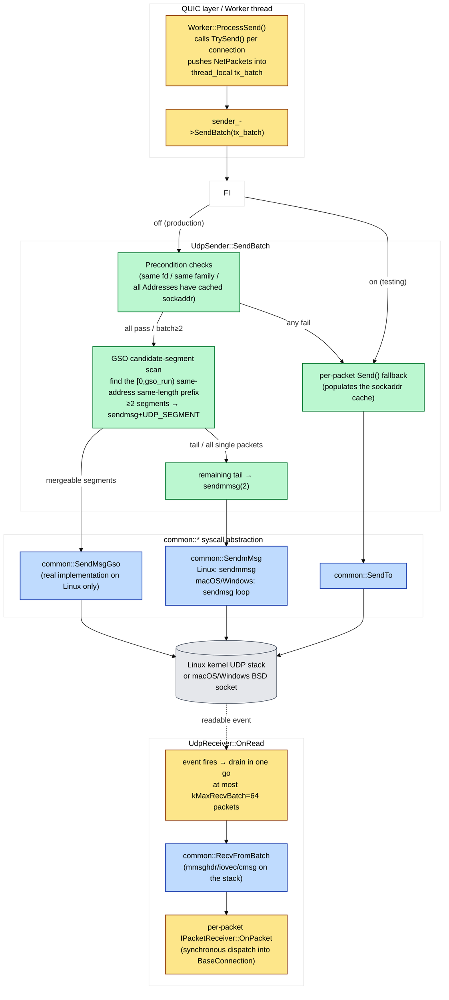

# UDP I/O Subsystem Design: sendmmsg / GSO / recvmmsg Tradeoffs and Fallback Paths

This document covers the engineering decisions at quicX's lowest syscall layer — the docs above tell "where a packet comes from and goes to" ([`packet_lifecycle.md`](packet_lifecycle.md)) and the threading model ([`process_model.md`](process_model.md)); this one tells "whether that syscall is sendto / sendmmsg or sendmsg+UDP_SEGMENT, and how to fall back on failure". Code involved: `src/quic/udp/` (UdpSender / UdpReceiver / NetPacket / IReceiver / ISender) and `src/common/network/` (io_handle.h, recv_batch.cpp, and three io_handle.cpp for linux/macos/windows). It attempts to answer the following questions:

1. **On Linux, why does QUIC need both sendmmsg + UDP_GSO layers of batching? Isn't sendmmsg enough?**
2. **`UdpReceiver::OnRead` pulls at most 64 packets at a time (`kMaxRecvBatch`) — how is that number derived? What goes wrong with too many / too few?**
3. **macOS / Windows have no recvmmsg / UDP_SEGMENT; how does quicX keep semantics consistent without writing a pile of `#ifdef`s?**
4. **When GSO is unsupported on some path (old kernel / container / specific NIC), how does the code discover it and bypass it permanently? What race arises when two concurrent threads discover the failure simultaneously?**

---
## 1. Overview: The Three-Layer Pipeline and Fallback Chain



**Four key relationships**:

- **The QUIC layer (yellow) only decides "what to send"** — in `ProcessSend` the Worker calls `TrySend()` per connection, pushing NetPackets into `thread_local tx_batch`, then **flushes the whole batch with one `SendBatch`** (the while loop at `worker.cpp:142` + `sender_->SendBatch` at `:164`), no longer trapping into the kernel per packet.
- **The UdpSender layer (green) does three things**: ① precondition checks; ② GSO prefix scan; ③ sendmmsg tail handling; any failure degrades the **whole batch** to per-packet `Send()` — never "half batch sendmmsg + half sendto", which would invert FIFO.
- **The common::* syscall abstraction (blue) hides every `#ifdef`** — Linux uses real `sendmmsg(2)` / `sendmsg+UDP_SEGMENT cmsg` / `recvmmsg(2)`; macOS/Windows use `sendmsg` / `recvmsg` loops; the upper layer sees one unified function.
- **The receive side (yellow→blue→yellow) drains once**: from N `recvfrom` calls to a single `recvmmsg` fetching 64 at once, letting ack-eliciting packets pile up past `kAckThreshold=10` within one wakeup and trigger **ACK aggregation** — the key single-point optimization that pulled loopback throughput from 22k pkts/s to ~36 MB/s.

---

## 2. Design Motivation: Why Batching + the GSO Second Layer

### 2.1 The Ceiling of Per-Packet sendto

Every `sendto(2)` must:

1. Switch user → kernel mode (a trap, ~1 μs each);
2. Take the UDP socket lock (per-fd spin);
3. Walk the whole UDP stack (build IP/UDP headers, route lookup, netfilter, enqueue into qdisc);
4. Switch kernel → user mode.

The `DiagSendtoLatencyUs` histogram at `udp_sender.cpp:327` exists to measure exactly this. Typical loopback values are 5–15 μs, meaning a **single-threaded sendto ceiling of ~70k pkts/s**. At MTU=1452 that's only ~800 Mbps; anything above gigabit requires batching.

### 2.2 sendmmsg Solves Steps 1 and 2, Not Step 3

`sendmmsg(2)` batches N datagrams into one syscall:

- **One trap** ✓ (steps 1 and 4 paid once)
- **One socket lock** ✓ (step 2 shared by the whole batch)
- **Protocol stack walked N times** ✗ (each datagram still goes through once)

Measured ~2× improvement. But QUIC's steady-state send profile is dominated by "same peer + same MTU" (one stream pushing 1452B continuously to one Address), so step 3 becomes the new bottleneck.

### 2.3 UDP_GSO (`UDP_SEGMENT` cmsg) Solves Step 3

UDP Generic Segmentation Offload on Linux 4.18+:

- User space concatenates N **equal-length** same-peer packets **into one contiguous buffer** (payload = N × seg_size), attaching a `UDP_SEGMENT` control message telling the kernel "slice by seg_size";
- **One `sendmsg(2)`**; the kernel **walks the protocol stack once** and internally slices into N datagrams;
- On real NICs this can further use hardware GSO (NIC slicing), halving CPU again.

The GSO scan at `udp_sender.cpp:602-703` exists for this: **find the longest "same address + same length" prefix**; the remaining tail goes to sendmmsg. At most `kGsoMaxSegments=64` segments (the historical Linux UDP_MAX_SEGMENTS cap), total length ≤ 65000B (the UDP datagram size limit).

> **Key trade-off: on multi-tenant servers the GSO hit rate is markedly lower than in single-flow benchmarks.** GSO requires the **entire prefix to share one destination Address**, so when a Worker round-robins across 16 active connections, `tx_batch` typically looks like `[A,B,C,A,D,B,...]` with a GSO prefix length of 1 (unmergeable) → it falls back to sendmmsg automatically. This is **why we don't "reorder by Address then GSO"**: reordering would break FIFO (the pacing order), and QUIC congestion control depends on send order. The cost is small (single-connection is already the dominant load scenario); the benefit is preserved (pacing intact).

### 2.4 The Key Invariant of the Three-Layer Fallback Chain

```
UDP_GSO (sendmsg+UDP_SEGMENT)        ≥2 segments, same address, same length
   ↓ unsupported / heterogeneous packets
sendmmsg(2)                          all Addresses have cached sockaddr, same fd
   ↓ cache miss / mixed fds
per-packet Send() → sendto(2)        always available
```

**Any upper-layer failure drops the whole batch to the layer below** — `udp_sender.cpp:589-600` forbids "half sendmmsg + half sendto" because that inverts FIFO order and breaks pacing. **The only partial batching** is GSO success + sendmmsg handling the tail: since GSO segments come first and sendmmsg segments after, FIFO is preserved.

---

## 3. UdpSender: Careful Engineering on the Send Side

### 3.1 The sockaddr Cache: Amortizing inet_pton into the First Packet

Each `common::Address` internally caches its `sockaddr_in` / `sockaddr_in6` (`GetCachedSockaddr` / `StoreCachedSockaddr` at `io_handle.cpp:263-286`). The first `SendTo` resolves via `inet_pton`, fills and caches; afterwards all sendmmsg / GSO paths take the cached `const struct sockaddr*` straight into `msg_name_` — **zero string parsing**.

That's why `SendBatch` lists "every packet's Address has a cached sockaddr" among its fast-path preconditions (`udp_sender.cpp:526-546`): a cache miss degrades straight to per-packet `Send()`, where the `SendTo` inside conveniently fills the cache — the next `SendBatch` round takes the fast path. This is **self-healing warm-up**: a new connection's first round is slow; from the second round on, full speed.

### 3.2 The Concurrency Design of the GSO Permanent-Disable Flag

```cpp
namespace { std::atomic<bool> g_gso_unsupported{false}; }
```

The first time GSO returns any of `EINVAL / ENOTSUP / EIO / ENOPROTOOPT`, the flag is atomically set and **all subsequent SendBatch calls in the process skip GSO probing forever** (`udp_sender.cpp:626 + 690-698`).

**There is one consciously accepted small race here**: two concurrent threads discovering the failure at the same time may each try one more "doomed to fail" GSO before the flag is set — the cost is 2 failed syscalls, far below "lock-serializing all GSO probes". Relaxed memory order suffices, because this only affects **the hit rate of subsequent GSO probes**; it never causes a functional bug.

> **Why the alternatives were vetoed**: mutex + double-check would make the GSO path pay an atomic RMW every call (even uncontended); a thread_local flag would let "one worker's startup-time probe failure" go unnoticed by other workers, costing the whole cluster N extra failed probes. **Global atomic + relaxed** is optimal.

### 3.3 sendmmsg Short-Write Handling: Drop, Don't Cache

`udp_sender.cpp:764-773`: when `sendmmsg` returns `sent < mm_count` (kernel send queue full / EINTR), **the remaining packets are dropped outright**, not cached across rounds.

Reasons:

- UDP is unreliable by design; QUIC has loss recovery above (PTO + packet-number ACK); the retransmission logic already exists;
- Caching across rounds would **invert FIFO** — packets newly sent next round would interleave with the previous round's leftovers;
- If short writes persist, the sndbuf is full / the link saturated; caching would only worsen the backlog.

Errors count into `UdpSendErrors`; visibility via metrics is enough.

---

## 4. UdpReceiver: Receive-Side Batching and Pool Defenses

### 4.1 Single fd / Many Connections / Single-Threaded EventLoop

quicX's UDP receive does **not** use SO_REUSEPORT multi-fd; instead:

- Each `UdpReceiver` holds one or more fds, each registered onto an `IEventLoop`;
- When `OnRead(fd)` fires, the whole batch is dispatched to that fd's **single** `IPacketReceiver` (typically `QuicServer`/`QuicClient`), which then routes by connection ID to the specific BaseConnection;
- All connections run on **the same EventLoop thread** (in worker mode, one EventLoop per worker).

> **Why not let SO_REUSEPORT hash-split in the kernel?** Three reasons: ① QUIC's connection ID only stabilizes after the handshake (Initial uses the client's DCID, 1-RTT the server-issued SCID), while SO_REUSEPORT hashes on the 5-tuple and **would route packets of the same connection to different fds** — a user-space connection-ID route would still be required, making SO_REUSEPORT worthless; ② quicX uses the worker model rather than thread-per-connection; connection-to-worker binding is done by the upper-layer `Dispatcher`, more finely; ③ in the client scenario one fd maps to one connection, REUSEPORT is meaningless.

The comment at `udp_receiver.h:18` does leave the door open with "we can process one connection in a single thread since set REUSE_PORT option", but **the current code has zero SO_REUSEPORT calls** — that is design headroom reserved for future server-side multi-worker port sharing, not an implemented mechanism.

### 4.2 The `kMaxRecvBatch=64` Tradeoff

`config.h:157-161`:

```cpp
static constexpr int kMaxRecvBatch = 64;
```

Why 64:

- **Lower bound**: must be ≥ 1 BDP / MTU. Loopback 100Mbps × 1ms RTT ÷ 1452B ≈ 9 packets; gigabit ≈ 90. 64 sits low in between, but paired with the send-side throttle of `kMaxPacketsPerRound=128` it suffices.
- **Upper bound**: beyond 64, one OnRead drain pulls in so much that **receiver-side ACK feedback gets deferred** — before upper-layer scheduling can process them, another 64 arrive, and Worker `ProcessSend` never gets to ACK the piled-up ack-eliciting packets. Measured at `worker.cpp:115-119`: 256 → −10.6%, 1024 → −7.4%.
- **Stack budget**: mmsghdr+iovec+sockaddr_storage+128B cmsg × 256 ≈ 64 KiB at `recv_batch.cpp:21-24`; the stack cap is 256, not 64. **`kMaxRecvBatch=64` is a perf choice**; **`kMaxBatch=256` is the syscall interface hard cap** — the latter merely keeps the former from growing wild.

### 4.3 The Pool-Recycling Trap and Two Lines of Defense

The comment at `udp_receiver.cpp:218-273` tells a **hard-won story**: `NetPacket` comes from a thread-local pool; when a recycled NetPacket's underlying chunk "floor" is still referenced by an external `SharedBufferSpan`, the writable region returned by `GetWritableSpan()` can be smaller than `kMaxV4PacketSize=1472` — but if `buf_len_` is passed to the kernel as a hard 1472, **an MTU-sized datagram writes past the end into the next chunk** — chunks are physically contiguous in the BlockMemoryPool arena, and the overflow corrupts the next chunk's valid region into "short-header garbage", producing a storm of `payload too short for header protection sample. payload_len:19` errors above.

**Two lines of defense**:

1. **Write lengths use the real writable span** — `entries[i].buf_len_ = span.GetLength()`, **never** a hard-coded `kMaxV4PacketSize`;
2. **If the writable span is too small, swap the packet** — a `for retries < kMaxRecycleRetries` loop keeps calling Malloc until a clean buffer ≥ 1472 is obtained; the retry cap of 8 prevents a permanently leaking pool from spinning OnRead forever. Still nothing after 8 → **shrink the batch** (`batch = i; break`); the remaining datagrams stay in the kernel queue for the next readable event.

This hurdle is the concrete manifestation of the "external-reference trap" in `pool_allocator.md` at the UDP I/O layer — that document explains **why the floor gets pinned**; this section explains **how to hold the line at the syscall boundary**.

### 4.4 Parsing the ECN cmsg

ECN is the early-congestion signal defined by RFC 9002 §B.4 / RFC 3168, a 2-bit encoding: `00`=Not-ECT, `10`=ECT(0), `01`=ECT(1), `11`=CE.

`ParseEcnFromCmsg` at `recv_batch.cpp:105-124` looks in each datagram's cmsg for `IP_TOS` (IPv4) / `IPV6_TCLASS` (IPv6) and takes the low 2 bits. `EnableUdpEcn()` sets `IP_RECVTOS` / `IPV6_RECVTCLASS` at fd creation so the kernel delivers these cmsgs (`io_handle.cpp:574-576`).

**Key point**: ECN extraction runs **per packet** inside the batch (every mmsghdr carries a 128B cmsg buffer), not once for the whole batch — different packets may carry different CE marks and must be attributed to the corresponding BaseConnection's `ack_ecn_counts_`. On Windows the whole block is skipped via `#ifndef _WIN32` — winsock2 has no equivalent cmsg delivery mechanism, so ECN is compile-time disabled on Windows (declared in the `EnableUdpEcn` comment at `io_handle.h:163` too).

### 4.5 The Full OnRead Picture

```
EventLoop epoll_wait returns fd readable
  └─ UdpReceiver::OnRead(fd)
      ├─ prepare batch_cap=64 NetPackets
      │    └─ each GetWritableSpan() validated ≥ 1472
      │       miss → drop the old NetPacket, retry ≤ 8 times
      │       all fail → shrink batch = i, drain again next event
      ├─ common::RecvFromBatch(fd, entries, batch, ecn)
      │    └─ Linux: recvmmsg(MSG_DONTWAIT)
      │    └─ macOS/Windows: recvmsg loop until EAGAIN
      ├─ rc.return_value_ <= 0
      │    └─ EAGAIN → silent return, await the next event
      │    └─ real error → LOG_ERROR + counter
      └─ for i in 0..rc:
           ├─ MoveWritePt(bytes_)
           ├─ SetAddress / SetSocket / SetTime / SetEcn
           ├─ Metrics: UdpPacketsRx / UdpBytesRx
           └─ receiver_strong->OnPacket(pkt)  ← synchronously into BaseConnection
```

The whole path is **one syscall + N synchronous dispatches**, which is what gives the Worker's ACK aggregation (`kAckThreshold=10` in `RecvControl::ShouldSendImmediateAck`) a chance to trigger — why this change pulled pkts_tx from 22k/s to ~36k/s on a loopback 100MB upload (the PERF FIX comment at `udp_receiver.cpp:167-187`).

---

## 5. Cross-Platform Abstraction: One File = One Platform

### 5.1 The Three-Platform Split

```
src/common/network/
├── io_handle.h               interface (POD-style Iovec/Msghdr/MMsghdr, independent of
│                             sys/socket.h internal alignment)
├── linux/io_handle.cpp       sendmmsg / recvmmsg / UDP_SEGMENT all real implementations
├── macos/io_handle.cpp       sendmsg loop / recvmsg loop / SendMsgGso returns EIO
├── windows/io_handle.cpp     WSARecvMsg / sendmsg loop / SendMsgGso returns EIO
└── recv_batch.cpp            single file holding RecvFromBatch used by all platforms
                              (built on the three RecvmMsg variants above)
```

**Core design**: `UdpReceiver` / `UdpSender` above see a completely unified interface with **zero `#ifdef <platform>`**. All platform differences are pressed into the three `io_handle.cpp` files; adding a platform means adding one directory.

### 5.2 What to Do Without sendmmsg / recvmmsg on macOS / Windows

`SendmMsg` / `RecvmMsg` in the macOS / Windows implementations **degenerate into sendmsg / recvmsg loops**:

```
for i in 0..vlen:
    ret = sendmsg/recvmsg(socket, &msgvec[i].msg_hdr_, flag)
    if ret < 0:
        if i == 0: return {-1, errno}
        else: return {i, 0}     # partial success, like a Linux short write
```

**No syscall savings**, but **the interface semantics are identical** (returns the count of processed datagrams). RecvmMsg returns `{0, 0}` on EAGAIN/EWOULDBLOCK (empty drain), matching Linux — the upper-layer check at `recv_batch.cpp:194-198` doesn't branch by platform.

### 5.3 SendMsgGso on Non-Linux Platforms

The macOS / Windows implementations simply `return {-1, EIO}`. The first time `UdpSender::SendBatch` sees that errno it sets `g_gso_unsupported` to true, and **every subsequent SendBatch in the process skips GSO probing forever** — non-Linux platforms pay one "sentinel failure" per lifetime.

---

## 6. fd Ownership and Lifetime

UdpReceiver provides two `AddReceiver` overloads (`udp_receiver.h:27-28`):

| Overload | Caller | fd Ownership |
| :--- | :--- | :--- |
| `AddReceiver(socket_fd, receiver)` | The caller already holds the fd (a client created it itself) | **Caller** |
| `AddReceiver(ip, port, receiver)` | UdpReceiver internally does `UdpSocket()` + `Bind()` | **UdpReceiver** |

The `owned_fds_` set **tracks only the latter**. At destruction (`cpp:32-46`) only `owned_fds_` is closed; the former is left to the caller.

**The story behind this split**: an early version closed every fd in receiver_map_ indiscriminately at destruction, and ran into **phantom EADDRINUSE** during server graceful restarts / repeated Init on the same port — the kernel pins the UDP port until every fd is closed, and a listen socket missed by a previous Init made the new server silently fail to bind. The fix is this binary ownership: **caller passes the fd in = caller closes it; the fd was opened at construction = UdpReceiver closes it**.

`OnClose` / `RemoveReceiver` use the same judgment (`cpp:152-159`, `cpp:354-360`).

---

## 7. Cross-Thread Cooperation: All fd Operations on the EventLoop Thread

`AddReceiver` / `RemoveReceiver` / `OnClose` all carry this template (`cpp:56-65`):

```cpp
if (!loop->IsInLoopThread()) {
    auto weak_self = weak_from_this();
    loop->RunInLoop([weak_self, ...](){
        if (auto self = weak_self.lock()) {
            self->Op(...);
        }
    });
    return true;
}
// fall through: already on the loop thread, do it directly
```

**Why this is mandatory**:

- `IEventLoop::RegisterFd` / `RemoveFd` internally maintain the epoll/kqueue fd set; cross-thread access races with `epoll_wait`;
- `receiver_map_` is lock-free — OnRead writes and reads it on the loop thread; a cross-thread AddReceiver would mutate it concurrently;
- `RunInLoop` pushes the closure onto the EventLoop's pending queue, executed before the next wait returns.

**The weak_from_this-vs-shared_from_this detail**: the closure may execute after UdpReceiver is already destructed (the loop hasn't exited but the owner has reset); a failed `weak_self.lock()` just returns, never dereferencing a dangling pointer. `enable_shared_from_this<UdpReceiver>` exists precisely for this (`.h:21`).

---

## 8. Metrics Mapping

| Metric | Emit Site | Meaning |
| :--- | :--- | :--- |
| `UdpPacketsRx` / `UdpBytesRx` | `udp_receiver.cpp:322-323` (per dispatched datagram) | actually received and dispatched |
| `UdpPacketsTx` / `UdpBytesTx` | `udp_sender.cpp:345-346 / 406-407 / 678-682 / 761-762` | counted on all three paths (Send / Send-fault-path / GSO / sendmmsg) |
| `UdpDroppedPackets` | `udp_receiver.cpp:305 / 328` | receiver already removed / receiver_strong expired (rare) |
| `UdpSendErrors` | `udp_sender.cpp:341 / 400 / 219` + `:771` short writes | real send failures |
| `DiagUdpOnRead` | `udp_receiver.cpp:165` | OnRead entry count (watch wakeup frequency) |
| `DiagUdpSendCalls` / `DiagUdpSendOk` | `udp_sender.cpp:311 / 347` | single-packet Send path calls / successes |
| `DiagUdpSendBatchCalls` / `DiagUdpSendBatchOk` | `udp_sender.cpp:485 / 685 / 775` | batch path calls / successes |
| `DiagSendtoLatencyUs` | `udp_sender.cpp:333-337 / 683-684 / 731-733` | per-datagram equivalent sendto latency (amortized for GSO/sendmmsg) |
| `DiagPktPerIterHist` | `worker.cpp:166-168` | packets actually sent per ProcessSend round |

Diagnostic recipes:

- The **`DiagUdpSendCalls / DiagUdpSendBatchCalls` ratio** tells you "how many sends took the batch path" — ideal steady state should be < 0.1 (no more than 1 in 10 sends on the single-packet path);
- **`DiagSendtoLatencyUs` p50** > 20 μs means even sendmmsg can't save it (sndbuf full / link saturated); consider enlarging with `SetUdpSocketBuffer`;
- **`DiagPktPerIterHist` skewing to 1** means the worker is being fed by small flows sending one packet at a time — the upper-layer BBR pacing interval is too dense / the application push rhythm too scattered; unrelated to UDP I/O (see `congestion_control.md`).

---

## 9. Key Invariants

1. **Any precondition failure of `SendBatch` degrades the whole batch**; "half sendmmsg + half sendto" is forbidden. FIFO must be preserved.
2. **GSO segments precede sendmmsg segments** — the only permitted "partial batching", because it doesn't break FIFO.
3. **GSO segments must share one destination Address + one length** (the final segment may be shorter); any mismatch disqualifies that segment from the GSO prefix.
4. **Once `g_gso_unsupported` is true, the process never probes GSO again**; relaxed atomic + the two-thread race costs ≤ 1 failed syscall.
5. **`recv_batch` buffer lengths must use `GetWritableSpan().GetLength()`, never a hard-coded `kMaxV4PacketSize`** — with pool recycling + floor pinned, the writable region shrinks.
6. **`kMaxRecvBatch=64` is the perf cap** (preventing ack-feedback starvation); **`kMaxBatch=256` is the syscall interface hard cap** (stack budget + UIO_MAXIOV).
7. **Each fd maps to exactly one IPacketReceiver**; multi-connection multiplexing goes through upper-layer connection-ID routing, not SO_REUSEPORT.
8. **fd ownership is binary**: caller passes it in = caller closes; UdpReceiver creates it = UdpReceiver closes. `owned_fds_` is the concrete evidence of this rule.
9. **All fd register/remove operations must run on the EventLoop thread**; cross-thread always goes through `RunInLoop` + `weak_from_this`.

---

## 10. Related Documents

- **`packet_lifecycle.md`** — the full path of a datagram from UDP in to frames; this document details the syscall ends of its entry/exit segments.
- **`process_model.md`** — the EventLoop / Worker threading model; the source of this document's "fd operations on the loop thread" constraint.
- **`pool_allocator.md`** — the frame-level memory pool; §4.3's pool-recycling trap depends on its floor-pinned concept.
- **`metrics.md`** — the full metrics catalog; this document's §8 is the UDP subset + diagnostic recipes.
- **`connection_anatomy.md`** — the upper path of BaseConnection calling SendBuffer / sender_->Send; this document is the syscall implementation beneath it.
- **`congestion_control.md`** — pacing / cwnd decide when SendBatch is called; this document is how SendBatch batches internally.

---

## 11. Related RFCs

- **RFC 9000** — QUIC: A UDP-Based Multiplexed and Secure Transport
  - §13.4.2.1 ECN Validation: the protocol-side motivation for §4.4's ECN extraction
  - §14 Datagram Size: the relation between MTU = 1452 and `kMaxV4PacketSize`
- **RFC 9002** — QUIC Loss Detection and Congestion Control
  - §B.4 Receiving ACKs: CE-marked datagrams counted into `ack_ecn_counts_`
- **RFC 3168** — The Addition of Explicit Congestion Notification (ECN) to IP
  - §5 ECN codepoint encoding: the 2-bit mathematical definition used in §4.4
- **Linux kernel UDP_SEGMENT** — 4.18+, `Documentation/networking/segmentation-offloads.rst` § "UDP Fragmentation Offload"
- **Linux man pages** — `sendmmsg(2)`, `recvmmsg(2)`: the syscall behavior basis for §2.2 / §4.2
- **`man 7 ip`** — IP_TOS / IP_RECVTOS: the basis for §4.4's ECN cmsg parsing

---

> **Summary**: the hard engineering part of the UDP I/O subsystem isn't the syscalls themselves but **preserving semantics across multi-layer fallback paths** — any combination of the sendmmsg ↔ GSO ↔ sendto three layers, Linux ↔ macOS ↔ Windows three platforms, fd-owned-by-caller ↔ fd-owned-by-receiver binary ownership, the EventLoop-thread-only ↔ cross-thread-via-RunInLoop concurrency constraint, and the pool-recycle-floor-pinned memory defense. **Every seemingly redundant if / atomic / weak_from_this pins down a past bug**. When this document's code structure seems non-obvious, flip to the comments at the same spot in `udp_sender.cpp` / `udp_receiver.cpp` — the "why" of many decisions lives there.
