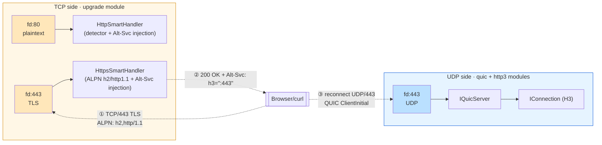
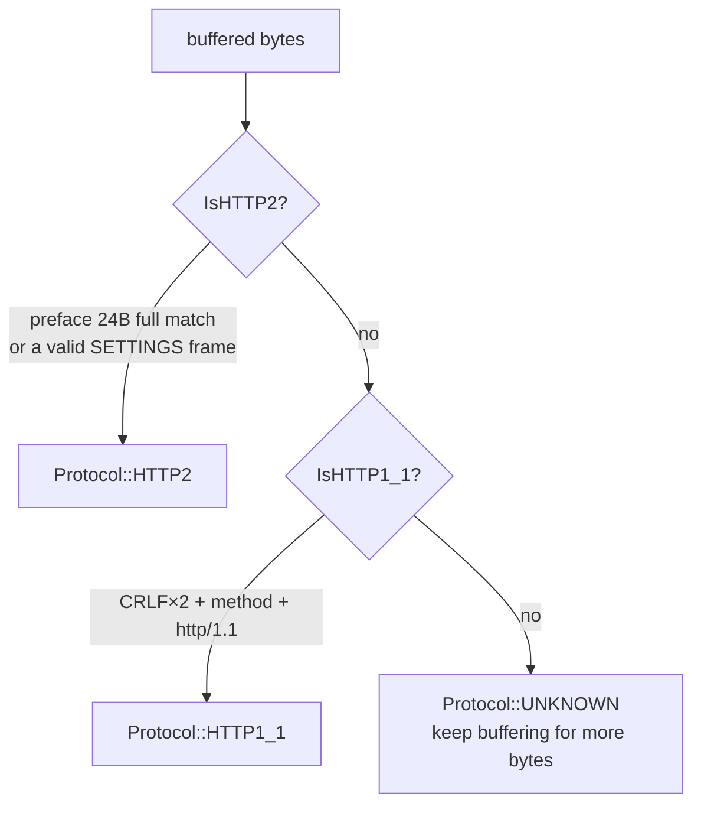
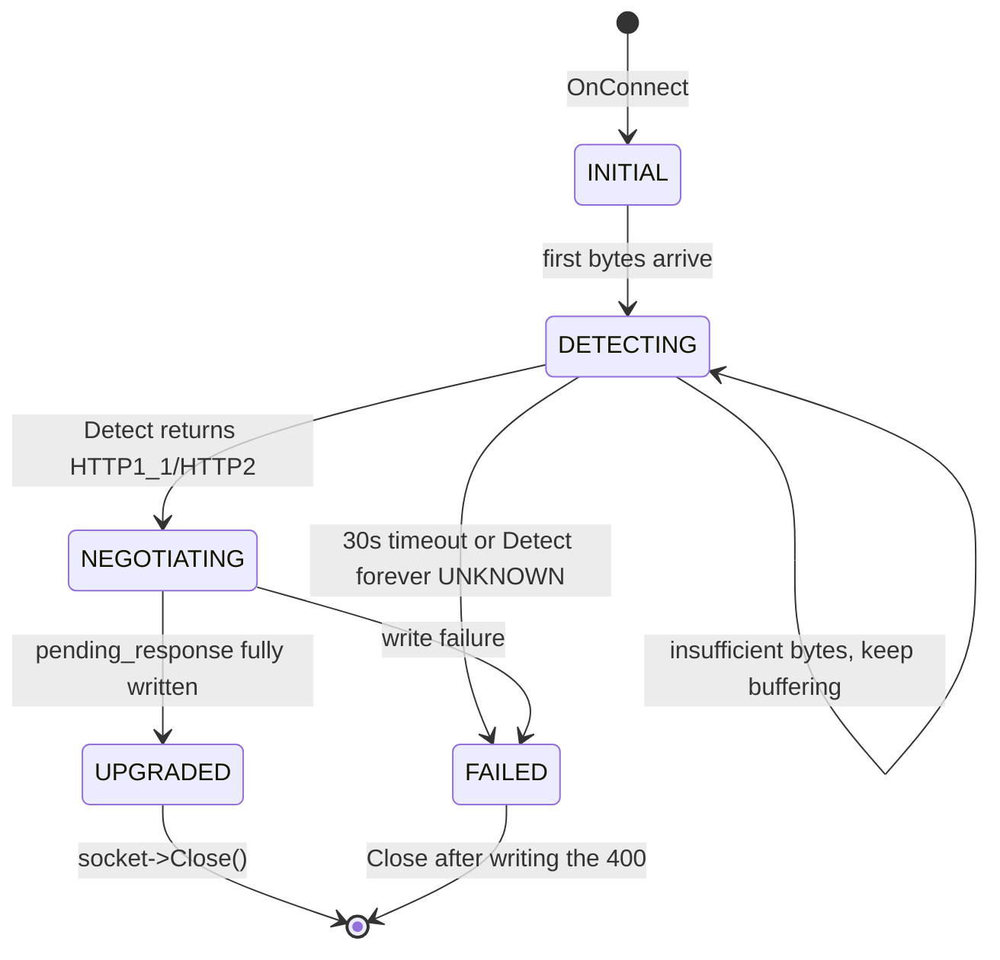
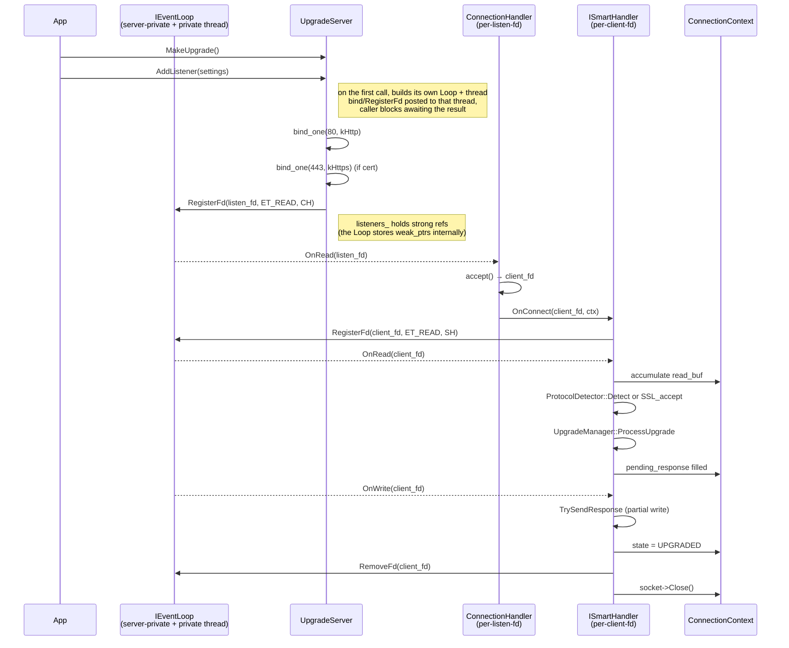

# The H1/H2 → H3 Negotiation Front End: The upgrade Module and Alt-Svc

This document covers the design of quicX's `src/upgrade/` module: the **negotiation front end** between H1/H2 and H3 — not an H3 server, not a reverse proxy. Its sole job is to answer every cleartext / TLS client on TCP ports 80/443, over HTTP/1.1 or HTTP/2, with the same line:

```
Alt-Svc: h3=":443"; ma=86400
```

A browser's first packet is always a TLS ClientHello on TCP/443; it **will not proactively try UDP/443**. If you only start a QUIC server and emit no signal on the TCP side, clients will never discover H3 exists — this module exists to close that service-discovery gap. This document attempts to answer the following questions:

1. **Why must the TCP-side ALPN list never contain `h3`?** — the h3 negotiation can only be revealed out-of-band via Alt-Svc;
2. **Why does `ProtocolDetector` sniff only cleartext, not TLS?** — the port already routes TLS traffic; sniffing only distinguishes H1 / H2 prior-knowledge within cleartext;
3. **Why does the HTTP/2 path hand-roll a bit of HPACK literal encoding?** — a single emit, fixed content, < 127 bytes — not worth pulling in an entire hpack implementation;
4. **Why is the `result.target_protocol == Protocol::HTTP3` branch inside `UpgradeManager::ProcessUpgrade` dead code?** — HTTP3 cannot run on TCP and be detected; the branch reminds us at the type-system level that "H3 is an exit, not an entrance".

---

## 1. The Module's Position in quicX



Four facts:

- **upgrade and quic are fully decoupled**: the two sides align only through the port convention (default h3_port = 443) and **user configuration**; there is no code-level hand-off. upgrade never calls `IQuicServer`; quic doesn't know upgrade exists.
- **Each runs its own `IEventLoop`**: `IUpgrade::MakeUpgrade()` no longer accepts an external loop; the upgrade server builds its own `common::IEventLoop` and the thread driving it (started at the first `AddListener()`). Not laziness: the two sides **share no state** (see the previous item), while `EventLoop` is thread-affine (`Init()` records `thread_id_`; afterwards all `RegisterFd/AddTimer` go through `AssertInLoopThread()`, aborting on mismatch). Sharing one loop would bind the TCP first hop and QUIC's PTO/timer precision to a single timeline and entangle teardown destruction order. The cost is merely one epoll fd + one wakeup fd + one thread stack.
- **The TCP side never becomes an H3 server**: `HttpsSmartHandler` advertises only `h2,http/1.1` in ALPN; after the TLS handshake it enters either the H1 or the H2 negotiation-response path, and **the sole purpose of both paths is to emit one Alt-Svc line and close** (H1 via `Connection: close`, H2 via `GOAWAY`).
- **The client must make the second connection itself**: once Alt-Svc is sent, the TCP side's work is done. The browser then records an alt-authority entry in its connection pool per RFC 7838 §3 and, on the next visit to the same origin, tries UDP/443 + QUIC + ALPN=`h3` first. **The entire hop happens on the client**; the server holds no state linking the two connections.

---

## 2. The Minimality of the Public API

`include/quicx/upgrade/if_upgrade.h` contains only this (comments omitted):

```cpp
class IUpgrade {
public:
    virtual bool AddListener(UpgradeSettings& settings) = 0;
    virtual void Stop() = 0;
    static std::unique_ptr<IUpgrade> MakeUpgrade();
};
```

**No callback signatures, no `IEventLoop`/`IFdHandler`, no connection counts, no fd exposure.** This reflects the module's positioning: it needs no business logic — it either sits on the port emitting Alt-Svc, or it didn't start; the caller cares only about the latter.

The only lifecycle entry is `Stop()` (also called by the destructor, idempotent). It does three things, **all on the module's own loop thread**: tear down client fds (`ISmartHandler::CloseAllConnections()`), tear down and close listen fds, stop the thread and join. Loop-thread execution is a hard requirement — `EventLoop::RemoveFd/RegisterFd/AddTimer` all pass `AssertInLoopThread()`; calling from another thread is an abort. The old implementation called `RemoveFd()` directly in the destructor, which runs on the **caller's** thread; cross-thread teardown was this module's most treacherous landmine.

`UpgradeSettings` (`include/quicx/upgrade/type.h`) fields fall into four groups:

| Group | Fields | Actually Consumed? |
| :--- | :--- | :--- |
| Listening | `listen_addr_` `http_port_` `https_port_` `h3_port_` | ✅ all read by `UpgradeServer::AddListener` |
| Protocol switches | `enable_http1_` `enable_http2_` `enable_http3_` | ⚠️ **not read** by the current implementation — the decision is inferred from "is the port non-zero + is a cert configured" |
| Preference list | `preferred_protocols_ = {"h3","h2","http/1.1"}` | ⚠️ **not read** — the server-side ALPN preference is hard-coded in the `kPreferred` array of `HttpsSmartHandler::ALPNSelectCallback` |
| Credentials/timeouts | `cert_file_` `key_file_` `cert_pem_` `key_pem_` `detection_timeout_ms_` `upgrade_timeout_ms_` | ✅ credentials read; ⚠️ both timeouts **not read** — handlers use the hard-coded `kUpgradeNegotiationTimeoutMs = 30000` from `src/upgrade/config.h` |
| Logging | `log_level_ = LogLevel::kInfo` | ⚠️ **not read** — module log level isn't wired to this field |

**Reconciliation honesty**: keeping "not read" fields in the public struct is historical baggage; ideally one would (1) inject `preferred_protocols` into `ALPNSelectCallback`; (2) inject the two timeouts into `BaseSmartHandler`. The short-term cost of the status quo is silent config ignoring; this document records that gap explicitly.

---

## 3. Detection: Why HTTP/2 Before HTTP/1.1

`ProtocolDetector::Detect` is called on the cleartext path; the decision chain:



Three details worth remembering:

- **The order is counter-intuitively H2 first.** HTTP/2's connection preface `PRI * HTTP/2.0\r\n\r\nSM\r\n\r\n` starts with `P`, the same first letter as HTTP/1.1's `POST/PUT`; a naive "match by method name" would misjudge H2 as H1. `IsHTTP2` uses two conflict-free signals — a **full 24-byte literal compare** or **a self-consistent 9-byte frame header check** — to veto H2 outright before H1's turn; hit rate and misjudgment rate are both optimal.
- **HTTP/1.1 returns true only upon the full double CRLF (end of headers)**: avoiding a premature verdict while the client has sent only half a request line, which would enter the negotiate branch with an unfilled buffer and never come back.
- **The TLS path never enters the detector**: only `HttpSmartHandler::OnRead` calls `ProtocolDetector::Detect`; `HttpsSmartHandler` goes through OpenSSL `SSL_read`/`SSL_accept` — the encrypted bytes were claimed by the TLS encapsulation layer long ago; to it, "the protocol is the string ALPN selected" — `ProtocolDetector` has no role on the https path.

**The `Protocol` enum contains `HTTP3`, but `Detect` never returns it** — because HTTP/3 runs on UDP and a TCP detector physically never sees H3 bytes. That's the root of the fourth question in §0.

---

## 4. The ALPN Honey Pot and TCP/UDP Physical Isolation

This section is where outside readers most easily misjudge the module. The comment on `HttpsSmartHandler::SetupALPN` is pure gold and must be quoted verbatim:

```cpp
// ALPN protocols advertised by THIS TCP/TLS endpoint.
// Important: do NOT advertise "h3" here. HTTP/3 lives on QUIC over UDP
// and never appears as an ALPN value on a TCP/TLS connection. Browsers
// discover h3 out-of-band via the `Alt-Svc` HTTP response header.
static const unsigned char alpn_protocols[] = {
    0x02, 'h', '2',
    0x08, 'h','t','t','p','/','1','.','1',
};
```

Four layers of stacked semantics:

1. **Protocol geography**: ALPN is a TLS extension; TLS runs on TCP; QUIC implements its own TLS 1.3 on UDP. The two ALPN namespaces are identical (both use IANA-registered protocol strings) but the **physical transports are mutually exclusive**. Stuffing `h3` into TCP/TLS ALPN makes the peer genuinely believe "this TCP connection will now run HTTP/3" and wait for your QUIC initial packets — which you cannot send, because you're on TCP. The result is a connection-level deadlock.
2. **The server callback is what actually takes effect**: `SSL_CTX_set_alpn_protos` sets "what ALPN list I'll send as a client" on a client SSL_CTX and **does nothing in server mode**. What actually selects ALPN server-side is the `ALPNSelectCallback` registered via `SSL_CTX_set_alpn_select_cb`. These two functions are easily confused; the comment at `https_smart_handler.cpp:380-389` exists to disambiguate.
3. **The server-side selection policy is hard-coded**:
   ```cpp
   static constexpr std::array<const char*, 2> kPreferred = {"http/1.1", "h2"};
   ```
   Preferring `http/1.1` over `h2` is deliberate — when a browser/curl offers both ALPNs, the H1 path's response from `GenerateHTTP1UpgradeData` (a 200 OK + Alt-Svc + a small body) is an order of magnitude simpler than the H2 path's hand-rolled HPACK, **and the Alt-Svc field value delivered to the client is identical**.
4. **The downgrade strategy**: if the client's ALPN list has neither `h2` nor `http/1.1` (rare; some grpc clients offer only `h2`), the callback returns `SSL_TLSEXT_ERR_NOACK` to let the TLS handshake continue without ALPN (comment at `https_smart_handler.cpp:444-448`) — mirroring nginx's tolerant behavior, avoiding an alert over a minor protocol-name conflict.

---

## 5. The Three SmartHandler Classes and the State Machine



The four handler roles:

| Class | Responsibility |
| :--- | :--- |
| `ISmartHandler` (interface) | `OnConnect / OnRead / OnTimeout / GetType()` |
| `BaseSmartHandler` (common base) | the `ConnectionContext` pool, state transitions, `pending_response` chunked writes, timeout timers, held by `UpgradeManager` |
| `HttpSmartHandler` | cleartext path: `OnRead → ProtocolDetector::Detect → manager_->ProcessUpgrade` |
| `HttpsSmartHandler` | TLS path: `OnRead → SSL_read → ALPN already selected → manager_->ProcessUpgrade`, **skipping the detector** |

`SmartHandlerFactory::CreateHandler(settings, loop, kind)` picks between `HandlerKind::kHttp` / `kHttps`. **There is no third kind** — reinforcing the "port decides the path" design: 80 → kHttp, 443 → kHttps; there is no "run cleartext H2 on 443" path (H2C refused, matching the reality that RFC 7540 §3.2 was eventually deprecated by RFC 9113 §3.1).

`ConnectionContext` (`connection_context.h`) is the small structure shared across handlers; key fields:

```cpp
ConnectionState state;          // INITIAL/DETECTING/NEGOTIATING/UPGRADED/FAILED
Protocol detected_protocol;     // the detector's output
std::vector<uint8_t> read_buf;  // accumulating buffer
std::vector<uint8_t> pending_response;  // negotiation response bytes, pending write
size_t response_sent;           // written offset, supporting chunked writes
std::shared_ptr<ITcpSocket> socket;
```

**The `pending_response` + `response_sent` pair is the core of chunked writing**: the negotiation response is generated in one shot (a few hundred bytes for H1, ~250 for H2), but when the kernel send buffer is full the write can't finish — it must resume on the next writable event after EAGAIN — which is exactly the partial-write loop `BaseSmartHandler::TrySendResponse` runs.

---

## 6. The Negotiation Response: Alt-Svc Injection on the Dual-Code Path

`VersionNegotiator::Negotiate` branches by `context.detected_protocol` into two generators.

### 6.1 The HTTP/1.1 Path: Plain String Concatenation

```cpp
std::string body = "h3 available on :" + std::to_string(settings.h3_port_) + "\n";
std::string alt_svc = "h3=\":" + std::to_string(settings.h3_port_) + "\"; ma=86400";
std::string response =
    "HTTP/1.1 200 OK\r\n"
    "Content-Type: text/plain\r\n"
    "Content-Length: " + std::to_string(body.size()) + "\r\n"
    "Alt-Svc: " + alt_svc + "\r\n"
    "Connection: close\r\n"
    "\r\n" + body;
```

Why 200 OK instead of RFC 7230 §6.7's `101 Switching Protocols + Upgrade: h3`? Because **the vast majority of browsers don't respond to `Upgrade: h3`** — h3 is not an in-band upgrade in the RFC 7230 sense (after switching, the new protocol must run on the same TCP connection; but h3 must move to UDP). RFC 9114 §3.3 states plainly that h3's discovery paths are Alt-Svc or DNS HTTPS records, not the Upgrade header. Our 200 OK + Alt-Svc follows the standard practice of RFC 7838 §3.

`Connection: close` is the key: "mission accomplished, Alt-Svc has been sent; please disconnect and redial with the alt-authority".

### 6.2 The HTTP/2 Path: Hand-Rolled HPACK Literals

The full sequence (`version_negotiator.cpp:121-265`):

```
1) Server SETTINGS frame (empty payload)
2) SETTINGS ACK frame (preemptive — RFC 7540 §6.5.3 tolerates unordered ACKs)
3) HEADERS frame on stream 1 (END_HEADERS)
     :status: 200       — indexed header (static index 8 → 0x88)
     content-type: text/plain        — literal-name without indexing
     content-length: <body.len>      — literal-name without indexing
     alt-svc: h3=":<port>"; ma=86400 — literal-name without indexing
4) DATA frame on stream 1 (END_STREAM) with body
5) GOAWAY frame (last_stream_id=1, error=NO_ERROR)
```

Four justifications for **hand-rolling instead of pulling in full HPACK**:

1. **Zero dependencies**: the upgrade module needn't even link an hpack library or run an H2 protocol state machine — it just spits five fixed structured frames in byte order.
2. **The HPACK literal-without-indexing (0x00 prefix, RFC 7541 §6.2.2) is the simplest form**: `name-len(7bit, H=0) name-bytes value-len(7bit, H=0) value-bytes`; every field is < 127 bytes, so a single 7-bit-prefix byte suffices for each length — zero varint complexity.
3. **Sending SETTINGS ACK preemptively**: normally the ACK follows receipt of the peer's SETTINGS, but RFC 7540 §6.5.3 only requires "as soon as possible" — our early send is really a simplification of *never reading the peer's SETTINGS* (once Alt-Svc is sent, GOAWAY follows); it violates the "receive then ACK" semantics but is tolerated by all implementations. This trades *protocol elasticity* for *implementation simplicity*.
4. **The path is a cold one**: the server-side ALPN selection prefers `http/1.1` (§4), so this H2 path **triggers only when the client's ALPN list lacks `http/1.1`** — e.g. nghttp / h2load / certain gRPC clients. The path is kept for these rare clients, maintained spec-compliant with minimal code.

### 6.3 The "Equivalent Output" Invariant of the Dual-Code Path

**Any client that has passed through the upgrade module should see a byte-identical alt-svc field value** `h3=":<h3_port>"; ma=86400`. This is the module's **contract bisection**: the client must not form a different view of the H3 endpoint depending on whether it took the H1 or the H2 path. Both paths in the code derive the alt_svc string from the same `settings.h3_port_`; the invariant holds by "the alt_svc computation formula being shared between the two paths".

---

## 7. The Server Framework and Lifecycle



Four engineering lessons:

1. **The dual-listen design**: one `AddListener` call binds both the 80 and 443 fds, configured with `HttpSmartHandler` and `HttpsSmartHandler` respectively. The comment at `upgrade_server.cpp:36-130` traces a historical bug — a previous version bound "only 443 if a cert exists, only 80 otherwise", so once you configured a certificate, a browser first hitting `http://host:port/` got connection refused and h3 was silently drowned. After the fix, the two listeners are independent, each with its own handler, and **plaintext bytes never enter the SSL state machine, nor vice versa**.
2. **`listeners_` must hold strong references**: `EventLoop::fd_to_handler_` internally stores `std::weak_ptr<IFdHandler>`; if the `connection_handler` `shared_ptr` were destroyed when `bind_one`'s lambda exits, the next epoll wakeup would find an expired weak_ptr — "No handler found for fd N" in the logs, and the accept loop would never run. The `listeners_.push_back(...)` at `upgrade_server.cpp:103` is this bug's trip wire.
3. **The client fd's handler is `ISmartHandler` itself**: the listen_fd uses `ConnectionHandler` to adapt accept; the accepted client_fd registers `ISmartHandler` directly onto the EventLoop — the latter's lifetime is kept alive indirectly through the `ConnectionHandler::handler_` path.
4. **Teardown ordering**: `UpgradeServer::~UpgradeServer` explicitly `RemoveFd + Close`es each listen_fd (`upgrade_server.cpp:21-34`). This avoids a race during the EventLoop's own destruction: if the EventLoop were destructed first, it would iterate fd_to_handler_, dispatching on each weak_ptr.lock() — but the ConnectionHandler would already be freed, yielding a dangling object. Removing the weak_ptr entries from the loop first, then letting listeners_ empty, guarantees the correct forgetting order.

---

## 8. The Client Hop: What Happens After Alt-Svc

The server's work ends at GOAWAY/Connection-close. The client's H1→H3 hop chain (per RFC 7838 §3 + RFC 9114 §3.3):

1. **Receiving Alt-Svc**: the HTTP client parses `Alt-Svc: h3=":443"; ma=86400` and writes `(origin, h3, alt-authority=":443", expiry=now+86400s)` into its alt-svc cache.
2. **Next visit to that origin**: the client checks the cache when initiating an HTTP request:
   - If within ma → **race**: dial TCP/443 (the old path) and UDP/443 + QUIC + ALPN=h3 (the new path) simultaneously; the first to finish its handshake wins. That's Chrome/Firefox's "happy-eyeballs for H3" behavior.
   - If the cache is expired or absent → fall back to the pure TCP path, re-triggering the §1 flow.
3. **The QUIC handshake**: this step runs exactly the key derivation / ALPN=`h3` of `crypto_keying.md`, then the SETTINGS / control-stream assembly of `h3_connection.md`. **It has nothing to do with the upgrade module** — the client interacts directly with the QUIC server.
4. **Failure fallback**: if UDP/443 is dropped by middleboxes so the QUIC handshake times out, the client falls back to TCP/443 + h2/http1.1 and marks the alt-authority "broken" for a period (5 minutes in Chrome). **No server-side signal can intervene in this fallback**, which is why QUIC-layer reachability is a hard requirement for H3 deployment.

**Key invariant**: the server-client negotiation contract is **entirely asynchronous, one-way, and stateless**. Once the upgrade module sends Alt-Svc it forgets that client; the client may never return, may dial in on UDP immediately, or may come a week later. This loose coupling is the essence of Alt-Svc's design — it lets you deploy this module as a stateless edge service, in front of a CDN, behind any load-balancing strategy, without affecting H3 negotiation correctness.

---

## 9. The Current Implementation's Honest Gaps

This section lists this repo's unfinished items against the "ideal upgrade negotiation front end", to stop readers treating `src/upgrade/` as finished:

| Item | Status | Gap | Impact |
| :--- | :--- | :--- | :--- |
| `preferred_protocols_` field | in the public struct, unconsumed | ALPN preference not runtime-adjustable | "prefer H2 over H1" deployments need source edits |
| `enable_http1_` / `enable_http2_` / `enable_http3_` | unconsumed | no way to disable a path | "H2 + H3 only, no H1" is currently impossible |
| `detection_timeout_ms_` / `upgrade_timeout_ms_` | unconsumed | hardcoded 30s | timeouts can't be shortened in deployment for faster zombie-connection cleanup |
| 0-RTT / TLS session tickets | TLS context defaults; ticket persistence not enabled | no 0-RTT on same-origin reconnects | every return to TCP/443 pays a full handshake |
| `Upgrade: h2c` header parsing | entirely unimplemented (H2C deprecated by RFC 9113) | cleartext H2 must be prior-knowledge | no impact on mainstream clients |
| DNS HTTPS RR records (RFC 9460) | outside the upgrade module's scope | none | that path depends entirely on ops-side DNS configuration |
| Alt-Svc cache-clear signal | RFC 7838 §3.3's `Alt-Svc: clear` unimplemented | can't proactively announce H3 port retirement | clients expire naturally per ma |

**Two items worth tightening**: wiring `preferred_protocols_` into `ALPNSelectCallback` is a low-risk 5-line change; reading the two timeout fields into `BaseSmartHandler` is 3 lines. Both are the smallest-effort, highest-ROI urgent items.

---

## 10. Key Invariants

Across all of `src/upgrade/`, the following assertions **must never be violated on any code path** — any future refactor must preserve them:

1. **The TCP/TLS-side ALPN list never contains `h3`** (`https_smart_handler.cpp:362-389`).
2. `ProtocolDetector::Detect` **never returns** `Protocol::HTTP3`.
3. Cleartext bytes **never** enter the SSL state machine: `HttpSmartHandler` and `HttpsSmartHandler` are split by `SmartHandlerFactory` at the listen stage; which handler an accepted client_fd registers is decided by its listen endpoint, never switched mid-flight.
4. **The `alt-svc` field value is byte-identical across both negotiation paths (H1/H2)** (same-source `settings.h3_port_`).
5. Once `pending_response` is filled, it must be written out byte-by-byte by `TrySendResponse` across multiple `EAGAIN`s — **never regenerated** (regenerating would misalign stateful fields like `:status`).
6. Each `ConnectionHandler`'s `shared_ptr` in `UpgradeServer::listeners_` **must outlive the corresponding fd's `RemoveFd`** (the EventLoop's internal weak_ptr assumption).
7. At destruction, **`RemoveFd` must precede `Close`**, or the EventLoop might dispatch again on an already-closed fd.
8. `ConnectionState` transitions are **one-way**: INITIAL → DETECTING → NEGOTIATING → (UPGRADED | FAILED); no rollback paths exist.
9. Every terminal state (UPGRADED / FAILED) must `socket->Close()` — the upgrade module **keeps no** long-lived connections; connection reuse is the client's alt-authority cache business.
10. The HTTP/2 path's 5-frame sequence must be emitted in a **single TLS write** (comment at `version_negotiator.cpp:128`), guaranteeing the five frames arrive in order within the client's parse window.
11. The only state `UpgradeManager` persists is **`last_result_`** (for logging); connection-level state lives in `ConnectionContext`, owned by `BaseSmartHandler` — the manager is a connectionless, purely functional orchestrator.
12. **The server never reads the H2 client's SETTINGS frame** (the preemptive-ACK simplification), but **must send its own SETTINGS (even empty)**, or the client will GOAWAY over an RFC 7540 §3.5 protocol violation.

---

## 11. Relations and Authorities

### 11.1 Division of Labor with the Other Design Documents in This Repo

| Document | Responsibility Boundary | Interface with This Document |
| :--- | :--- | :--- |
| `connection_anatomy.md` | UDP/QUIC connection structure | after upgrade emits Alt-Svc on the TCP side, the client enters here |
| `handshake_state_machine.md` | the QUIC + TLS handshake flow | the client runs this handshake upon reaching UDP; ALPN=`h3` is negotiated here |
| `crypto_keying.md` | key derivation and Key Update | after h3 ALPN is selected, 1-RTT starts with RFC 9001 §5 secrets |
| `h3_connection.md` | the 6-class multi-stream cooperation of H3 | upgrade leads the client to quic; the quic server assembles the 6 stream classes this document describes |
| `process_model.md` | the EventLoop threading model | upgrade builds its own private EventLoop and driving thread, sharing nothing with the quic side |
| `ownership_and_memory.md` | reference-counting and lifetime patterns | `UpgradeServer::listeners_` strong refs + the EventLoop's weak_ptrs are an instance of that model |

### 11.2 RFC Index

- **RFC 9114** *HTTP/3*: §3.1 H3 endpoint discovery, §3.3 Connection Establishment (explicitly says h3 doesn't use the TCP Upgrade header)
- **RFC 7838** *HTTP Alternative Services*: §3 Alt-Svc field syntax and semantics, §3.1 the alt-authority meaning, §3.3 the `Alt-Svc: clear` signal
- **RFC 9460** *Service Binding via DNS*: HTTPS RR records (the DNS-path alternative to Alt-Svc; outside this module)
- **RFC 7540** *HTTP/2*: §3.5 connection preface, §6.5 SETTINGS frame, §6.5.3 SETTINGS ACK, §6.8 GOAWAY frame
- **RFC 9113** *HTTP/2 (revised)*: §3.1 deprecating H2C `Upgrade: h2c`
- **RFC 7541** *HPACK*: §6.1 indexed header (the 0x88 encoding of `:status:200`), §6.2.2 literal without indexing (the zero-dependency encoding of the alt-svc header)
- **RFC 7230** *HTTP/1.1 Message Syntax*: §6.7 the Upgrade header (explaining why h3 doesn't go through this mechanism)
- **RFC 8470** *Using Early Data in HTTP*: 0-RTT constraints over HTTP (not enabled here; listed under gaps)

---

> **Design-document finale**: `docs/en/design/` now holds 16 full documents covering five groups — the main path, key decisions, infrastructure, protocol-layer details, and observability — forming quicX's complete internal explanation set from handshake to protocol entry. See the document map in [`../README.md`](../README.md) §6.
