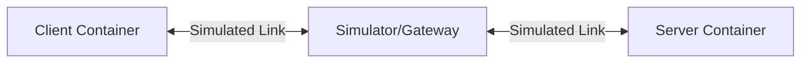

# QUIC Interop Runner — Architecture & Specification

This document explains the inner workings of the
[quic-interop-runner](https://github.com/marten-seemann/quic-interop-runner)
framework that QuicX plugs into. It is not a comparison of QUIC
implementations; it focuses on the **mechanism** that lets the runner drive
arbitrary QUIC stacks through one common interface.

## 1. Architecture

The runner stands up a fully isolated, controllable network in which different
QUIC implementations are exercised against each other.

### 1.1 Component model

A test runs inside a Docker Compose virtual network with three roles:

1. **Client container** (left): runs the implementation under test as a client
   (e.g. `quicx-client`, `quic-go-client`).
2. **Server container** (right): runs the implementation under test as a
   server.
3. **Simulator / gateway** (middle): the network gateway connecting client and
   server.

All traffic is **forced** through the simulator. Client and server never see
each other directly.

### 1.2 Network simulation

Instead of relying on the public network, the runner uses `ns-3` (or, for the
simpler scenarios, Linux `tc` + NetEm) to control the link characteristics
precisely:

- **Bandwidth** (e.g. 10 Mbps)
- **RTT** (e.g. 20 ms)
- **Loss rate** (e.g. 1 %)
- **Queue size** (to model bufferbloat)
- **Reordering**

This is what makes the suite useful for stressing congestion-control and
loss-recovery code paths.

## 2. Interface specification

So that one driver can talk to every implementation, all Docker images
**must** obey the following black-box contract.

### 2.1 Container bootstrap

The runner injects configuration via environment variables. Your program must
read these on startup:

| Variable | Side | Required | Description |
| :--- | :--- | :--- | :--- |
| `SSLKEYLOGFILE` | both | yes | File path that receives TLS secrets, for Wireshark decryption |
| `QLOGDIR`       | both | yes | Directory that receives `.qlog` files, for qvis visualization |
| `Role`          | -    | -    | Your entrypoint script normally derives client/server from a CLI arg |

### 2.2 Server side

- **Listen port**: `443/UDP` by default, can be overridden with the `PORT` env var.
- **Document root (`WWW`)**:
  - Path comes from the `WWW` env var (commonly `/www`).
  - The server **must** be able to read files from this directory and serve
    them on demand.
  - **Pre-seeded files**: before a test starts the runner mounts a volume with
    randomly generated payload files. Names usually encode the size, e.g.
    `1MB`, `10MB`, `1GB`.
- **Certificates**: typically mounted at `/certs/cert.pem` and `/certs/priv.key`.

### 2.3 Client side

- **Target address**: read the host or IP from the `SERVER` env var.
- **Request list (`REQUESTS`)**:
  - The most important parameter.
  - Format: a space-separated list of URLs.
  - Example: `https://server:443/data/1MB https://server:443/data/10MB`
- **Download directory (`DOWNLOADS`)**:
  - The client must save downloaded files here.
  - The on-disk filename must be derived from the URL (e.g. `1MB`).
  - After the test the runner hashes everything in this directory and compares
    against the original files in `WWW`.

## 3. Workflow

A complete test case runs through these stages:

1. **Setup**:
   - Runner generates random payload files.
   - Runner generates a per-test TLS certificate.

2. **Start the server**:
   - `docker run -v /www:... -v /certs:... quicx-image server`
   - Runner waits for the server's UDP/443 port to become reachable.

3. **Start the network simulator**:
   - Configure routing so traffic crosses the `ns-3` bridge between the
     client and server segments.
   - Apply scenario-specific parameters (e.g. `handshake` may be lossless,
     `transfer` may have packet loss).

4. **Start the client**:
   - `docker run -e REQUESTS="..." -v /downloads:... quicx-image client`
   - Client parses the URLs, opens a QUIC connection, downloads the files,
     writes them to the volume.

5. **Verification**:
   - **Exit code**: the client must exit 0.
   - **File integrity**: the runner hashes `/downloads` and compares against
     `/www`. Any mismatch fails the test.

6. **Log collection**:
   - Collect `qlog` and `pcap`.
   - For specific scenarios (e.g. `resumption`) the runner actually runs the
     client twice and inspects the second handshake (via pcap / keylog) for a
     resumption ticket.

## 4. Key test cases

The scenarios specified by the runner:

- **`handshake`** — client downloads a tiny file. Verifies basic connection
  establishment.
- **`transfer`** — downloads files of varying sizes (1 MB, 10 MB). Verifies
  flow control, packetization, reassembly.
- **`retry`** — server is configured to require Retry (stateless retry).
  Verifies the client handles the Retry packet and resends Initial.
- **`resumption`** — connect once → close → connect again. Verifies 0-RTT or
  1-RTT session resumption.
- **`multiconnect`** — connect, finish, then connect again from a fresh
  client.
- **`zerortt`** — verifies 0-RTT data (Early Data).
- **`http3`** — exercises richer HTTP/3 interactions (header compression …).
- **`ecn`** — verifies Explicit Congestion Notification support.

## 5. How QuicX's `interop_*.cpp` adapts to the spec

The shape of the C++ code under `test/interop/` is dictated by the contract
above:

- **Reading `REQUESTS`** — so the client knows which URLs the runner expects
  it to fetch.
- **Mounting a `Handle` callback / `fopen`** — to satisfy the server's
  obligation to serve any file under `/www`.
- **`DownloadHandler` writing to disk** — so the runner can find the file in
  `/downloads` and hash-compare it.

That's the core principle of the official interop suite: **standardized
container interfaces plus filesystem side effects implement a black-box
conformance check**.
