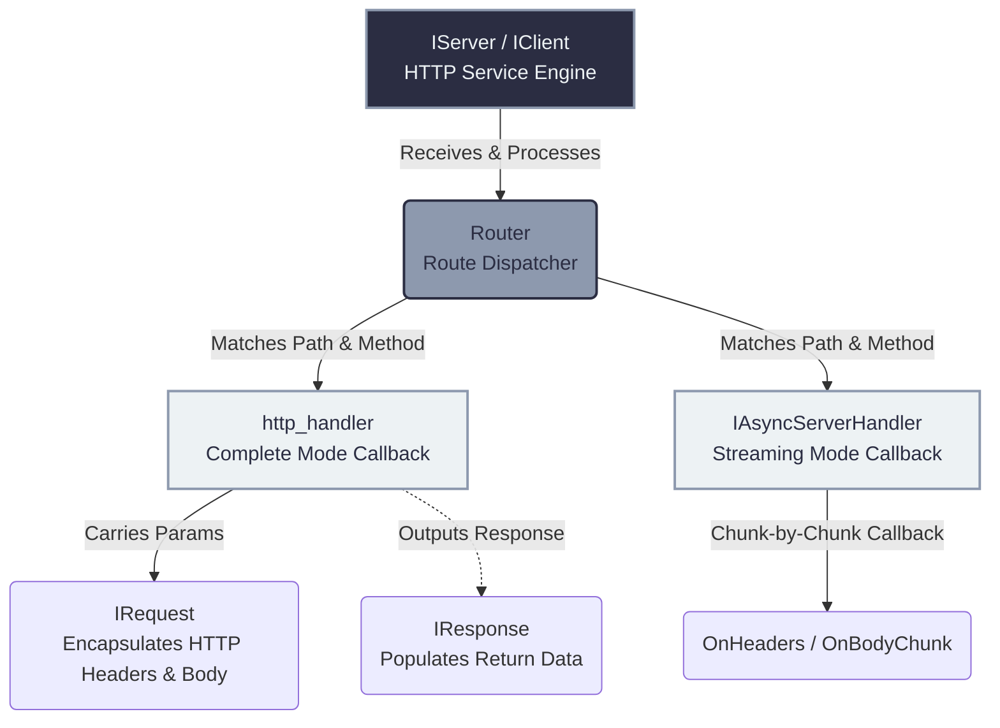

# HTTP/3 Application Layer API Guide

If you are using `quicX` to provide standard web services, API interfaces, or high-throughput file downloads, then you **DO NOT NEED** to directly use the core interfaces located in `src/quic/`. Instead, simply use the out-of-the-box application-layer API model provided by `src/http3/`.

Here, there are no complex Stream handoffs or varied underlying control frames, only the familiar **Service Engine (IServer/IClient)**, **Handler**, **Request**, and **Response** from traditional web frameworks (like Express.js / Go Gin / Spring Boot).

Simultaneously, `quicX` entirely conceals HTTP/3's unique powerful traits (like `Server Push`, `0-RTT` that eliminates handshake latency, and massive zero-head-of-line-blocking multiplexing) underneath this API suite.

---

## Architecture Overview

In the HTTP/3 layer, `quicX` smoothens out all the underlying multiplexing details for you:



---

## 1. Server API: Engine, Routes, and Middleware

For backend developers, your central focus is the `quicx::IServer` interface. It assumes responsibility for configuration, route registration, and runtime interception.

### 1.1 Startup & Configuration Features
Unlike the low-level `QuicConfig`, HTTP/3 offers a special overarching configuration `Http3ServerConfig`, handling application layer boundaries:

```cpp
auto server = quicx::IServer::Create();

quicx::Http3ServerConfig config;
// -- 1. TLS Certificate & Transport Configuration (HTTPS/3 mandates TLS 1.3 certificates) --
config.quic_config_.cert_pem_ = "...";
config.quic_config_.key_pem_ = "...";

// -- 2. HTTP/3 Specific Constraints & Traits --
// Limit malicious clients from concurrently firing too many crazy requests
config.max_concurrent_streams_ = 200; 

// Permit the server to utilize PUSH_PROMISE frames to proactively push associated resources to the client
config.enable_push_ = true;          

server->Init(config);
server->Start("0.0.0.0", 7001);       // Blocks the current thread and starts listening
```

### 1.2 Powerful Routing Dispatch System (Router)
This is `quicX`'s most business-productive asset. It uses a Trie-tree or high-efficiency Hash-table routing engine, supporting **Exact Match** and **RESTful Match**.

> [!TIP]
> **Route Matching Priority**: Exact Match > Named Parameter Match > Wildcard Match.

```cpp
// ==== A. Exact Route Matching ====
server->AddHandler(quicx::HttpMethod::kGet, "/api/v1/user", handler);

// ==== B. Suffix Wildcard Matching ====
// Allows requests starting with /static/ (like /static/js/app.js) to smoothly fall through
server->AddHandler(quicx::HttpMethod::kGet, "/static/*", handler);

// ==== C. RESTful Named Parameter Extraction ====
// Safely extract paths into URL route variables
server->AddHandler(quicx::HttpMethod::kGet, "/api/v1/user/:id",
    [](std::shared_ptr<quicx::IRequest> req, std::shared_ptr<quicx::IResponse> resp) {
        // Upon request to /api/v1/user/10086, cleanly fetches "10086"
        auto path_params = req->GetPathParams();
        std::string user_id = path_params.count("id") ? path_params.at("id") : "";
    });
```

### 1.3 Middleware Interceptor
If all of your endpoints need to validate Tokens, track latency outputs, or process CORS (Cross-Origin Resource Sharing), you can deploy `AddMiddleware`.

```cpp
server->AddMiddleware(quicx::HttpMethod::kPost, quicx::MiddlewarePosition::kBefore, 
    [](std::shared_ptr<quicx::IRequest> req, std::shared_ptr<quicx::IResponse> resp) {
        
        // This callback is triggered "**before (kBefore)**" the authentic Routing Handler checks logic
        std::string auth_header;
        if (!req->GetHeader("Authorization", auth_header)) {
            resp->SetStatusCode(401);
            resp->AppendBody("Unauthorized");
            // Important: If you pre-determine content/error codes, the downstream proper logic is skipped/terminated!
        }
    });
```

---

## 2. Modes of Handlers (Complete vs. Async)

HTTP payload sizes differ enormously, ranging from merely a few bytes in JSON up to mult-gigabyte file uploads. To that end, `quicX` provides deeply integrated **Complete Mode** and **Streaming Mode**.

### 2.1 Complete Mode: Ideal for Typical APIs & JSON
**Key Characteristics:** Packets are tiny, and you wish to access all of the Headers and Body at once, deal with it, and return.
**Internal Mechanic:** Until the client finishes broadcasting entirely, this lambda won't fire. The Engine internally stockpiles data and delivers it all at once to your callbacks.

```cpp
server->AddHandler(quicx::HttpMethod::kPost, "/api/login",
    [](std::shared_ptr<quicx::IRequest> req, std::shared_ptr<quicx::IResponse> resp) {
        
        // 1. Parse headers processed by QPACK
        std::string content_type;
        req->GetHeader("Content-Type", content_type);
        
        // 2. Load complete Request Payload (Warning: This initiates Memory Exhaustion or OOM for massive files)
        std::string credentials = req->GetBodyAsString();
        
        // 3. Populate response easily, disregarding underlying Network Interface sync times
        resp->AddHeader("X-Internal-Token", "abcd");
        resp->SetStatusCode(200);
        resp->AppendBody(std::string("{\"msg\": \"success\"}"));
    });
```

### 2.2 Streaming Mode: Massive Media Uploads
**Key Characteristics:** The client is uploading a 10GB BlueRay disc, or the server dictates long-polling chunk transmission (SSE / streaming like ChatGPT response behavior).
**Internal Mechanic:** Inherit `IAsyncServerHandler` or link a Provider up to your Request/Responses. Let the protocol toss in data slices, guaranteeing zero RAM occupancy.

**[Example: Server Side Huge File Receipt]**:
```cpp
class FileUploadHandler : public quicx::IAsyncServerHandler {
public:
    // Step 1: Client has just pushed its HTTP Headers. Body is dormant.
    void OnHeaders(std::shared_ptr<quicx::IRequest> req,
                   std::shared_ptr<quicx::IResponse> resp) override {
        file_ = fopen("upload.dat", "wb"); // Urgently instantiate handle file writes 
        resp->SetStatusCode(200);
    }

    // Step 2: Protocol loop delivers a fragment of the Chunk upon reception via NIC 
    void OnBodyChunk(const uint8_t* data, size_t len, bool is_last) override {
        if (file_) fwrite(data, 1, len, file_);
        
        if (is_last) { 
            // is_last == true specifies the remote client finalized passing a FIN
            if (file_) { fclose(file_); file_ = nullptr; }
        }
    }

    // Step 3: Irregular Aborts. E.g., The Client pulled off its router plug
    void OnError(uint32_t error) override {
        if (file_) { fclose(file_); file_ = nullptr; }
    }
private:
    FILE* file_ = nullptr;
};

server->AddHandler(quicx::HttpMethod::kPost, "/upload", std::make_shared<FileUploadHandler>());
```

---

## 3. The Request & Response Interface Entities (IRequest / IResponse)

`IRequest` and `IResponse` aren't dummy dictionaries, but intelligent entities bridging lower protocol loops.

### IRequest: Argument extraction tools
* **Query Parameters Extraction**: For `/api?page=1&limit=10`, access these neatly through `GetQueryParams()` formatted as key/value hashmaps.
* **Custom Configured Push Controllers**:
  If a client wants to dump a massive volume, **do not** ever execute `AppendBody` fetching massive gigabytes of files, supply a specific Lambda (`body_provider`).
  ```cpp
  FILE* upload = fopen("upload.dat", "rb");
  // The system stack comes and asks for chunks when packets run out. Let them feed themselves!  
  req->SetRequestBodyProvider([upload](uint8_t* buf, size_t size) -> uint32_t {
      size_t read = fread(buf, 1, size, upload);
      if (read == 0) fclose(upload);
      return read; // Supplying 0 signifies the transmission protocol has wrapped up the broadcast. 
  });
  ```

### IResponse: Wrapper Packaging Tools 
Beyond generic `SetStatusCode` and `AddHeader`, it encompasses **Server Push** characteristics!
* **Server Push Promises Principles**: As a client searches for `index.html`, the Server not only serves HTML but acts actively pushing via `AppendPush()` assuming you'll query `style.css` real soon. You prep the `CSS`, appending everything so as the client browser resolves HTML strings, voila, css strings pre-exist in caches avoiding any added delays.

```cpp
auto push_resp = quicx::IResponse::Create();
push_resp->SetStatusCode(200);
push_resp->AppendBody("body { color: red; }");
push_resp->AddHeader("content-type", "text/css");
// ... Deploy settings to push_resp 

// Nesting the 'CSS' structure underneath the Master 'HTML'
resp->AppendPush(push_resp);
```

---

## Conclusion 

There is zero requirement to be a QUIC specialist to generate high-capability Internal Web APIs using `quicX`. This interface guards you from terrible intricacies below:
- **Imperceptible QPACK Compression**: Disregarding if you call `GetHeader` or `AddHeader`, everything translates magically through Dynamic/Static dictionaries and internal variable Huffman mappings, flawlessly automating decoding schemes.
- **Concurrency & Head-of-line Blocking**: A client firing 200 documents parallel never suffers congestion holdups. All queries sit neatly packed into their very isolated QUIC Streams StateMachines. All you do is concentrate directly, aggressively handling the `Handlers`.
