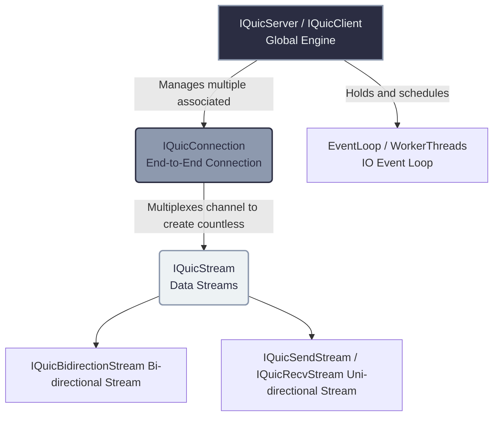

# Core QUIC Transport Layer API Guide

If you intend to use `quicX` to run raw QUIC protocol (instead of HTTP/3) to develop highly customized private RPCs, game acceleration tunnels, or IoT protocols, you need to interface with its underlying **QUIC Transport Layer API**.

In this guide, we will introduce `quicX`'s most core abstract concepts from interface abstractions to configuration details: **Engine**, **Connection**, and **Stream**.

---

## Architecture Overview

In the `quicX` world, the resource and lifecycle relationships are as follows:



---

## 1. Core Configuration & Parameter Tuning System

The configuration system controlling QUIC's behavior is divided into **three major levels**, reflecting QUIC's highly customizable nature.

### 1.1 `QuicConfig`: Global Runtime Configuration
Determines how `quicX` operates itself, such as the threading model, logging mechanics, and advanced TLS features.
```cpp
quicx::QuicConfig config;

// --- Threading Model ---
// kSingleThread: Suitable for extreme low latency scenarios, no inter-thread switching overhead.
// kMultiThread: Suitable for high concurrency. Underlying connections are hash-distributed across multiple workers.
config.thread_mode_ = quicx::ThreadMode::kMultiThread;
config.worker_thread_num_ = 4; // Start 4 Worker threads

// --- Advanced Network & Security Features ---
config.enable_0rtt_ = true;        // Enable 0-RTT (requires a previous connection session ticket)
config.enable_key_update_ = false; // Automatic key rotation (RFC 9001)
config.quic_version_ = quic::kQuicVersion2; // Use QUIC v2 (RFC 9369)
config.keylog_file_ = "keys.log";  // Highly recommended during development! Necessary for Wireshark packet decryption.
```

### 1.2 `QuicTransportParams`: Transport Layer Parameter Configuration (Negotiated during Handshake)
These parameters are packaged into the TLS Certificate phase and communicated to the peer during the handshake. It primarily controls **Flow Control** and **Timeout Policies**. This directly impacts how fast you can transmit data:
```cpp
quicx::QuicTransportParams tp;

// Max idle time (If no KeepAlive packets are sent, how long before connection drops)
tp.max_idle_timeout_ms_ = 120000; // Default: 2 minutes

// Initial Flow Control Windows — Extremely crucial! If you want large file transfers, you must enlarge these!
tp.initial_max_data_ = 64 * 1024 * 1024;                    // Total connection window (64MB)
tp.initial_max_stream_data_bidi_local_ = 16 * 1024 * 1024;  // Individual locally-initiated stream window (16MB)

// Stream limits: How many concurrent Streams you can open once connected
tp.initial_max_streams_bidi_ = 200;
```

### 1.3 `MigrationConfig`: Connection Migration Configuration
One of QUIC's most amazing features—even if you switch your Wi-Fi to a 5G mobile network (IP/Port changes), the connection doesn't drop.
```cpp
quicx::MigrationConfig mc;
mc.enable_active_migration_ = true;       // Allow the client to actively initiate migration
mc.enable_nat_rebinding_ = true;          // Allow passive detection of NAT mapping changes
```

---

## 2. Core Object APIs Breakdown

### 2.1 The Engine: `IQuicServer` / `IQuicClient`
This is the global singleton engine. Whether server or client, it should logically only be instantiated once.

* **Connection Scheduling**: It internally manages UDP Sockets. When a new connection completes its handshake successfully, it emits an event.
```cpp
auto server = quicx::IQuicServer::Create(tp); // Pass the transport layer config tp during Create

server->SetConnectionStateCallBack(
    [](std::shared_ptr<quicx::IQuicConnection> conn, 
       quicx::ConnectionOperation op, uint32_t error, const std::string& reason) {
        if (op == quicx::ConnectionOperation::kConnectionCreate && error == 0) {
            std::cout << "Handshake successful, certificate validated!" << std::endl;
        }
    });

quicx::QuicServerConfig server_config;
server_config.config_ = config; // Inherit the above QuicConfig
server_config.cert_pem_ = "..."; // Insert certificate
server_config.key_pem_ = "...";  // Insert private key

server->Init(server_config);
server->ListenAndAccept("0.0.0.0", 7001);
```

### 2.2 The Channel: `IQuicConnection`
This represents a secure encrypted end-to-End connection. **Remember: You cannot write business data directly to a Connection!**

Its main uses include:
* **Passing User State**: Associate your own `PlayerContext` via `conn->SetUserData(void*)`.
* **Mounting Lightweight Timers**: Utilizing `conn->AddTimer(callback, timeout_ms)` enables precise logic execution within the current connection's lifecycle without relying on external timers.
* **Core Action — Creating Streams**:
```cpp
// Listening for streams opened by the peer
conn->SetStreamStateCallBack(
    [](std::shared_ptr<quicx::IQuicStream> stream, uint32_t err) {
        if (err == 0 && stream->GetDirection() == quicx::StreamDirection::kBidi) {
            // We have received a bidirectional stream initiated by the peer
        }
    });

// Actively open a stream on our side to establish a channel
auto my_stream = conn->MakeStream(quicx::StreamDirection::kBidi);
```

### 2.3 The Carrier: `IQuicBidirectionStream`
This is the truck that truly hauls your application-layer bitstreams. Consider it an independent and cheap TCP connection that supports 0-RTT and features no head-of-line blocking.

```cpp
auto bidi_stream = std::dynamic_pointer_cast<quicx::IQuicBidirectionStream>(my_stream);

// ----------------- Sender Workflow -----------------
std::string msg = "Ping Protocol Version 1";
bidi_stream->Send((uint8_t*)msg.data(), msg.length());

// ----------------- Receiver Workflow -----------------
bidi_stream->SetStreamReadCallBack(
    [](std::shared_ptr<quicx::IBufferRead> buffer, bool is_last, uint32_t error) {
        if (error != 0) return; // Stream error

        char recv_buf[1024] = {0};
        uint32_t len = buffer->Read((uint8_t*)recv_buf, sizeof(recv_buf));
        std::cout << "Read Data: " << std::string(recv_buf, len) << std::endl;

        if (is_last) {
            std::cout << "This is the final chunk sent from the peer (Peer sent FIN)!" << std::endl;
        }
    });
```

> [!WARNING]
> **Thread Safety Warning: NEVER block the underlying I/O Workers!**
> The callback code in `SetStreamReadCallBack` is **synchronously** invoked by the internal Worker threads.
> Please absolutely refrain from executing system call blocks (like `sleep()`, blocking queries like `mysql.query()`), or even prolonged computations (like facial recognition) inside this callback. Otherwise, the engine will completely freeze on that thread, failing to process any subsequent QUIC packets. Delegate time-consuming tasks to your own `ThreadPool`.
