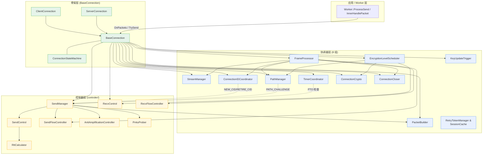

# Connection 解剖：骨架 / 协调器 / 控制器

`src/quic/connection/` 是仓库最大的子树（21 个 cpp + 一个 `controler/` 子目录）。第一次打开它的人会被名字相近的类淹没——`ConnectionIDManager` / `ConnectionIDCoordinator` 各管什么？`SendManager` / `SendControl` / `SendFlowController` 三个都姓 send，谁调用谁？

本文档画一张地图。读完后你应当能够：

- 说出 BaseConnection 在收到 `OnPackets` 之后，实际工作是怎么被分发到 11 个内部组件的；
- 区分**协调器**（coordinator/manager，"决定做什么"）与**控制器**（controller，"按规则记账与执行"）的边界；
- 想找某个具体功能（CID 轮换 / PTO / 流控授信 / Anti-Amp / PMTU 探测 / Key Update）的代码时，知道直接打开哪个文件。

本文不重复 [`packet_lifecycle.md`](packet_lifecycle.md)（接收路径）与 [`handshake_state_machine.md`](handshake_state_machine.md)（握手），它们关心"包从哪来 / 加密级别怎么走"；本文关心**进入连接之后，谁负责干什么**。

---

## 1. 三层结构总览



三层职责一句话区分：

| 层 | 职责 | 典型动词 |
| :--- | :--- | :--- |
| 骨架（Skeleton） | 持有所有协调器与控制器，是对 Worker 暴露的唯一对象 | 转发、组装、生命周期 |
| 协调器（Coordinator / Manager） | "决定做什么"——按 RFC 规则把请求拆成多步动作，调度多个底层模块协作 | 调度、决策、记账 |
| 控制器（Controller） | "按规则执行"——单一职责的算法或状态机，不做跨模块协作 | 计算、限制、追踪 |

**判断技巧**：当一个组件需要"调用别的组件"才能完成职责，它是协调器；当它只需要在一个范围内做记账或计算，它是控制器。后面 §3 §4 会给具体例子。

---

## 2. 骨架层：BaseConnection / Client / Server / StateMachine

### 2.1 类层次

```
IConnection (公开接口，src/quic/include/quicx/quic/if_connection.h)
   ▲
   │
BaseConnection (connection_base.{h,cpp})
   ▲
   ├──── ServerConnection (connection_server.{h,cpp})
   └──── ClientConnection (connection_client.{h,cpp})
```

`BaseConnection` 持有所有协调器与控制器作为成员变量（见 [`connection_base.h`](../../src/quic/connection/connection_base.h) 第 348~414 行的 protected 段）：

| 成员 | 类型 | 说明 |
| :--- | :--- | :--- |
| `state_machine_` | `ConnectionStateMachine` | 值类型，只是 5 状态枚举 + 跳转判断 |
| `timer_coordinator_` | `unique_ptr<TimerCoordinator>` | 协调器 |
| `cid_coordinator_` | `unique_ptr<ConnectionIDCoordinator>` | 协调器 |
| `path_manager_` | `unique_ptr<PathManager>` | 协调器 |
| `stream_manager_` | `unique_ptr<StreamManager>` | 协调器 |
| `connection_closer_` | `unique_ptr<ConnectionCloser>` | 协调器 |
| `frame_processor_` | `unique_ptr<FrameProcessor>` | 协调器 |
| `encryption_scheduler_` | `unique_ptr<EncryptionLevelScheduler>` | 协调器 |
| `packet_builder_` | `unique_ptr<PacketBuilder>` | 协调器 |
| `connection_crypto_` | `ConnectionCrypto` | 值类型，crypto 协调器 |
| `send_manager_` | `SendManager` | 值类型，发送侧协调器（聚合多个控制器） |
| `recv_control_` | `RecvControl` | 值类型，控制器 |
| `send_flow_controller_` | `SendFlowController` | 值类型，控制器 |
| `recv_flow_controller_` | `RecvFlowController` | 值类型，控制器 |
| `key_update_trigger_` | `KeyUpdateTrigger` | 值类型，控制器 |
| `tls_connection_` | `shared_ptr<TLSConnection>` | crypto 模块的 TLS 适配 |

`BaseConnection` 自身**几乎不直接处理协议逻辑**——它的职责是：

1. 接收 `Worker` 的两个主要调用：`OnPackets()`（收）、`TrySend()`（发）；
2. 在 §`OnPackets`/`TrySend` 内部，按状态机门禁决定是否处理、然后转发给对应协调器；
3. 提供回调中转：`IConnectionStateListener` 与 `IConnectionEventSink` 两个接口都是 `BaseConnection` 实现的，协调器通过这两个接口把事件回弹到连接。

### 2.2 ConnectionStateMachine

定义在 [`connection_state_machine.h`](../../src/quic/connection/connection_state_machine.h)，五个状态：

| 状态 | 含义 |
| :--- | :--- |
| `kStateConnecting` | 握手中 |
| `kStateConnected` | 握手完成，正常收发 |
| `kStateClosing` | **本端**主动关闭，已发 CONNECTION_CLOSE，等 1×PTO |
| `kStateDraining` | **对端**关闭，已收到对端 CONNECTION_CLOSE，不再发包，等 3×PTO |
| `kStateClosed` | 终态，资源可释放 |

转移由 `OnHandshakeDone()` / `OnClose()` / `OnConnectionCloseFrameReceived()` / `OnCloseTimeout()` 四个事件触发；`BaseConnection` 实现 `IConnectionStateListener` 监听转移并向各协调器广播（典型例子：`OnStateToDraining` 触发 `connection_closer_->StorePeerCloseInfo` 与 `timer_coordinator_->StopIdleTimer`）。

### 2.3 ServerConnection vs ClientConnection 的差异

只看派生类自己写的方法：

| 方法 | server 行为 | client 行为 |
| :--- | :--- | :--- |
| `OnRetryPacket` | 不可能收到（已禁用） | 切换 token，重发 Initial |
| `OnVersionNegotiationPacket` | 不处理（server 不可能收到） | 选择新版本，重连 |
| `WriteCryptoData` | server 侧 TLS 流 | client 侧 TLS 流（多一步 token 缓存） |
| 握手开始 | 由 worker 在收到 Initial 时构造 | 由 `QuicClient::Connect` 主动发起 |

差异不大——QUIC 的 server / client 在 1-RTT 后基本对称，只在握手前期与异常路径上分叉。

---

## 3. 协调器层：8 + 3 个协调器

按"协议主链路 → 辅助职能"的顺序展开。每个协调器的"为什么需要它"比"它的方法签名"更重要——签名查头文件即可。

### 3.1 FrameProcessor —— 收到的 frame 派发到谁

[`connection_frame_processor.{h,cpp}`](../../src/quic/connection/connection_frame_processor.cpp)

`BaseConnection::OnPackets` 解密成功后调 `OnFrames(frames, crypto_level)`，它只是 `FrameProcessor::OnFrames` 的转发。FrameProcessor 拿到的是已解密的 `vector<IFrame>`，按 `FrameType` switch 派发。完整映射表见 `packet_lifecycle.md` §6.3。

它**自身不做协议判断**，所有 RFC 规则都在被调用方（StreamManager / SendManager / FlowController…）里。FrameProcessor 的价值是把 `BaseConnection` 上几百行的 switch 提取成独立类，让 connection 主体保持薄。

### 3.2 StreamManager —— 流的全生命周期

[`connection_stream_manager.{h,cpp}`](../../src/quic/connection/connection_stream_manager.cpp)

| 职责 | 关键方法 |
| :--- | :--- |
| 同步建流 | `MakeStreamWithFlowControl(StreamDirection)` |
| 异步建流（流 ID 限额满时排队） | `MakeStreamAsync(direction, callback)` |
| 收到 `MAX_STREAMS` 后排队请求重试 | `RetryPendingStreamRequests()` |
| 流 ID 限额管理（双向 / 单向 / 自发 / 对端） | `StreamIDGenerator` |
| 数据 ACK 通知到具体 stream | `OnStreamDataAcked(stream_id, off, len, has_fin)` |

关键不变量：**所有 stream 创建/销毁都在 EventLoop 线程**；`MakeStreamAsync` 排队走 `IConnectionEventSink::OnStreamReady` 回调，外部线程不能直接持有 IStream 对象。

### 3.3 ConnectionIDCoordinator —— 协调本端 / 对端两套 CID 管理

[`connection_id_coordinator.{h,cpp}`](../../src/quic/connection/connection_id_coordinator.cpp)

它**协调** [`ConnectionIDManager`](../../src/quic/connection/connection_id_manager.cpp) 两实例：本端 CID 池（local，自己生成的、登记给对端的）+ 对端 CID 池（remote，对端生成的、自己用来当 DCID 的）。

| 协调器（Coordinator） | 管理器（Manager） |
| :--- | :--- |
| 决定何时**生成新 CID**、何时**发 NEW_CONNECTION_ID 帧**、何时**发 RETIRE_CONNECTION_ID 帧** | 维护一个 CID 池：增删查、序号分配、轮换序号窗口 |
| 上调 `BaseConnection::AddConnectionId` 让 worker 把 CID 写进 master 的 `cid_worker_map_` | 不知道有 worker / master，只是个数据结构 |
| 池低于阈值（kMinLocalCIDPoolSize=3）时补发 | 提供 `Add/Pop/GetActive` 等 API |

这个区分**就是 §1 提到的"协调器 vs 管理器/控制器"的最干净例子**：Coordinator 跨模块协作（调 SendManager 发帧、调 BaseConnection 注册），Manager 单数据结构记账。

### 3.4 PathManager —— 路径验证与连接迁移（RFC 9000 §9）

[`connection_path_manager.{h,cpp}`](../../src/quic/connection/connection_path_manager.cpp)

构造时通过 `PathManager::Deps` struct 注入 6 路依赖（之前是 8 参数构造，已重构成具名 struct——参考头文件 §`Deps` 注释里的 lifetime contract）。

主要场景：

| 场景 | 入口 | 说明 |
| :--- | :--- | :--- |
| 收到 `PATH_CHALLENGE` | `OnPathChallenge` | 立即生成 PATH_RESPONSE，原样回 |
| 主动迁移到新本地地址 | `InitiateMigrationToAddress` | 创建新 socket → 旋转 DCID → `StartPathValidationProbeWithPreRotation` |
| 检测到对端地址变了（NAT rebinding） | `OnObservedPeerAddress` | 候选地址入队，发 PATH_CHALLENGE |
| 收到 `PATH_RESPONSE` 验证成功 | `OnPathResponse` | 切换主路径、退出 anti-amp、回调通知应用 |

PathManager 自己**不做** anti-amp 计费（那是 [`anti_amplification_controller`](../../src/quic/connection/controler/anti_amplification_controller.cpp) 控制器的事），但它**决定何时**进入/退出 anti-amp 状态。

### 3.5 TimerCoordinator —— 连接级定时器集中管理

[`connection_timer_coordinator.{h,cpp}`](../../src/quic/connection/connection_timer_coordinator.cpp)

| 定时器 | 职责 |
| :--- | :--- |
| Idle timer | RFC 9000 §10.1，超时未通信则关闭连接 |
| PTO 检查 | RFC 9002，连续 PTO 过多触发 idle 关闭 |
| 用户自定义 timer | 应用层通过 `IConnection::AddTimer` 注册的回调 |
| 线程迁移钩子 | `OnThreadTransferBefore/After`：连接被 master 重派给另一个 worker 时，先从旧 EventLoop 摘除所有 TimerTask，再装回新 EventLoop |

注意：**重传 / loss / ACK delay** 这些 timer **不在** TimerCoordinator 里，它们在 `SendControl` / `RecvControl` 内部各自维护。TimerCoordinator 只管"连接整体活着没活着"以及应用注册的 timer。

> 时间轮 vs treemap 双层定时器的取舍参见 [`design/timer_design.md`](timer_design.md)。

### 3.6 ConnectionCrypto —— TLS 与多 epoch keys

[`connection_crypto.{h,cpp}`](../../src/quic/connection/connection_crypto.cpp)

| 职责 | 备注 |
| :--- | :--- |
| 持有 `TLSConnection`（封装 BoringSSL 的 QUIC 接口） | 收到 CRYPTO 帧 → 喂给 `tls_connection_->ProcessCryptoData(level, buf)` |
| 维护四个加密级别的 `ICryptographer` | Initial / Handshake / 0-RTT / 1-RTT |
| Key Update（RFC 9001 §6） | `TriggerKeyUpdate()` 翻 phase；解密失败 + 检测到 key phase 翻转时被动 update |
| Initial secret DCID 跟踪 | 用于 server 在 RFC 9001 §5.2 验证 Initial 包；client 在 Retry 后切换 |

它和 `EncryptionLevelScheduler` 的关系：crypto 是"key 在不在 / 用哪把"，scheduler 是"现在该用哪一级发"。前者数据，后者策略。

> 详细的密钥派生与 Key Update 状态机参见 [`handshake_state_machine.md`](handshake_state_machine.md)；TLS keying 的细节参见 *`design/crypto_keying.md`*（规划中 · S5-T7d）。

### 3.7 EncryptionLevelScheduler —— 下个包用哪一级

[`encryption_level_scheduler.{h,cpp}`](../../src/quic/connection/encryption_level_scheduler.cpp)

历史包袱：原本"用什么 level 发"分散在 `BaseConnection::GetCurEncryptionLevel()` 和 `GenerateSendData()` 两处，规则混乱（cross-level ACK 优先级、0-RTT 必须先发 Initial、PATH_CHALLENGE 强制 Application 级…）。

scheduler 把决策权集中：`GetNextSendContext()` 返回一个 `SendContext{ level, has_pending_ack, ack_space, is_path_probe }`。优先级（从高到低）：

1. 跨级别 pending ACK（影响对端拥塞控制最严重）
2. 路径验证（PATH_CHALLENGE / RESPONSE 必须 Application 级）
3. 0-RTT early data（如条件满足）
4. 当前加密级别（正常流）

`TrySend` 走完一轮，下一轮不一定还在同一级。

### 3.8 PacketBuilder —— 统一组装包

[`packet_builder.{h,cpp}`](../../src/quic/connection/packet_builder.cpp)

之前 `SendManager::MakePacket` 与 `BaseConnection::SendImmediateAckAtLevel` 各有一份组装逻辑，重复且偶尔不一致（典型 bug：Initial 包的 1200 字节 padding 一处加了一处忘了）。PacketBuilder 用 `BuildContext` struct 把所有输入显式列出（encryption_level / cryptographer / frame_visitor / 两个 CID manager / token / padding flag / quic_version），单一出口，彻底消除重复。

### 3.9 ConnectionCloser —— 优雅关闭与立即关闭

[`connection_closer.{h,cpp}`](../../src/quic/connection/connection_closer.cpp)

两种关闭路径：

| 路径 | 触发 | 行为 |
| :--- | :--- | :--- |
| Graceful | 应用调 `IConnection::Close()` | 等 stream 数据全部 ACK → 发 CONNECTION_CLOSE → 进 Closing → 等 1×PTO → Closed |
| Immediate | 协议错误（解码失败 / FlowControl 越界 / TLS alert…） | 立即发 CONNECTION_CLOSE → 进 Closing → 等 1×PTO → Closed |

收到对端 CONNECTION_CLOSE 走第三条：**Draining**——不再发任何包（包括 ACK），等 3×PTO 后释放资源（RFC 9000 §10.2）。这条由 `state_machine_->OnConnectionCloseFrameReceived()` 转移，closer 配合 `StorePeerCloseInfo` 记下对端报的 error。

### 3.10 KeyUpdateTrigger —— 主动 Key Update 决策

[`key_update_trigger.{h,cpp}`](../../src/quic/connection/key_update_trigger.cpp)

只是一个"什么时候该触发 key update"的判断：基于已发字节数 / 已发包号 / 时间。判断为 true 时由 `BaseConnection::TriggerKeyUpdate` 调 `connection_crypto_.TriggerKeyUpdate()` 实际翻 phase。

**它不知道 keys 是什么**——这是它属于"控制器"风格的轻量决策，只是因为生命周期与 connection 绑死，物理上挂在 connection 目录。

### 3.11 RetryTokenManager + SessionCache —— 辅助职能

| 组件 | 职责 |
| :--- | :--- |
| [`retry_token_manager`](../../src/quic/connection/retry_token_manager.cpp) | server 侧：用 HMAC-SHA256 生成 / 验证 Retry token（RFC 9000 §8.1.4）。token 绑定 client IP + original DCID + 时间戳。线程安全（多 worker 共享同一 secret，定期轮换）。 |
| [`session_cache`](../../src/quic/connection/session_cache.cpp) | client 侧：缓存 NEW_TOKEN（用于下次连接的 0-RTT）+ remote transport params 快照。RFC 9000 §7.4.1 / §8.1.3。 |

这两个是面向**会话外**的（一个跨多次连接的 token，一个跨多次连接的会话票据），所以没出现在 §1 总览图的中央——它们是**协调器旁边的辅助**。

---

## 4. 控制器层：controler/ 子目录

[`src/quic/connection/controler/`](../../src/quic/connection/controler) 共 8 个文件，全部是"按规则记账或计算"的单一职责类：

| 控制器 | 职责 | RFC |
| :--- | :--- | :--- |
| [`SendControl`](../../src/quic/connection/controler/send_control.cpp) | 发送侧 packet number 跟踪、PTO/loss timer、丢包检测、ACK 处理回弹给 RTT 与 cwnd | RFC 9002 §6 |
| [`RecvControl`](../../src/quic/connection/controler/recv_control.cpp) | 接收侧 packet number 集合、ACK 聚合阈值、max_ack_delay timer、生成 ACK frame | RFC 9000 §13.2 |
| [`SendFlowController`](../../src/quic/connection/controler/send_flow_controller.cpp) | 连接级发送窗口（被对端 MAX_DATA 授信），发字节计数、阻塞时发 DATA_BLOCKED | RFC 9000 §4 |
| [`RecvFlowController`](../../src/quic/connection/controler/recv_flow_controller.cpp) | 连接级接收窗口（自己授信给对端），消费字节计数、低水位时发 MAX_DATA | RFC 9000 §4 |
| [`RttCalculator`](../../src/quic/connection/controler/rtt_calculator.cpp) | latest/min/smoothed RTT、RTT VAR、PTO 计算（含连续 PTO backoff，max 2^6 倍） | RFC 9002 §5/§6.2 |
| [`AntiAmplificationController`](../../src/quic/connection/controler/anti_amplification_controller.cpp) | server 对未验证地址的 3×bytes 限额计费 | RFC 9000 §8 |
| [`PmtuProber`](../../src/quic/connection/controler/pmtu_prober.cpp) | PMTU 探测：选目标尺寸、记探测包号、看 ACK 覆盖判结果 | RFC 8899 |
| [`SendManager`](../../src/quic/connection/controler/send_manager.cpp) | **协调器**：聚合上面 4 个控制器（SendControl + SendFlowController + Anti + Pmtu），加上 PacketBuilder，对 BaseConnection 暴露统一的 `GetSendOperation` / `MakePacket` / `ToSendFrame` | —— |

注意：`SendManager` 严格说**是协调器**，物理上放在 `controler/` 子目录里只是历史原因（早期所有 send 相关都在这）。它的职责是组装下一帧 / 下一包要发什么，调用 4 个控制器拿到约束（cwnd / fc 窗 / amp 限额 / pmtu 限额），最后用 PacketBuilder 出包。**每条 send-side 路径都先经过 SendManager**。

### 4.1 SendControl 与 RttCalculator 的关系

```
SendControl
   │
   ├── 持有 RttCalculator（单实例）
   │        │
   │        └── UpdateRtt(send_time, now, ack_delay)  ← 收到 ACK 时调
   │
   ├── 持有 PacketNumber → SentPacketInfo 表（packet number space × 3）
   │
   ├── PTO timer：超时 → OnPTOExpired → RttCalculator.OnPTOExpired（backoff++）
   │
   └── loss timer：超时 → 标记 inflight 中过期的 packet 丢失 → 通知 cc 模块
```

ACK 路径：`FrameProcessor` 收到 ACK frame → `SendManager::OnPacketAck` → `SendControl::OnAck` → 调 `RttCalculator.UpdateRtt` + 标记 inflight 中被 ACK 的包为 acknowledged + 更新 cwnd。

### 4.2 流控 vs 拥塞控制

非常容易混的两件事：

|  | SendFlowController | 拥塞控制 |
| :--- | :--- | :--- |
| 限额来源 | 对端的 transport param `initial_max_data` + 后续的 MAX_DATA 帧 | 自己根据 RTT / 丢包状况估算 |
| 单位 | 字节 | 字节（但用 cwnd 这个变量） |
| 阻塞时发 | DATA_BLOCKED 帧 | 不发任何信号，自己等 |
| 实现位置 | `controler/send_flow_controller.{h,cpp}` | `src/quic/congestion_control/`（Reno / Cubic / BBR） |

`SendManager` 同时受这两个限制——`GetAvailableWindow()` 返回的是两者最小值。

> 拥塞控制的算法选择与可插拔机制参见 [`congestion_control.md`](congestion_control.md)。

---

## 5. 一个完整请求的端到端走查

以"client 发起一个 H3 GET、收到 response"为例，看上面这 11+8 个组件如何协作。

### 5.1 发起请求（发送侧）

```
应用 → http3::Client → 用 stream API 写 HTTP frame
         │
         ▼
StreamManager::MakeStreamWithFlowControl  ← 检查流 ID 限额
         │
         ▼
SendStream::Write                         ← 数据进 stream send buffer
         │
         ▼ (回调)
BaseConnection::ActiveSendStream → ActiveSend → worker.active_set
         │
         ▼
Worker::ProcessSend → BaseConnection::TrySend
         │
         ▼
TrySendNew:
  1. EncryptionLevelScheduler::GetNextSendContext  → level=1-RTT
  2. SendManager::GetAvailableWindow               → cwnd ∩ fc ∩ amp ∩ pmtu
  3. FrameVisitor 收集：StreamManager 的 stream data + RecvControl 的 ACK + 别的 pending frames
  4. PacketBuilder.BuildPacket(ctx)                → 加密好的 1-RTT packet
  5. SendBuffer → sender_->Send（或塞到 sendmmsg sink）
  6. SendControl 登记发送（packet number / sent_time / ack-eliciting）
  7. SendFlowController 累加发字节数
  8. KeyUpdateTrigger.OnBytesSent                  → 是否要 trigger key update
```

### 5.2 收到响应（接收侧）

`packet_lifecycle.md` §6 描述了从 socket → frames 的链路。本节只看 frames 进入 connection 之后：

```
BaseConnection::OnPackets → 解密 → OnFrames (FrameProcessor)
   │
   ├── ACK         → SendManager::OnPacketAck
   │                    └── SendControl.OnAck
   │                             ├── RttCalculator.UpdateRtt
   │                             ├── 把 inflight 的 ACKed 包从表里移除
   │                             ├── 反馈给 cc 模块（Reno/Cubic/BBR）
   │                             └── 触发 StreamDataAckCallback → StreamManager.OnStreamDataAcked
   │
   ├── STREAM      → StreamManager.OnStreamFrame → RecvStream 收数据
   │                    ├── 检查并扣 RecvFlowController 窗口
   │                    └── 数据可读 → 应用层 read 回调
   │
   ├── MAX_DATA    → SendFlowController.OnMaxDataUpdate（解阻塞）
   │
   └── PATH_RESPONSE → PathManager.OnPathResponse
                          └── 切换主路径 → AntiAmp.ExitUnvalidatedState
                                       → 通知 migration_callback

接着：
   RecvControl.OnPacketRecv（packet number → 等 ACK 队列）
   RecvControl.MayGenerateAckFrame（看是否要立即发 ACK）
   timer_coordinator_->ResetIdleTimer
```

每条 frame 类型都有自己的小路径，但**模式都一样**：FrameProcessor 派发 → 协调器拆决策 → 控制器记账。

---

## 6. 关键不变量

整理几条贯穿全模块的约束，便于排查与修改：

1. **协调器之间不互相 own**——所有协调器都被 `BaseConnection` 持有；协调器 A 需要协调器 B 的能力时，B 通过引用或回调注入（典型例子见 `PathManager::Deps`）。
2. **CID 表跨线程的一致性**靠 EventLoop 串行：本端 CID 添加走 `BaseConnection::AddConnectionId` → `Worker::HandleAddConnectionId` → master 的 `cid_worker_map_` 更新，全在自己的 EventLoop 上。
3. **每个 packet 只在 SendControl 登记一次**。如果某条 send 路径绕过 SendManager（早期临时代码出现过），ACK 来了会找不到 sent_time，RTT 估算静默失效。
4. **关闭路径状态机的两次入口必须保持互斥**：本端 `Close()` 后再收到对端 CONNECTION_CLOSE，走 `Closing → Draining` 转移；对端先关，本端再调 `Close()` 走 `Draining → Draining`（无效转移）。这是 `connection_state_machine.cpp` 里 `OnConnectionCloseFrameReceived` 与 `OnClose` 两个函数的关键判断。
5. **`shared_from_this` 的使用约定**：`BaseConnection` 继承 `enable_shared_from_this`，凡是回调要持续访问 connection 的（如 timer 回调），都通过 `weak_from_this()` 弱引用持有，回调触发时 `lock()` 检查存活——避免析构竞争。
6. **协调器层的 `unique_ptr` 选择**是刻意的：协调器与连接同生共死，没有任何外部组件应该持有协调器本身的 shared_ptr。所有想"持有连接"的外部代码都只能持有 `shared_ptr<IConnection>`。

---

## 7. 关联文档

- [`packet_lifecycle.md`](packet_lifecycle.md) —— 从 socket 到 frame，是本文档的"上游"。
- [`handshake_state_machine.md`](handshake_state_machine.md) —— ConnectionCrypto / EncryptionLevelScheduler 的协议侧细节。
- [`loss_recovery.md`](loss_recovery.md) —— SendControl + RttCalculator 的算法侧细节（PTO / loss / spurious detection）。
- [`congestion_control.md`](congestion_control.md) —— SendControl 之外的 cwnd 模块。
- [`ownership_and_memory.md`](ownership_and_memory.md) —— 为什么 BaseConnection / IStream 用 weak_ptr<IEventLoop>。
- [`timer_design.md`](timer_design.md) —— TimerCoordinator 底层用的双层定时器机制。
- [`process_model.md`](process_model.md) —— BaseConnection 在 master+worker 模型中的位置。

---

## 8. 关联 RFC

- [RFC 9000 §4](https://www.rfc-editor.org/rfc/rfc9000.html#name-flow-control) —— Flow Control（SendFlowController / RecvFlowController）
- [RFC 9000 §5.1.1](https://www.rfc-editor.org/rfc/rfc9000.html#name-issuing-connection-ids) —— Issuing Connection IDs（ConnectionIDCoordinator）
- [RFC 9000 §8](https://www.rfc-editor.org/rfc/rfc9000.html#name-address-validation) —— Address Validation（AntiAmplificationController + RetryTokenManager）
- [RFC 9000 §9](https://www.rfc-editor.org/rfc/rfc9000.html#name-connection-migration) —— Connection Migration（PathManager）
- [RFC 9000 §10](https://www.rfc-editor.org/rfc/rfc9000.html#name-connection-termination) —— Connection Termination（ConnectionCloser + StateMachine）
- [RFC 9000 §13.2](https://www.rfc-editor.org/rfc/rfc9000.html#name-generating-acknowledgements) —— Generating Acks（RecvControl）
- [RFC 9001 §6](https://www.rfc-editor.org/rfc/rfc9001.html#name-key-update) —— Key Update（KeyUpdateTrigger + ConnectionCrypto）
- [RFC 9002 §5/§6](https://www.rfc-editor.org/rfc/rfc9002.html#name-estimating-the-round-trip-t) —— RTT Estimation / PTO（RttCalculator + SendControl）
- [RFC 8899](https://www.rfc-editor.org/rfc/rfc8899.html) —— Datagram PMTUD（PmtuProber）
