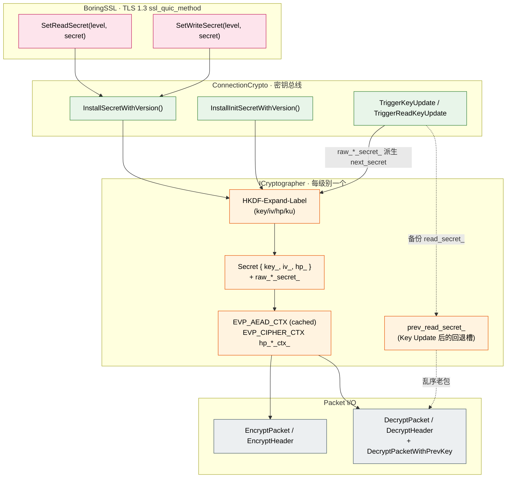

# crypto_keying — TLS 密钥派生、包保护与 Key Update

> **本文回答四个问题**
> 1. **从哪个秘密派生出哪些密钥？** —— TLS traffic secret → AEAD key / IV / HP key 三件套，每个加密级别一份；外加 Initial 级别的 HKDF-Extract(salt, DCID) 例外路径。
> 2. **为什么 nonce 不直接用 packet number？** —— RFC 9001 §5.3 的 IV ⊕ big-endian(pn) 算法；写错就是 nonce 重用 = AEAD 失效。
> 3. **Key Update 怎么不丢乱序包？** —— `prev_read_secret_` + `HasPrevReadKey()` 双时窗机制；Header Protection key **不更新**的硬性约束。
> 4. **为什么 v1 和 v2 标签集不一样？** —— RFC 9369 抗中间盒 ossification 设计；标签从 `"tls13 quic key"` 改成 `"tls13 quicv2 key"`，盐换一组。

> **本文不涉及**：握手状态推进（见 [`handshake_state_machine.md`](handshake_state_machine.md)）、TransportParam 协商（同上）、CRYPTO frame 与 CryptoStream（见 [`packet_lifecycle.md`](packet_lifecycle.md) §CRYPTO frame）。本文专注于"**密钥从哪来 / 怎么派生 / 怎么用 / 怎么轮换**"这一闭环机制。

---

## 1. 总览：密钥栈与四层数据流



**四个分层**：

| 层 | 角色 | 关键产物 |
| :--- | :--- | :--- |
| **TLS 1.3 (BoringSSL)** | 握手协商 + traffic secret 派生 | 调用 `SetReadSecret` / `SetWriteSecret` 投递 client/server traffic secret |
| **ConnectionCrypto** | 密钥总线；管理 4 级别的 cryptographer 数组 | 把 secret 路由到对应级别 + 触发 Key Update |
| **ICryptographer** | 每级别一份；HKDF-Expand 派生 AEAD key/IV/HP key | 缓存 EVP_AEAD_CTX / EVP_CIPHER_CTX 给热路径复用 |
| **Packet I/O** | EncryptPacket / DecryptPacket / Header Protection | nonce = IV ⊕ pn；mask = ECB(hp_key, sample) |

**密钥级别四态（RFC 9001 §2.1）**：

| 级别 | EncryptionLevel | 长头/短头 | AEAD 算法 | 何时就绪 |
| :--- | :--- | :--- | :--- | :--- |
| Initial | `kInitial = 0` | 长头 | **永远 AES-128-GCM**（RFC 9001 §5.2 强制） | 客户端首个 Initial 一发 / 服务端收到客户端 Initial |
| 0-RTT | `kEarlyData = 1` | 长头（type=0x01） | TLS 协商套件 | TLS 调 `SetWriteSecret(kEarlyData, …)` |
| Handshake | `kHandshake = 2` | 长头（type=0x10） | TLS 协商套件 | TLS 调 `SetReadSecret/SetWriteSecret(kHandshake, …)` |
| Application | `kApplication = 3` | **短头**（1-RTT） | TLS 协商套件 | TLS 调 `SetReadSecret/SetWriteSecret(kApplication, …)` |

握手状态机如何决定**当前出包用哪个级别**已在 [`handshake_state_machine.md`](handshake_state_machine.md) §3.3 讲透；本文从这里向下走。

---

## 2. HKDF-Expand-Label：QUIC 密钥派生的唯一原语

### 2.1 RFC 8446 §7.1 字节布局

QUIC 完全复用 TLS 1.3 的 HKDF-Expand-Label，每次派生一段密钥都构造一个 `HkdfLabel` 字节串：

```
struct {
    uint16 length = Length;            // 2 bytes, big-endian, 期望输出长度
    opaque label<7..255> = "tls13 " + Label;   // QUIC 标签**已包含** "tls13 " 前缀
    opaque context<0..255> = Context;   // QUIC 全部用空 context
} HkdfLabel;
```

`hkdf.cpp` 的实现：

```cpp
// 实际构造的 hkdf_label：
//   [length_hi][length_lo][labellen][label_bytes...][0x00]
//                                                    ^^^^^ 空 context 长度
hkdf_label[0] = (destlen >> 8) & 0xFF;
hkdf_label[1] = destlen & 0xFF;
hkdf_label[2] = labellen;
memcpy(hkdf_label + 3, label, labellen);   // label 已含 "tls13 " 前缀
hkdf_label[3 + labellen] = 0;              // empty context
```

> **设计陷阱**：`type.h` 里的标签数组 **已经包含** `"tls13 "` 前缀（如 `kTlsLabelKeyV1 = "tls13 quic key"`），调用方不要再加前缀，否则就是 `"tls13 tls13 quic key"`，握手通不过。这点和 RFC 8446 描述的"label = 'tls13 ' + Label"读起来容易混。

### 2.2 标签集 v1 vs v2（RFC 9001 / RFC 9369）

```
                 v1 (RFC 9001)               v2 (RFC 9369)
key 派生         "tls13 quic key"            "tls13 quicv2 key"
iv  派生         "tls13 quic iv"             "tls13 quicv2 iv"
hp  派生         "tls13 quic hp"             "tls13 quicv2 hp"
ku  派生         "tls13 quic ku"             "tls13 quicv2 ku"
Initial salt     38 76 2c f7 ... 7f 0a       0d ed e3 de ... 2e d9
Retry key        be 0c 69 ...                8f b4 b0 ...
Retry nonce      46 15 99 ...                d8 69 69 ...
```

为什么 v2 不是简单加版本号、而是连标签和盐都换？—— **抗 ossification**：v1 出来后多年，运营商中间盒开始固化对 `"tls13 quic"` 字面值与 v1 salt 的解析（Greasing 不够时）。RFC 9369 通过完全不同的字面值，让"识别 QUIC 流量靠匹配密钥派生材料"的中间盒在 v2 流量上误判为乱码加密包，从而失效。

`type.h` 用一个 `QuicLabels` 结构体 + `GetQuicLabels(version)` 工厂函数把版本差异屏蔽到一处；`InstallSecretWithVersion / KeyUpdateWithVersion / InstallInitSecretWithVersion` 三个入口都接 version 参数，**单点版本派生**。

### 2.3 一次 InstallSecret 派生三件套

`AeadBaseCryptographer::InstallSecretWithVersion` 把 TLS 投来的 traffic secret（32 字节，对应 SHA-256；48 字节对应 SHA-384）膨胀成三段独立密钥：

```cpp
// 1) AEAD packet protection key —— 用 "tls13 quic key" 标签
HKDF-Expand(secret, "tls13 quic key",  aead_key_length_) → key_
// 2) AEAD IV —— 用 "tls13 quic iv" 标签
HKDF-Expand(secret, "tls13 quic iv",   aead_iv_length_)  → iv_
// 3) Header Protection key —— 用 "tls13 quic hp" 标签
HKDF-Expand(secret, "tls13 quic hp",   cipher_key_length_) → hp_
```

派生完后**同时**做两件事：

1. **保存原始 traffic secret**（`raw_read_secret_ / raw_write_secret_`）—— 后续 Key Update 必须用 raw secret 再派生 `next_secret`，**不能用 key_/iv_/hp_** 这三个已经膨胀过的字节串去算（会得到错的密钥）。
2. **预创建并缓存 EVP_AEAD_CTX 与 EVP_CIPHER_CTX**（`read_aead_ctx_ / hp_read_ctx_` 等）—— 把 AES key schedule 和 cipher init 摊到 InstallSecret 一次，避免 1 Gbps 流量下每个包都重做 AES_set_encrypt_key（剖析显示这条路曾占 client 20% CPU，注释保留在 `aead_base_cryptographer.cpp:62-87`）。

### 2.4 Initial 密钥的特殊派生：HKDF-Extract(salt, DCID)

`InstallInitSecret` 是另一条路径：

```
initial_secret    = HKDF-Extract(salt = kInitialSaltVx, IKM = client_DCID)
client_secret     = HKDF-Expand(initial_secret, "tls13 client in", 32)
server_secret     = HKDF-Expand(initial_secret, "tls13 server in", 32)
然后再各自 InstallSecret(client_secret 或 server_secret) → key/iv/hp 三件套
```

三个特殊点：

- **算法固定 AES-128-GCM**（RFC 9001 §5.2）—— 即使 TLS 后续协商出 AES-256-GCM 或 ChaCha20，Initial 这一级永远是 AES-128-GCM。`connection_crypto.cpp:159` 直接 `MakeCryptographer(kCipherIdAes128GcmSha256)`。
- **digest 固定 SHA-256**（同上） —— `aead_base_cryptographer.cpp:193` 写死 `EVP_sha256()`，不读 `digest_` 成员。
- **client/server 标签反向使用**：服务端要解客户端 Initial 包，所以 `read_label = "tls13 client in"`；客户端反之。`InstallInitSecret` 用 `is_server` 标志做 swap。

### 2.5 Retry 后的非对称 Initial 重派生

服务端发 Retry 强制客户端重连后（[`packet_lifecycle.md`](packet_lifecycle.md) §Retry），客户端的 Initial 密钥变成**非对称**：

- **写**密钥：用 **Retry 包的 Source CID** 派生 —— 客户端发出去的 Initial 用这个加密
- **读**密钥：用客户端**自己的本地 CID** 派生 —— 服务端用这个解后续客户端 Initial

`InstallInitSecretForRetryWithVersion` 的两步实现：

```cpp
// Step 1: 用 read_cid 全套 install（读对、写错）
cryptographer->InstallInitSecret(read_cid, …, is_server=false);
// Step 2: 用 write_cid 单独再派生 client_secret，覆盖 write 槽
HKDF-Extract(write_cid, salt) → init_secret
HKDF-Expand(init_secret, "tls13 client in") → write_secret
cryptographer->InstallSecretWithVersion(write_secret, …, is_write=true);
```

这是少数会**只更新单侧 secret**的合法路径之一（其余两处是 Key Update 的 read/write 分别更新）。

---

## 3. 包保护：AEAD 加解密 + Header Protection

### 3.1 数据包加密：AEAD with associated data

```
ciphertext = AEAD_Seal(
    key   = key_,                              // HKDF-Expand("quic key")
    nonce = MakePacketNonce(iv_, pn),          // 见 §3.2
    plaintext = packet_payload,
    aad   = packet_header_with_unprotected_pn  // 见 §3.4
)
```

实现要点（`EncryptPacket / DecryptPacket`）：

- **AAD 范围**：从 first byte 到 packet number 末尾，**不**包含 payload。注意 first byte 与 PN 此时**还未做 Header Protection**（HP 是在 AEAD 之后/之前的最外层操作；见 §3.5）。
- **EVP_AEAD_CTX 复用**：`InstallSecret` 时已建好 `read_aead_ctx_ / write_aead_ctx_`；热路径直接复用。Lazy fallback 保留是为了未走过 InstallSecret 的诊断路径，正常生产不应触发。
- **out_plaintext / out_ciphertext 是 IBuffer**：调用 `MoveWritePt(out_length)` 推进写指针；调用方需要保证 `GetWritableSpan()` 容量 ≥ plaintext + tag_length。

### 3.2 nonce 的精确构造（RFC 9001 §5.3）

QUIC 的 nonce 不直接用 packet number，而是用 **IV XOR big-endian 编码的 pn**：

```cpp
// 12 字节 nonce，前几字节直接复制 IV
memcpy(nonce, iv.data(), 12);

// 把 64-bit pn 转成 big-endian
uint64_t be_pn = byte_swap_64(pkt_number);

// 在 nonce 末尾 8 字节 XOR be_pn
for (i = 0..7) nonce[12 - 8 + i] ^= ((uint8_t*)&be_pn)[i];
```

**为什么必须这么做？** 三个原因：

1. **只用 pn 会导致跨级别 nonce 重用**：每个加密级别（Initial/Handshake/Application）的 pn 空间独立，pn=1 在 Initial 和 Handshake 都会出现；如果 nonce 直接等于 pn，相同 traffic secret 不同级别会用相同 nonce → AEAD 灾难性失效。XOR IV 之后，每级别 IV 不同（HKDF-Expand 派生时 label 同但 traffic secret 不同），nonce 自然分离。
2. **抗截断 / 重放**：pn 是明文（去保护后），完全可被攻击者操控；但 IV 是密钥派生出来的秘密，攻击者改 pn 也无法预测 nonce。
3. **AEAD 安全前提**：GCM / ChaCha20-Poly1305 的安全性以 (key, nonce) 不重为前提，pn 单调递增 + IV 固定就足够保证不重。

### 3.3 packet number 编码与恢复（RFC 9000 Appendix A）

发送侧 pn 是 64-bit 单调递增，但线上 pn 字段只有 1/2/3/4 字节（截断），需要接收侧用 `largest_received_pn` 恢复完整 pn：

- **PnLen 字段**：长头/短头 first byte 低 2 bit 编码 `actual_length - 1`。RFC 9000 故意用 (len-1) 而非 len：因为 4 个值 0x0/0x1/0x2/0x3 对应长度 1/2/3/4，省一位。
- **Two-step 恢复**：先解 HP 拿到 PnLen，从 wire 读 truncated_pn；然后用 `PacketNumber::Decode(largest_received_pn, truncated_pn, pn_bits)` 算最近的、与 truncated_pn 低位一致的整数（包号回绕窗口）。
- **largest_received_pn 必须是该级别的**：`PacketNumberManager` 按 pns（packet number space）分桶；Initial / Handshake / Application 各自一份；不可跨桶用。

### 3.4 AAD 的精确范围

```
AAD = [Flag byte][rest of header...][unprotected packet number]
```

关键：AAD **不**包含 token、length 字段之外的数据；short header 的 AAD 是 `[Flag][DCID][PN]`；long header 的 AAD 是从 first byte 一路到 length+pn。**`packet_payload`** 是 AAD 之后的密文；tag 是 AEAD 输出末尾 16 字节。

### 3.5 Header Protection：双层套娃

QUIC 用 **HP** 把 first byte 的低 4 bit（长头）/低 5 bit（短头）和整个 packet number 字段再加一层异或保护，目的是让中间盒**看不到 pn**（避免基于 pn 的固化推断、避免基于 first byte flag 的解析）。

```
mask = HP_function(hp_key, sample)
// sample = ciphertext[pn_offset+4 .. pn_offset+4+16]，固定 16 字节
//          注意：从假设 PnLen=4 的位置取，即使实际 PnLen=1，sample 也跨过去

first_byte ^= mask[0] & (is_short ? 0x1f : 0x0f)
for i in 0..pn_len:
    pn_bytes[i] ^= mask[i+1]
```

**HP 算法依 cipher 而异**：

| AEAD | HP function | 实现 |
| :--- | :--- | :--- |
| AES-128-GCM | AES-128-ECB(hp_key, sample[16])[0..4] | `AeadBaseCryptographer::MakeHeaderProtectMask` AES-ECB 路径 + `EVP_CIPHER_CTX` 缓存 |
| AES-256-GCM | AES-256-ECB(hp_key, sample[16])[0..4] | 同上 |
| ChaCha20-Poly1305 | ChaCha20(hp_key, sample[0..3] as counter, sample[4..16] as nonce) ⊕ 5 字节 0 | `ChaCha20Poly1305Cryptographer::MakeHeaderProtectMask` 重写覆盖 |

**性能优化**：AES-ECB 这条路的 `EVP_CIPHER_CTX` 在 `InstallSecretWithVersion` 一次性 init 好（跑过 AES key schedule），后续每包只做一次 16 字节 ECB 块加密；过去未缓存版本剖析显示这条路占 1Gbps 客户端 20% CPU。`MakeHeaderProtectMask` 的 `cached_hp_ctx` 参数就是这个优化的入口；为兼容性还保留了一条 slow path（建临时 ctx），仅在没有缓存时走。

### 3.6 解密的两步：HP 先 / AEAD 后

```
1. DecryptHeader(ciphertext, sample, pn_offset, &out_pn_len, is_short)
   → 用 sample 算 mask，异或还原 first byte 和 pn 字段
   → first byte 还原后才能从低 2 bit 读到 PnLen
2. 从还原的 first byte 读 PnLen，从 wire 读 truncated_pn
3. 用 PacketNumber::Decode 恢复完整 pn
4. DecryptPacket(pn, ad_span, payload, plaintext_buffer)
   → AEAD_Open(key, nonce(iv,pn), payload, ad_span)
```

**顺序不能反**：sample 是从密文里取的固定偏移（`pn_offset + 4`），不依赖 PnLen；只有 first byte 还原后才知道真实的 PnLen（影响 AAD 边界）；只有完整 pn 才能算 nonce。

---

## 4. Key Update：1-RTT 密钥的代际轮换

### 4.1 触发条件与 KeyUpdateTrigger

RFC 9001 §6 允许任一端在 1-RTT 通信中**主动**轮换密钥，也要求收到对端 Key Phase 翻转时**被动**跟进。`KeyUpdateTrigger` 是主动触发器，`OnBytesSent / OnPacketSent` 累计两类阈值：

| 阈值 | 默认值 | 检查时机 | 命中含义 |
| :--- | :--- | :--- | :--- |
| `bytes_threshold_` | 512 KB | 每次发包后 `OnBytesSent(packet_size)` | "AEAD 用得够久了，预防性轮换" |
| `pn_threshold_` | 1000 packets | 每次发包后 `OnPacketSent(pn)` | "包号差距够大了，加点新鲜度" |

`enabled_` 默认 false（由 `WorkerConfig::enable_key_update_` 在 server/client 启动时打开），是因为：

1. **互操作性**：早期某些实现 Key Update 处理脆弱，触发就掉线；保留 opt-in 是对生产慎重。
2. **测试可控**：关闭后单元测试可固定密钥环境，避免无关的 Key Update 流入测试断言。

`triggered_` 一个旗标避免 RTT 内**重复**触发；`MarkTriggered` 在 `TriggerKeyUpdate` 成功后置位 + `Reset()` 清 byte 计数。注意 `Reset()` **不**清 `key_update_count_`（累计跨连接生命周期的统计量）。

### 4.2 主动 Key Update：TriggerKeyUpdate

```
1) 拿出 cryptographers_[kApplication]   // 只有 Application 级别才能 Key Update
2) cryptographer->KeyUpdateWithVersion(nullptr, 0, is_write=true,  version)   // 更新 write
3) cryptographer->KeyUpdateWithVersion(nullptr, 0, is_write=false, version)   // 更新 read
4) current_key_phase_ ^= 1   // 翻转 key phase
5) qlog 写 "1rtt key_update" 事件，trigger="key_update"
```

`KeyUpdateWithVersion(nullptr, 0, …)` 表示"用我自己保存的 raw_*_secret_ 作 base"：

```cpp
const auto& raw = is_write ? raw_write_secret_ : raw_read_secret_;
next_secret = HKDF-Expand-Label(raw, "tls13 quic ku", "", hash_len)   // 32 / 48 字节
// 然后用 next_secret 重新 InstallSecret（派生新 key/iv，**但 hp 单独保存恢复**）
```

**HP key 不更新的硬约束**（RFC 9001 §6 强制）：Header Protection key 在整个连接生命周期保持不变。原因是 HP 算法依 sample 取自密文，密文已经覆盖了 Key Update 的 AEAD 密钥变化，HP 端再换 key 是冗余安全度并增加复杂度（更要命的是会破坏 reordering 容错）。

实现细节（`KeyUpdateWithVersion`）：

```cpp
saved_hp     = current_secret.hp_;      // 备份当前 HP key
saved_hp_ctx = std::move(hp_ctx_ref);   // 备份 HP cipher context
InstallSecretWithVersion(next_secret)   // 这里会重新派生 hp_，其实是错的
current_secret.hp_   = saved_hp;        // 还原回去
hp_ctx_ref           = saved_hp_ctx;    // 还原 cipher context
```

为什么不直接在 InstallSecret 里加个"skip hp"分支？—— 一致性优先：`InstallSecret` 永远派生完整三件套，HP 不更新这件事在 KeyUpdate 路径外不存在；保持 InstallSecret 的不变量（永远派生 key/iv/hp），用 KeyUpdate 包一层 save/restore 避免污染基础原语。

### 4.3 被动 Key Update：TriggerReadKeyUpdate

收到一个 1-RTT 包，HP 解完后看 first byte 的 bit 2（KeyPhase 位）：

```cpp
// rtt_1_packet.cpp:148
bool key_phase_changed = (received_key_phase != expected_key_phase_);
```

- **没变**：用当前 read key 解密；如失败再用 `prev_read_secret_` 兜底（见 §4.4）。
- **变了**：保存原始 buffer 状态（`saved_payload_start_/saved_ad_start_/...`），向 connection 上送 `key_phase_changed_` 旗标，**不**直接换 key。

为什么不直接换？—— **决策权属于 BaseConnection**：`On1rttPacket` 收到旗标后调 `connection_crypto_.TriggerReadKeyUpdate()`，这条路径同时更新 read **和** write 密钥（RFC 9001 §6.2 SHOULD），然后调 `rtt_1_packet->RetryPayloadDecrypt()` 用新 key 重解 payload（header 已经在前一步解过了）。把"换 key"和"重解包"分到两层，是因为 `Rtt1Packet` 不持有 `ConnectionCrypto`，不能自己换；同时保留 retry 的能力让上层在换 key 失败时还能记录原状态。

### 4.4 prev_read_secret_：乱序老包的兜底

Key Update 后短窗口内，可能还会收到**对端在自己 Key Update 之前发的包**（pn 排序乱掉），这些包仍用上一代密钥加密。`AeadBaseCryptographer::KeyUpdateWithVersion` 在更新 read 时：

```cpp
if (!update_write) {
    CleanSecret(prev_read_secret_);            // 清掉更老的 prev（最多保留一代）
    prev_read_secret_ = read_secret_;          // 当前 read → prev
    prev_read_aead_ctx_ = std::move(read_aead_ctx_);   // 转移 AEAD ctx
    read_secret_ = Secret();                   // 清空 current（不 cleanse，数据已转移）
}
// 然后 InstallSecretWithVersion(next_secret) 派生新一代 read
```

`rtt_1_packet.cpp:181-191` 的回退路径：

```cpp
result = crypto_grapher_->DecryptPacket(pn, ad, payload, plaintext);   // 当前 read key
if (result != kOk) {
    if (crypto_grapher_->HasPrevReadKey()) {   // 上一代 read key 还在
        // 用 prev 重试
        result = crypto_grapher_->DecryptPacketWithPrevKey(pn, ad, payload, plaintext);
    }
}
```

**只保留一代 prev**：每次 Key Update 把当前 prev 直接清掉，新的 current 变成 prev。RFC 9001 §6.6 的论证是：连续两次 Key Update 之间的间隔应远大于 RTT，乱序老包跨两代的概率可忽略；保留两代以上反而扩大密钥泄露窗口。

**HP key 不参与 prev**：因为 HP key 不更新，所以不需要 `prev_hp_ctx_`，`prev_read_secret_.hp_` 字段留空（注释明确：HP not updated during Key Update）。

---

## 5. 算法适配：ICryptographer 三族

```
ICryptographer  (interface)
  └─ AeadBaseCryptographer  (HKDF + EVP_AEAD + EVP_CIPHER 通用骨架)
       ├─ Aes128GcmCryptographer       // aead = AES-128-GCM, hp = AES-128-ECB
       ├─ Aes256GcmCryptographer       // aead = AES-256-GCM, hp = AES-256-ECB
       └─ ChaCha20Poly1305Cryptographer // aead = ChaCha20-Poly1305
                                       // hp 重写覆盖：CRYPTO_chacha_20()
```

`MakeCryptographer(SSL_CIPHER*)` 走 BoringSSL 的 cipher id → quicX 内部枚举映射：

| BoringSSL 常量 | quicX 枚举 | 类 |
| :--- | :--- | :--- |
| `TLS1_CK_AES_128_GCM_SHA256` | `kCipherIdAes128GcmSha256` | Aes128Gcm |
| `TLS1_CK_AES_256_GCM_SHA384` | `kCipherIdAes256GcmSha384` | Aes256Gcm |
| `TLS1_CK_CHACHA20_POLY1305_SHA256` | `kCipherIdChaCha20Poly1305Sha256` | ChaCha20Poly1305 |

各子类构造时只设 `aead_ / cipher_ / digest_` 三个 EVP 句柄，其余字段（key 长度、IV 长度、tag 长度）从 EVP 函数现取；公共逻辑（HKDF / Install / Encrypt / Decrypt）全在基类。这种**算法即句柄**的设计避免了三套独立实现的代码膨胀。

`ChaCha20Poly1305Cryptographer::MakeHeaderProtectMask` 是唯一一个 override —— 因为 ChaCha20 的 HP 算法和 AES-ECB 完全不一样（用 sample 前 4 字节当 counter，后 12 字节当 nonce，对一段 5 字节零做 ChaCha20 流式加密拿 mask）：

```cpp
const uint8_t* sample_pos = sample.GetStart();
uint32_t* counter = (uint32_t*)sample_pos;          // sample[0..3] 当 counter
sample_pos += sizeof(uint32_t);                     // 跳过 4 字节
CRYPTO_chacha_20(out_mask, kHeaderMask=0x0..0, 5, key, sample_pos /*nonce*/, *counter);
```

注意 `*counter` 直接对 little-endian 内存解读（x86 默认布局），符合 ChaCha20 RFC 7539 的 32-bit LE counter 约定。

---

## 6. Retry Integrity Tag：另一条 AEAD 路径

`RetryCrypto::ComputeRetryIntegrityTag`（`retry_crypto.cpp:55-102`）是个**独立**的 AEAD 调用，**不**走 ICryptographer 接口：

```
Retry Pseudo-Packet = ODCID_Len(1B) || ODCID || Retry_Packet_Without_Tag

Tag = AEAD-AES-128-GCM_Seal(
    key       = kRetryIntegrityKeyVx,    // RFC 9001 / RFC 9369 公开常量
    nonce     = kRetryIntegrityNonceVx,  // 同上，公开常量
    plaintext = ""                        // 空
    aad       = Retry Pseudo-Packet
).tag                                     // 取 AEAD 输出的 16 字节 tag
```

四点反直觉：

1. **密钥是公开常量，不是秘密** —— 它防的不是机密性，是**包来源真实性**：tag 的 AAD 包含 ODCID（客户端最初的 DCID），中间盒不知道 ODCID 就无法伪造合法 Retry。
2. **plaintext 是空** —— AEAD 这里被当成"对 AAD 的认证函数"用，只取 tag 不要密文。
3. **不复用 cryptographers_[kInitial]** —— Retry tag 的密钥与 Initial 包保护密钥语义完全不同（前者全网共享公开常量，后者一连接一份），共用一个对象会模糊层次。
4. **v1 / v2 分组**：`kRetryIntegrityKeyV1/V2` 与 `kRetryIntegrityNonceV1/V2` 是两套完全不同的常量字符串（RFC 9369 重新设了一组）。`SelectRetryKeyAndNonce(version)` 单点分发。

`VerifyRetryIntegrityTag` 内部调 `ComputeRetryIntegrityTag` 算预期 tag，再做**常量时间**比较（手写 XOR 累或 + 单次 result==0，防时序侧信道泄露 tag）。

---

## 7. 不变量速查（debug 用）

1. **traffic secret 必须保存**：`InstallSecretWithVersion` 必须 `raw_*_secret_.assign(secret, ...)`，否则 Key Update 拿不到 base，`KeyUpdate(nullptr, 0, …)` 会返回 `kNotInitialized`。
2. **HP key 不参与 Key Update**：`KeyUpdateWithVersion` 中 `current_secret.hp_` 必须先备份后还原；这条不变量被破坏 → 对端解 first byte 解不开 → 连接断。
3. **prev_read_secret_ 最多一代**：每次 read 侧 KeyUpdate 必须 `CleanSecret(prev_read_secret_)`；保留两代会让密钥泄露窗口翻倍。
4. **Initial 永远 AES-128-GCM + SHA-256**：即使 TLS 协商后 cryptographers_[kHandshake/kApplication] 是 ChaCha20，cryptographers_[kInitial] 必须保持 AES-128-GCM。
5. **nonce 末 8 字节是 IV ⊕ be(pn)**：`MakePacketNonce` 对 pn 必须做 `byte_swap` 转大端；用本机字节序写就是 nonce 错位。
6. **AAD 包含未加密的 first byte 和 pn**：解密时 AAD 必须用**已解 HP** 后的 first byte 和**已恢复**的完整 pn 字节；用受 HP 保护的密文 first byte 算 AAD = AEAD 解密失败。
7. **Key Phase 位读取自解 HP 后的 first byte**：`rtt_1_packet.cpp:145-147` 必须先 DecryptHeader 才能读 bit 2；顺序反了就把密文当明文读，伪造数据触发误 Key Update。
8. **TriggerReadKeyUpdate 同时更新写**：RFC 9001 §6.2 SHOULD —— 收到对端 Key Phase 翻转后，自己后续发的也得用新 phase；`connection_crypto.cpp:341-354` 双调 KeyUpdate 不能漏第二次。
9. **Retry tag 的 AEAD 密钥是公开常量**：不要试图把 `kRetryIntegrityKeyV1` 替换成连接级密钥；这会破坏 Retry 互操作。
10. **HKDF label 已含 "tls13 " 前缀**：`type.h` 里所有 `kTlsLabel*` 都是 `"tls13 quic key"` 这样的完整字串；上层调用 HkdfExpand 不要再加前缀。

---

## 8. 关联文档

- [`handshake_state_machine.md`](handshake_state_machine.md) — 握手两层状态、加密级别推进；本文 §1 衔接其 §3.3。
- [`packet_lifecycle.md`](packet_lifecycle.md) — Retry 包的格式与流程；本文 §6 衔接其"Retry"章节。
- [`connection_anatomy.md`](connection_anatomy.md) — `ConnectionCrypto` 在连接对象里的位置与依赖。
- [`ownership_and_memory.md`](ownership_and_memory.md) — `cryptographers_[]` / `crypto_stream_` 的所有权。
- [`loss_recovery.md`](loss_recovery.md) — pn 单调递增、largest_received_pn 维护与 §3.3 的 pn 恢复。
- [`stream_state_machine.md`](stream_state_machine.md) — CRYPTO frame 走的特殊 stream（与 0/1/2/3 编号无关），与本文 §1 的 4 加密级别正交。

---

## 9. 关联 RFC

- **RFC 9001 §5** — Packet Protection（key/iv/hp 派生、AAD、nonce 算法）
- **RFC 9001 §5.2** — Initial Secrets（HKDF-Extract(salt, DCID) 的特殊路径）
- **RFC 9001 §5.3** — AEAD Usage（nonce = IV ⊕ pn 大端编码）
- **RFC 9001 §5.4** — Header Protection（sample 偏移、mask 应用、ECB / ChaCha20 两族）
- **RFC 9001 §5.8** — Retry Packet Integrity（公开密钥 AEAD 认证）
- **RFC 9001 §6** — Key Update（key_phase 位、prev key 兜底、HP key 不更新约束）
- **RFC 9001 §4.8 / RFC 9000 §20.1** — TLS Alert → CRYPTO_ERROR 0x0100 + alert_code
- **RFC 9369 §3** — QUIC v2 标签集与盐（"tls13 quicv2 key/iv/hp/ku" + 新 Initial salt）
- **RFC 9369 §3.3** — QUIC v2 Retry Integrity Key/Nonce
- **RFC 8446 §7.1** — TLS 1.3 HKDF-Expand-Label 字节布局
- **RFC 8439** — ChaCha20-Poly1305 算法（含 32-bit LE counter 约定）
- **RFC 5869** — HKDF-Extract / HKDF-Expand 形式化定义
