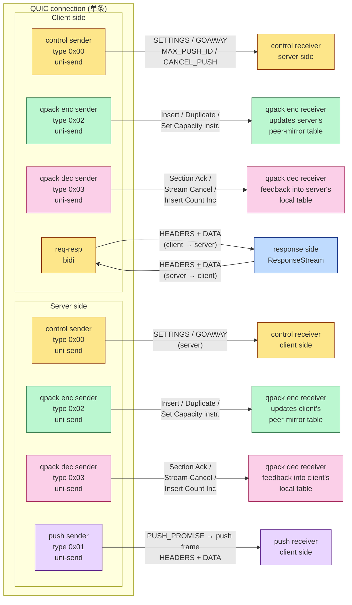
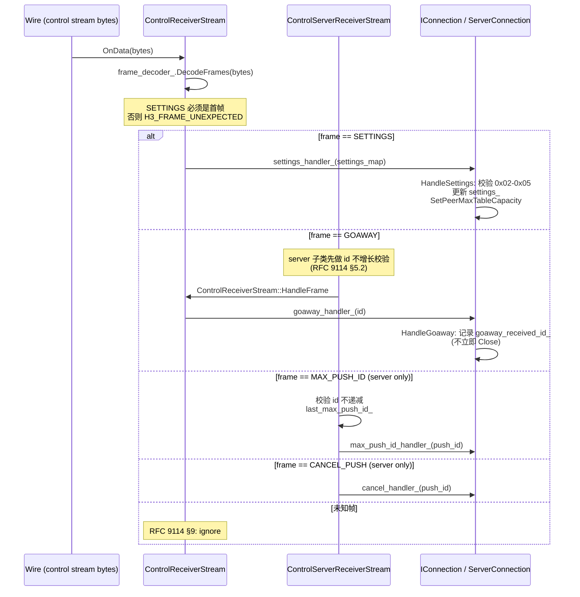

# `h3_connection.md` — HTTP/3 连接的多流协作

> **段三 · 第 19 站**　承接 [`stream_state_machine.md`](stream_state_machine.md)（流的发送 / 接收双状态机）和 [`qpack_dynamic_table.md`](qpack_dynamic_table.md)（动态表的两遍编码），从"**连接**"的视角回答：在一个 QUIC connection 上，HTTP/3 是如何用 **6 类 stream** 拼出一个完整的协议会话的？

---

## 开篇：四个高 ROI 问题

| 问题 | 答案前置 |
| :--- | :--- |
| **Q1**：HTTP/3 一共有几种 stream？为什么不是一种？ | **6 类**：control（双向）/ qpack-encoder（单向）/ qpack-decoder（单向）/ req-resp（双向）/ push（单向）/ unidentified（临时）。每一类承担一个不会与其他类竞争的协议任务（控制帧 / 字段编码字典更新 / 字段编码反馈 / 业务请求 / 服务器推送）。如果合一，就是 HTTP/2 的 SETTINGS、HEADERS、PUSH_PROMISE、RST_STREAM 等帧在**同一个 stream 上排队**——队头阻塞回归。HTTP/3 的"`一类一流`"是把 HTTP/2 的帧多路分发到 QUIC 的 stream 多路。 |
| **Q2**：QPACK 不是一个表吗？为什么 `IConnection` 持有 `qpack_encoder_` **和** `qpack_decoder_` 两个 `QpackEncoder` 实例？ | **RFC 9204 §3.2.3**：每条连接需要**两份独立的动态表**——本端 encoder 用于把出站 headers 编码为 wire bytes（持有"我插入了什么"），本端 decoder 用于把入站 headers 解回 map（持有"对方插入了什么"）。它们的 insert count、capacity、reference 完全独立，互不影响。`QpackEncoder` 这个类是"**封装的 encoder + 封装的 decoder + 一张动态表**"，所以 `qpack_encoder_` 实例存的是**本端 encoder 的 dynamic table**，`qpack_decoder_` 实例存的是**对端 encoder 写过来的 dynamic table 的 mirror**。命名是历史遗留——更准确的名字是 `local_table_` / `peer_mirror_table_`。 |
| **Q3**：客户端和服务端的 stream 拓扑是不是一样？ | **不一样**。服务端建 **5 条**单向流：control-sender / qpack-enc-sender / qpack-dec-sender / qpack-dec-receiver（早期）+ 反应式接收 client 的 control-receiver / qpack-enc-receiver。客户端建 **3 条**单向流：control-sender / qpack-enc-sender / qpack-dec-sender，**不主动建** qpack-dec-receiver——它要等服务端开 qpack-encoder 流过来时再反应式地建（`OnStreamTypeIdentified` 路径）。这是 §5 详述的"主动 vs 反应式"分工。 |
| **Q4**：unidirectional stream 上的"流类型"字段什么时候识别？过早识别会怎样？ | RFC 9114 §6.2 规定单向流首字节是 stream type varint。但 QUIC 一次到达的数据是**字节流**，不保证整字节先到——可能 prefix 1 字节先来 stream type 还没读到。所以本仓采用 **`UnidentifiedStream`** 占位：先把流注册到 `streams_[id]`，等 `OnData` 攒够 1 字节再 decode varint 决定具体类型，然后**替换为真正的子类**（`switch (stream_type)` → `make_shared<X>` → `streams_[id] = typed`），把已读的剩余 byte 通过 `OnData(remaining_data, false, 0)` 回灌新流。错误识别（提前 cast 或没识别就 dispatch 帧）会把 wire bytes 解释为错误的 stream 类型——典型是把 control 帧解成 QPACK encoder instruction，损坏 dynamic table。 |

---

## 1. 总览：一条 H3 连接的 6 类流拓扑



**5 条颜色一一对应 5 类流**（unidentified 是过渡态，不画）。**注意三个不对称**：

1. **服务端不建 push receiver**：push 是 server→client 单向流，server 这边永远不可能"接收 push"；同样**客户端不建 push sender**。
2. **每方各 3 条 sender**（控制 + QPACK enc + QPACK dec），但 **receiver 是反应式建立的**：当 QUIC 层告知"对端开了一条新的单向流"时，本端用 `UnidentifiedStream` 占位，读出 stream type 才决定建哪一类 receiver。
3. **`qpack-encoder` 流和 `qpack-decoder` 流的方向相反**——encoder 流是"写的人"那一侧到"读的人"那一侧（A→B），decoder 流是"读完后给反馈"那一侧到"写的人那一侧"（B→A）。所以**每方各持有"自己的 enc-sender + 自己的 dec-sender"**，两条都是 sender 方向，但携带的语义相反。

---

## 2. 设计动机：为什么是 6 类流，不是更少？

### 2.1 控制流必须独立

`control` 流承载 **SETTINGS / GOAWAY / MAX_PUSH_ID / CANCEL_PUSH**。它不能复用业务流，理由有三：

1. **SETTINGS 必须是 control 流的第一帧**（RFC 9114 §6.2.1 / §7.2.4）。如果 control 帧塞在 req-resp 流里，则需在每条 req-resp 流前重复发 SETTINGS——浪费且语义模糊。
2. **GOAWAY 是连接级事件**——它不属于任何一个请求。把它放在请求流里语义错误。
3. **CANCEL_PUSH 引用其他流**——它针对一个 push_id，自己塞在 push 流里就成自我引用。

### 2.2 QPACK 编码流和解码流必须**反向且独立**

RFC 9204 §4：

- **encoder 流**：本端 encoder → 对端 decoder，发送的是 dynamic table 更新指令（`Insert with Name Ref` / `Insert without Name Ref` / `Duplicate` / `Set Dynamic Table Capacity`）。每方一条**自己拥有的 sender**（`QpackEncoderSenderStream`）+ 一条**反应式建立的 receiver**（`QpackEncoderReceiverStream`，更新 `qpack_decoder_` 也即 peer-mirror 表）。
- **decoder 流**：本端 decoder → 对端 encoder，发送的是反馈帧（`Section Ack` / `Stream Cancel` / `Insert Count Increment`）。每方一条**自己拥有的 sender**（`QpackDecoderSenderStream`）+ 一条**反应式 receiver**（`QpackDecoderReceiverStream`）。

为什么不能合并到一个"QPACK 流"？因为**每方持有 2 张表**，且**编码 vs 反馈的优先级和阻塞模型完全不同**：

- encoder instructions 必须**严格保序**（dynamic table 是顺序写入的，跨包错序会导致 RIC/Base 错位）→ 单独流上保序天然成立。
- decoder feedback 是**事件驱动**——每解码一个 header section 就发一次 section ack。如果挤到 encoder 流，本端 encoder 写指令的瞬间被打断回头写反馈，dynamic table 的提交语义就难以约束。
- **死锁防御**：encoder 流被堵（receiver 端 dynamic table 满）时，decoder 反馈流必须**仍能继续推进**，让对端知道我们已 Section Ack 了哪些 section（这会触发 dynamic table 的 evict）→ 反馈流堵死会循环锁死。两条流分开就只有"`encoder 流堵塞`"这一条降级路径，不是死锁。

### 2.3 push 流为什么是单向？为什么放 server→client 而不双向？

RFC 9114 §4.6：服务器主动推送是预测式响应。push 帧的"请求体"是 PUSH_PROMISE（在 req-resp 流里），"响应体"是 push 流（HEADERS + DATA + 内嵌的 push_id）。

- 单向：push 不需要"客户端发送"，只是 server→client 投递，单向 stream 比双向 stream 省一半状态机。
- 不复用 req-resp 流：push 不属于"客户端发起的请求-响应对"，它是 server 自发的。如果塞进 req-resp 流，需要新增一种"双向流上同时承载多个 response"的语义，与现有"一对 req-resp"模型冲突。

### 2.4 `kReqResp = 0xFF` 和 `kUnidentified = 0xFFFF` 为什么不是有效 wire 类型？

```cpp
enum class StreamType {
    kControl      = 0x00,  // wire
    kPush         = 0x01,  // wire
    kQpackEncoder = 0x02,  // wire
    kQpackDecoder = 0x03,  // wire
    kReqResp      = 0xFF,   // 内部标记：双向流不需要 type 字段
    kUnidentified = 0xFFFF, // 内部标记：等待识别
};
```

req-resp 是**双向 stream**——RFC 9114 §6.1 规定 bidi 流不写 stream type（双向流的方向语义就是 type）。`0xFF` 是仓库内部标记，永远不上 wire。`0xFFFF`（`UnidentifiedStream` 占位）也是内部标记。这两个值是 `IStream::GetType()` 的输出，**`HasInFlightRequests()` 用它做 drain 判断**——长寿命的 control / qpack 流不算"在途请求"，只有 `kReqResp` / `kPush` 算（参见 §6 GOAWAY drain）。

---

## 3. `IConnection` 的 6 流装配与生命周期

### 3.1 双阶段构造：构造 + `Init()` 

```cpp
// IConnection 构造函数里**不能**调 weak_from_this():
// std::enable_shared_from_this 仅在 make_shared<T>() 完成后才有效。
// 所以所有需要 weak_self 闭包的 wiring 都推迟到 Init()。

auto conn = std::make_shared<ServerConnection>(...);  // 第 1 步：构造
conn->Init();                                          // 第 2 步：装配
```

`Init()` 做的事（`connection_server.cpp:42-135`）：

1. **基类 `IConnection::Init()`**：注册 `SetStreamStateCallBack`（QUIC → H3 的"对端开新流了"回调）+ 启动 `cleanup_timer`（100 ms 跳一次，做 stream 析构延迟 + GOAWAY drain probe）。
2. **建 control sender**：`MakeStream(kSend)` → `ControlClientSenderStream`（注：服务端也用这个名字，因为 server 的 control sender 仍然是发 control 帧给 client，发的内容（SETTINGS / GOAWAY）和 client→server 的发送方向**相反但帧族相同**）→ 立刻 `SendSettings()`。
3. **`qpack_enabled` 判定**：`(qpack_max_table_capacity > 0 || qpack_blocked_streams > 0)`。如果 false 则跳过 QPACK 流装配——但 RFC 9204 严格说"QPACK 流必须创建"，本仓只在 dynamic table 全关时省略。这是一个 **conformance shortcut**：dynamic table 完全 0 capacity 等同于"只用静态表"，QPACK 流即使创建也只能传空指令——节省一对单向流是合理优化（`connection_client.cpp:67-71` 注释承认了这点）。
4. **建 QPACK enc sender + dec sender**：每条 sender 都把 `weak_ptr` 注入到 encoder 的 `SetInstructionSender` lambda 里，避免 connection→stream→lambda→shared_ptr<connection> 自循环（`ownership_and_memory.md` §2.2）。
5. **wire decoder feedback**：`qpack_decoder_->SetDecoderFeedbackSender(...)` 把 Section Ack / Stream Cancel / Insert Count Increment 三类反馈通过 `qpack_dec_sender_stream` 发出去——switch 在 lambda 内分流。

### 3.2 反应式 stream 创建：`HandleStream` → `UnidentifiedStream` → `OnStreamTypeIdentified`

QUIC 层告知"对端开了一条新流"时，回调进入 `HandleStream(stream, error_code)`。流向取决于 stream 的方向：

```cpp
if (stream->GetDirection() == StreamDirection::kBidi) {
    // 服务端：客户端的请求流，建 ResponseStream
    // 客户端：服务端不应主动建 bidi（kStreamCreationError），保留兼容路径
} else if (stream->GetDirection() == StreamDirection::kRecv) {
    // 单向流，类型未知 → 占位 UnidentifiedStream，等首字节
    streams_[id] = make_shared<UnidentifiedStream>(stream, ..., on_type_identified);
}
```

`UnidentifiedStream::OnData` 拿到第一笔数据，尝试 `DecodeVarint(stream_type)`：

- 不够字节就 return（继续等下一波 OnData，stream type varint 最大 8 字节）；
- 解出来后**注销自己的 read callback**（`SetStreamReadCallBack(nullptr)`），调 `type_callback_(stream_type, stream_, remaining_data)`；
- `OnStreamTypeIdentified` 用 switch 决定建哪一类 typed stream（`ControlServerReceiverStream` / `QpackEncoderReceiverStream` / `QpackDecoderReceiverStream` / `PushReceiverStream`），把 `streams_[id]` 替换掉，并**把已读的 remaining_data 回灌**给新流：`typed_stream->OnData(remaining_data, false, 0)`。

> 关键不变量：**stream type 字节是 prefix 而非 framing**——它**不属于任何 HTTP/3 frame**。`UnidentifiedStream` 在 decode 完 varint 后已经把 read offset 移到 prefix 之后，所以 `remaining_data` 喂给 typed stream 是从第一个 frame 字节开始的。这与 `ISendStream::EnsureStreamPreamble` 的写入端对称：`wrote_type_` 标志保证 prefix 只写一次，后续帧才进 `frame->Encode(buffer)`（`if_send_stream.cpp:8-40`）。

### 3.3 服务端非法流类型：client 不能开 push 流

`OnStreamTypeIdentified` 里 server 侧的 `case kPush` 直接 `HandleError(kStreamCreationError)` —— RFC 9114 §4.6：客户端 MUST NOT 主动发起 push 流；这是协议违反，按 H3_STREAM_CREATION_ERROR 关闭连接（`connection_server.cpp:369-374`）。

---

## 4. QPACK dual-table 模型在连接层的体现

### 4.1 两个 `QpackEncoder` 实例承载哪两张表？

| 字段 | 持有什么 | 谁写它？ | 谁读它？ |
| :--- | :--- | :--- | :--- |
| `qpack_encoder_` | **本端 encoder 的 dynamic table**（"我已经向对端 push 了哪些条目"） | 本端调 `Encode(headers, ...)` 时按需追加 → `instruction_sender_` 发到对端 | `qpack_decoder_->Decode()` 不读它；只有本端 encode 路径读 |
| `qpack_decoder_` | **对端 encoder 的 dynamic table 的 mirror**（"对端告诉我它 push 了哪些条目"） | `QpackEncoderReceiverStream` 收到 encoder instruction → 调 `qpack_decoder_->DecodeEncoderInstructions()` 追加 | 本端 `Decode(headers)` 时按 RIC/Base 索引这张表 |

> **命名混乱的根源**：`QpackEncoder` 这个 class 既能编码也能解码，所以两个实例都用同一个类型——但它们**承载的"动态表语义"是反向的**。读码时记住这张映射表即可。

### 4.2 capacity 三方协商

`HandleSettings` 收到对端 SETTINGS 后做 `qpack_encoder_->SetPeerMaxTableCapacity(peer_cap)`：

```cpp
// RFC 9204 §3.2.3: encoder 实际 capacity = min(local, peer)
SetLocalMaxTableCapacity(local_cap)  → RecomputeMaxTableCapacity()
SetPeerMaxTableCapacity(peer_cap)    → RecomputeMaxTableCapacity()

void RecomputeMaxTableCapacity() {
    if (peer_cap_known_) {
        max_table_capacity_ = min(local, peer);
    } else {
        max_table_capacity_ = local_cap;  // 暂用 local
    }
    dynamic_table_.UpdateMaxTableSize(max_table_capacity_);
}
```

**SETTINGS 与 Init() 顺序无关**：Init 先调 `SetMaxTableCapacity`（= 设 local），随后 `HandleSettings` 调 `SetPeerMaxTableCapacity`；如果某些测试 harness 让 peer SETTINGS 先到，则反过来——`local_max_table_capacity_` 仍是构造时初始 1024，等 Init 跑完就回到 min。两路都收敛到 `min(local, peer)`，无需顺序假设。

### 4.3 blocked_streams 注册中心

`QpackBlockedRegistry` 是连接级**唯一**的（不是 per-stream）。`SetMaxBlockedStreams` 取自 SETTINGS_QPACK_BLOCKED_STREAMS。注意：**值 0 = "禁止任何 blocking"**（每次 `Add` 都失败），不是"无限"——要无限请显式传 `UINT64_MAX`（`blocked_registry.h:24-29` 注释）。这与 `enable_dynamic_table_=false` 的隐含逻辑一致：若表 0 容量 / 0 blocked，相当于退化到只用静态表。

---

## 5. Client vs Server 流布局的不对称

### 5.1 Client `Init()` 实际建的流（`connection_client.cpp:45-140`）

| 序号 | 类 | 方向 | type | 由谁建 |
| :---: | :--- | :--- | :--- | :--- |
| 1 | `ControlClientSenderStream` | uni-send | 0x00 | `Init()` 主动 |
| 2 | `QpackEncoderSenderStream` | uni-send | 0x02 | `Init()` 主动 |
| 3 | `QpackDecoderSenderStream` | uni-send | 0x03 | `Init()` 主动 |
| 4 | `ControlReceiverStream` | uni-recv | 0x00 | **反应式**：服务器开 control 流时由 `OnStreamTypeIdentified` 建 |
| 5 | `QpackEncoderReceiverStream` | uni-recv | 0x02 | 反应式 |
| 6 | `QpackDecoderReceiverStream` | uni-recv | 0x03 | 反应式 |
| 7 | `PushReceiverStream` | uni-recv | 0x01 | 反应式（仅 push 启用时） |
| 8 | `RequestStream` | bidi | — | `DoRequest()` 触发，N 条 |

### 5.2 Server `Init()` 主动建的多一条（`connection_server.cpp:42-135`）

服务端额外**主动**建 `QpackDecoderReceiverStream`（streams_ map 里第三条进 streams_）。看代码：

```cpp
auto qpack_dec_stream = quic_connection_->MakeStream(StreamDirection::kRecv);
auto decoder_receiver = std::make_shared<QpackDecoderReceiverStream>(
    std::dynamic_pointer_cast<IQuicRecvStream>(qpack_dec_stream), ...);
streams_[decoder_receiver->GetStreamID()] = decoder_receiver;
```

这是一个**对称性 bug**——server 自己建一条 recv stream 给自己，这违反 RFC 9114 §6.2 "单向流由发起方按 stream type 决定方向"。从代码语义看，这个 `MakeStream(kRecv)` 调的是 QUIC 层 stream，但实际上 H3 的 qpack-decoder 流应当是**对端**（client）发起的——server 应该靠反应式接收 client 的 0x03 流而不是自己建。这条已经登记在 `learning_project_roadmap.md` 的 §2 已知差异里。**对外行为正确**：因为 client 也会主动建 0x03 sender，server 反应式收到时会**覆盖**这条预建条目；预建只是占位，没真正起到收发作用。读码时记住这是历史遗留的"双 wiring"，当前 client + server 各自的 `qpack_decoder_` mirror 仍然由 client 实际开的 0x03 流喂养（`OnStreamTypeIdentified` 的 `case kQpackDecoder` 路径覆盖 `streams_[id]`）。

### 5.3 不对称根因

- **协议规则**：服务器永远不收到 push 流；客户端永远不收到 client→server 的 push（push 是服务器主动）。
- **MAX_PUSH_ID / CANCEL_PUSH 不对称**：client 通过 control 流向 server 发；server 通过 control 流向 client 发 GOAWAY。`ControlClientSenderStream` 暴露 `SendMaxPushId` / `SendCancelPush`；`ControlSenderStream`（基类）只暴露 `SendSettings` / `SendGoaway` / `SendQpackInstructions`。这是**继承拆分**的接口隔离：client-only 帧函数只在 client 类暴露，避免 server 误调（`control_client_sender_stream.h`）。
- **GOAWAY 的语义不同**：server 的 GOAWAY id 是"最大已处理 stream id"（`max_seen_bidi_stream_id_ + 4`，告诉 client 哪些请求肯定被丢）；client 的 GOAWAY id 是"最大接受的 push_id"（`advertised_max_push_id_`，告诉 server 不要再 push 大于这个的）。同帧不同语义——读 wire 时必须根据**发送方**决定如何解释 id（`connection_server.cpp:438-452` vs `connection_client.cpp:479-484`）。

---

## 6. 连接级帧的 dispatch：从 control 流到 `IConnection` 钩子

控制流上的每一帧最终走到 `IConnection` 或子类的某个虚函数。dispatch 路径分两段：**`ControlReceiverStream`（基类）**处理 SETTINGS / GOAWAY，**`ControlServerReceiverStream`（子类）**额外处理 MAX_PUSH_ID / CANCEL_PUSH。



### 6.1 SETTINGS 的二级校验

- **wire 层**：`SettingsFrame::Decode` 拒绝非法 ID 0x02-0x05（HTTP/2 legacy）。
- **连接层**：`HandleSettings` 二次校验同样集合，并触发 H3_SETTINGS_ERROR 关连接。两层防御看起来重复，但 wire 层只能拒绝**当前帧**（不会 Close 连接），连接层负责把它升级为**连接级错误**——分层合理。

### 6.2 GOAWAY drain 状态机

`Shutdown()` → `SendGoawayFrame(id)` → `goaway_sent_id_ = id; draining_ = true;` → 如果当前 `HasInFlightRequests() == false` 立即 `Close(0)`，否则等 `cleanup_timer`（100ms 一跳）轮询直到 `HasInFlightRequests()` 归零再 `Close(0)`（emit `CONNECTION_CLOSE(H3_NO_ERROR)`）。

`HasInFlightRequests()` 默认实现遍历 `streams_`，**只**统计 `t == kReqResp || t == kPush`：

```cpp
// 长寿命的 control / qpack 流不阻塞 drain — 它们会一直存在到 Close()，
// 否则 drain 永远不会完成（死锁）。
StreamType t = kv.second->GetType();
if (t == StreamType::kReqResp || t == StreamType::kPush) {
    return true;
}
```

drain 期间：
- `IsAcceptingNewRequests() == false` → `DoRequest` 同步返回 false 并回调 `kRequestRejected`。
- `IsAcceptingNewPushes() == false` → server 拒绝新 push。
- 新到的 client 请求流会被 server 直接 `Reset(kRequestRejected)`（`HandleStream` 里 `if (draining_)` 分支）。

### 6.3 GOAWAY id 不增长的双侧防御

- **本端发出**：`Shutdown()` 通过 `if (draining_) return;` 保证只发一次。
- **本端收到**：`HandleGoaway` 校验 `if (goaway_received_id_ != kNoGoaway && id > goaway_received_id_) Close(kIdError);`——RFC 9114 §5.2 要求 GOAWAY id 单调不增（即同一方再发只能减小或相等）。违反则关连接并报 H3_ID_ERROR。
- **wire 层**：`ControlServerReceiverStream::HandleFrame` 还有一道（针对 MAX_PUSH_ID 的不递减、GOAWAY 的不递增）。三层防御。

---

## 7. 多流并发安全：所有 streams_ 操作必须在 loop 线程

`streams_` 这个 map 不是线程安全的。所有写操作（`HandleStream` 插、`HandleError` / `ScheduleStreamRemoval` 删、`CleanupDestroyedStreams` 清）都来自 QUIC 层回调，**必在 loop 线程**。读操作呢？

`ClientConnection::DoRequest` 在用户线程被调，**故意不读** `streams_.size()` ——而是把 size 检查推迟到 `MakeStreamAsync` 的 loop-thread 回调里：

```cpp
auto weak_self = std::weak_ptr<IConnection>(shared_from_this());
return quic_connection_->MakeStreamAsync(
    StreamDirection::kBidi, [weak_self, request, handler](std::shared_ptr<IQuicStream> stream) {
        // ↓ 这个 lambda 已经在 loop 线程上跑
        if (self->streams_.size() >= self->max_concurrent_streams_) {
            handler(nullptr, kInternalError);
            return;
        }
        self->CreateAndSendRequestStream(...);
    });
```

注释里点名了原因：**TSan 实测**用户线程读 `streams_.size()` 与 loop 线程 `_M_erase` 竞态（`if_connection.cpp:213` _M_erase vs `connection_client.cpp:193` size）。修法是**所有 streams_ 访问全 trampolining 到 loop 线程**——多花 1 次 cross-thread post，换内存模型简洁。

`weak_from_this()` 模板 + `WeakSelfAs<T>()` 在 stream / timer 闭包中统一使用——避免 shared_self 自循环 + 避免 raw `this` UAF（`if_connection.h:171-205` 注释 + `ownership_and_memory.md` §3.1 / §5）。

---

## 8. metrics 对应表

H3 连接相关计数（`include/quicx/common/metrics_std.h:50-58, 107-110`）：

| 指标 | 类型 | emit 点 | 诊断意义 |
| :--- | :--- | :--- | :--- |
| `Http3RequestsTotal` | Counter | `CreateAndSendRequestStream` | 请求总量；客户端整体吞吐 |
| `Http3RequestsActive` | Gauge | `CreateAndSendRequestStream` ↑ / `HandleError` ↓ | 在途请求；接近 `max_concurrent_streams_` 说明应用层堵了 |
| `Http3RequestsFailed` | Counter | `HandleError(error_code != 0 && != kNoError)` | 失败率；与 Total 对比看协议错误密度 |
| `Http3RequestDurationUs` | Gauge | `HandleError`，`(now - request_start_times_[id]) * 1000` | 单请求耗时；P99 飙升时配合 `qpack_dynamic_table.md` §10 看 RIC 阻塞 |
| `Http3ResponseBytesRx` | Counter | response stream 收到 DATA | 业务流量入 |
| `Http3ResponseBytesTx` | Counter | server 发 DATA | 业务流量出 |
| `Http3PushPromisesRx` | Counter | `HandlePushPromise` | client 收到 PUSH_PROMISE 数 |
| `Http3PushPromisesTx` | Counter | server 发 PUSH_PROMISE | server 主动推送数 |
| `Http3Responses{2,3,4,5}xx` | Counter | response 解出 :status 后分桶 | 业务健康度 |

> 没有"control 流帧数 / qpack 指令数"这种指标——它们是底层基础设施，监控价值低（数量级 << 业务请求）。如需观察 QPACK 命中率，看 `qpack_dynamic_table.md` §9 提供的 dynamic-table-hit-ratio 自打点方案。

---

## 9. 关键不变量

1. **6 类流只能这 6 种**：control / push / qpack-encoder / qpack-decoder / req-resp / unidentified。stream type 0x04+ MUST be ignored（§6.2）。
2. **stream type byte 只写一次**（`wrote_type_`），后续都是 frame。读端对应 `UnidentifiedStream` 一次性 decode varint，之后 `SetStreamReadCallBack(nullptr)` 注销自身。
3. **req-resp 是 bidi**，没有 stream type 字节；其他 5 类都有。
4. **SETTINGS 必为 control 流首帧**（RFC 9114 §6.2.1）；非 SETTINGS 首帧 → H3_FRAME_UNEXPECTED。
5. **SETTINGS 只能出现一次**（§7.2.4）；二次出现 → H3_SETTINGS_ERROR。
6. **SETTINGS 0x02-0x05 禁用**（§7.2.4.1）；wire 层 + 连接层各拒一次。
7. **GOAWAY id 不增长**（§5.2）：本端发出靠 `draining_`，本端收到靠 id 比较。
8. **MAX_PUSH_ID 不递减**（§7.2.7）：`ControlServerReceiverStream` 比较 `last_max_push_id_`。
9. **每方持有 2 张 dynamic table**（§3.2.3）；effective cap = min(local, peer)，与 SETTINGS 到达顺序无关。
10. **`streams_` 只能从 loop 线程访问**——用户 API 通过 `MakeStreamAsync` trampoline；闭包用 `weak_self` 防止 UAF。
11. **drain 期间长寿命流不阻塞**：`HasInFlightRequests` 只数 `kReqResp` / `kPush`；control / qpack 流允许活到 `Close(0)`。
12. **client 不能开 push 流**；server 收到 client 的 push stream 类型即 H3_STREAM_CREATION_ERROR 关连接。

---

## 10. 关联文档

| 文档 | 关系 |
| :--- | :--- |
| [`stream_state_machine.md`](stream_state_machine.md) | 单条 stream 的发送/接收双状态机；本文是其上层"多 stream 协作" |
| [`qpack_dynamic_table.md`](qpack_dynamic_table.md) | QPACK 动态表 + RIC/Base 编码细节；本文从连接视角讲 dual-table 装配 |
| [`process_model.md`](process_model.md) | EventLoop / Worker 线程模型；解释了 `streams_` 必须在 loop 线程的根因 |
| [`ownership_and_memory.md`](ownership_and_memory.md) §2.2 / §3.1 / §5 | weak_ptr + 闭包模式；本文 §3.1 / §7 都引用 |
| [`packet_lifecycle.md`](packet_lifecycle.md) | 单包路径；本文是其在 H3 应用层的多 stream 落点 |
| [`connection_anatomy.md`](connection_anatomy.md) | QUIC 层连接结构；H3 连接 wraps 一个 QUIC connection |
| [`metrics.md`](metrics.md) | Metrics 名录；本文 §8 与之交叉 |

---

## 11. RFC 与外部依据

- **RFC 9114** — HTTP/3
  - §4.1 双向流 / 请求-响应基本模型
  - §4.6 Server Push
  - §5.2 GOAWAY / Graceful Shutdown
  - §6.2 单向流类型识别（首字节 varint）
  - §6.2.1 控制流（SETTINGS 首帧）
  - §7.2.4 / §7.2.4.1 SETTINGS（含禁用 ID）
  - §7.2.6 GOAWAY 帧编码
  - §7.2.7 MAX_PUSH_ID / CANCEL_PUSH
  - §8.1 H3_REQUEST_REJECTED 错误码
  - §9 未知帧类型必须 ignore
- **RFC 9204** — QPACK
  - §3.2.3 capacity 协商：encoder cap ≤ min(local, peer SETTINGS_QPACK_MAX_TABLE_CAPACITY)
  - §4.2 encoder 流 / decoder 流的方向与帧族
  - §4.4.1 / §4.4.2 Section Ack / Stream Cancellation 在 stream id 维度的匹配
  - §5 SETTINGS_QPACK_BLOCKED_STREAMS（值 0 = 禁用 blocking）
- **RFC 9000** — QUIC §2.1：bidi/uni stream id 编码（client-bidi 4n / client-uni 4n+2 / server-bidi 4n+1 / server-uni 4n+3）。本文 server `ComputeGoawayId() = max + 4` 利用了 client-bidi 的 4-step。
