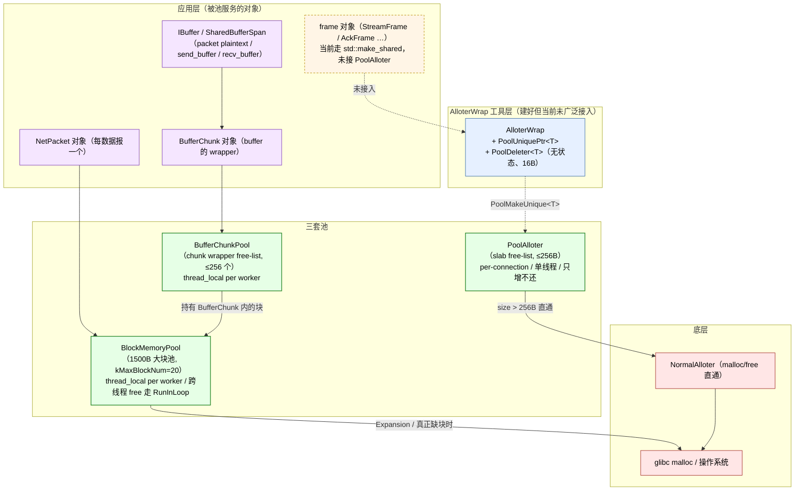

# 内存池设计：三套池、为什么这样分、frame 池的暂缓决策

quicX 的"内存池"在源码里是**三套相互独立的池**，分别解决不同尺寸 / 不同所有权 / 不同热度的分配问题，没有任何一套是"全能池"：

- **`PoolAlloter`**（`src/common/alloter/`）—— 小对象 slab free-list 分配器（≤256B），**per-connection、单线程、连接寿命内只增不还**。设计上为"未来要把 frame 这类小对象池化"留好接口，但 *目前尚未接入产品代码*（决策见 `pool_alloter_frame_optimization.md`）。
- **`BlockMemoryPool`**（`src/common/alloter/pool_block.h`）—— 1500B 大块池，`thread_local` per worker，**真正承担流量**：每个 QUIC 数据报的明文/密文缓冲、每条 stream 的发送缓冲、`NetPacket` 的 `IBuffer`，最终都由它发块。
- **`BufferChunkPool`**（`src/common/buffer/buffer_chunk_pool.h`）—— `BufferChunk` *对象包装*的 thread-local 自由表（受 `BlockMemoryPool` 之上），回收的是 `BufferChunk` 这个 ~80B 的 wrapper 对象（含 `shared_ptr` 控制块本身依然每次分配一次，已是当前路径的最小可达开销）。

本文回答四个问题：

- 三套池各管什么尺寸 / 谁是 owner / 谁是热源，为什么不能合成一套；
- `IAlloter` 接口 + `AlloterWrap` + `PoolUniquePtr<T>` 这一组工具准备好了什么、避免了什么；
- 为什么"小对象 slab"最自然的目标 —— frame —— *目前并没有接* `PoolAlloter`，与 `pool_alloter_frame_optimization.md` 的暂缓决策怎么对上；
- 三套池在跨线程 / 关闭顺序 / 失败模式上的不变量。

阅读时建议打开 `src/common/alloter/`、`src/common/buffer/buffer_chunk_pool.{h,cpp}`、`src/quic/quicx/global_resource.{h,cpp}` 这三处源码。

---

## 1. 三套池总览



四件事看图就明白：

1. **三套池服务的目标尺寸不同**：`PoolAlloter` 锁定 ≤256B 的小对象；`BlockMemoryPool` 锁定 1500B 的大块（紧贴以太网 MTU）；`BufferChunkPool` 回收的是 BufferChunk *wrapper 对象本身*（约 80B 的元数据，块仍由 `BlockMemoryPool` 管）。
2. **生命周期 / 线程性 / 缩容策略各不相同**：`PoolAlloter` 是 per-connection 单线程、连接寿命内只增不还；`BlockMemoryPool` 是 per-worker thread_local、跨线程 free 走 `RunInLoop`、超过 `kMaxBlockNum` 就 `ReleaseHalf` 主动收缩；`BufferChunkPool` 是 thread_local + 256 上限的简单 free list，溢出就直接 `delete`（其内部块顺势归还给 `BlockMemoryPool`）。
3. **`AlloterWrap` 与 `PoolUniquePtr<T>` 是已铺好的"零开销 RAII 桥"**，但产品代码里**还没有把 frame 接上去** —— 这不是疏忽，而是 `pool_alloter_frame_optimization.md` 已经做完的成本/风险评估的结论。
4. **真正承担流量的是 `BlockMemoryPool`**：每个出向 QUIC 数据报、每个入向 NetPacket、每条 stream 的发送/接收缓冲，最终都从它发 1500B 块出去。`PoolAlloter` 设计虽精巧，但在当前栈里更像"留好的位置"。

---

## 2. `IAlloter` 接口与 `AlloterWrap` 工具

源码：`src/common/alloter/if_alloter.h`。`IAlloter` 是分配器抽象（`Malloc / MallocAlign / MallocZero / Free`）；`AlloterWrap` 是面向使用方的便利层。

### 2.1 `IAlloter` 抽象

```cpp
class IAlloter {
public:
    virtual void* Malloc(uint32_t size) = 0;
    virtual void* MallocAlign(uint32_t size) = 0;        // 按 sizeof(unsigned long) 对齐
    virtual void* MallocZero(uint32_t size) = 0;
    virtual void Free(void* &data, uint32_t len = 0) = 0;  // 注意：传引用，Free 后置空
protected:
    uint32_t Align(uint32_t size) { return (size + kAlign - 1) & ~(kAlign - 1); }
};
```

两个细节体现"防误用"思想：

- `Free(void*&)` 传引用：Free 完成后**强制把调用方指针置 nullptr**，杜绝 use-after-free 的最常见来源。
- `Free` 第二参数 `len`：`PoolAlloter` 释放小对象时**必须知道原始 size** 才能定位 free-list bucket（`FreeListIndex(len)`）；`len = 0` 被显式当作"我不知道大小，请走 fallback"处理（直接转给 `NormalAlloter`），避免 `(0 + 7) / 8 - 1` 下溢成 `UINT32_MAX` 导致 vector 越界。

### 2.2 `PoolUniquePtr<T>` —— 零开销 RAII

```cpp
template<typename T>
class PoolDeleter {
    IAlloter* alloter_;          // 一个裸指针，无 atomic refcount
public:
    void operator()(T* p) const noexcept {
        if (!p) return;
        p->~T();
        void* data = static_cast<void*>(p);
        alloter_->Free(data, sizeof(T));   // sizeof(T) 提供 len，Free 自然走 free-list
    }
};

template<typename T>
using PoolUniquePtr = std::unique_ptr<T, PoolDeleter<T>>;
```

`sizeof(PoolUniquePtr<T>)` = 16B（一个 `T*` + 一个 `IAlloter*`）。比 `shared_ptr<T>` 的 16B（指针 + 控制块指针）小一档：**没有控制块、没有 atomic inc/dec**。

### 2.3 已过期的 `PoolNewSharePtr`

`AlloterWrap::PoolNewSharePtr` / `PoolMallocSharePtr` 都标了 `[[deprecated]]`，理由写得很直白：

> The shared_ptr control block is allocated by the default allocator (NOT the pool), completely bypassing pooling.

所以 `PoolNew + PoolDelete` 或 `PoolMakeUnique` 才是热路径正确做法 —— `shared_ptr` 哪怕外层池化，控制块仍然要走 glibc malloc，所谓"池化"被消解大半。

### 2.4 `kAlign` 与对齐的细节

`kAlign = sizeof(unsigned long)`（64-bit Linux 上 8B）。`PoolAlloter` 的 free-list bucket 也是按 `kAlign` 步进切片：

| 平台 | `kAlign` | bucket 数 = `kDefaultMaxBytes / kAlign` |
| :--- | :--- | :--- |
| 64-bit Linux | 8 | 256/8 = 32 |
| 32-bit | 4 | 256/4 = 64 |

`MallocAlign(size)` 内部就是 `Malloc(Align(size))`，把 size 上对齐到 `kAlign` 倍数后再走 free-list。

---

## 3. `PoolAlloter` —— 小对象 slab（已建好、暂未接入）

源码：`src/common/alloter/pool_alloter.{h,cpp}`，约 150 行。算法继承自经典 STL slab allocator（`__gnu_cxx::__pool_alloc` 类似思路）。

### 3.1 数据结构

```cpp
class PoolAlloter : public IAlloter {
private:
    union MemNode {
        MemNode*    next_;     // 在 free 状态下作为链表指针
        uint8_t     data_[1];  // 在使用状态下作为对象首地址
    };

    uint8_t*  pool_start_;                  // 当前未切分的大块的起点
    uint8_t*  pool_end_;                    // 当前未切分的大块的终点
    std::vector<MemNode*>     free_list_;   // 32 桶（@8B 对齐），每桶一个单链表
    std::vector<uint8_t*>     malloc_vec_;  // 历史申请过的所有大块（用于 ~PoolAlloter 一次释放）
    std::shared_ptr<IAlloter> alloter_;     // 后端 = NormalAlloter
};
```

**为什么 `free_list` 是 32 桶**：`kDefaultMaxBytes = 256`、`kAlign = 8`，所以 `[8B, 16B, 24B, …, 256B]` 共 32 个 bucket。`>256B` 的请求**直接转后端 `NormalAlloter`**（`Malloc` / `Free` 都有这条 fallback）—— `PoolAlloter` 只负责 *小* 对象。

### 3.2 三条主路径

**Malloc(size)**：

```text
size > 256B   →  转 NormalAlloter（malloc 直通）
否则          →  bucket = FreeListIndex(size)
                free_list_[bucket] 非空  → 弹首节点，O(1)
                free_list_[bucket] 为空  → ReFill：从大块切 20 个对应尺寸的节点串成新 free-list
```

**Free(data, len)**：

```text
data == nullptr     →  no-op
len == 0 || > 256B  →  转 NormalAlloter（防御 + fallback）
否则                →  bucket = FreeListIndex(len)
                       data 头插到 free_list_[bucket]，O(1)
                       data 置 nullptr（接口契约）
```

**ReFill(size, num=20)** + **ChunkAlloc**：核心切片器。先看当前大块剩余够不够：
- 够切 20 块 → 一次切 20 块；
- 只够切 1~19 块 → 切多少要多少；
- 完全不够 → 把剩余尾段挂到对应 bucket（避免内部碎片浪费），然后向 `NormalAlloter` 申请新的 `20 * size` 字节大块，递归再切。

新申请的大块都登记到 `malloc_vec_`，析构时一次性 `alloter_->Free` 全归还系统。

### 3.3 三个不变量

1. **单线程独占**：`PoolAlloter` *没有任何锁*，文档写明 "intentionally NOT thread-safe"。设计模型是 "one PoolAlloter per Connection"，连接被 framework 钉到单一 I/O 线程上。
2. **只增不还**：连接寿命内 `malloc_vec_` 只增长，`Free` 把节点退回 free-list 但**不归还系统**。这与连接级"用完就丢整片 arena"的语义吻合 —— 连接关闭那一刻 `~PoolAlloter` 把所有大块一把还给 glibc。
3. **`Free` 必须传准确 `len`**：调用方有义务记得对象原始大小（这正是 `PoolDeleter::operator()` 用 `sizeof(T)` 而不是 0 的原因）。

### 3.4 `PoolAlloter` 在产品代码中的接入现状

```text
$ grep -rn MakePoolAlloterPtr src/
src/common/alloter/pool_alloter.h:    std::shared_ptr<IAlloter> MakePoolAlloterPtr();
src/common/alloter/pool_alloter.cpp:  std::shared_ptr<IAlloter> MakePoolAlloterPtr() { ... }
```

**只在自身定义处出现，产品代码 0 处调用**。`PoolUniquePtr` 在产品代码也 0 处使用 —— 工具铺好了，但还没有调用方把 frame 这类小对象拽过来。原因下一节展开。

---

## 4. 为什么 frame 没有走 `PoolAlloter`：暂缓决策摘要

完整决策剧本在 `docs/internal/pool_alloter_frame_optimization.md`（约 250 行）。这里把 *与设计折衷相关* 的结论压缩成一节，避免读者读完本文以为"PoolAlloter 是孤儿"：

| 维度 | 结论 |
| :--- | :--- |
| **技术可行性** | ✅ 可行。`PoolDeleter` / `PoolUniquePtr` / `PoolMakeUnique` 已就位（`if_alloter.h` 内）。 |
| **改造规模** | 全量改造涉及 ~25 文件 / ~2000 行：23 处 `dynamic_pointer_cast<XFrame>` 要改 `dynamic_cast`；`recv_stream::out_order_frame_` / `crypto_stream::out_order_frame_` 的乱序缓存要从 `shared_ptr` 改成 `PoolUniquePtr` 即被迫 move 语义；`packet::frames_list_` / `OnFrames` / `wait_frame_list_` 全链路签名联动。 |
| **真实热度** | 实测发送侧 frame 生命周期 = 单次 `TrySend` 迭代（`packet->SetPayload(frame_visitor->GetBuffer())` 后 packet **不持有 frame**），收益主要来自 shared_ptr 控制块（16~24B）+ atomic inc/dec（ns 级）。在 ACK 密集 / 小包场景有收益，大流量场景占比有限。 |
| **当前阶段优先级** | 互操作 / 稳定性优先于微优化。`ThreadLocalBlockPool` 已覆盖 1500B BufferChunk（流量更大的目标）；frame 池化属"边际改进"。 |
| **决策** | **暂缓**。重启触发条件：perf 火焰图中 `make_shared` 在 frame 栈上占比 >5%，或 50K conn 高 PPS 出现内存抖动。 |
| **若重启** | 推荐 **P0 仅改发送侧临时 frame**（4~5 文件、不动接收侧、不动 `wait_frame_list_`、不动 23 处 `dynamic_pointer_cast`），覆盖 ~70% 收益。 |

> **Take-away**：`PoolAlloter` 不是"被废弃"，而是"被论证过、暂缓接入"。本文与 `pool_alloter_frame_optimization.md` 的分工是 —— 本文讲 *机制*，那篇讲 *决策*。

---

## 5. `BlockMemoryPool` —— 1500B 大块池（真·主力）

源码：`src/common/alloter/pool_block.{h,cpp}` + `src/quic/quicx/global_resource.{h,cpp}`。

### 5.1 形态

```cpp
class BlockMemoryPool : public std::enable_shared_from_this<BlockMemoryPool> {
public:
    BlockMemoryPool(uint32_t large_sz, uint32_t add_num);
    void* PoolLargeMalloc();              // 从 free_mem_vec_ 弹一块；空了 Expansion()
    void PoolLargeFree(void*& m);         // 归还到 free_mem_vec_；超 kMaxBlockNum=20 触发 ReleaseHalf
    void SetEventLoop(std::shared_ptr<IEventLoop> loop);   // 跨线程 free 时回 RunInLoop
    void ReleaseHalf();                   // 主动缩容：释放前 50% 块给 glibc
    void Expansion(uint32_t num = 0);     // 一次申请 add_num 块
private:
    uint32_t large_size_;                 // 1500（每块字节数）
    uint32_t number_large_add_nodes_;     // 4（一次扩容多少块）
    std::vector<void*> free_mem_vec_;
    std::weak_ptr<IEventLoop> event_loop_;
};
```

### 5.2 全局接入：`thread_local` per worker

`global_resource.cpp` 的核心两行：

```cpp
thread_local std::shared_ptr<common::BlockMemoryPool> pool_;
thread_local std::shared_ptr<quic::IPacketAllotor>    packet_allotor_;
```

每个 QUIC worker 线程首次访问时 lazily 创建：

```cpp
return common::MakeBlockMemoryPoolPtr(/*large_sz=*/1500, /*add_num=*/4);
```

**为什么是 1500B**：源码注释写得直白 ——
> 1500B aligns with typical Ethernet MTU and is required by the outbound packet build path: `BaseConnection::TrySend` allocates a BufferChunk from this same pool to serialize the entire encrypted QUIC packet (header + STREAM frame payload up to 1300B + AEAD tag). Shrinking this below ~1350B causes BuildDataPacket to fail once STREAM payload approaches the 1300B cap. Also satisfies RFC9000 minimum datagram size of 1200B.

**为什么 thread_local**：`BlockMemoryPool` 自身的 `free_mem_vec_` 是 `std::vector<void*>`，没有锁。Worker 线程模型（见 `process_model.md`）保证一个连接被钉在一个 worker 上，所以 `Malloc/Free` 在同线程上完成是常态，**0 同步开销**。

### 5.3 跨线程 free 的 fast/slow path

虽然产品路径 99% 都是同线程 free，但**关闭 / migration / 异常路径**可能让最后一个 BufferChunk 引用在另一个线程释放（buffer 持有者不一定与池在同一 worker）。`PoolLargeFree` 做了显式分支：

```cpp
auto loop = event_loop_.lock();
if (loop && !loop->IsInLoopThread()) {
    // Slow path: PostTask 把 free_mem_vec_ 的写串回拥有线程
    auto weak_self = weak_from_this();
    loop->RunInLoop([weak_self, ptr]() mutable {
        auto self = weak_self.lock();
        if (!self) { free(ptr); return; }      // 池已销毁，直接还系统
        self->free_mem_vec_.push_back(ptr);
        if (self->free_mem_vec_.size() > kMaxBlockNum) self->ReleaseHalf();
    });
    m = nullptr;
    return;
}
// Fast path：同线程，直接 push_back，0 同步
free_mem_vec_.push_back(m);
m = nullptr;
if (free_mem_vec_.size() > kMaxBlockNum) ReleaseHalf();
```

设计要点：

- **fast path 0 atomic / 0 lambda**：源码注释专门解释 ——"`RunInLoop` 内部要分配 std::function（潜在 heap）+ 拷贝 weak_ptr（atomic op）+ lambda 内重新 lock shared_ptr（再一次 atomic），全是同线程时的纯开销"。
- **slow path 必经 weak_ptr**：跨线程 free 时池可能正被销毁，`weak_self.lock()` 失败就直接 `free(ptr)` 还系统，避免 use-after-free。

### 5.4 主动缩容：`ReleaseHalf` 与 `kMaxBlockNum=20`

`free_mem_vec_.size() > 20` 时立即 `ReleaseHalf`，把前 50% 块还给 glibc。这避免了"一次大流量后池永远膨胀到峰值不收缩"的问题（标准 `free-list` 池的常见缺陷）。

### 5.5 metrics 钩子

每条 alloc/free 路径都打 4 个指标（见 `design/metrics.md` §11）：`MemPoolAllocatedBlocks` / `MemPoolFreeBlocks`（gauge）+ `MemPoolAllocations` / `MemPoolDeallocations`（counter）。这是池层面**唯一**的可观察性入口，OOM / 抖动调查从此进入。

### 5.6 LSan 抑制：thread_local 的代价

`test/perf/lsan_suppressions.txt` 显式抑制了 `BlockMemoryPool` 的全局/线程本地泄露 —— `thread_local shared_ptr<BlockMemoryPool>` 在线程退出顺序与 LSan 扫描顺序不一致时会被误报。这是与 `ownership_and_memory.md` §13 的"零环引用"承诺相容的：池的内存 **是有归宿的**（线程退出时 `~ThreadLocalFreeList` 串接 `~BlockMemoryPool` 把所有块还系统），只是 LSan 扫不到时序。

---

## 6. `BufferChunkPool` —— `BufferChunk` 包装对象 free-list

源码：`src/common/buffer/buffer_chunk_pool.{h,cpp}`。这层池**不管块**（块由 `BlockMemoryPool` 管），管的是**包装对象**。

### 6.1 为什么需要这层

注释把背景说得很清楚：

> Hot paths (per-packet plaintext buffers in the QUIC decoder) construct a fresh `BufferChunk` for every datagram, which produces ~167K `BufferChunk(pool)` ctor invocations per 50MB download (and a matching number of `shared_ptr` control-block allocations).
> The underlying memory blocks are already pooled by `BlockMemoryPool`, but the BufferChunk *object* itself is freshly allocated each time.

`BufferChunk` 这个 wrapper（约 80B 元数据 —— freeze count、write floor、read/write 指针、pool 指针、`enable_shared_from_this` ctrl 等）以前每个 datagram 都 new + delete 一次。这层池把它的对象生命周期也回收掉。

### 6.2 形态：thread_local + 256 上限的极简自由表

```cpp
thread_local ThreadLocalFreeList tls;   // 单 vector<BufferChunk*>，256 上限

shared_ptr<BufferChunk> Acquire(pool):
    if !tls.empty():  弹尾，复用
    else:             new BufferChunk(pool)（仍走 BlockMemoryPool 取块）
    返回 shared_ptr，custom deleter = Recycle

Recycle(raw):
    if !raw->Valid():           delete raw（块已被 BlockMemoryPool 释放，包装也丢）
    elif tls.size() >= 256:     delete raw（满了不缓存）
    else:                       tls.push_back(raw)（缓存复用）
```

### 6.3 freeze_count 自清的关键依赖

注释一再强调："by the time the deleter fires, every `SharedBufferSpan` that referenced this chunk has already been destroyed, so `freeze_count_` is guaranteed to be 0 ...   No manual reset is required."

这点把 chunk 池"重用对象"的安全性建立在 `BufferChunk` 的另一项契约上 —— `FreezeUpTo/Unfreeze` 在最后一次 unfreeze 自动清状态。否则池回收的旧对象就可能带"脏 freeze 状态"复用，把后续 writer 顶到错误的 floor。

### 6.4 控制块仍然每次分配一次

最后一行注释诚实写出：

> `shared_ptr`'s control block is the only remaining per-call heap allocation in this path; it is unavoidable without a more invasive intrusive_ptr refactor.

也就是说，`BufferChunkPool::Acquire` 路径上的 *最后一次* 堆分配是 `shared_ptr` 的控制块。要消掉，得把 `BufferChunk` 改成 `intrusive_ptr` —— 与 frame 池化一样属于"已论证、暂缓"梯队。

---

## 7. `PoolPacketAllotor` —— `NetPacket` 对象池

源码：`src/quic/udp/pool_pakcet_allotor.{h,cpp}`。这是基于 `BlockMemoryPool` 的更高层包装：

```cpp
PoolPacketAllotor():
    pool_(MakeBlockMemoryPoolPtr(kPacketBufferSize, kPacketPoolBlockCount))
    for i in [0, kPacketPoolSize):
        chunk = make_shared<BufferChunk>(pool_)
        buffer = make_shared<SingleBlockBuffer>(chunk)
        pkt = new NetPacket(); pkt->SetData(buffer)
        packet_queue_.Push(pkt)            // ThreadSafeQueue

Malloc():
    if packet_queue_.Pop(pkt):
        return shared_ptr<NetPacket>(pkt, custom deleter = Free)
    else:
        return NormalPacketAllotor::Malloc()    // 池空了 fallback

Free(pkt):
    if queue_size < kPacketPoolSize:
        pkt->GetData()->Clear()      // 复位 buffer，再入队
        packet_queue_.Push(pkt)
    else:
        delete pkt
```

特点：

- **预分配 N 个 NetPacket 对象**（`kPacketPoolSize` 个）；每个绑定一个 `BufferChunk + SingleBlockBuffer`。这与 `BlockMemoryPool` 的"按需 free-list"策略不同 —— packet 数量是 *上限可控* 的，预分配能把首次分配的尾延迟也压到 0。
- **`ThreadSafeQueue`**：因为 receiver 与 worker 跨线程（一个收包线程发到多个 worker），队列必须是线程安全的（与 `BlockMemoryPool` 单线程独占不同）。
- **池满则 `delete`**：超过 `kPacketPoolSize` 的请求来自异常路径（短期 burst），不让池无限膨胀。

`PoolPacketAllotor` 是 `packet_lifecycle.md` §2.4 提到的 "`PoolPacketAllotor`，底层 chunk 来自 `common::BlockMemoryPool`" 的具体实现。

---

## 8. 三套池的横向对照

| 维度 | `PoolAlloter` | `BlockMemoryPool` | `BufferChunkPool` | `PoolPacketAllotor` |
| :--- | :--- | :--- | :--- | :--- |
| **目标对象** | 任意 ≤256B 小对象 | 1500B 数据块 | `BufferChunk` 包装对象（~80B） | `NetPacket` + 绑定 buffer |
| **分配粒度** | 32 桶 free-list（@8B 步进） | 单一尺寸（1500B） | 单一尺寸（chunk 对象） | 单一尺寸（NetPacket 对象） |
| **Owner 模型** | per-connection（设计） | thread_local per worker | thread_local per thread | 全局 / `ThreadSafeQueue` |
| **线程性** | **不可跨线程**（无锁） | 同线程 free fast path / 跨线程 RunInLoop | 单线程（acquire & deleter 同 thread） | **多线程安全**（队列） |
| **缩容策略** | 不缩容（连接结束一次性还） | `> kMaxBlockNum=20` 触发 `ReleaseHalf` | `> 256` 时直接 `delete`（不缓存） | `> kPacketPoolSize` 时直接 `delete` |
| **失败 / 超尺寸** | `>256B` 转 `NormalAlloter` | `Expansion` 失败记日志、跳过 | 块分配失败 → 返回 `nullptr` | 队列空 → 退到 `NormalPacketAllotor` |
| **接入度** | **0 处产品代码**（仅工具就位） | 高（packet / buffer / send_buffer 都用） | 高（每 packet plaintext 路径） | 高（receiver hot path） |
| **metrics** | 无 | `MemPool*` 系列 4 个 | 无 | 无 |
| **关联设计文档** | 本文 + `pool_alloter_frame_optimization.md` | `packet_lifecycle.md`、`metrics.md` | `packet_lifecycle.md` §2.4 | `packet_lifecycle.md` |

横向看下来，**三套池确实不能合**：

- `PoolAlloter` 和 `BlockMemoryPool` 尺寸量级差 6 倍（256B vs 1500B），且 free-list 策略（多桶 @8B 步进）和 single-size 策略（1500B 唯一）天然互斥。
- `BufferChunkPool` 必须建在 `BlockMemoryPool` *之上*：它管的是"装载块的对象"，本身仍要从 `BlockMemoryPool` 取块。
- `PoolPacketAllotor` 跨线程，与 `BlockMemoryPool` 的 thread_local 模型互补 —— receiver 线程从池取空 packet → worker 线程消费 → 释放时回队列。

---

## 9. 不变量

读懂这些池后再看代码，下面几条贯穿所有路径：

- **`Free(void*&)` 强制置 nullptr** —— 调用方 `Free` 后 *不能* 再用旧指针（接口契约就把脚枪卸了）。
- **`PoolAlloter::Free` 必须传准确 `len`**，否则 `len=0` 走 fallback、`len>256` 也走 fallback —— 永远不会被 free-list 吃错桶。
- **`PoolAlloter` 单线程独占 / 不缩容** —— 配合 "one alloter per Connection" 模型；一旦未来重启 frame 池化，**禁止跨线程共享 alloter 实例**。
- **`BlockMemoryPool` thread_local + 同线程 fast path** —— 跨线程 free 必经 `RunInLoop`，所以 `free_mem_vec_` 这个 `std::vector` 永远不需要锁。
- **`BlockMemoryPool` 主动缩容**（`kMaxBlockNum=20` 时 `ReleaseHalf`）—— 池占用回归与流量曲线相关，不会"一次峰值永远不还"。
- **`BufferChunkPool` 依赖 `BufferChunk` 自动清状态**（最后一次 unfreeze 自清 freeze 计数）—— 池回收的对象不会带脏状态复用。
- **`PoolPacketAllotor` 满则 delete** —— 不允许 burst 让对象池无限膨胀；超量请求自然回落到 `NormalPacketAllotor::Malloc`。
- **`shared_ptr` 控制块永远在 glibc heap** —— 任何"加了池的 shared_ptr"路径，控制块都没池化，这是放弃 `PoolNewSharePtr` / 把 `BufferChunkPool` 注释成"控制块仍每次分配"的根本原因。

---

## 10. 相关设计

- [`packet_lifecycle.md`](packet_lifecycle.md) —— `NetPacket::buffer_` 的来源（`PoolPacketAllotor` + `BlockMemoryPool`），§2.4 与本文 §7 互看。
- [`ownership_and_memory.md`](ownership_and_memory.md) —— LSan 对 `BlockMemoryPool` 的抑制说明（与本文 §5.6 互看）；以及为什么"加了池仍要避免环引用"。
- [`metrics.md`](metrics.md) —— §11 列出 `MemPool*` 四个指标，是 `BlockMemoryPool` 唯一可观察性入口。
- [`process_model.md`](process_model.md) —— 解释为什么 `BlockMemoryPool` 可以做成 `thread_local`：worker 模型 + 连接钉线程。
- [`buffers.md`](buffers.md) —— `BufferChunk` / `IBuffer` / `SharedBufferSpan` 的语义，是 `BufferChunkPool` 服务的对象。
- 内部决策剧本：`docs/internal/pool_alloter_frame_optimization.md` —— `PoolAlloter` 为什么暂未接入 frame、若重启走哪条 P0 路径。

---

## 11. 参考实现 / 文献

- 经典 STL slab 分配器：`__gnu_cxx::__pool_alloc`（GCC libstdc++）—— `PoolAlloter` 的 free-list / chunk-alloc 结构与之同源。
- Bonwick, J. "The Slab Allocator: An Object-Caching Kernel Memory Allocator." USENIX 1994 —— "对象池 + 自由表"思路的奠基论文，与 `BufferChunkPool` 思想一致。
- jemalloc / tcmalloc 的 thread cache 思路 —— `BlockMemoryPool` 的 thread_local + 跨线程 RunInLoop 是简化版本。
- RFC 9000 §14（Datagram Size）—— `BlockMemoryPool` 选 1500B 块的 RFC 依据（最小 1200B + AEAD overhead + IP/UDP 头）。
