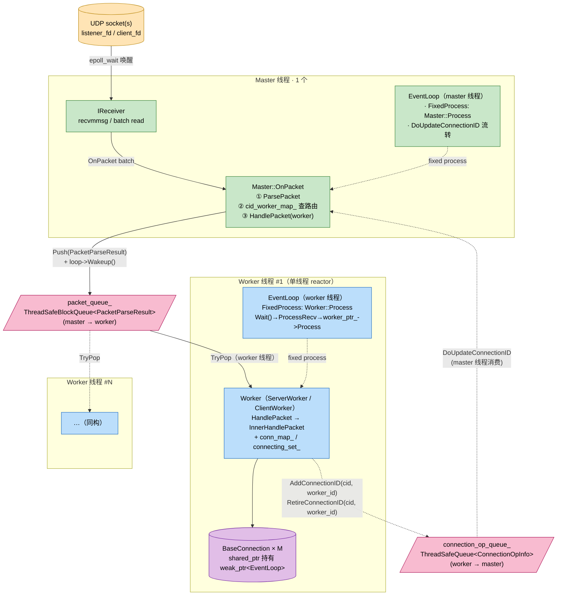

# 进程模型：master + worker、单线程 reactor、为什么不用线程池

quicX 的执行骨架是 **一个 master + N 个 worker**，每个 worker 内部跑单线程 reactor。这是 QUIC 实现里相对常见的选择，但具体落到代码上仍然有几条不那么显然的设计取舍。本文尝试回答以下问题：

- master 与 worker **各自管什么**，为什么不让 worker 自己 `recvfrom`；
- 一个 UDP 数据报从 socket 到 `BaseConnection::OnPackets()` 中间经过哪几层、跨几次线程；
- 既然 worker 都是干活的，为什么**不用线程池**而要把每条连接绑死在一个 worker 上；
- 单线程 + 多线程**两种部署模式**共用同一套类层次时，哪些地方用了 `*_with_thread.h`、哪些地方退化为同线程。

阅读时建议同时打开 `src/quic/quicx/master.h` / `master_with_thread.h` / `worker.h` / `worker_with_thread.h` 五个头文件——它们一共 < 350 行，是整张图最值得花时间的部分。

---

## 1. 总览：一图看清五条线



三色块对应三类角色：

- 🟧 **IO 层**：UDP socket（可能多个：listener、client、connection migration 临时 fd）；
- 🟩 **master 线程**：`Master` + 唯一的 `IReceiver` + 唯一的 `EventLoop`，**只做收包与路由**；
- 🟦 **worker 线程**：N 份，每份持有自己的 `EventLoop` 与 `Worker` 对象（实际类型是 `ServerWorker` 或 `ClientWorker`），**承载所有连接状态机**。

两条粉色管道 `connection_op_queue_` 与 `packet_queue_` 是 master/worker 之间**仅有的**两条跨线程通道——除此之外两侧不直接共享任何可变状态。

---

## 2. master：只做"听 + 分"两件事

### 2.1 master 的职责清单

`src/quic/quicx/master.h`：

```cpp
class Master:
    public IMaster,
    public IPacketReceiver,
    public IConnectionIDNotify,
    public std::enable_shared_from_this<Master> {
    // ...
    void OnPacket(std::shared_ptr<NetPacket>& pkt) override;  // IPacketReceiver

    void AddConnectionID(ConnectionID& cid, const std::string& worker_id) override;
    void RetireConnectionID(ConnectionID& cid, const std::string& worker_id) override;

protected:
    bool ecn_enabled_;
    std::shared_ptr<IReceiver> receiver_;
    std::unordered_map<uint64_t, std::string> cid_worker_map_;       // CID hash → worker
    std::unordered_map<std::string, std::shared_ptr<IWorker>> worker_map_;
};
```

它只承担三件事：

| 职责 | 实现位置 | 关键点 |
| :--- | :--- | :--- |
| 持有 UDP socket、批量收包 | `IReceiver`（封装 `recvmmsg`/`recvfrom`） | 由 `EventLoop::RegisterFd` 挂在 master 自己的 loop 上 |
| 路由（CID → worker） | `Master::OnPacket`（`master.cpp:73-99`） | 哈希查表→分发；查不到时 `rand()` 选一个 worker（仅 Initial 包，见 §2.3） |
| 维护路由表 | `cid_worker_map_` | worker 在收到 NEW_CONNECTION_ID / RETIRE_CONNECTION_ID 时**反向通知** master 更新表 |

### 2.2 路由：`Master::OnPacket` 的 7 行核心逻辑

```cpp
void Master::OnPacket(std::shared_ptr<NetPacket>& pkt) {
    // ...
    PacketParseResult packet_info;
    if (MsgParser::ParsePacket(pkt, packet_info)) {
        auto iter = cid_worker_map_.find(packet_info.cid_.Hash());
        if (iter != cid_worker_map_.end()) {
            worker_map_[iter->second]->HandlePacket(packet_info);   // 已知连接：精确路由
        } else {
            // random pick: 仅命中"陌生 CID"分支（典型为 server 收到 Initial）
            auto it = worker_map_.begin();
            std::advance(it, rand() % worker_map_.size());
            it->second->HandlePacket(packet_info);
        }
    }
}
```

注意 `MsgParser::ParsePacket` 不解密、不解 frame，只剥短/长包头取出 DCID。**完整解密在 worker 内做**——即 master 永不接触加密 keys。这是把 keys 全部留在 worker 的关键约束，§5 会再讨论它的影响。

### 2.3 路由表更新：worker → master 的反向通道

worker 在以下时机需要让 master 把新 CID 加到路由表：

- 服务端首次构造 `ServerConnection` 给客户端发出的 SCID（master 后续就能收到带这个 CID 的包）；
- `NEW_CONNECTION_ID` frame 从对端到达；
- 连接迁移 / preferred_address 等场景。

worker 通过 `IConnectionIDNotify` 接口（`if_worker.h:12-16`）向 master 通知。在多线程模式下，这条调用路径是跨线程的：

```cpp
// master_with_thread.cpp:61
void MasterWithThread::AddConnectionID(ConnectionID& cid, const std::string& worker_id) {
    connection_op_queue_.Push({ADD_CONNECTION_ID, cid, worker_id});  // 入队（无锁竞争域）
    if (auto loop = event_loop_.lock()) loop->Wakeup();              // 唤醒 master
}

// 由 master loop 在 FixedProcess 阶段消费（master 线程）
void MasterWithThread::DoUpdateConnectionID() {
    ConnectionOpInfo op_info;
    while (connection_op_queue_.Pop(op_info)) {
        if (op_info.operation_ == ADD_CONNECTION_ID)
            Master::AddConnectionID(op_info.cid_, op_info.worker_id_);
        else
            Master::RetireConnectionID(op_info.cid_, op_info.worker_id_);
    }
}
```

这意味着 `cid_worker_map_` **从不被多线程并发读写**——只有 master 线程读它（`OnPacket`）也只有 master 线程写它（`DoUpdateConnectionID`）。worker 侧完全不直接接触这张表，只能通过 `connection_op_queue_` 间接更新。

---

## 3. worker：单线程 reactor + 全部连接状态

### 3.1 类层次

```text
         IWorker (if_worker.h)                common::Thread (common/thread/thread.h)
            │                                          │
            ▼                                          │
         Worker (worker.h)         ┌────────  WorkerWithThread (worker_with_thread.h) ────┐
            │   ↑ 持有                                                                   │
            │   └─────────────── 持有 worker_ptr_ ────────────────────────────────────────┘
            ├── ServerWorker (worker_server.h) —— Retry / IP rate limiter / handshake watchdog
            └── ClientWorker (worker_client.h) —— version negotiation / connect timeout
```

`Worker` 是真正持有连接的"业务核心"，`WorkerWithThread` 只是把它**包进一个独立线程 + EventLoop** 的薄壳。在单线程模式下根本不构造 `WorkerWithThread`，`Worker` 直接挂在 master 的 EventLoop 上跑（见 §4）。

### 3.2 worker 的核心成员

`worker.h:62-85`：

```cpp
bool do_send_;
bool ecn_enabled_;
bool enable_key_update_;
uint32_t quic_version_;
std::string worker_id_;

std::shared_ptr<ISender> sender_;
std::shared_ptr<TLSCtx> ctx_;

common::DoubleBuffer<std::shared_ptr<IConnection>> active_send_connections_;
std::unordered_set<std::shared_ptr<IConnection>> connecting_set_;
std::unordered_map<uint64_t, std::shared_ptr<IConnection>> conn_map_;

connection_state_callback connection_handler_;
std::weak_ptr<common::IEventLoop> event_loop_;     // observer，不持有
RegisterSocketCallback register_socket_cb_;
```

关键点：

- **`conn_map_` 是 worker 私有**，按 CID hash 索引连接；只有当前 worker 线程访问。
- **`active_send_connections_` 用 double buffer**：一个 buffer 当前帧"待发送 conn"，另一个 buffer 给"产生新发送需求的 conn"挂钩——`Worker::Process()` 在每轮 EventLoop 收尾时 swap 两块缓冲区，避免在遍历 send 列表时再次插入造成 invalidation。
- **`event_loop_` 用 `weak_ptr`**：所有权属于 `QuicClient` / `QuicServer`，worker 只是 observer。这一选择与 `BaseConnection::event_loop_` 同因——见 [`ownership_and_memory.md`](ownership_and_memory.md)。

### 3.3 worker 的主循环（多线程模式）

`worker_with_thread.cpp:38-56`：

```cpp
void WorkerWithThread::Run() {
    auto loop = event_loop_.lock();
    if (!loop || !loop->Init()) {
        ready_promise_.set_value(false); return;
    }
    ready_promise_.set_value(true);          // 唤醒主线程：worker 已就绪

    while (!Thread::IsStop()) {
        loop->Wait();                        // ① epoll_wait（带最近一个定时器的 deadline）
        ProcessRecv();                       // ② 把 packet_queue_ 里的包喂给 worker_ptr_->HandlePacket
        if (worker_ptr_) worker_ptr_->Process();  // ③ 触发 worker 的 ProcessSend / 心跳
    }
}
```

`Wait()` 一次循环里**做三件事**（`event_loop.h:30`）：

1. 跑到期定时器；
2. `epoll_wait` 至下一定时器 deadline；
3. dispatch IO 回调 + drain `PostTask` 队列。

`ProcessRecv` 只是一个 `TryPop`（**单次**，非循环 drain）：

```cpp
// worker_with_thread.cpp:71
void WorkerWithThread::ProcessRecv() {
    PacketParseResult packet_info;
    if (packet_queue_.TryPop(packet_info)) {
        worker_ptr_->HandlePacket(packet_info);
    }
}
```

为什么不循环 drain？因为如果连续来 1 万个包就会饿死定时器。每轮 loop 只取一个，下一轮再取——`HandlePacket` 进队时调了 `loop->Wakeup()`，所以队列不空时 epoll_wait 几乎立即返回，吞吐没有损失。

### 3.4 入口排队：`packet_queue_`

`worker_with_thread.h:45`：

```cpp
common::ThreadSafeBlockQueue<PacketParseResult> packet_queue_;
```

`ThreadSafeBlockQueue`（`common/structure/thread_safe_block_queue.h`）就是 mutex + std::queue + condition_variable 的最朴素实现。Push/Pop 路径都是 O(1)，但每次都要 lock。这里没有用 lock-free MPSC ring buffer，是有意的：

- **生产者只有一个**（master 线程），消费者也只有一个（worker 线程）——SPSC 场景；
- 但即便在 SPSC 下，使用 mutex 的吞吐也已经 > 10⁶ 包/秒，远高于真实 QUIC 包率（万级到十万级）；
- 节约的复杂度（不需要写 lock-free 代码、不需要处理 ABA）远比省下的几百 ns 重要。

文档的初衷是"学习参考实现"——当你在性能场景下需要把这里换成 SPSC ring buffer 时，**接口边界是清晰的**：只需要替换 `packet_queue_` 的实现类型即可，`HandlePacket` / `ProcessRecv` 调用点都不变。

---

## 4. 单线程 vs 多线程：同一套类的两种部署

quicX 同时支持两种部署模式：

| 模式 | master 类 | worker 类 | EventLoop 数 | 线程数 |
| :--- | :--- | :--- | :--- | :--- |
| 单线程 | `Master` | `Worker`（直接，不裹 `WorkerWithThread`） | 1 | 1 |
| 多线程 | `MasterWithThread` | `WorkerWithThread` 包 `Worker` | N+1 | N+1 |

### 4.1 单线程模式

master 与 worker 共享同一个 EventLoop。worker 通过 `event_loop_->AddFixedProcess(shared_from_this(), Worker::Process)` 挂为定时回调。`Master::OnPacket` 解出 `PacketParseResult` 后**直接同步调用** `worker->HandlePacket(...)`——根本不进 `packet_queue_`。

这种模式下完全没有跨线程通道，但所有 work 串行：UDP recv、解包、HandlePacket、connection 状态机、加密、发包都在同一线程。**它的最大价值是简化生命周期**——`event_loop_` weak_ptr 锁不到的窗口几乎不存在，单元测试与本机 example 可以专注业务逻辑。

### 4.2 多线程模式

master 与每个 worker 各自跑一个 `Thread + EventLoop`。`Master::OnPacket` 解出包后调用的是 `WorkerWithThread::HandlePacket`：

```cpp
// worker_with_thread.cpp:31
void WorkerWithThread::HandlePacket(PacketParseResult& packet_info) {
    packet_queue_.Emplace(std::move(packet_info));   // 跨线程入队
    if (auto loop = event_loop_.lock()) loop->Wakeup(); // 唤醒目标 worker
}
```

注意这里 `WorkerWithThread` 既是 `Thread` 也是 `IWorker`：master 看到的"worker"实际是它，业务核心 `Worker` 被它持有。`Master::OnPacket` 不需要知道当前是单线程还是多线程，分发时调用的都是 `IWorker::HandlePacket`——多线程模式由 `WorkerWithThread` 的覆盖把它转为入队 + Wakeup。

`Master` 自己也有同样结构：`MasterWithThread` 继承 `Master + Thread`，把 `Master::Process` 也挂成 FixedProcess 在自己的线程跑。`master_with_thread.cpp:37`：

```cpp
loop->AddFixedProcess(shared_from_this(),
                      std::bind(&MasterWithThread::Process, this));
```

### 4.3 选择哪种模式

`QuicClient` / `QuicServer` 构造时根据 `QuicConfig::worker_thread_count` 决定：

- `worker_thread_count == 0`（默认）→ 单线程模式（master 与唯一的 worker 共享 EventLoop）；
- `worker_thread_count >= 1` → 多线程模式（master + N 个独立 worker 线程）。

---

## 5. 为什么不用线程池？

这一节回答的是：**既然有 N 个 worker 线程，为什么不简单地把每个数据包丢进一个工作池抢？**

### 5.1 连接亲缘绑定（thread affinity）

QUIC 连接是有状态的——一条连接拥有：

- TLS 握手状态机 + 加密 keys（4 个 packet number space × 2 方向）；
- 拥塞控制状态（cwnd / pacing / RTT 估计）；
- 流量控制窗口（per-stream + connection-level）；
- 一组定时器（idle / loss detection / PTO / handshake watchdog）；
- 数十条 stream 的收/发缓冲与排序队列。

如果两个数据包进了不同 worker，则要么所有以上状态全用锁保护（QUIC 高频事件下锁竞争极重），要么必须有跨线程的状态同步协议（复杂度爆炸）。

quicX 选择**第三条路**：CID hash → 固定 worker。一条连接一旦在某个 worker 上建立，就**永远只在那个 worker 上处理**。这条 thread affinity 由 `cid_worker_map_` 强制保证：master 路由后包一定落到曾经登记过这个 CID 的 worker。

### 5.2 worker 内单线程 reactor 的好处

绑定到单线程后：

- **无锁化**：worker 内所有 `Worker::conn_map_` / 每条 `BaseConnection` / 每条 `Stream` 都是单线程访问，整个 worker 内**没有一把 mutex**（除了入口的 `packet_queue_`）；
- **状态推进顺序确定**：A 包先到、B 包后到，那么 A 触发的 cwnd 更新一定先于 B 看到的 cwnd；这对 loss recovery / pacer 这类**对事件顺序敏感**的算法是天然保护；
- **EventLoop 的 `AssertInLoopThread()` 守住边界**：在 worker 内调用 `EventLoop::AddTimer` / `RegisterFd` 等会断言当前线程是 loop 线程，任何错误调用直接 abort，bug 暴露在第一现场（见 `if_worker.h:50-57` Shutdown 段的注释）。

### 5.3 线程池的代价

如果改成线程池，QUIC 实现会被迫做以下其中之一：

- 给每条连接加大锁——高频包路径下锁竞争 + cache line bouncing 会让吞吐下降 5×；
- 给每个状态字段加细粒度锁——复杂度爆炸，几乎不可能不出 race；
- 给每条连接维持"事件队列 + worker 抢占"——这等价于每条连接退化为单线程，但管理开销更高。

工业实现里 NGINX、HAProxy、msquic、quiche 全都是 **CID 亲缘 + 单线程 reactor**，原因相同。

### 5.4 代价：负载不均

亲缘绑定的代价是 **N 个 worker 之间负载可能不均**——CID 哈希分布近似随机但样本小时方差大。当某些连接是大流量长连接（音视频流）时尤其明显。

quicX 当前用的是 `cid.Hash() → worker_id` 直接哈希到字符串，没有做带权再均衡。在学习实现里这是合理的简化；生产实现会做的是**连接迁移触发 worker 切换 + master 维护 per-worker load 计数**——这部分 quicX 留给将来扩展（无 TODO 也无 FIXME，只是边界开放）。

---

## 6. 端到端走查：一条 UDP 报文从 socket 到 frame

以**多线程服务端**模式为例，跟踪一条携带 STREAM frame 的 1-RTT 包：

```text
① master 线程 · UDP socket 可读
   epoll_wait 唤醒 → IReceiver::ReceiveBatch(recvmmsg) 取出 N 个 NetPacket
   ↓
② Master::OnPacket(pkt)（每包一次）
   · ParsePacket：剥包头取 DCID
   · cid_worker_map_.find(DCID.Hash()) → "worker_id_3"
   · worker_map_["worker_id_3"]->HandlePacket(packet_info)
       ↑ 这里实际类型是 WorkerWithThread
   ↓
③ WorkerWithThread::HandlePacket（master 线程仍在执行）
   · packet_queue_.Emplace(std::move(packet_info))    [跨线程入队]
   · loop->Wakeup()                                    [pipe write 唤醒 worker]
   ↓
   ━━━━━━━━━━━━━━━ 线程切换：master → worker #3 ━━━━━━━━━━━━━━━
   ↓
④ Worker 线程 · EventLoop::Wait 返回
   ↓
⑤ WorkerWithThread::ProcessRecv
   · packet_queue_.TryPop(packet_info)
   · worker_ptr_->HandlePacket(packet_info)
       ↑ 这里实际类型是 ServerWorker（继承 Worker）
   ↓
⑥ Worker::HandlePacket → ServerWorker::InnerHandlePacket
   · conn_map_.find(DCID.Hash()) → BaseConnection*
   · conn->OnPackets(...)
   ↓
⑦ BaseConnection 内部分发
   （后续路径详见 packet_lifecycle.md / connection_anatomy.md §5）
   · DecryptPacket → FrameProcessor → StreamManager → 触发 SendControl::OnPacketAcked / OnPacketSent ...
   · 任何想发回的数据通过 active_send_connections_ 登记
   ↓
⑧ Worker::Process（同一轮 loop 收尾时执行）
   · double buffer swap
   · 遍历 active 连接 → conn->BuildPackets() → sender_->Send(...)
   ↓
⑨ sender_->Send 把 datagram 写回 UDP socket
   （注意 sender_ 是共享的，多 worker 并发写同一 socket 由内核保证原子性）
```

整个路径只有 ②→③ 与 ⑨ 是**真正的跨线程点**：前者是 master→worker 单向投递，后者是多 worker 同时调用一个 sender 写 socket。worker 内部从 ⑤ 到 ⑧ 全部串行单线程，无锁。

---

## 7. 不变量

写代码 / 读代码 / 改代码时永远成立的事实：

1. **`cid_worker_map_` 只在 master 线程读写**——worker 必须通过 `connection_op_queue_` 间接更新它，绝不能直接持有 `Master*` 指针调 `AddConnectionID`。
2. **每条连接终身绑定一个 worker**——CID 路由表只追加 / 删除条目，不"迁移"条目（连接迁移在 QUIC 协议层是地址迁移，不是 worker 迁移）。
3. **worker 内无锁** —— `Worker::conn_map_` / `BaseConnection` / `Stream` 三层都假设单线程访问。任何想从 worker 外触达连接状态的代码必须走 `EventLoop::PostTask`。
4. **EventLoop 的所有权属于宿主**——`QuicClient` / `QuicServer` 创建并独占 `shared_ptr<IEventLoop>`，master/worker/connection/stream 全用 `weak_ptr` 引用。这避免循环引用。
5. **入口队列只有一个**——`packet_queue_`。除了它，master 与 worker 不共享任何可变状态。`connection_op_queue_` 是反方向的小通道，承载的不是热数据。
6. **master 永不接触加密 keys**——它只剥包头取 CID。任何解密路径必须在 worker 内完成。

---

## 8. 关联文档

- [`packet_lifecycle.md`](packet_lifecycle.md) —— 第 ⑦ 步进入 `BaseConnection::OnPackets()` 之后的路径。
- [`connection_anatomy.md`](connection_anatomy.md) —— worker 持有的 `BaseConnection` 子树结构。
- [`ownership_and_memory.md`](ownership_and_memory.md) —— 为什么 `Worker::event_loop_` 用 `weak_ptr`、为什么 `Worker::Shutdown()` 必须在 join 后调用。
- [`timer_design.md`](timer_design.md) —— `EventLoop::Wait` 内部用的双层定时器机制。
- [`metrics.md`](metrics.md) —— per-worker 队列深度 / 包率指标怎么暴露。

---

## 9. 关联 RFC

进程模型本身不属于 RFC 9000 范围——QUIC 协议**不规定**实现的并发模型。但以下条款会影响这里的设计：

- **RFC 9000 §5.1** Connection ID：`cid_worker_map_` 路由表的合法性来源；
- **RFC 9000 §5.2** Matching Packets to Connections：Initial 包用 server-chosen DCID 之前需要一次"陌生 CID"分发，对应 §2.2 的 random pick 分支；
- **RFC 9000 §9** Connection Migration：地址迁移期间 CID 不变，所以 worker 不需要迁移；这正是亲缘绑定能与 migration 共存的关键。
