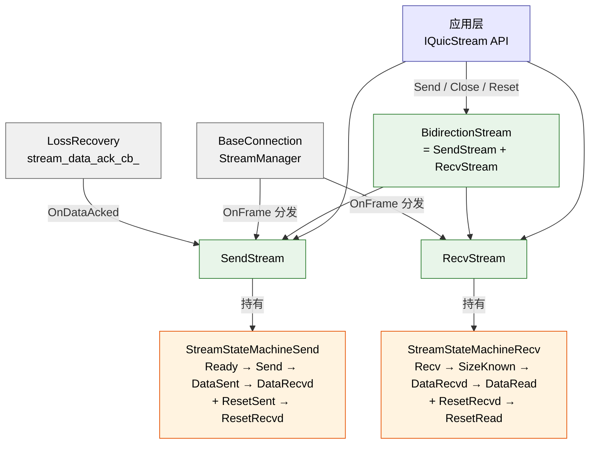

# Stream 双状态机设计（RFC 9000 §3）

> **本文定位**：把 quicX 的 stream 状态机从 RFC 9000 §3 的"两张图加一堆 SHOULD/MUST"翻译成代码读者能直接对照源码的"一表一图一段"。重点回答四件事：
>
> 1. 为什么 quicX 要把一条双向 stream 拆成 **两个独立状态机**（`StreamStateMachineSend` + `StreamStateMachineRecv`），而不是合一张大图？
> 2. 收到 / 发出每一类 frame，**哪些状态接受、哪些拒绝、转到哪**？为什么 `OnFrame()` 与 `CheckCanSendFrame()` 是**两个**方法而不是一个？
> 3. **终态闭合**条件：发送侧"全部 ACK 才到 Data Recvd"、接收侧"App 读完才到 Data Read"——`BidirectionStream::CheckStreamClose()` 是怎么把两侧扣在一起的？什么 race 会让 stream 永远不释放？
> 4. **stream id 编码**为什么把 starter / direction 直接打进低两位？peek vs next 的取数差异？
>
> 与本仓既有文档的分工：
>
> - 本文 = stream 内部状态转移 + frame 接受/拒绝矩阵 + 双侧闭合（**机制**）。
> - [`connection_anatomy.md`](connection_anatomy.md) §B-3 = stream 在 connection 内部的归属与生命周期管线（**集成**）。
> - [`loss_recovery.md`](loss_recovery.md) §3 = `OnDataAcked` 的 selective range 算法与 PN 迁移（**ACK 回流**）。
> - [`ownership_and_memory.md`](ownership_and_memory.md) §5 = stream 回调的 weak_self 模式（**生命周期安全**）。
> - [`process_model.md`](process_model.md) = 跨线程 `Send` / `Close` / `Reset` 的 `RunInLoop` 转入路径（**线程模型**）。

---

## 1. 总览：为什么是"双状态机"

RFC 9000 §3.1 / §3.2 把 sending stream 和 receiving stream 各画了一张状态图——故意分开的。原因有二：

1. **单向 stream 物理上只有一侧**。客户端发起的 `0x02` (client unidirectional) 只有 send 侧；服务端发起的 `0x03` 只有 recv 侧。一张合并的大图会有半边永远进不去。
2. **双向 stream 的两侧 race 独立**：发送侧到 *Data Sent* 等所有 ACK 时，接收侧可能还在 *Recv* 等数据；接收侧已经 *Data Read* 时，发送侧可能还卡在 cwnd 限制下重传。两侧的转移条件、触发事件、终态时机互不耦合，强行合一只会增加无效转移。

quicX 直接照抄这个分割：

```
src/quic/stream/
  if_state_machine.h          ← IStreamStateMachine 接口（OnFrame / CheckCanSendFrame）
  state_machine_send.{h,cpp}  ← StreamStateMachineSend（5 态 + AllAckDone）
  state_machine_recv.{h,cpp}  ← StreamStateMachineRecv（6 态 + RecvAllData / AppReadAllData）
  if_stream.h                 ← IStream（带 frames_list_ + active_send_cb_）
  send_stream.{h,cpp}         ← SendStream     —— 持有 send_machine_
  recv_stream.{h,cpp}         ← RecvStream     —— 持有 recv_machine_
  bidirection_stream.{h,cpp}  ← BidirectionStream（多重继承 SendStream + RecvStream）
  stream_id_generator.{h,cpp} ← stream id 编码
  type.h                      ← StreamState 枚举（位掩码型）
```

层次结构：



**关键判断**：BidirectionStream **不是** "另一个状态机"——它只是把 SendStream 和 RecvStream 多重继承在一起，状态转移仍然各管各的；唯一新增的是 `CheckStreamClose()` 这把"逻辑与"的闭合钩子（§4）。

---

## 2. 接口契约：`IStreamStateMachine`

### 2.1 两个方法，泾渭分明

```cpp
class IStreamStateMachine {
public:
    // 处理一个已经决定要发出 / 已经收到的 frame，返回 false 表示当前态拒绝该 frame
    virtual bool OnFrame(uint16_t frame_type) = 0;

    // 询问当前态是否允许"现在就发"这种 frame，不改状态
    virtual bool CheckCanSendFrame(uint16_t frame_type) = 0;

    StreamState GetStatus() { return state_; }
    void SetStateChangeCB(StateChangeCB cb, uint64_t stream_id);  // qlog 钩子
};
```

为什么是**两个**方法、不是一个？

| 场景 | 调用 |
| :--- | :--- |
| 应用 `Send()` 之前 | `CheckCanSendFrame(kStream)` —— 只问能不能写，不能就直接 `return -1`，**不能改状态** |
| `TrySendData()` 真正把 frame 喂给 visitor 之后 | `OnFrame(frame_type)` —— frame 已经压进 packet buffer，状态机要登记"已经发了" |
| `OnFrame()` 在收侧（peer 来包） | `OnFrame(frame_type)` —— 包已经收进来，状态机判定"接受"或拒绝，但不能"先 ack 后再决定" |

混在一起会出 bug：早期版本曾经在 `Send` 入口就 `OnFrame`，结果 packet 编码失败（`kInsufficientSpace`）后状态机已经从 `Ready` 走到 `Send`，retry 时 `CheckCanSendFrame` 看到 `kSend` 仍允许，**逻辑没事**——但 `kDataSent` 之后 retry 就误以为已经发了 FIN。修法是：**先编码成功，再 `OnFrame`**——`send_stream.cpp:409-424` 是这个顺序。

### 2.2 状态枚举（位掩码型）

```cpp
// type.h
enum class StreamState: uint16_t {
    kUnknown     = 0,
    // sending stream states
    kReady       = 0x0001,
    kSend        = 0x0002,
    kDataSent    = 0x0004,
    kResetSent   = 0x0008,
    // receiving stream states
    kRecv        = 0x0010,
    kSizeKnown   = 0x0020,
    kDataRead    = 0x0040,
    kResetRead   = 0x0080,
    // common termination states
    kDataRecvd   = 0x0100,
    kResetRecvd  = 0x0200,
};
```

设计点：

- **位掩码而非顺序枚举**：方便 qlog 输出"位与"判定（"是不是任意一个终态"），也方便未来扩展 `state & TerminalMask`。
- **`kDataRecvd` / `kResetRecvd` 跨两侧共用**：发送侧到 *Data Recvd*（"我发的全被 ACK 了"）和接收侧到 *Reset Recvd*（"我收到对端的 RESET"），用同一个枚举值——因为它们语义是"该方向已终结"，且代码里**永远**通过 `send_machine_->GetStatus()` 或 `recv_machine_->GetStatus()` 显式区分上下文，不会混。
- **`kUnknown = 0`**：兼容默认构造，但实际使用前两个状态机都会被显式构造为 `kReady` / `kRecv`（见 `state_machine_send.h:50` / `state_machine_recv.h:47`）。

### 2.3 qlog 钩子

```cpp
void SetStateChangeCB(StateChangeCB cb, uint64_t stream_id) {
    state_change_cb_ = cb;
    stream_id_ = stream_id;
}
protected:
void NotifyStateChange(StreamState old_state, StreamState new_state) {
    if (state_change_cb_ && old_state != new_state) {
        state_change_cb_(stream_id_, old_state, new_state);
    }
}
```

每个状态转移点都成对调用 `state_ = new_state; NotifyStateChange(old_state, state_);`——这就是 qlog `transport:stream_state_updated` 事件的源头。**关键纪律**：转移成功才 Notify，失败（默认分支 `LOG_ERROR`）不 Notify，避免 qlog 出现"状态没变也广播"的脏事件。

---

## 3. 发送侧状态机（RFC 9000 §3.1）

### 3.1 状态图

```
       ┌─────────┐
       │  Ready  │ ← 构造时初始态
       └────┬────┘
            │
   ┌────────┼─────────────────────┐
   │ STREAM │ STREAM_DATA_BLOCKED │ RESET_STREAM
   │  (没    │                     │
   │   FIN)  │                     │
   ▼        ▼                      ▼
┌────────┐               ┌─────────────┐
│  Send  │ ── RESET ──→  │ Reset Sent  │
└────────┘               └──────┬──────┘
   │                            │
   │ STREAM + FIN               │ AllAckDone
   ▼                            ▼
┌──────────┐              ┌─────────────┐
│ DataSent │              │ Reset Recvd │
└────┬─────┘              └─────────────┘
     │ AllAckDone
     ▼
┌──────────┐
│ DataRecvd│  ← 终态：所有发出的 byte + FIN 都被 ACK
└──────────┘
```

### 3.2 `OnFrame()` 转移表（`state_machine_send.cpp:16-65`）

| 当前态 | 触发 frame | 目标态 | 备注 |
| :--- | :--- | :--- | :--- |
| `Ready` | `STREAM` (无 FIN) | `Send` | |
| `Ready` | `STREAM` + FIN | `DataSent` | RFC 9000 §3.1 允许 *Ready → Data Sent* 一步到位 |
| `Ready` | `STREAM_DATA_BLOCKED` | `Send` | 算"开始发数据" |
| `Ready` | `RESET_STREAM` | `ResetSent` | |
| `Send` | `STREAM` (无 FIN) | `Send` (自环) | |
| `Send` | `STREAM` + FIN | `DataSent` | |
| `Send` | `RESET_STREAM` | `ResetSent` | |
| `DataSent` | `RESET_STREAM` | `ResetSent` | RFC 9000 §3.5：`STOP_SENDING` 触发的 reset 在 *DataSent* 可以**延迟**（见 §3.4） |
| 其他 | 任意 | `LOG_ERROR` | |

### 3.3 `CheckCanSendFrame()` 矩阵（`state_machine_send.cpp:67-80`）

```cpp
bool CheckCanSendFrame(uint16_t frame_type) {
    // RFC 9000 §3.3：任何 frame 都不能从终态发出
    if (state_ == kResetRecvd || state_ == kDataRecvd) return false;

    // RFC 9000 §3.1：在 ResetSent 或 DataSent，不能再发 STREAM / STREAM_DATA_BLOCKED
    if (IsStreamFrame(frame_type) || frame_type == kStreamDataBlocked) {
        return state_ != kResetSent && state_ != kDataSent;
    }

    return true;
}
```

注意 `RESET_STREAM` **不在被禁列表**：从 `DataSent` 转 `ResetSent` 是合法的（§3.4）。

### 3.4 `AllAckDone()`：终态闭合（`state_machine_send.cpp:82-98`）

```cpp
bool AllAckDone() {
    switch (state_) {
        case kDataSent:  state_ = kDataRecvd;  break;
        case kResetSent: state_ = kResetRecvd; break;
        default: return false;  // 其他态不允许 AllAckDone
    }
    return true;
}
```

**真正驱动这次转移的不是状态机自己，而是 `SendStream::OnDataAcked` → `CheckAllDataAcked()`**：

```cpp
// send_stream.cpp:562
void CheckAllDataAcked() {
    // 两个闭合条件缺一不可：
    if (fin_sent_ && acked_offset_ >= send_data_offset_) {
        send_machine_->AllAckDone();   // ← 触发 DataSent → DataRecvd
    }
}
```

- `fin_sent_`：FIN 已经写到 wire（在 §4.1 ack 路径或 §4.2 send 路径任一处置位）；
- `acked_offset_ >= send_data_offset_`：连续 ACK 前缀覆盖到了发送水位线。

### 3.5 selective ACK 与"伪终态"

`acked_ranges_` 是 `std::map<offset, end>` 的 disjoint interval set——**不能**降级成单一高水位。理由：aioquic 风格的 peer 可能 ACK `(5MB, FIN)` 这个包，但其实前面还缺一段；如果只看 high-water mark，会错误地判定"全部到达"，停止重传，连接挂死直到 idle_timeout。

完整算法（`send_stream.cpp:504-560`）：

1. 把新 ACK range `[start, start+length)` 插入 map，**合并**任何相邻或重叠的旧 range；
2. 重算 `acked_offset_` = 第一个 range 的 end（**前提**：该 range 起点为 0）；
3. 单独跟踪 `fin_sent_`（ACK 路径和原始 send 路径都置位，幂等）；
4. 触发 `CheckAllDataAcked()`。

> 详细的 PN 迁移（重传时如何把 `stream_data` 从旧 PN 搬到新 PN，避免 retransmit 后 ACK 不回流）见 [`loss_recovery.md`](loss_recovery.md) §3.

### 3.6 `STOP_SENDING` 的特例处理

`OnStopSendingFrame`（`send_stream.cpp:476-502`）有一段非常重要的 RFC 9000 §3.5 兑现：

```cpp
auto current_state = send_machine_->GetStatus();
if (current_state == kReady || current_state == kSend) {
    // MUST send RESET_STREAM in Ready or Send state
    SendStream::Reset(err);
}
// In Data Sent state: defer RESET_STREAM (RFC 9000 allows this)
// 已经发 FIN 了；某些实现（如 quic-go）会把后到的 RESET_STREAM 解读为
// "请求被取消"，停发响应。我们故意不发。
```

这条注释里那句 "*some implementations interpret it as 'request cancelled' and stop sending the response*" 是 HTTP/3 互操作 testbed 上踩出来的实战教训——如果不做这层判断，HTTP/3 客户端发完 FIN 后调 `Cancel`，server 收到 RESET_STREAM 立刻丢响应，整段 5MB 文件传输会丢一半。

---

## 4. 接收侧状态机（RFC 9000 §3.2）

### 4.1 状态图

```
       ┌─────────┐
       │  Recv   │ ← 构造时初始态
       └────┬────┘
            │
   ┌────────┼──────────────┐
   │ STREAM │ RESET_STREAM │
   │ + FIN  │              │
   ▼        ▼              ▼
┌────────────┐       ┌─────────────┐
│ SizeKnown  │──RST──│ Reset Recvd │
└─────┬──────┘       └──────┬──────┘
      │                     │
      │ RecvAllData         │ AppReadAllData
      ▼                     ▼
┌──────────┐         ┌─────────────┐
│ DataRecvd│         │ Reset Read  │ ← 终态
└─────┬────┘         └─────────────┘
      │ AppReadAllData
      ▼
┌──────────┐
│ DataRead │ ← 终态
└──────────┘
```

### 4.2 `OnFrame()` 转移表（`state_machine_recv.cpp:16-74`）

| 当前态 | 触发 frame | 目标态 | 备注 |
| :--- | :--- | :--- | :--- |
| `Recv` | `STREAM` (无 FIN) | `Recv` | 自环，仅返回 true |
| `Recv` | `STREAM` + FIN | `SizeKnown` | |
| `Recv` | `STREAM_DATA_BLOCKED` | `Recv` | 自环 |
| `Recv` | `RESET_STREAM` | `ResetRecvd` | `is_reset_received_ = true` 副作用 |
| `SizeKnown` | `STREAM` | `SizeKnown` | 接受补缺数据 |
| `SizeKnown` | `STREAM_DATA_BLOCKED` | `SizeKnown` | |
| `SizeKnown` | `RESET_STREAM` | `ResetRecvd` | |
| `ResetRecvd` | `STREAM` | `ResetRecvd` | RFC 9000 §3.2 optional：reset 后还能接受 stream 帧（用于 final_size 校验） |
| `DataRecvd` / `DataRead` | `STREAM` / `RESET_STREAM` | 自环 | RFC 9000 §4.5：终态仍要校验 final_size |

### 4.3 `CheckCanSendFrame()`（`state_machine_recv.cpp:76-87`）

接收侧能"发"的只有两种 frame——窗口更新 / 主动止血：

```cpp
if (frame_type == kMaxStreamData) {
    // RFC 9000 §3.2：仅在 Recv / SizeKnown 发
    return state_ == kRecv || state_ == kSizeKnown;
}
if (frame_type == kStopSending) {
    // RFC 9000 §3.2：除 ResetRecvd / ResetRead 外都可发
    return state_ != kResetRead && state_ != kResetRecvd;
}
return false;
```

### 4.4 双阶段终态：`RecvAllData()` + `AppReadAllData()`

接收侧 RFC 9000 把"数据收齐"和"应用读完"故意分成两个状态：

| 阶段 | 触发 | 转移 |
| :--- | :--- | :--- |
| `SizeKnown → DataRecvd` | `RecvAllData()`：`final_offset_ != 0 && except_offset_ == final_offset_` | 由 `RecvStream::OnStreamFrame` 在写 buffer 后自动检查 |
| `DataRecvd → DataRead` | `AppReadAllData()`：`recv_cb_` 被触发**且**返回成功 | `recv_machine_->CanAppReadAllData()` 守卫，幂等 |
| `SizeKnown / Recv → ResetRecvd` | 收到 `RESET_STREAM` | 自动 |
| `ResetRecvd → ResetRead` | 应用层确认（也是 `AppReadAllData()`）| 终态 |

**`is_reset_received_` 的角色**（`state_machine_recv.h:65`）：当 `RecvAllData()` 在 `SizeKnown` 触发时，如果**之前**已经收过 `RESET_STREAM`（但当时被 §4.2 的最后一行接受了，仍记录在 `is_reset_received_`），则转 `ResetRecvd` 而非 `DataRecvd`——避免用户应用层看到一个"全部到达但其实已被 reset"的 stream 误以为成功。

### 4.5 乱序缓冲与最终大小校验（`recv_stream.cpp:114-271`）

收 stream frame 的核心循环：

1. **`OnFrame()` 守卫**：状态机不接受就直接 drop（`recv_stream.cpp:115`）；
2. **整数溢出检查**：`offset + length` 在 uint64_t 溢出 → `FlowControlError` 关连接（`recv_stream.cpp:124-134`）；
3. **流量控制检查**：`frame_end > local_data_limit_` → `FlowControlError`（同上）；
4. **final_size 一致性**：FIN 包的 `offset+length` 必须等于 `final_offset_`（任何已知的 final_offset），否则 `FinalSizeError`；
5. **顺序匹配**：`offset == except_offset_` 走 fast path（深拷贝进 `buffer_`，回调 `recv_cb_`），否则进 `out_order_frame_`；
6. **乱序合流**：每收一个连续段，循环检查 `out_order_frame_[except_offset_]` 把可拼的包陆续吐出；
7. **回调闭合**：`is_last == true` 时调 `recv_machine_->RecvAllData()`（`SizeKnown → DataRecvd`），随后 `CanAppReadAllData()` → `AppReadAllData()`（`DataRecvd → DataRead`）。

### 4.6 主动窗口推进策略（`recv_stream.cpp:238-265`）

```cpp
const uint64_t kWindowThreshold = local_data_limit_ / 4;       // 25% 剩余触发
const uint64_t kWindowIncrement = kStreamWindowIncrement;       // 每次大幅增长

if (remaining_window < kWindowThreshold) {
    if (recv_machine_->CheckCanSendFrame(kMaxStreamData)) {
        // ... 计算 needed，扩窗，把 MAX_STREAM_DATA 排入 frames_list_
    }
}
```

设计要点：

- **25% 早触发**：等到 0% 才发 MAX_STREAM_DATA 会让 sender 在 RTT 期间静默 stall；
- **大增量更新**：每次至少加 `kStreamWindowIncrement`（典型 2MB），减少 frame 数量；
- **状态守卫**：`CheckCanSendFrame(kMaxStreamData)` 拒绝在 `DataRecvd` 之后再发——RFC 9000 §3.2 明确要求。

---

## 5. 双向 stream 的闭合：`CheckStreamClose()`

`BidirectionStream` 通过多重继承拼出来：

```cpp
class BidirectionStream:
    public virtual IStream,         // 共同基类，避免菱形
    public virtual SendStream,
    public virtual RecvStream {
};
```

唯一新增的逻辑是 `CheckStreamClose()`——**把两侧的终态用逻辑与扣在一起**：

```cpp
// bidirection_stream.cpp:154
void CheckStreamClose() {
    bool send_terminal = (send_machine_->GetStatus() == kDataRecvd ||
                          send_machine_->GetStatus() == kResetRecvd);
    bool recv_terminal = (recv_machine_->GetStatus() == kDataRead ||
                          recv_machine_->GetStatus() == kResetRead);
    if (send_terminal && recv_terminal) {  // ← AND，不能是 OR
        if (stream_close_cb_) stream_close_cb_(stream_id_);
    }
}
```

**触发点**（共 4 个，`bidirection_stream.cpp:43, 67, 109, 118, 125, 151`）：

| 调用点 | 时机 |
| :--- | :--- |
| `Close()` 里 | 应用主动关送侧后，立刻试一次（绝大多数情况这次不会通过——还需要等 ACK） |
| `Reset(error)` 里 | 应用主动 reset 双侧后试一次 |
| `OnFrame(RESET_STREAM)` 后 | 收到对端 reset，递归到 `OnResetStreamFrame` 改了 recv 状态 |
| `OnFrame(STOP_SENDING)` 后 | 触发本侧 reset，改了 send 状态 |
| `OnFrame(STREAM)` 后 | recv 侧可能因 FIN+读完直接到 DataRead |
| `OnDataAcked()` 后 | send 侧可能因全部 ACK 到 DataRecvd |

**为什么必须是 AND**：

- 单向 stream 不存在这个问题，因为 IStream 是只 send 或只 recv，终态唯一；
- 双向 stream 在 send 侧已 DataRecvd、recv 侧还在 SizeKnown 时，应用还在等数据；用 OR 会过早关闭，stream_id 被释放后再来的 packet 找不到对应 stream（`StreamManager` 会 drop 或新建）——quic-go 互操作时会观察到响应被截断。

### 5.1 流处理分发的 4 路 frame 派发

```cpp
// bidirection_stream.cpp:98
uint32_t OnFrame(std::shared_ptr<IFrame> frame) {
    switch (frame->GetType()) {
        case kStreamDataBlocked: OnStreamDataBlockFrame(frame); break;     // → recv 侧
        case kResetStream:       OnResetStreamFrame(frame); CheckStreamClose(); break;
        case kMaxStreamData:     OnMaxStreamDataFrame(frame); break;       // → send 侧
        case kStopSending:       OnStopSendingFrame(frame); CheckStreamClose(); break;
        default:
            if (StreamFrame::IsStreamFrame(frame->GetType())) {
                result = OnStreamFrame(frame);  // → recv 侧
                CheckStreamClose();
                return result;
            }
    }
}
```

**钉死的不变量**：每个**可能改终态的**分支后面都跟一次 `CheckStreamClose()`。漏一处就会导致 stream 卡死直到 idle_timeout。这是历史 bug 的常见根源，提交 bidirection_stream.cpp 任何修改都要做"终态触发点 ≥ 4"的自检。

### 5.2 `TrySendData()` 的两侧顺序

```cpp
// bidirection_stream.cpp:134
TrySendResult TrySendData(IFrameVisitor* visitor, EncryptionLevel level) {
    auto recv_result = RecvStream::TrySendData(visitor);   // 先发 recv 侧的 MAX_STREAM_DATA
    if (recv_result == TrySendResult::kFailed) return recv_result;
    return SendStream::TrySendData(visitor, level);        // 再发 send 侧的数据
}
```

**recv 侧优先**的理由：MAX_STREAM_DATA 是给对端用的窗口更新；如果包预算用尽全发了自己的 STREAM 数据，对端可能因窗口不更新而停发——形成"我有空间没告知 / 对端不发了 / 我也没数据可读"的死结。把窗口更新放最前能让两侧 pipeline 不阻塞。

---

## 6. Stream ID 编码：`StreamIDGenerator`

### 6.1 RFC 9000 §2.1 的位编码

```
Stream ID（62-bit varint）的低两位含义：
  bit 0 (Initiator): 0 = Client-initiated, 1 = Server-initiated
  bit 1 (Direction): 0 = Bidirectional,    1 = Unidirectional
```

quicX 的实现（`stream_id_generator.cpp:14-30`）：

```cpp
uint64_t NextStreamID(StreamDirection direction) {
    uint64_t next = (direction == kBidirectional) ?
                    cur_bidirectional_id_++ : cur_unidirectional_id_++;
    next = next << 2 | (direction | starter_);
    return next;
}
```

- `<< 2`：高位是 sequence number；
- `| (direction | starter_)`：低 2 位填编码。`StreamDirection::kBidirectional = 0x0` / `kUnidirectional = 0x2`，正好对齐 bit 1；`StreamStarter::kClient = 0x0` / `kServer = 0x1`，正好对齐 bit 0。

### 6.2 `PeekNextStreamID` vs `NextStreamID`

```cpp
uint64_t PeekNextStreamID(StreamDirection direction) const;  // 不递增
uint64_t NextStreamID(StreamDirection direction);            // 递增
```

**为什么需要 Peek**：在 `MakeStream` 之前要先校验"再开一条 stream 会不会超过 peer 给的 `initial_max_streams_*` 限额"。如果先 Next 再校验失败，sequence 已经跳号，下一次 Next 会"留洞"——peer 看到 stream id 16 没出现就直接到 stream id 20，会按 RFC 9000 §3.1 视为"中间的 16 已经隐式打开"，导致 stream 数对不齐。Peek 走相同的位编码逻辑但**不动计数器**，让 caller 在限额检查通过后再 Next。

### 6.3 静态反向解码

```cpp
static StreamDirection GetStreamDirection(uint64_t id) {
    if (id & StreamDirection::kUnidirectional) return kUnidirectional;
    return kBidirectional;
}
```

只看 bit 1。Initiator 的反向解码不在这个类里，由 `BaseConnection::IsLocalStreamID(id)` 比对 `(id & 0x1) == starter_` 完成（见 `connection_anatomy.md`）。

---

## 7. `IStream` 公共基设施

`IStream`（`if_stream.h:19`）是 SendStream / RecvStream 的共同基，提供 4 件事：

```cpp
class IStream: public virtual IQuicStream, public std::enable_shared_from_this<IStream> {
    // 1. stream id + event_loop weak_ptr
    uint64_t stream_id_;
    std::weak_ptr<common::IEventLoop> event_loop_;

    // 2. 待发 frames 队列（MAX_STREAM_DATA / STOP_SENDING / RESET_STREAM 等控制帧）
    std::list<std::shared_ptr<IFrame>> frames_list_;

    // 3. active 状态位 + 三个回调
    bool is_active_send_ = false;
    std::function<void(std::shared_ptr<IStream>)> active_send_cb_;
    std::function<void(uint64_t stream_id)> stream_close_cb_;
    std::function<void(uint64_t err, uint16_t frame_type, const std::string&)> connection_close_cb_;

    // 4. TrySendData 公共边缘 + 两个保护方法
    enum class TrySendResult { kSuccess, kFailed, kBreak, kFlowControlBlocked };
    void ToClose();
    void ToSend();
};
```

### 7.1 `TrySendResult` 的四种返回值

| 返回值 | 含义 | StreamManager / Connection 的反应 |
| :--- | :--- | :--- |
| `kSuccess` | 全部 frames 已经压进当前包 | 从 active list 移除（除非 send_buffer 还有数据） |
| `kFailed` | 永久错误（编码异常等） | 从 active list 移除，可能触发 connection close |
| `kBreak` | 包满 / 还有数据 | **保留**在 active list，给下个包继续填 |
| `kFlowControlBlocked` | stream-level FC 卡住 | 保留在 active list，等 MAX_STREAM_DATA |

`kBreak` 和 `kFlowControlBlocked` 的**精确区分**是历史 bug 的根源（见 `send_stream.cpp:343-401` 长注释）：早期版本不分，把 conn-level cwnd 限制误当成 stream FC 触发 STREAM_DATA_BLOCKED，导致 quic-go peer 看到限额还远没到（"limit=524288 而 offset=388276"）的虚假 blocked 帧，引发协议噪音。

### 7.2 跨线程入口的 `RunInLoop` 转入

`SendStream::Send` / `Close` / `Flush`，`RecvStream::Reset`，`BidirectionStream::Reset`——所有应用层调用都先做：

```cpp
auto loop = event_loop_.lock();
if (!loop) return -1;
if (!loop->IsInLoopThread()) {
    auto weak_self = weak_from_this();
    loop->RunInLoop([weak_self, ...]() {
        auto self = weak_self.lock();
        if (!self) return;
        // 真实工作
    });
    return success_marker;  // 假装成功，已经排队了
}
// EventLoop 线程内：直接干
```

**为什么必须排队**：状态机本身没有锁——RFC 9000 状态转移是 EventLoop 单线程调度的产物。如果应用层从其他线程直接 `OnFrame`，状态机和 send_buffer 都会 race。`weak_from_this` + `lock()` 是 `ownership_and_memory.md` §5 的 weak-self 标准模式：stream 已经析构时 lambda 安全 no-op。

---

## 8. 不变量清单

| # | 不变量 | 违反后果 |
| :--- | :--- | :--- |
| 1 | 状态转移**一定**先编码成功后 `OnFrame()`，不能"先转移再发包" | retry 时状态机错位，FIN 重发被拒 |
| 2 | `CheckCanSendFrame()` **不**改状态，`OnFrame()` 才改 | 应用层 `Send` 失败时状态机被污染 |
| 3 | 双向 stream 闭合判定必须是 send_terminal **AND** recv_terminal | 早关 → 后续包找不到 stream |
| 4 | `BidirectionStream::OnFrame` 每个**改终态分支**后都要 `CheckStreamClose()` | stream 卡到 idle_timeout 才释放 |
| 5 | `CheckAllDataAcked()` 必须同时检查 `fin_sent_` 和 `acked_offset_ >= send_data_offset_` | FIN-only 包丢失时永远到不了 DataRecvd |
| 6 | `acked_ranges_` 必须保持 disjoint，**不能**降级为高水位 | aioquic 风格 ACK `(5MB, FIN)` 后停止重传 |
| 7 | 应用线程入口必先 `RunInLoop` 转入 EventLoop 线程 | 状态机 + send_buffer race |
| 8 | recv 侧主动窗口阈值 25% + 大增量 | 0% 触发会让 sender RTT 内 stall |
| 9 | `StreamIDGenerator` 校验失败要走 `Peek` 而不是 `Next` | sequence 跳号，peer 误判隐式打开 |
| 10 | `STOP_SENDING` 在 `DataSent` 状态延迟回 `RESET_STREAM` | quic-go peer 视为"请求取消"丢响应 |

---

## 9. 关联文档

- [`connection_anatomy.md`](connection_anatomy.md) §B-3 —— stream 在 connection 内的归属、StreamManager 的派发链
- [`loss_recovery.md`](loss_recovery.md) §3 —— `OnDataAcked` 的 selective range 算法、PN 迁移、stream_data_ack_cb_
- [`ownership_and_memory.md`](ownership_and_memory.md) §5 —— stream 回调的 weak_self 模式
- [`process_model.md`](process_model.md) —— 跨线程 `Send` / `Close` / `Reset` 的 RunInLoop 转入路径
- [`packet_lifecycle.md`](packet_lifecycle.md) —— `TrySendData` 在 connection 发送主循环里的位置
- [`pool_alloter.md`](pool_alloter.md) §5 —— stream `send_buffer` / `buffer_` 的内存来自 BlockMemoryPool

---

## 10. 经典文献

- **RFC 9000 §3** *Stream States* —— 本文的对照源；`§3.1` 发送侧、`§3.2` 接收侧、`§3.3` Permitted Frame Types、`§3.5` Solicited State Transitions（STOP_SENDING）、`§4.5` Final Size。
- **RFC 9000 §2.1** *Stream Types and Identifiers* —— stream id 低 2 位编码。
- **RFC 9000 §4** *Flow Control* —— MAX_STREAM_DATA / STREAM_DATA_BLOCKED 的语义边界，与 §4.6 的部分协同。
- **RFC 9000 §19.4 / §19.5 / §19.13** —— RESET_STREAM / STOP_SENDING / STREAM_DATA_BLOCKED 各自的字段语义。
