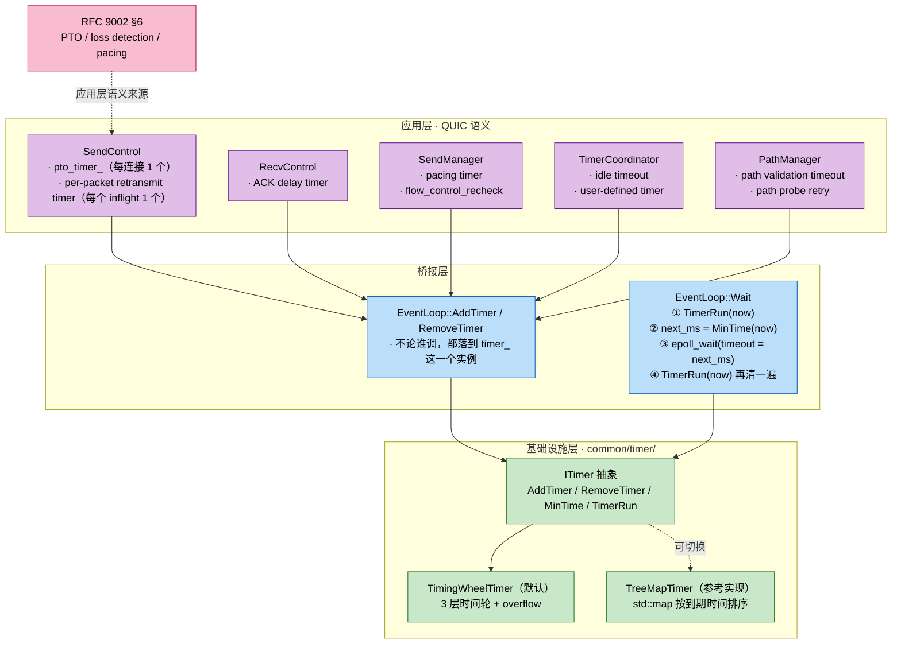

# 定时器设计：双实现、双层结构、为什么时间轮

quicX 在两个层面上用到定时器：

- **基础设施层**：`common/timer/` 提供 `ITimer` 接口与两份实现（`TreeMapTimer` / `TimingWheelTimer`），被 `EventLoop` 持有一份，是把"下一个最早事件还有多久"接到 `epoll_wait` 超时上的唯一通道；
- **应用层**：连接生命周期内几乎所有"再多久要做一件事"的 QUIC 语义（PTO、ACK delay、pacing、流控 recheck、idle timeout、path validation 重试 …）都通过 `EventLoop::AddTimer()` 注册到这同一份底层定时器上。

本文回答四个问题：

- 为什么 `MakeTimer()` 默认返回时间轮、treemap 留着干什么；
- 时间轮是怎么把 O(1) 加 / O(1) 删做出来的，cascade 与 overflow 又是怎么回事；
- `EventLoop::Wait` 是怎么把这个定时器揉进 reactor 的；
- 应用层每条 timer（重点是 PTO）落到底层时长什么样，与 `loss_recovery.md` 怎么形成"应用 → 基础设施"双层闭环。

阅读时建议打开 `src/common/timer/` 下的 5 个文件（`if_timer.h` / `timer_task.h` / `timing_wheel_timer.{h,cpp}` / `treemap_timer.{h,cpp}`）以及 `src/common/network/event_loop.cpp`、`src/quic/connection/controler/send_control.cpp`。

---

## 1. 总览



四件事重点看：

1. **只有一个 ITimer**：每个 `EventLoop` 持有一个 `timer_`，所有应用层 timer 共用这一份；不存在"PTO 用一个 timer、idle 用另一个"的多 timer 切分。
2. **`EventLoop::Wait` 是唯一驱动者**：底层定时器从来不自己跑线程、也不抢占主循环，全靠 `Wait()` 在 `epoll_wait` 前后各跑一轮。
3. **`MakeTimer()` 当前硬编码返回 `TimingWheelTimer`**（`timer.cpp:8-10`）。treemap 实现保留作为参照与回退选项。
4. **应用层只看到 `EventLoop::AddTimer/RemoveTimer/AddTimerTask`**（`event_loop.cpp:300-380`），不直接接触 `ITimer`；这层桥接也兼掉了"一次性 timer 不要保留 callback"等内存细节（见 §6 的 P4 注释）。

---

## 2. 接口契约：`ITimer` 的四个动作

`if_timer.h` 一共 33 行，把语义钉得很死：

```cpp
class ITimer {
public:
    virtual uint64_t AddTimer(TimerTask& task, uint32_t time, uint64_t now = 0) = 0;
    virtual bool     RemoveTimer(TimerTask& task) = 0;
    virtual int32_t  MinTime(uint64_t now = 0) = 0;   // <0 没 timer；==0 已到期；>0 还有这么多 ms
    virtual void     TimerRun(uint64_t now = 0) = 0;  // 触发所有到期回调
    virtual bool     Empty() = 0;
};
```

四个动作、一种数据载体（`TimerTask`）：

```cpp
class TimerTask {
public:
    std::function<void()> tcb_;            // 用户回调
    // 以下 5 个字段是私有的"位置元数据"，由实现填回
    uint64_t time_;                        // 到期绝对时刻（ms）
    uint64_t id_;                          // 唯一 id（remove 用）
    int8_t   wheel_idx_;                   // 时间轮的 0/1/2/3，-1 表示未注册
    uint32_t slot_idx_;
    std::list<TimerTask>::iterator list_it_;
    friend class TreeMapTimer;
    friend class TimingWheelTimer;
};
```

值类型 + friend：`TimerTask` 由调用方持有（譬如 `SendControl::pto_timer_` 是成员变量），实现内部存的是它的拷贝，靠 `id_` 在 `location_map_` 里反查到拷贝并 O(1) 擦掉——这是 Remove O(1) 的物理基础。

`AddTimer` / `MinTime` / `TimerRun` 都允许传入 `now=0` 表示"自己取时间"。`EventLoop::Wait()` 总是在循环顶端取一次 `now` 然后传下去，避免循环内部多次系统调用。

---

## 3. 时间轮实现（默认）：3 层 + overflow

### 3.1 几何参数

`timing_wheel_timer.h:53-68`：

| 层 | slot 数 | 单 slot 时长 | 覆盖范围 |
| :--- | :---: | :---: | :--- |
| L0 | 256 | 1 ms | 0 ~ 256 ms |
| L1 | 64  | 256 ms | 256 ms ~ 16.4 s |
| L2 | 64  | 16.4 s | 16.4 s ~ ~17.5 min |
| overflow | — | — | > 17.5 min |

slot 数全是 2 的幂，所有"取 slot 索引"动作就退化成位移 + 与；这是为什么源码里到处是 `>> kL0Bits`、`& kL1Mask` 这种写法。

L0 的"1 ms 一格"对 QUIC 关键：**PTO 的最小可分辨粒度就是 1 ms**（loss_recovery 里 PTO 公式输出的就是毫秒），刚好能直接落到 L0 的同一个 slot；不用做时间放大。

### 3.2 数据结构（重点）

```cpp
std::array<Slot, 256> wheel0_;          // Slot = std::list<TimerTask>
std::array<Slot, 64>  wheel1_;
std::array<Slot, 64>  wheel2_;
Slot                  overflow_;

// 占位 bitmap：bit s == 1 表示对应 slot 非空
std::array<uint64_t, 4> wheel0_occ_;    // 4*64 = 256 bit
uint64_t                wheel1_occ_;
uint64_t                wheel2_occ_;
bool                    overflow_nonempty_;

// L1/L2/overflow 的"本 slot 最早到期时间"缓存（L0 一格 1 ms，无须缓存）
std::array<uint64_t, 64> wheel1_slot_min_;
std::array<uint64_t, 64> wheel2_slot_min_;
uint64_t                  overflow_slot_min_;

// 全轮最小到期时间缓存（脏即重算）
uint64_t min_deadline_cache_;
bool     cache_dirty_;

// id → list iterator，用于 O(1) Remove
std::unordered_map<uint64_t, std::list<TimerTask>::iterator> location_map_;
```

三类辅助索引（占位 bitmap、per-slot 最小值、全局最小值缓存）合起来就是为了让 **MinTime 不用扫 384 个 slot 的链表**——这条路径每次 `EventLoop::Wait()` 都会走，是性能热点（"曾经吃 ~20% CPU"，见 `timing_wheel_timer.cpp:418-422` 的注释）。

### 3.3 Add / Remove：怎么做到 O(1)

**AddTimer**（`timing_wheel_timer.cpp:42-79`）：

```
1. now      = (传入 now != 0) ? now : UTCTimeMsec();
2. id       = 随机 uint64
3. deadline = now + time_ms
4. delta    = deadline - reference
5. 根据 delta 落到 wheel0_/1/2 或 overflow:
     delta < 256        → wheel0_[ deadline & 0xFF ]
     delta < 16384      → wheel1_[ (deadline >> 8) & 0x3F ]
     delta < 1048576    → wheel2_[ (deadline >> 14) & 0x3F ]
     else               → overflow_
6. push_back 拷贝、写回 list_it_/wheel_idx_/slot_idx_、写 location_map_
7. 顺手更新该层 occupancy bit、本 slot 最小值缓存、全局最小值缓存
```

**RemoveTimer**（同文件 86-160）：

```
1. location_map_.find(id) → list iterator
2. 按 wheel_idx_ 选 slot，slot.erase(it) — O(1)
3. 维护占位 bit / per-slot min（移除的就是 slot 最小值时单 slot 重扫一次）
4. 如果移除的就是全局最小值，置 cache_dirty_ = true
```

注意第 3 步：**per-slot 最小值在被移除时只扫一个 slot 的链表**，QUIC 单 slot 通常只有 个位数 timer，因此尽管链表扫描理论上 O(k)，实际表现稳定 O(1) 量级。

### 3.4 cascade：当 L0 走完一圈

`Tick`（同文件 335-378）按 ms 步进，每次：

```
c0 = current_ms_ & 0xFF        # L0 slot
c1 = (current_ms_ >> 8) & 0x3F # L1 slot
c2 = (current_ms_ >> 14) & 0x3F# L2 slot

if c0 == 0:                     # L0 走完一圈（256 ms）
    if c1 == 0:                 # L1 也走完一圈（16.4 s）
        if c2 == 0:             # L2 也走完一圈（17.5 min）
            Cascade(3 = overflow → 重新分级)
        Cascade(2, c2)          # 把 L2 当前 slot 的 timer 重新插（多数会落 L1/L0）
    Cascade(1, c1)              # 把 L1 当前 slot 的 timer 重新插（多数会落 L0）

# 然后弹出 wheel0_[c0] 的整个 list，逐个调 tcb_()
current_ms_ += 1
```

cascade 的代价分摊到很久前的 AddTimer 上：长 timer 注册时只走一次 O(1) 落 L1/L2，临到期前 cascade 一次落 L0，再 O(1) 触发——单个 timer 全生命周期 O(1)。

### 3.5 MinTime：bitmap 跳过空 slot

`MinTime` 命中缓存时是直接读 `min_deadline_cache_` - O(1)。脏时调 `EarliestDeadline()`（`timing_wheel_timer.cpp:434-496`）：

- L0：从当前 ms 对应 slot 出发，在 4×64-bit 的占位 bitmap 上用 `__builtin_ctzll` 找最低 set bit；最坏 4 次 ctz；
- L1：枚举 `wheel1_occ_` 的 set bit（最多 64 个），每个直接读 `wheel1_slot_min_[s]`，**不展开 slot 内的链表**；
- L2：同 L1；
- overflow：直接读 `overflow_slot_min_`。

整个 EarliestDeadline 是 O(words + 非空 slot 数 × 1)，在 QUIC 典型负载（几千连接 / 几万 timer）下基本就是几十次 ctz —— 远低于早期版本"每次都遍历 384 个 slot 的 std::list"的开销。

---

## 4. TreeMap 实现：留着做什么

`TreeMapTimer`（`treemap_timer.{h,cpp}`，全部不到 100 行）用 `std::map<uint64_t, std::unordered_map<uint64_t, TimerTask>>` 按到期 ms 排序：

```cpp
std::map<uint64_t, std::unordered_map<uint64_t, TimerTask>> timer_map_;
//        ^^^^^^^^^^^^^^                  ^^^^^^^^^^^^^^^
//        到期时间 ms                      timer id → task
```

| 操作 | 时间轮 | TreeMap | 说明 |
| :--- | :---: | :---: | :--- |
| AddTimer    | O(1)        | O(log N)  | TreeMap 要红黑树插入 |
| RemoveTimer | O(1)        | O(log N)  | 时间轮靠 location_map_ + list iterator |
| MinTime     | O(1) 摊还   | O(1)      | TreeMap 的 begin() 就是最小 |
| TimerRun    | O(到期数 + cascade 摊还) | O(到期数 + log N) | TreeMap 每删一个 slot 是 O(log N) |
| 内存       | 几 KB 静态                 | 与 N 成正比 | wheel 是 384 slot × list overhead |
| 超长 timer | overflow 兜底             | 天然支持   | TreeMap 无上界 |

QUIC 的负载特征——**timer 数大、加 / 删 / 重新武装非常频繁**（见 §5）——把"O(1) Remove"放在了首位。TreeMap 的 O(log N) Remove 会成为瓶颈，但它在两类场景仍然有用：

- **极少 timer + 都很长**（比如长连接守护进程）：n 很小时 log N 也很小，wheel 那 384 slot 的内存反而浪费；
- **回归 / 排错**：算法不同，可以拿来对账（确保一种实现没出 bug）。

`MakeTimer()` 切换实现就改一行（`timer.cpp:8-10`），所以这是一个真正可替换的接口。

---

## 5. EventLoop 怎么把它接到 reactor 上

`event_loop.cpp:79-101`（`EventLoop::Wait`）：

```cpp
int EventLoop::Wait() {
    uint64_t now = UTCTimeMsec();
    timer_->TimerRun(now);                       // ① 先清一遍已到期的

    int32_t next_ms = timer_->MinTime(now);
    int timeout_ms  = next_ms >= 0 ? next_ms : 1000;

    if (need_immediate_wakeup_) timeout_ms = 0;  // RunInLoop 同线程 wakeup

    int n = driver_->Wait(events_, timeout_ms);  // ② epoll_wait

    timer_->TimerRun(UTCTimeMsec());             // ③ 再清一遍（可能 epoll 忙等中又有 timer 到期）

    // ④ 处理 fd 事件...
}
```

四步逻辑对应着 reactor 范式的标准实现：

- **① 与 ③ 各跑一次 TimerRun**：第一次保证"我决定要等多久"前已经把所有过去的 timer 清干净；第二次保证 epoll 阻塞期间到期的 timer 不被 fd 事件饿死。
- **② timeout 的来源是 MinTime**：这是 timer 与 reactor 唯一耦合点。`MinTime` 返回 `>=0` 的 ms 数 / `-1`（无 timer）。无 timer 时退化为 1000 ms 阻塞——这个值是兜底超时，不影响正确性，但避免了"epoll 永久阻塞导致 RunInLoop 任务延迟"。
- **`need_immediate_wakeup_` 跨线程信号**：当 `RunInLoop` 在同线程 post 任务（无法用 eventfd 走 wakeup pipe）时通过它把超时压成 0，让 epoll_wait 立刻返回。

应用层调用 `event_loop_->AddTimer(cb, delay_ms)` 后，`EventLoop` 会在内部封一个 `TimerTask`、登记到 `timer_->AddTimer()`、并把 task 存进 `timers_` map（仅 repeat timer，见下）：

```cpp
// event_loop.cpp:300 附近
TimerTask task(cb);
uint64_t id = timer_->AddTimer(task, delay_ms, now);
timer_ids_.insert(id);
if (repeat) {
    timers_[id]      = task;     // 重复 timer 必须保留 cb 用于重新注册
    timer_repeat_[id]= true;
}
// 一次性 timer 不放 timers_，否则 cb 捕获的 shared_ptr<BaseConnection>
// 会在 fire 后仍被持有 → 每连接 ~120KB RSS 残留（见 P4 修复注释）
```

**P4 教训**：一次性 timer 一旦触发就要让它的 callback 立即从 EventLoop 的索引中消失，否则连接析构会被延迟到下一轮 timer GC。`timer_repeat_` 这层薄区分就是为了这件事。

---

## 6. 应用侧实例：PTO timer 的四次再武装

`SendControl::pto_timer_`（`send_control.h:233-238`）是单条连接最热的 timer：

```cpp
common::TimerTask pto_timer_;            // 每连接 1 个
void OnPTOTimer();                       // 触发回调
```

它在 4 个时刻被重置（reset = `RemoveTimer(pto_timer_)` + `AddTimer(pto_timer_, pto_ms)`）：

| 触发时机 | 代码位置 | 行为 |
| :--- | :--- | :--- |
| ① 发出一个 ack-eliciting 包 | `OnPacketSend` (`send_control.cpp:147-151`) | Remove old + Add new with `GetPTOWithBackoff(...)` |
| ② 收到 ACK 且仍有 in-flight | `OnPacketAck`（partial ACK 分支，454-456） | backoff 已被 `OnPacketAcked()` 清零，按 latest RTT 重新武装 |
| ③ 收到 ACK 且未握手完成 | 同上 460-468 | 即使没有 in-flight 也保持 PTO 活着，作为 PING probe 触发器 |
| ④ PTO 到期后自我重入 | `OnPTOTimer`（748-752） | 用更新后的 backoff 重新武装下一轮 probe |

每次 reset 都是一次 RemoveTimer + AddTimer，**这就是为什么 RemoveTimer 的 O(1) 复杂度对 QUIC 至关重要**：在重传率高 / RTT 抖动剧烈时，每个连接每秒可能反复 reset 多次 PTO；把它放在 O(log N) 的 TreeMap 上，N 一旦上来（多连接 / 多 inflight 包）就会变慢。

每个 in-flight 包还有自己的 retransmit timer（保存在 `unacked_packets_[ns][pn].timer_task`），ACK 时 `ClearRetransmissionData()` 一并清理（见 `send_control.h:64-79` 的注释，里面记录了一次"P3 短 RTT 时 timer 不及时清干净导致 heap-corruption"的真实事故）。

其他高频 timer：

| 模块 | timer 名 | 用途 | 频率 |
| :--- | :--- | :--- | :--- |
| `RecvControl` | `timer_task_` | ACK delay（凑批延迟回 ACK） | 每个 ack-eliciting 包都可能武装一次 |
| `SendManager` | `pacing_timer_task_` | pacing 让出 cwnd | 取决于 pacing rate |
| `SendManager` | `flow_control_recheck_task_` | 流控 stalled 重新检查 | 每被流控阻塞一次武装一次 |
| `TimerCoordinator` | `idle_timeout_task_` | RFC 9000 idle timeout | 每收 / 发包都可能 reset |
| `TimerCoordinator` | 用户自定义 timer | 应用层 TimerCoordinator::AddTimer 暴露给上层 | — |
| `PathManager` | `migration_timeout_task_` | path validation 超时 | 迁移期间偶发 |
| `PathManager` | `path_probe_task_` | path probe 重试 | 迁移期间偶发 |

`TimerCoordinator`（`connection/connection_timer_coordinator.cpp`）特别值得一看：它把"在哪个线程上调 AddTimer"也封掉了——线程一致时直接 `loop->RemoveTimer + AddTimer`，跨线程时走 `RunInLoop` 把操作 trampoline 回 worker 线程（`connection_timer_coordinator.cpp:117-131`）。这是 **EventLoop::AssertInLoopThread() 不变量** 在 timer 上的具体落地（见 `process_model.md` §7）。

---

## 7. 与 loss_recovery 的双层闭环

`loss_recovery.md` 讲的是 **应用语义**——

- PTO 公式：`PTO = SRTT + max(4*RTTVAR, kGranularity) + max_ack_delay`，再乘 `2^pto_count`；
- loss detection 阈值：`9/8 × max(SRTT, latest_rtt)`；
- 何时要发 probe / 何时要把 in-flight 标 lost；
- 这些动作映射到 `OnPacketSend`/`OnPacketAck`/`OnPTOTimer` 上。

**它回答"什么时候要 timer 干什么"。**

`timer_design.md`（本文）讲的是 **底层机制**——

- `RemoveTimer + AddTimer` 是 O(1) 的，所以 PTO 反复重置是廉价的；
- `MinTime` 是 O(1) 摊还的，所以 reactor 每轮决定 epoll 超时时基本不耗 CPU；
- cascade 把"长 timer 注册时不用进 L0"做到了平摊 O(1)；
- 一次性 timer 在 EventLoop 这层会立即从索引擦除，避免 callback 持有连接对象的回档。

**它回答"timer 触发后底层怎么做到 O(1) 武装 / 取消 / 找最早"。**

两篇文档加起来，QUIC 的"超时驱动"行为就完整了：上层语义 + 下层机制各占一篇，读完任意一篇都能独立成章，但放在一起才是完整故事。

---

## 8. 设计不变量

读源码或调试时如果发现下列任一条不成立，就是 bug：

1. **每个 EventLoop 一个 timer 实例**：从来不同时存在两个 ITimer，所有应用层 timer 共用一个轮（或一棵树）。
2. **TimerTask::id_ 全局唯一**：时间轮用 `RangeRandom` 取 64-bit id；treemap 用 monotonically increasing。location_map_ 反查不到等价于 task 不在轮里。
3. **wheel_idx_ == -1 ⇔ 未注册**：Insert 时写回，Remove 后写回。task 在多个 slot 同时存在是 bug。
4. **per-slot min 与 occupancy bit 同生同死**：任一个 wheelN_occ_ 的 bit 与 wheelN_slot_min_[s] 必须一致表达"这个 slot 是否非空"。
5. **min_deadline_cache_ 要么是真值，要么 cache_dirty_ = true**：Remove 命中最小值 / Tick 触发最小值时必须立即设脏。
6. **EventLoop::Wait 总是先 TimerRun 再 MinTime**：反过来会出现"刚算完 next_ms，回头却发现 ms 内有 timer 已到期但没跑"的窗口。
7. **跨线程的 timer 操作必须经 RunInLoop 转发**：`TimerCoordinator::ResetIdleTimer()` 是范本（见 §6 末尾代码引用）。

---

## 9. 关联文档

- [`loss_recovery.md`](loss_recovery.md) —— 上层 PTO 公式 / loss detection 阈值，与本文形成双层闭环。
- [`congestion_control.md`](congestion_control.md) —— pacing timer 服务的 cwnd / pacing rate 模型来源。
- [`connection_anatomy.md`](connection_anatomy.md) —— `TimerCoordinator` 在 BaseConnection 中的位置；§3.5 对"非 TimerCoordinator 持有的 timer"的范围划分。
- [`process_model.md`](process_model.md) —— EventLoop 在 worker 内单线程 reactor 中的位置；timer 的"AssertInLoopThread"约束。
- [`ownership_and_memory.md`](ownership_and_memory.md) —— 一次性 timer 的 callback 不能被 `EventLoop::timers_` 长期持有的 P4 教训。

---

## 10. 参考文献

- RFC 9002 §6（Loss Detection）—— PTO 公式、loss timer、ack-eliciting 概念。
- RFC 9002 §7（Pacing）—— pacing timer 的应用语义。
- RFC 9000 §10.1（Idle Timeout）—— idle timer 的协议层语义。
- 经典文献：George Varghese & Tony Lauck, *Hashed and Hierarchical Timing Wheels: Data Structures for the Efficient Implementation of a Timer Facility* (1987) —— 三层时间轮方案的源头。
