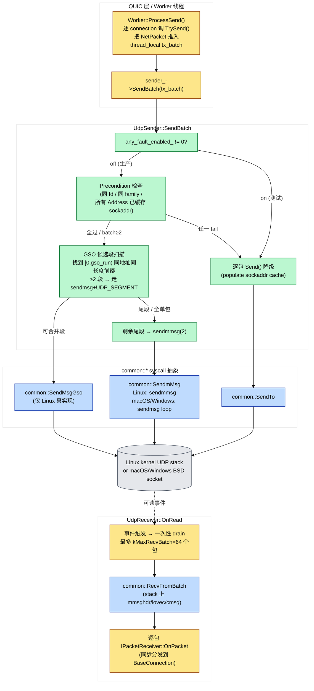

# UDP I/O 子系统设计：sendmmsg / GSO / recvmmsg 取舍与降级路径

> **读者前置**：建议先读 `packet_lifecycle.md`（一个 datagram 的完整路径）和 `process_model.md`（EventLoop / Worker 线程模型）。本文专注于**最底层 syscall 层**的工程决策——上面的设计文档讲"一个包从哪里来到哪里去"，这一篇讲"那一刀 syscall 到底是 sendto / sendmmsg 还是 sendmsg+UDP_SEGMENT，以及失败时怎么降级"。
>
> **代码地图**：`src/quic/udp/`（UdpSender / UdpReceiver / NetPacket / IReceiver / ISender）+ `src/common/network/`（io_handle.h、recv_batch.cpp、linux/macos/windows 三个 io_handle.cpp）。

## 开篇四问（钉死 ROI）

1. **同样在 Linux 上，为什么 QUIC 需要 sendmmsg + UDP_GSO 两层批处理？光 sendmmsg 不够吗？**
2. **`UdpReceiver::OnRead` 一次最多拉 64 个包（`kMaxRecvBatch`），这数怎么算的？拉太多 / 太少分别会出什么问题？**
3. **macOS / Windows 上没有 recvmmsg / UDP_SEGMENT，QuicX 怎么在不写一坨 `#ifdef` 的前提下保证语义一致？**
4. **GSO 在某条路径上不被支持时（旧内核 / 容器 / 特定网卡），代码怎么发现并永久绕开它？两个并发线程同时第一次发现失败会出什么竞争？**

---

## 1. 总览：三层管道与降级链



**四张关键关系**：

- **QUIC 层（黄）只决定"该发什么"**——Worker 在 `ProcessSend` 里逐 connection 调 `TrySend()` 把 NetPacket 推入 `thread_local tx_batch`，然后**整批一次 `SendBatch`**（`worker.cpp:131` 的 while 循环 + `:146` 的 `sender_->SendBatch`），不再逐包陷内核。
- **UdpSender 层（绿）做四件事**：①fault injection 短路；②precondition 检查；③GSO 前缀扫描；④sendmmsg 尾段处理；任何一步出问题都**全批降级**到逐包 `Send()`，不做"半批 sendmmsg + 半批 sendto"——后者会反转 FIFO。
- **common::* syscall 抽象层（蓝）封掉所有 `#ifdef`**——Linux 走真 `sendmmsg(2)` / `sendmsg+UDP_SEGMENT cmsg` / `recvmmsg(2)`；macOS/Windows 走 `sendmsg` / `recvmsg` 循环；上层只看到一个统一函数。
- **接收侧（黄→蓝→黄）一次 drain**：从 N 次 `recvfrom` 改为单次 `recvmmsg` 直接拿 64 个，让 ack-eliciting 包能在一次 wakeup 内堆够 `kAckThreshold=10` 个，触发**ACK 聚合**——这是 loopback 上把吞吐从 22k pkts/s 拉到 ~36 MB/s 的关键单点优化。

---

## 2. 设计动机：为什么需要批处理 + GSO 双层

### 2.1 单包 sendto 的天花板

每次 `sendto(2)` 都要：

1. 用户态 → 内核态切换（trap，~1 μs / 次）；
2. 取 UDP socket lock（per-fd 自旋）；
3. 走完整个 UDP 协议栈（封 IP/UDP 头、查路由表、走 netfilter、入 qdisc）；
4. 内核态 → 用户态切换。

`udp_sender.cpp:333` 的 `DiagSendtoLatencyUs` 直方图就是为了量这个。loopback 上典型值 5–15 μs，意味着**单线程 sendto 上限 ~70k pkts/s**。MTU=1452 时只有 ~800 Mbps；千兆以上必须批处理。

### 2.2 sendmmsg 解决了第 1、2 步，没解决第 3 步

`sendmmsg(2)` 把 N 个 datagram 攒成一次 syscall：

- **trap 一次** ✓（第 1、4 步只付一份）
- **socket lock 一次** ✓（第 2 步整批共享）
- **协议栈走 N 次** ✗（每个 datagram 仍要走一遍）

实测约 2× 提升。但 QUIC 稳态发包"同 peer + 同 MTU"占主导（一个流对一个 Address 持续 push 1452B），第 3 步成新瓶颈。

### 2.3 UDP_GSO（`UDP_SEGMENT` cmsg）解决了第 3 步

Linux 4.18+ 的 UDP Generic Segmentation Offload：

- 用户态把 N 个**长度相同的**同 peer 包**拼成一个连续 buffer**（payload = N × seg_size），加一个 `UDP_SEGMENT` 控制消息告诉内核"按 seg_size 切片"；
- **`sendmsg(2)` 一次**，内核**只走一次协议栈**就内部切成 N 个 datagram；
- 真实网卡上还能走硬件 GSO（NIC 切片），CPU 再省一倍。

`udp_sender.cpp:602-703` 的 GSO 扫描就是为这个：**找最长的"同地址 + 同长度"前缀**，剩下的尾段走 sendmmsg。最长 `kGsoMaxSegments=64` 段（Linux UDP_MAX_SEGMENTS 历史上限），总长度 ≤ 65000B（UDP datagram 大小限制）。

> **关键 trade-off：multi-tenant 服务器上 GSO 的命中率会显著低于 single-flow benchmark。** 因为 GSO 要求 **整个前缀同一个 destination Address**，所以一个 Worker 在 16 个 active connection 间轮流 push 时，`tx_batch` 通常长这样 `[A,B,C,A,D,B,...]`，GSO 前缀长度只有 1（不可合并）→ 自动落到 sendmmsg。这是**为什么不"按 Address 重排再 GSO"**：重排会破坏 FIFO（pacing 序），而 QUIC 拥塞控制依赖发送顺序。代价小（单 connection 已经是主要负载场景），收益保（pacing 不被破坏）。

### 2.4 三层降级链的关键不变量

```
UDP_GSO (sendmsg+UDP_SEGMENT)        段≥2 同地址同长度
   ↓ 不支持 / 异构包
sendmmsg(2)                          所有 Address 已缓存 sockaddr 且同 fd
   ↓ cache miss / 混 fd / fault inject
逐包 Send() → sendto(2)              永远可用
```

**任意上层失败都全批落到下层**——`udp_sender.cpp:589-600` 不允许"一半 sendmmsg + 一半 sendto"，因为这会反转 FIFO 顺序破坏 pacing 序。**唯一的部分批化**是 GSO 成功 + sendmmsg 处理尾段：因为 GSO 段在前、sendmmsg 段在后，FIFO 仍然保持。

---

## 3. UdpSender：发送侧的精细工程

### 3.1 fault injection 三层组合（drop → rate → delay）

`udp_sender.h:33-114` + `cpp:241-294`：

| 类型 | 实现 | 作用域 | 默认 |
| :--- | :--- | :--- | :--- |
| `SetDropPerMillion` | thread_local mt19937 + uniform_int | per-call | 0（关闭） |
| `SetRateLimitBps` | 全局 TokenBucket（mutex 守护）+ tail-drop | 进程 | 0（关闭） |
| `SetEgressDelayMs` | DelayQueue 后台 worker（FIFO 重发） | 进程 | 0（关闭） |

**组合顺序固定**：drop → rate → delay。理由：

- drop 在最前面，因为它**模拟物理层丢包**（不消耗发送端资源），rate-limit / delay 不应对一个"已经丢了"的包做工；
- rate 用 tail-drop 而不是 backpressure，因为模拟"1Mbps 链路饱和后丢尾包"——若 backpressure 会改变上层 pacing 行为；
- delay 必须最后，因为它把包**移交给后台 worker**，后续的 metrics 在 worker emit 时才计数（避免 `Drain()` 双计）。

**生产侧零成本设计**：`any_fault_enabled_` 是一个原子总开关，三个 setter 任意被改时重算它。`Send()` 热路径**先读这一个 atomic**（`udp_sender.cpp:326`），off 时短路掉所有 per-knob 检查、RNG、token bucket mutex；on 时才走完整三层。这让生产代码留着 fault injection 的开销 ≈ 一条 relaxed atomic load（< 1ns）。

> **为什么不用 `#ifdef NDEBUG` 把 fault injection 编译掉？** 因为 interop 测试要在 release build 上验证 1Mbps + 5%loss + 5ms 这种场景；编译时关闭就没法用 production 的 perf 配置去复现。

### 3.2 sockaddr cache：把 inet_pton 摊到首包

每个 `common::Address` 内部缓存了对应 `sockaddr_in` / `sockaddr_in6`（`io_handle.cpp:263-286` 的 `GetCachedSockaddr` / `StoreCachedSockaddr`）。第一次 `SendTo` 走 `inet_pton` 解析填充 + 缓存；之后所有 sendmmsg / GSO 直接拿缓存的 `const struct sockaddr*` 塞 `msg_name_`，**零字符串解析**。

这就是为什么 `SendBatch` 把 "所有包的 Address 都已缓存 sockaddr" 列为 fast-path 前置条件之一（`udp_sender.cpp:526-546`）：缓存 miss 直接退到逐包 `Send()`，由 Send 里的 `SendTo` 顺手填好缓存——下一轮 `SendBatch` 就能走 fast-path。这是**自愈式 warm-up**：新连接第一轮慢，第二轮起全速。

### 3.3 GSO 永久禁用标志的并发设计

```cpp
namespace { std::atomic<bool> g_gso_unsupported{false}; }
```

第一次 GSO 收到 `EINVAL / ENOTSUP / EIO / ENOPROTOOPT` 任意一个，原子置 true，**整个进程后续 SendBatch 永久跳过 GSO 探测**（`udp_sender.cpp:626 + 690-698`）。

**这里有一个有意识接受的小竞争**：两个并发线程同时第一次发现失败，可能各自又试一次"注定失败的"GSO 才置位——损失 = 2 个失败 syscall，远小于"加锁串行化全部 GSO 探测"。relaxed memory order 足够，因为这只影响**后续 GSO 探测的命中**，从不导致功能性 bug。

> **替代方案为什么否决**：用 mutex 保护 + double-check，会让 GSO 路径每次都付一次原子 RMW（虽然 uncontended）；用 thread_local 标志，会让"启动时一个 worker 探测失败"无法通知其他 worker，整个集群多花 N 次失败探测。**全局 atomic + relaxed** 是最优解。

### 3.4 sendmmsg 短写处理：丢而不缓存

`udp_sender.cpp:764-773`：当 `sendmmsg` 返回 `sent < mm_count` 时（kernel 发送队列满 / EINTR），**剩余包直接丢弃**，不跨 round 缓存。

理由：

- UDP 本来就是不可靠，QUIC 上层有 loss recovery（PTO + 包号 ACK），重传逻辑已存在；
- 跨 round 缓存会**反转 FIFO**——下一轮新发的包会跟着上一轮残留包混排；
- 若真出现持续短写说明 sndbuf 满 / 链路饱和，缓存只会让积压恶化。

错误计入 `UdpSendErrors`，metrics 看得见就够。

---

## 4. UdpReceiver：接收侧的批处理与池防御

### 4.1 单 fd / 多 connection / EventLoop 单线程

QuicX 的 UDP 接收**不用 SO_REUSEPORT 多 fd**，而是：

- 每个 `UdpReceiver` 持有一个或多个 fd，每个 fd 注册到 `IEventLoop` 上；
- `OnRead(fd)` 触发后，整批分发给该 fd 上**唯一**的 `IPacketReceiver`（通常是 `QuicServer`/`QuicClient`），它再用 connection ID 路由到具体 BaseConnection；
- 多 connection 都跑在**同一个 EventLoop 线程**上（worker 模式下每个 worker 一个 EventLoop）。

> **为什么不用 SO_REUSEPORT 让内核哈希分流？** 三个原因：① QUIC 的连接 ID 是握手后才稳定的（Initial 用客户端 DCID，1-RTT 用服务端给的 SCID），SO_REUSEPORT 哈希基于五元组，**会把同连接不同包路由到不同 fd**——必须用户态再做一次 connection-ID 路由，那 SO_REUSEPORT 就没价值；② QuicX 用 worker 模型而不是 thread-per-connection，连接到 worker 的绑定由上层 `Dispatcher` 完成，更精细；③ 客户端场景一个 fd 对应一个连接，REUSEPORT 没意义。

`udp_receiver.h:18` 的注释确实留了 "we can process one connection in a single thread since set REUSE_PORT option" 的口子，但**当前代码没有任何 SO_REUSEPORT 调用**——这是为将来 server-side 多 worker 共享同 port 预留的设计余量，不是已实现机制。

### 4.2 `kMaxRecvBatch=64` 的取舍

`config.h:157-161`：

```cpp
static constexpr int kMaxRecvBatch = 64;
```

为什么是 64：

- **下限**：要 ≥ 1 BDP / MTU。loopback 100Mbps × 1ms RTT ÷ 1452B ≈ 9 包；千兆 ≈ 90 包。64 在这中间偏低，但配合 `kMaxPacketsPerRound=128` 的 send-side 节流足够。
- **上限**：超过 64 后，`OnRead` 一次 drain 太多导致**接收端 ACK 反馈被推迟**——上层调度还没来得及处理就又拉回 64 个，Worker `ProcessSend` 没机会把堆积的 ack-eliciting 反过来 ACK。`worker.cpp:115-119` 实测：256 -> -10.6%，1024 -> -7.4%。
- **栈预算**：`recv_batch.cpp:21-24` 的 mmsghdr+iovec+sockaddr_storage+128B cmsg × 256 ≈ 64 KiB，stack 上限是 256 不是 64。**`kMaxRecvBatch=64` 是 perf 选择**，**`kMaxBatch=256` 是 syscall 接口硬上限**——后者只是别让前者乱涨。

### 4.3 池回收陷阱与两道防线

`udp_receiver.cpp:218-273` 的注释讲了一个**血泪故事**：`NetPacket` 由 thread-local pool 分配，当一个被回收的 NetPacket 底层 chunk 的 "floor" 还被外部 `SharedBufferSpan` 引用时，`GetWritableSpan()` 返回的可写区会比 `kMaxV4PacketSize=1472` 小，但若把 `buf_len_` 直接传成 1472 给内核，**MTU 大小的 datagram 会越界写到下一个 chunk**——在 BlockMemoryPool arena 里 chunk 物理连续，越界后下一个 chunk 的有效区被覆盖出"短头包"垃圾，上层报 `payload too short for header protection sample. payload_len:19` 风暴。

**两道防线**：

1. **写入长度用真实可写区** —— `entries[i].buf_len_ = span.GetLength()`，**绝不**写死 `kMaxV4PacketSize`；
2. **可写区不够就换包** —— `for retries < kMaxRecycleRetries` 循环 Malloc 直到拿到 ≥ 1472 的干净 buffer；retry 上限 8 防止池永久泄漏导致 OnRead 死循环。8 次还拿不到就**缩 batch**（`batch = i; break`），剩下的 datagram 留在内核队列，下次可读事件再 drain。

这道坎是 `pool_alloter.md` § "外部引用陷阱" 在 UDP I/O 层的具体表现——读那篇文档解释**为什么会有 floor pinned**，本节解释**怎么在 syscall 边界守住**。

### 4.4 ECN cmsg 的解析

ECN 是 RFC 9002 §B.4 / RFC 3168 定义的拥塞早期信号，2 bit 编码：`00`=Not-ECT、`10`=ECT(0)、`01`=ECT(1)、`11`=CE。

`recv_batch.cpp:105-124` 的 `ParseEcnFromCmsg` 在每个 datagram 的 cmsg 里找 `IP_TOS`（IPv4）/ `IPV6_TCLASS`（IPv6），取低 2 bit。`EnableUdpEcn()` 在 fd 创建时设 `IP_RECVTOS` / `IPV6_RECVTCLASS` 让内核投递这些 cmsg（`io_handle.cpp:574-576`）。

**关键**：ECN 提取在 batch 里**逐包**走（每个 mmsghdr 都带 128B cmsg buffer），不是一次性全批。这是因为不同包可能 CE 标记不同，必须逐包归到对应 BaseConnection 的 `ack_ecn_counts_`。Windows 上整段 `#ifndef _WIN32` 跳过——winsock2 没有等价 cmsg 投递机制，ECN 在 Windows 是编译时关掉的（`io_handle.h:163` 的 `EnableUdpEcn` 注释里也声明了这一点）。

### 4.5 OnRead 全图

```
EventLoop epoll_wait 返回 fd 可读
  └─ UdpReceiver::OnRead(fd)
      ├─ 准备 batch_cap=64 个 NetPacket
      │    └─ 每个 GetWritableSpan() 验长 ≥ 1472
      │       miss → drop 旧 NetPacket，retry ≤ 8 次
      │       全 fail → 缩 batch = i，下次再 drain
      ├─ common::RecvFromBatch(fd, entries, batch, ecn)
      │    └─ Linux: recvmmsg(MSG_DONTWAIT)
      │    └─ macOS/Windows: recvmsg loop until EAGAIN
      ├─ rc.return_value_ <= 0
      │    └─ EAGAIN → 静默返回，等下次事件
      │    └─ 真错误 → LOG_ERROR + 计数
      └─ for i in 0..rc:
           ├─ MoveWritePt(bytes_)
           ├─ SetAddress / SetSocket / SetTime / SetEcn
           ├─ Metrics: UdpPacketsRx / UdpBytesRx
           └─ receiver_strong->OnPacket(pkt)  ← 同步进 BaseConnection
```

整路 **一次 syscall + N 次同步 dispatch**，Worker 的 ack 聚合（`RecvControl::ShouldSendImmediateAck` 的 `kAckThreshold=10`）才有机会触发——这是为什么这个改动在 loopback 100MB upload 上把 pkts_tx 从 22k/s 拉到 ~36k/s（`udp_receiver.cpp:167-187` 的 PERF FIX 注释）。

---

## 5. 跨平台抽象：一个文件 = 一个平台

### 5.1 三平台分层

```
src/common/network/
├── io_handle.h               接口（POD 风格 Iovec/Msghdr/MMsghdr，不依赖 sys/socket.h 的内部对齐）
├── linux/io_handle.cpp       sendmmsg / recvmmsg / UDP_SEGMENT 全部真实现
├── macos/io_handle.cpp       sendmsg loop / recvmsg loop / SendMsgGso 返回 EIO
├── windows/io_handle.cpp     WSARecvMsg / sendmsg loop / SendMsgGso 返回 EIO
└── recv_batch.cpp            单文件包所有平台用的 RecvFromBatch（基于上面三个的 RecvmMsg）
```

**核心设计**：上层 `UdpReceiver` / `UdpSender` 看到的接口完全统一，**没有任何 `#ifdef <platform>`**。平台差异全压在三个 `io_handle.cpp` 里，新加平台只要补一个目录。

### 5.2 macOS / Windows 没有 sendmmsg / recvmmsg 怎么办

`SendmMsg` / `RecvmMsg` 在 macOS / Windows 实现里**退化为 sendmsg / recvmsg 循环**：

```
for i in 0..vlen:
    ret = sendmsg/recvmsg(socket, &msgvec[i].msg_hdr_, flag)
    if ret < 0:
        if i == 0: return {-1, errno}
        else: return {i, 0}     # 部分成功，类似 Linux 短写
```

**没有 syscall 节省**，但**接口语义完全一致**（返回处理的 datagram 数）。RecvmMsg 在 EAGAIN/EWOULDBLOCK 时返回 `{0, 0}`（空 drain），与 Linux 一致——`recv_batch.cpp:194-198` 的上层判断不区分平台。

### 5.3 SendMsgGso 在非 Linux 平台

macOS / Windows 实现直接 `return {-1, EIO}`。`UdpSender::SendBatch` 第一次拿到这个 errno 就把 `g_gso_unsupported` 置 true，**整个进程后续 SendBatch 永久跳 GSO 探测**——非 Linux 平台一辈子付一次"哨兵失败"。

---

## 6. fd 所有权与生命周期

UdpReceiver 提供两个 `AddReceiver` 重载（`udp_receiver.h:27-28`）：

| 重载 | 调用方 | fd 所有权 |
| :--- | :--- | :--- |
| `AddReceiver(socket_fd, receiver)` | 调用方已持有 fd（client 自己创建） | **调用方** |
| `AddReceiver(ip, port, receiver)` | UdpReceiver 内部 `UdpSocket()` + `Bind()` | **UdpReceiver** |

`owned_fds_` 集合**只追踪后者**。析构时（`cpp:32-46`）只 close `owned_fds_`，前者交给调用方自己关。

**这道分隔的故事**：早期版本析构时无差别 close 所有 receiver_map_ 里的 fd，结果在 server graceful restart / 反复 Init 同 port 时遇到了**幽灵 EADDRINUSE**——内核把 UDP port 绑死直到所有 fd 全部关闭，先前 Init 漏掉的 listen socket 让新 server 静默 bind 失败。修复就是这套二元 ownership：**调用方传 fd 进来 = 调用方负责关；构造时打开 fd = UdpReceiver 负责关**。

`OnClose` / `RemoveReceiver` 同样用这个判断（`cpp:152-159`、`cpp:354-360`）。

---

## 7. 跨线程协作：所有 fd 操作在 EventLoop 线程

`AddReceiver` / `RemoveReceiver` / `OnClose` 三处都有这段模板（`cpp:56-65`）：

```cpp
if (!loop->IsInLoopThread()) {
    auto weak_self = weak_from_this();
    loop->RunInLoop([weak_self, ...](){
        if (auto self = weak_self.lock()) {
            self->Op(...);
        }
    });
    return true;
}
// fall through: 已在 loop 线程，直接做
```

**为什么必须**：

- `IEventLoop::RegisterFd` / `RemoveFd` 内部维护 epoll/kqueue 的 fd 集合，跨线程访问会和 `epoll_wait` 竞态；
- `receiver_map_` 不加锁——OnRead 在 loop 线程写入读取，AddReceiver 跨线程会改它；
- `RunInLoop` 把闭包推 EventLoop 待办队列，下一次 wait 返回前执行。

**weak_from_this 而不是 shared_from_this 的细节**：闭包可能在 UdpReceiver 已析构后才执行（loop 还没退出但 owner 已 reset），`weak_self.lock()` 失败就直接 return，不 dereference 野指针。`enable_shared_from_this<UdpReceiver>` 是为这个准备的（`.h:21`）。

---

## 8. Metrics 对应关系

| 指标 | emit 点 | 含义 |
| :--- | :--- | :--- |
| `UdpPacketsRx` / `UdpBytesRx` | `udp_receiver.cpp:322-323`（每个 dispatched datagram） | 真实成功收下并 dispatch |
| `UdpPacketsTx` / `UdpBytesTx` | `udp_sender.cpp:345-346 / 406-407 / 678-682 / 761-762` | 三条路径（Send / Send-fault-path / GSO / sendmmsg）都计 |
| `UdpDroppedPackets` | `udp_receiver.cpp:305 / 328` | receiver 已删 / receiver_strong 失效（极少见） |
| `UdpSendErrors` | `udp_sender.cpp:341 / 400 / 219` + `:771` 短写 | 真实 send 失败 |
| `DiagUdpOnRead` | `udp_receiver.cpp:165` | OnRead entry 计数（看 wakeup 频次） |
| `DiagUdpSendCalls` / `DiagUdpSendOk` | `udp_sender.cpp:311 / 347` | 单包 Send 路径调用 / 成功 |
| `DiagUdpSendBatchCalls` / `DiagUdpSendBatchOk` | `udp_sender.cpp:485 / 685 / 775` | 批路径调用 / 成功 |
| `DiagSendtoLatencyUs` | `udp_sender.cpp:333-337 / 683-684 / 731-733` | 单 datagram 等价 sendto 耗时（GSO/sendmmsg 用均摊值） |
| `DiagPktPerIterHist` | `worker.cpp:166-168` | 每轮 ProcessSend 实际发了几个包 |

诊断套路：

- **`DiagUdpSendCalls / DiagUdpSendBatchCalls` 比值**告诉你"有多少 send 走了批"——理想稳态应 < 0.1（10 个 send 不超过 1 个走单包路径）；
- **`DiagSendtoLatencyUs` p50** > 20 μs 说明 sendmmsg 也救不了（sndbuf 已经满 / 链路饱和），考虑 `SetUdpSocketBuffer` 拉大；
- **`DiagPktPerIterHist` 偏 1** 说明 worker 被一次只发一个包的小流喂着——上层 BBR pacing 间隔太密 / 应用 push 节奏太散，与 UDP I/O 无关（看 `congestion_control.md`）。

---

## 9. 不变量清单（10 条）

1. **`SendBatch` 任何 precondition fail 都全批降级**，不允许"半批 sendmmsg + 半批 sendto"。FIFO 必须保持。
2. **GSO 段在 sendmmsg 段之前**——这是唯一允许的"部分批化"，因为它不破坏 FIFO。
3. **GSO 段必须同 destination Address + 同 length**（最后一段允许更短）；任何不匹配则该段不可合入 GSO 前缀。
4. **`g_gso_unsupported` 一旦置 true，进程内永不再探测 GSO**；relaxed atomic + 双线程 race 损失 ≤ 1 次失败 syscall。
5. **`any_fault_enabled_ == 0` 是生产恒定状态**；fault injection 静态成员只在 test setup/teardown 翻转。
6. **`recv_batch` 缓冲区长度必须用 `GetWritableSpan().GetLength()`，绝不写死 `kMaxV4PacketSize`**——pool 回收 + floor pinned 时可写区会缩水。
7. **`kMaxRecvBatch=64` 是 perf 上限**（防 ack-feedback 饥饿），**`kMaxBatch=256` 是 syscall 接口硬上限**（栈预算 + UIO_MAXIOV）。
8. **每个 fd 只对应一个 IPacketReceiver**；多 connection 复用通过上层 connection-ID 路由，而非 SO_REUSEPORT。
9. **fd 所有权二元化**：调用方传入 = 调用方关；UdpReceiver 创建 = UdpReceiver 关。`owned_fds_` 是这条规则的具体证据。
10. **所有 fd 注册 / 移除操作必须在 EventLoop 线程**；跨线程一律 `RunInLoop` + `weak_from_this`。

---

## 10. 关联文档

- **`packet_lifecycle.md`** ——一个 datagram 从 UDP 入到 frame 的全路径；本文是其入口/出口段的 syscall 细节。
- **`process_model.md`** —— EventLoop / Worker 线程模型；本文的"在 loop 线程做 fd 操作"约束源头。
- **`pool_alloter.md`** —— frame-level 内存池；§4.3 池回收陷阱依赖其 floor-pinned 概念。
- **`metrics.md`** —— 完整 Metrics 名录；本文 §8 是 UDP 子集 + 诊断套路。
- **`connection_anatomy.md`** —— BaseConnection 调 SendBuffer / sender_->Send 的上层路径；本文是其下层 syscall 实现。
- **`congestion_control.md`** —— pacing / cwnd 决定何时调 SendBatch；本文是 SendBatch 内部如何 batch。

---

## 11. RFC 与外部参考

- **RFC 9000** —— QUIC: A UDP-Based Multiplexed and Secure Transport
  - §13.4.2.1 ECN Validation：本文 §4.4 ECN 提取的协议侧动机
  - §14 Datagram Size：MTU = 1452 与 `kMaxV4PacketSize` 的关系
- **RFC 9002** —— QUIC Loss Detection and Congestion Control
  - §B.4 Receiving ACKs：CE-marked datagram 计入 `ack_ecn_counts_`
- **RFC 3168** —— The Addition of Explicit Congestion Notification (ECN) to IP
  - §5 ECN codepoint 编码：本文 §4.4 的 2-bit 数学定义
- **Linux kernel UDP_SEGMENT** —— 4.18+，`Documentation/networking/segmentation-offloads.rst` § "UDP Fragmentation Offload"
- **Linux man page** —— `sendmmsg(2)`、`recvmmsg(2)`：本文 §2.2 / §4.2 的 syscall 行为依据
- **`man 7 ip`** —— IP_TOS / IP_RECVTOS：本文 §4.4 ECN cmsg 解析依据

---

> **小结**：UDP I/O 子系统的工程难点不在 syscall 本身，而在**多层降级路径的语义保持**——sendmmsg ↔ GSO ↔ sendto 三层任意组合、Linux ↔ macOS ↔ Windows 三平台、fd-owned-by-caller ↔ fd-owned-by-receiver 二元 ownership、EventLoop-thread-only ↔ cross-thread-via-RunInLoop 的并发约束、pool-recycle-floor-pinned 的内存防御。**每一处看似多余的 if / atomic / weak_from_this 都钉住了过去的 bug**。读这篇文档时遇到不直观的代码结构，不妨翻一下 `udp_sender.cpp` / `udp_receiver.cpp` 同位置的注释——很多决策的"为什么"留在那里。
