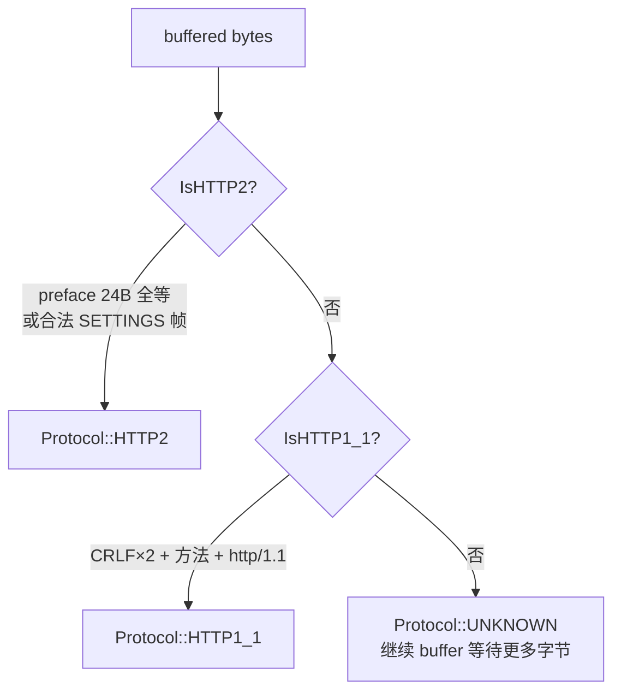
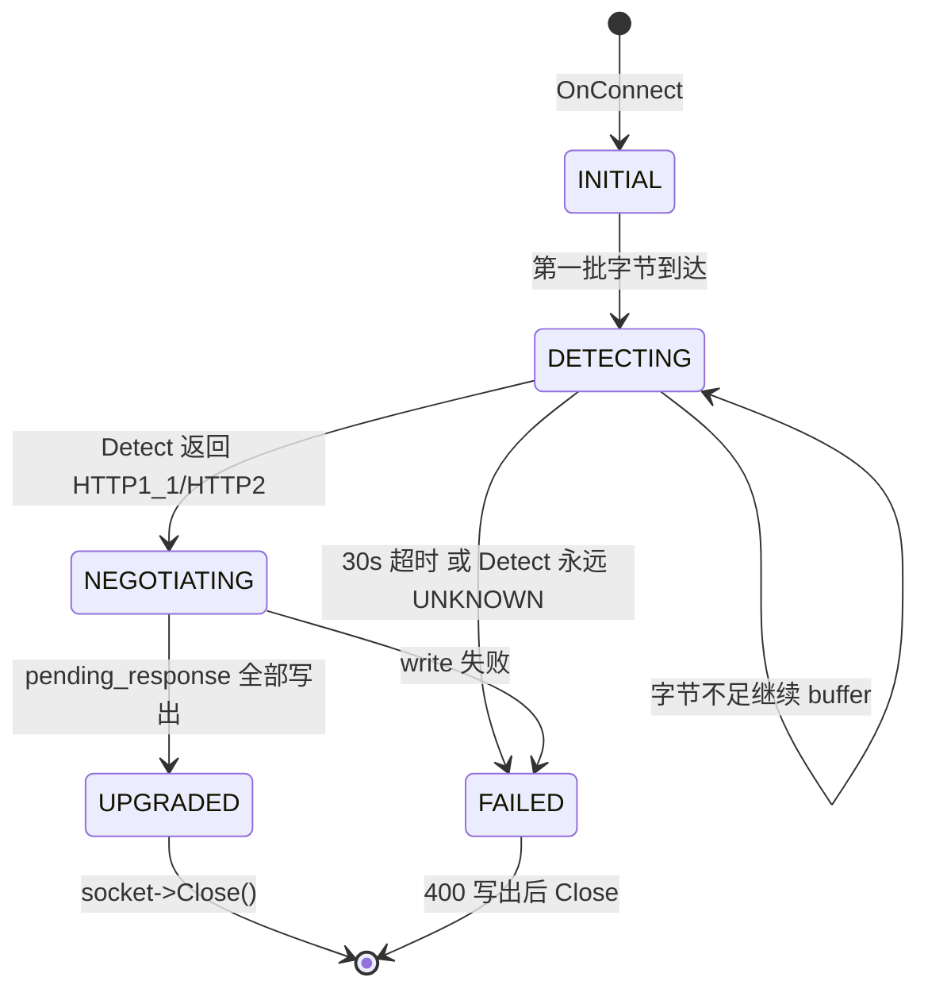

# H1/H2 → H3 协商前端：upgrade 模块的"广告牌"哲学

> 段三第 20 站 · S5-T7f 收官 · 2026-06-02

---

## 0. 这一站想钉住什么

`docs/zh/design/` 段三前 19 篇都在讲 **QUIC 数据平面与 H3 控制平面在 UDP 上怎么跑**。但有一个根本盲点没人触碰：**客户端凭什么知道你这个域名提供 H3 服务？** 浏览器拨过来的第一发包永远是 TCP/443 上的 TLS ClientHello，它**不会主动尝试 UDP/443**。如果你只起 quic 服务器、不在 TCP 端发任何信号，客户端就永远不会发现 H3 的存在。

quicX 的 `src/upgrade/` 是这个模块的工程答案。它**不是**一个 H3 服务器，**也不是**一个反向代理——它只是一块挂在 80/443 端口上的"广告牌"，用 HTTP/1.1 或 HTTP/2 向所有 cleartext / TLS 客户端反复回应同一句话：

```
Alt-Svc: h3=":443"; ma=86400
```

钉住四个反直觉问题：

1. **TCP 端的 ALPN 列表里为什么绝对不能写 `h3`？** —— 把 h3 写进去会让客户端立刻开始往这条 TCP 连接灌 QUIC 字节，而 TCP 跑不动 QUIC（QUIC 必须建在 UDP 上）。h3 协商**只能**通过 Alt-Svc 这条带外路径透露给客户端。
2. **`ProtocolDetector` 为什么只嗅探 cleartext，不嗅探 TLS？** —— TLS ClientHello 不需要嗅，端口已经决定了：80 → `HttpSmartHandler`，443 → `HttpsSmartHandler`，工厂阶段就分流；嗅探只用来在 cleartext 内部分辨 H1 / H2 prior-knowledge。
3. **HTTP/2 路径为什么要手搓一段 HPACK literal 编码？** —— 仅为了发一行 `alt-svc` 头就引入整个 hpack 实现是过度工程；这条路径单次 emit、内容固定、长度永远 < 127 字节，于是直接用 RFC 7541 §6.2.2 的 *literal-without-indexing* 形式编进去，零依赖。
4. **`UpgradeManager::ProcessUpgrade` 里 `result.target_protocol == Protocol::HTTP3` 那条分支为什么是死代码？** —— `Protocol::HTTP3` 在 `Protocol` 枚举里是个"目的地"标签，不是"被检测的输入"——detector 永远不会返回 HTTP3，因为 HTTP3 不可能跑在 TCP 上被检测到。这条死分支是模型清晰度的代价：它在类型系统层面提醒读者"H3 是出口、不是入口"。

---

## 1. 模块在 quicX 中的位置

```mermaid
flowchart LR
    subgraph TCP_PLANE [TCP 端 · upgrade 模块]
        L80["fd:80<br/>plaintext"] --> H1["HttpSmartHandler<br/>(detector + Alt-Svc 注入)"]
        L443["fd:443<br/>TLS"] --> H2["HttpsSmartHandler<br/>(ALPN h2/http1.1 + Alt-Svc 注入)"]
    end
    subgraph UDP_PLANE [UDP 端 · quic + http3 模块]
        U443["fd:443<br/>UDP"] --> Q["IQuicServer"]
        Q --> H3C["IConnection (H3)"]
    end
    Client[[浏览器/curl]] -.->|① TCP/443 TLS<br/>ALPN: h2,http/1.1| L443
    H2 -.->|② 200 OK + Alt-Svc: h3=":443"| Client
    Client -.->|③ 重连 UDP/443<br/>QUIC ClientInitial| U443

    style TCP_PLANE fill:#fff7e6,stroke:#d48806
    style UDP_PLANE fill:#e6f4ff,stroke:#0958d9
    style L443 fill:#ffe7ba
    style L80 fill:#ffe7ba
    style U443 fill:#bae0ff
```

四个事实：

- **upgrade 与 quic 完全解耦**：两边只通过端口约定（默认 h3_port = 443）和**用户配置**对齐，没有任何代码级 hand-off。upgrade 不调 `IQuicServer`，quic 也不知道 upgrade 存在。
- **共享一个 `IEventLoop`**：`IUpgrade::MakeUpgrade(event_loop)` 接的就是 quic 服务器同一个 `common::IEventLoop`，TCP 监听 fd 直接挂上去；这意味着同一个线程跑 epoll/kqueue 同时驱动 UDP 收发和 TCP accept（参考第 6 站 `process_model.md`）。
- **TCP 端永远不会变成 H3 服务器**：`HttpsSmartHandler` 在 ALPN 里只声明 `h2,http/1.1`，TLS 握完后要么进 H1 要么进 H2 协商响应路径，**两条路径的唯一目的都是发一行 Alt-Svc 然后 close**（H1 用 `Connection: close`，H2 用 `GOAWAY`）。
- **客户端必须主动二次连接**：发完 Alt-Svc，TCP 这边的工作就结束了。浏览器随后会按 RFC 7838 §3 在自己的连接池里记录一项 alt-authority，下次访问同名 origin 时优先尝试 UDP/443 + QUIC + ALPN=`h3`。**整个跳跃过程完全发生在客户端**，服务端没有任何状态关联两次连接。

---

## 2. 公共 API 的最小性

`include/quicx/upgrade/if_upgrade.h` 整个文件只有这些（注释省略）：

```cpp
class IUpgrade {
public:
    virtual bool AddListener(UpgradeSettings& settings) = 0;
    static std::unique_ptr<IUpgrade> MakeUpgrade(std::shared_ptr<common::IEventLoop> event_loop);
};
```

**没有回调签名、没有 `Start()` / `Stop()`、没有连接计数、没有 fd 暴露**。这反映模块定位："广告牌不需要业务逻辑"——它要么挂在端口上发 Alt-Svc，要么没起来；调用者只关心后者。

`UpgradeSettings`（`include/quicx/upgrade/type.h`）的字段分四组：

| 组别 | 字段 | 真实是否被消费 |
| :--- | :--- | :--- |
| 监听 | `listen_addr` `http_port` `https_port` `h3_port` | ✅ 全部被 `UpgradeServer::AddListener` 读取 |
| 协议开关 | `enable_http1` `enable_http2` `enable_http3` | ⚠️ 当前实现**未读取**——decision 由"端口是否非 0 + 是否配了证书"反推 |
| 优选列表 | `preferred_protocols = {"h3","h2","http/1.1"}` | ⚠️ **未读取**——服务端 ALPN 偏好硬编码在 `HttpsSmartHandler::ALPNSelectCallback` 的 `kPreferred` 数组里 |
| 凭据/超时 | `cert_file` `key_file` `cert_pem` `key_pem` `detection_timeout_ms` `upgrade_timeout_ms` | ✅ 凭据被读；⚠️ 两个 timeout **未读取**，handler 用 `BaseSmartHandler::kUpgradeNegotiationTimeoutMs = 30000` 硬编码值 |

**对账诚实度**：把"未读取"字段保留在公共结构里是历史遗留，理论上应当：(1) 把 `preferred_protocols` 注入到 `ALPNSelectCallback`；(2) 把两个 timeout 注入到 `BaseSmartHandler`。短期维持现状的代价是配置 silent ignore，本文档显式记录这个 gap。

---

## 3. 检测：为什么先 HTTP/2 后 HTTP/1.1

`ProtocolDetector::Detect` 在 cleartext 路径上调用，决策链：



三个值得记的细节：

- **顺序反直觉地是 H2 先**。HTTP/2 的连接 preface `PRI * HTTP/2.0\r\n\r\nSM\r\n\r\n` 起始字节是 `P`，跟 HTTP/1.1 的 `POST/PUT` 同字母，朴素的"按方法名命中"会把 H2 误判成 H1。`IsHTTP2` 用**全长 24 字节字面比对**或**完整 9 字节帧头自洽性校验**两个零冲突信号，把 H2 一票否决出去再轮到 H1，命中率/误判率都最优。
- **HTTP/1.1 必须看到完整双 CRLF（headers 结束）才返回 true**：避免在客户端只发了一半请求行就误判，造成 buffer 还没填满就走进 negotiate 分支然后回不来。
- **TLS 路径完全不进 detector**：`HttpSmartHandler::OnRead` 才调 `ProtocolDetector::Detect`；`HttpsSmartHandler` 走的是 OpenSSL `SSL_read`/`SSL_accept`，加密后字节早就被 TLS 封装层抢走了，对它来说"协议就是 ALPN 选出来的字符串"——`ProtocolDetector` 在 https 路径毫无用武之地。

**`Protocol` 枚举里有 `HTTP3`，但 `Detect` 永远不返回它**——因为 HTTP/3 跑在 UDP 上，TCP detector 物理上看不到 H3 字节。这就是 §0 第四问的根因。

---

## 4. ALPN 蜜罐与 TCP/UDP 物理隔离

这一节是整个模块最容易被外部读者误判的地方。`HttpsSmartHandler::SetupALPN` 这段注释含金量极高，必须原文引用：

```cpp
// ALPN protocols advertised by THIS TCP/TLS endpoint.
// Important: do NOT advertise "h3" here. HTTP/3 lives on QUIC over UDP
// and never appears as an ALPN value on a TCP/TLS connection. Browsers
// discover h3 out-of-band via the `Alt-Svc` HTTP response header.
static const unsigned char alpn_protocols[] = {
    0x02, 'h', '2',
    0x08, 'h','t','t','p','/','1','.','1',
};
```

四层语义堆叠：

1. **协议地理学**：ALPN 是 TLS 扩展，TLS 跑在 TCP 上；QUIC 自己实现了一套 TLS 1.3，跑在 UDP 上。两套 ALPN 的命名空间相同（同样用 IANA 注册的协议串），但**物理传输层互斥**。在 TCP/TLS 的 ALPN 里塞 `h3`，对端会真的认为"这条 TCP 连接接下来会跑 HTTP/3"，然后等待你发 QUIC initial 包——但你发不出来，因为你在 TCP 上。结果是连接级死锁。
2. **服务端 callback 才是真正生效点**：`SSL_CTX_set_alpn_protos` 在客户端 SSL_CTX 上设置"我作为客户端会发什么 ALPN 列表"，**服务端模式下毫无作用**。真正在服务端选定 ALPN 的是 `SSL_CTX_set_alpn_select_cb` 注册的 `ALPNSelectCallback`。这两个函数容易被搞混，注释 `https_smart_handler.cpp:380-389` 就是为了消歧。
3. **服务端选择策略硬编码**：
   ```cpp
   static constexpr std::array<const char*, 2> kPreferred = {"http/1.1", "h2"};
   ```
   优先 `http/1.1` 而非 `h2` 是有意的——浏览器/curl 同时报这两个 ALPN 时，走 H1 路径走 `GenerateHTTP1UpgradeData` 生成的响应（一行 200 OK + Alt-Svc + 简单 body）比 H2 路径手搓 HPACK 简单一个数量级，**而最终送到客户端的 Alt-Svc 字段值完全相同**。
4. **降级策略**：如果客户端 ALPN 里既没有 `h2` 也没有 `http/1.1`（极少见，比如某些 grpc 客户端只报 `h2`），回调返回 `SSL_TLSEXT_ERR_NOACK` 让 TLS 握手继续而不带 ALPN（注释 `https_smart_handler.cpp:444-448`）——这模拟了 nginx 的容错行为，避免协议名小冲突就直接 alert。

---

## 5. 三类 SmartHandler 与状态机



四个 handler 角色：

| 类 | 职责 |
| :--- | :--- |
| `ISmartHandler`（接口） | `OnConnect / OnRead / OnTimeout / GetType()` |
| `BaseSmartHandler`（公共基类） | `ConnectionContext` 池、状态迁移、`pending_response` 分片写、超时定时器、`UpgradeManager` 持有 |
| `HttpSmartHandler` | cleartext 路径：`OnRead → ProtocolDetector::Detect → manager_->ProcessUpgrade` |
| `HttpsSmartHandler` | TLS 路径：`OnRead → SSL_read → ALPN 已选定 → manager_->ProcessUpgrade`，**跳过 detector** |

`SmartHandlerFactory::CreateHandler(settings, loop, kind)` 根据 `HandlerKind::kHttp` / `kHttps` 二选一。**没有第三种 kind**——这强化了"端口决定路径"的设计：80 → kHttp，443 → kHttps，没有"443 上跑 cleartext H2"的路径（拒收 H2C，符合 RFC 7540 §3.2 最终被 RFC 9113 §3.1 弃用的现实）。

`ConnectionContext`（`connection_context.h`）是跨 handler 共享的小结构，关键字段：

```cpp
ConnectionState state;          // INITIAL/DETECTING/NEGOTIATING/UPGRADED/FAILED
Protocol detected_protocol;     // detector 的输出
std::vector<uint8_t> read_buf;  // 累积 buffer
std::vector<uint8_t> pending_response;  // 协商响应字节，待写
size_t response_sent;           // 已写偏移，支持分片 write
std::shared_ptr<ITcpSocket> socket;
```

**`pending_response` + `response_sent` 这一对是分片写的核心**：协商响应一次性生成（H1 几百字节、H2 ~250 字节），但内核 send buffer 满时写不完，必须 EAGAIN 后下次可写时续写——`BaseSmartHandler::TrySendResponse` 跑的就是这个 partial write 循环。

---

## 6. 协商响应：双码路径的 Alt-Svc 注入

`VersionNegotiator::Negotiate` 根据 `context.detected_protocol` 分流到两个生成器。

### 6.1 HTTP/1.1 路径：朴素字符串拼接

```cpp
std::string body = "h3 available on :" + std::to_string(settings.h3_port) + "\n";
std::string alt_svc = "h3=\":" + std::to_string(settings.h3_port) + "\"; ma=86400";
std::string response =
    "HTTP/1.1 200 OK\r\n"
    "Content-Type: text/plain\r\n"
    "Content-Length: " + std::to_string(body.size()) + "\r\n"
    "Alt-Svc: " + alt_svc + "\r\n"
    "Connection: close\r\n"
    "\r\n" + body;
```

为什么用 200 OK 而不是 RFC 7230 §6.7 那种 `101 Switching Protocols + Upgrade: h3`？因为 **绝大多数浏览器不会响应 `Upgrade: h3`**——h3 不是 RFC 7230 意义上的 in-band 升级（switching 后必须在同一 TCP 连接上跑新协议；但 h3 必须换到 UDP）。RFC 9114 §3.3 明确说 h3 的发现路径是 Alt-Svc 或 DNS HTTPS 记录，不走 Upgrade 头。我们这里用 200 OK + Alt-Svc 是符合 RFC 7838 §3 的标准做法。

`Connection: close` 是关键："任务完成、广告牌已亮，请你断开然后用 alt-authority 重新拨"。

### 6.2 HTTP/2 路径：手搓 HPACK literal

完整序列（`version_negotiator.cpp:121-265`）：

```
1) Server SETTINGS 帧（empty payload）
2) SETTINGS ACK 帧（preemptive — RFC 7540 §6.5.3 容忍乱序 ACK）
3) HEADERS 帧 on stream 1（END_HEADERS）
     :status: 200       — indexed header (static index 8 → 0x88)
     content-type: text/plain        — literal-name without indexing
     content-length: <body.len>      — literal-name without indexing
     alt-svc: h3=":<port>"; ma=86400 — literal-name without indexing
4) DATA 帧 on stream 1（END_STREAM）with body
5) GOAWAY 帧（last_stream_id=1, error=NO_ERROR）
```

四个**手搓而非引整套 HPACK** 的合理化：

1. **零依赖**：upgrade 模块连 hpack 库都不需要 link，连 H2 协议状态机都不需要——它只是按字节顺序往外吐五个固定结构帧。
2. **HPACK literal-without-indexing（0x00 prefix, RFC 7541 §6.2.2）是最简形式**：`name-len(7bit, H=0) name-bytes value-len(7bit, H=0) value-bytes`，所有字段长度均 < 127 字节，所以 7-bit 前缀单字节即可表示长度，零 varint 复杂度。
3. **预先发 SETTINGS ACK**：通常 ACK 应在收到对端 SETTINGS 后回，但 RFC 7540 §6.5.3 只要求 "as soon as possible"——我们提前发实际是 *永远不会读对端 SETTINGS* 的简化（反正广告牌发完就 GOAWAY），违反了"先收后 ACK"的语义但被所有实现容忍。这是用 *protocol elasticity* 换 *implementation simplicity*。
4. **路径冷门**：服务端 ALPN 选择策略偏好 `http/1.1`（§4），所以这条 H2 路径**只在客户端 ALPN 列表里没有 `http/1.1`** 时被触发——比如 nghttp / h2load / 某些 gRPC 客户端。给这些极少数客户端单独保留路径，但用最少代码维持 spec compliance。

### 6.3 双码路径的"等价输出"不变量

**任意客户端经历过 upgrade 模块后，应当看到完全等价的 alt-svc 字段值** `h3=":<h3_port>"; ma=86400`。这是模块的 **contract bisection**：客户端不应当因为走了 H1 还是 H2 路径而对 H3 端点产生不同认知。代码中两条路径都从同一个 `settings.h3_port` 派生 alt_svc 字符串，这条不变量靠"两条路径里 alt_svc 计算公式同源"维持。

---

## 7. 服务端框架与生命周期

```mermaid
sequenceDiagram
    participant App
    participant Loop as IEventLoop
    participant Srv as UpgradeServer
    participant CH as ConnectionHandler<br/>(per-listen-fd)
    participant SH as ISmartHandler<br/>(per-client-fd)
    participant Ctx as ConnectionContext
    App->>Srv: MakeUpgrade(loop)
    App->>Srv: AddListener(settings)
    Srv->>Srv: bind_one(80, kHttp)
    Srv->>Srv: bind_one(443, kHttps) [if cert]
    Srv->>Loop: RegisterFd(listen_fd, ET_READ, CH)
    Note right of Srv: listeners_ 持强引用<br/>(Loop 内部存 weak_ptr)
    Loop-->>CH: OnRead(listen_fd)
    CH->>CH: accept() → client_fd
    CH->>SH: OnConnect(client_fd, ctx)
    SH->>Loop: RegisterFd(client_fd, ET_READ, SH)
    Loop-->>SH: OnRead(client_fd)
    SH->>Ctx: 累积 read_buf
    SH->>SH: ProtocolDetector::Detect or SSL_accept
    SH->>SH: UpgradeManager::ProcessUpgrade
    SH->>Ctx: pending_response 填充
    Loop-->>SH: OnWrite(client_fd)
    SH->>SH: TrySendResponse (partial write)
    SH->>Ctx: state = UPGRADED
    SH->>Loop: RemoveFd(client_fd)
    SH->>Ctx: socket->Close()
```

四个工程教训：

1. **双监听设计**：`AddListener` 一次调用同时绑 80 和 443 两个 fd，分别配 `HttpSmartHandler` 和 `HttpsSmartHandler`。`upgrade_server.cpp:36-130` 的注释回溯了一段历史 bug——前任版本"有 cert 就只绑 443，没 cert 就只绑 80"，结果一旦你给配置了证书，浏览器先打 `http://host:port/` 直接 connection refused，h3 被静默淹没。修正后两条监听独立、各自带各自的 handler，**plaintext 字节永远不会进 SSL 状态机，反之亦然**。
2. **`listeners_` 必须强引用**：`EventLoop::fd_to_handler_` 内部存的是 `std::weak_ptr<IFdHandler>`，如果 `bind_one` 的 lambda 退出时 `connection_handler` 这个 `shared_ptr` 也跟着析构，下一次 epoll 唤醒就会拿到一个失效 weak_ptr，日志上看到"No handler found for fd N"，accept loop 永远不会跑。`upgrade_server.cpp:103` 的 `listeners_.push_back(...)` 是这个 bug 的 trip wire。
3. **客户端 fd 的 handler 是 `ISmartHandler` 自己**：listen_fd 用 `ConnectionHandler` 适配 accept；accept 出来的 client_fd 直接把 `ISmartHandler` 注册到 EventLoop——后者的生命周期通过 `ConnectionHandler::handler_` 这条路径间接保活。
4. **拆解时序**：`UpgradeServer::~UpgradeServer` 显式 `RemoveFd + Close` 每个 listen_fd（`upgrade_server.cpp:21-34`）。这是为了在 EventLoop 自己析构期间避免 race：如果先析构 EventLoop，它会遍历 fd_to_handler_，对每个 weak_ptr.lock() 后 dispatch，而此时 ConnectionHandler 已经被释放——会拿到一个失效对象。先 RemoveFd 把 weak_ptr 项从 loop 清掉再让 listeners_ 清空，保证遗忘顺序正确。

---

## 8. 客户端跳跃：Alt-Svc 之后发生了什么

服务端的工作到 GOAWAY/Connection-close 就结束了。客户端的 H1→H3 跳跃链（参考 RFC 7838 §3 + RFC 9114 §3.3）：

1. **接收 Alt-Svc**：HTTP 客户端解析 `Alt-Svc: h3=":443"; ma=86400`，把 `(origin, h3, alt-authority=":443", expiry=now+86400s)` 写入 alt-svc cache。
2. **下次访问该 origin**：客户端发起 HTTP 请求时检查 cache：
   - 如果在 ma 内 → **race**：同时拨 TCP/443 (旧路径) 和 UDP/443 + QUIC + ALPN=h3（新路径），首个完成握手者赢；这就是 Chrome/Firefox 的"happy-eyeballs for H3"行为。
   - 如果 cache 失效或不存在 → 退回纯 TCP 路径，重新触发 §1 流程。
3. **QUIC 握手**：这一步走的就是段三第 18 站 `crypto_keying.md` 描述的密钥派生 / ALPN=`h3`、然后第 19 站 `h3_connection.md` 的 SETTINGS / control 流装配。**与 upgrade 模块完全无关**——客户端和 quic 服务器直接交互。
4. **失败回退**：如果 UDP/443 被中间盒丢包导致 QUIC 握手超时，客户端回退到 TCP/443 + h2/http1.1，并把 alt-authority 标记为"broken"在一段时间内不再尝试（Chrome 是 5 分钟）。**服务端没有任何信号能介入这个回退**，所以 quic 层的可达性是 H3 部署的硬要求。

**关键不变量**：服务端和客户端在协商上的契约**完全是异步的、单向的、stateless 的**。upgrade 模块发完 Alt-Svc 就忘掉这个客户端；客户端可能从此再也不来，或者立刻在 UDP 上拨过来，或者一周后才来。这种松耦合是 Alt-Svc 设计的精髓——它让你可以把广告牌部署成无状态边缘服务、放在 CDN 前面、用任何负载均衡策略，都不影响 H3 协商正确性。

---

## 9. 当前实现的诚实差距

这一节是对照"理想 upgrade 协商前端"列出本仓库的未完成项，避免读者把 `src/upgrade/` 当成成品：

| 项 | 现状 | 缺口 | 影响 |
| :--- | :--- | :--- | :--- |
| `preferred_protocols` 字段 | 公共结构体里有，未消费 | 无法运行时调整 ALPN 偏好 | 需要支持"优先 H2 而非 H1"的部署需手改源码 |
| `enable_http1` / `enable_http2` / `enable_http3` | 未消费 | 无法关闭某条路径 | 想做"只 H2 + H3，禁 H1"目前做不到 |
| `detection_timeout_ms` / `upgrade_timeout_ms` | 未消费 | 用 hardcoded 30s | 部署中无法调短超时以提高僵死连接清理 |
| 0-RTT / TLS session ticket | TLS context 默认配置，未启用 ticket 持久化 | 同源重连无法 0-RTT | 客户端每次回到 TCP/443 仍需完整握手 |
| `Upgrade: h2c` 头解析 | 完全未实现（H2C 已被 RFC 9113 弃用） | cleartext H2 必须 prior-knowledge | 不影响主流客户端 |
| DNS HTTPS RR 记录（RFC 9460） | 不在 upgrade 模块职责范围 | 无 | 该路径完全靠运维侧 DNS 配置 |
| Alt-Svc 缓存清除信号 | 未实现 RFC 7838 §3.3 的 `Alt-Svc: clear` | h3 端口下线无法主动通知 | 客户端会按 ma 自然过期 |

**值得收紧的两项**：把 `preferred_protocols` 接到 `ALPNSelectCallback` 是低风险 5 行修改；把两个 timeout 字段读进 `BaseSmartHandler` 是 3 行修改。两者是工作量最小、ROI 最高的紧迫项。

---

## 10. 关键不变量清单

跨整个 `src/upgrade/`，下列断言**在任何代码路径下都不应当被违反**——任何后续重构都必须维持：

1. **TCP/TLS 端的 ALPN 列表中绝不包含 `h3`**（`https_smart_handler.cpp:362-389`）。
2. `ProtocolDetector::Detect` **永远不会返回** `Protocol::HTTP3`。
3. cleartext 字节**永远不会**进入 SSL 状态机：`HttpSmartHandler` 和 `HttpsSmartHandler` 由 `SmartHandlerFactory` 在 listen 阶段就分流，accept 出来的 client_fd 注册到的是哪个 handler，由它的 listen 端点决定，不可中途切换。
4. **协商响应在两条路径（H1/H2）下的 `alt-svc` 字段值字节级相同**（同源 `settings.h3_port`）。
5. `pending_response` 一旦填充，必须由 `TrySendResponse` 在多次 `EAGAIN` 之间逐字节写完——**绝不重新生成**（重新生成意味着 `:status` 之类有状态字段错位）。
6. `UpgradeServer::listeners_` 中每个 `ConnectionHandler` 的 `shared_ptr` **必须存活到对应 fd `RemoveFd` 之后**（EventLoop 内部 weak_ptr 假设）。
7. 析构时 **`RemoveFd` 必须在 `Close` 之前**，否则 EventLoop 可能在 fd 已关闭后再次 dispatch。
8. `ConnectionState` 状态迁移**单向**：INITIAL → DETECTING → NEGOTIATING → (UPGRADED | FAILED)，不存在回退路径。
9. 任何最终态（UPGRADED / FAILED）都必须 `socket->Close()`——upgrade 模块**不保留**任何长连接，连接复用是客户端 alt-authority cache 的事。
10. HTTP/2 路径的 5 帧序列必须在**单次 TLS write** 内一次性 emit（注释 `version_negotiator.cpp:128`），保证客户端解析窗口内五帧顺序到达。
11. `UpgradeManager` 持久化的状态**只有 `last_result_`**（用于日志）；连接级状态住在 `ConnectionContext` 里、归 `BaseSmartHandler` 管，manager 是无连接状态的纯函数式编排者。
12. **服务端永远不读 H2 客户端的 SETTINGS 帧**（提前 ACK 简化路径），但**必须发自己的 SETTINGS（即使为空）**，否则客户端会因为 RFC 7540 §3.5 违反协议而 GOAWAY。

---

## 11. 关联与权威

### 11.1 与本仓库其他设计文档的分工

| 文档 | 职责边界 | 与本文的接口 |
| :--- | :--- | :--- |
| `connection_anatomy.md`（第 11 站） | UDP/QUIC 连接结构 | upgrade 在 TCP 端发完 Alt-Svc 后，客户端在此进入 |
| `handshake_state_machine.md`（第 13 站） | QUIC + TLS 握手流程 | 客户端到达 UDP 后跑这套握手；ALPN=`h3` 即在此协商 |
| `crypto_keying.md`（第 18 站） | 密钥派生与 Key Update | h3 ALPN 选定后用 RFC 9001 §5 的 secrets 起 1-RTT |
| `h3_connection.md`（第 19 站） | H3 6 类流的多流协作 | upgrade 把客户端引到 quic，quic 服务器装配本文档描述的 6 类流 |
| `process_model.md`（第 6 站） | EventLoop 线程模型 | upgrade 共享 quic 的 EventLoop；TCP listen fd 与 UDP fd 同线程 |
| `ownership_and_memory.md`（第 7 站） | 引用计数与生命周期模式 | `UpgradeServer::listeners_` 强引用 + EventLoop weak_ptr 是该模型的实例 |

### 11.2 RFC 索引

- **RFC 9114** *HTTP/3*：§3.1 H3 endpoint discovery、§3.3 Connection Establishment（明确说 h3 不走 TCP Upgrade 头）
- **RFC 7838** *HTTP Alternative Services*：§3 Alt-Svc 字段语法与语义、§3.1 alt-authority 含义、§3.3 `Alt-Svc: clear` 清除信号
- **RFC 9460** *Service Binding via DNS*：HTTPS RR 记录（DNS 路径的 Alt-Svc 替代品；不在本模块）
- **RFC 7540** *HTTP/2*：§3.5 connection preface、§6.5 SETTINGS frame、§6.5.3 SETTINGS ACK、§6.8 GOAWAY frame
- **RFC 9113** *HTTP/2 (revised)*：§3.1 弃用 H2C `Upgrade: h2c`
- **RFC 7541** *HPACK*：§6.1 indexed header（`:status:200` 的 0x88 编码）、§6.2.2 literal without indexing（alt-svc 头的零依赖编码方式）
- **RFC 7230** *HTTP/1.1 Message Syntax*：§6.7 Upgrade 头（解释为何 h3 不通过此机制）
- **RFC 8470** *Using Early Data in HTTP*：0-RTT 在 HTTP 上的使用约束（本模块未启用，列入差距）

---

> **设计文档完结**：`docs/zh/design/` 目前共 20 篇正文，覆盖主链路、关键决策、基础设施、协议层细节与可观测性五组，构成 quicX 内部从握手到协议入口的完整说明集。文档地图见 [`../README.md`](../README.md) §6。
