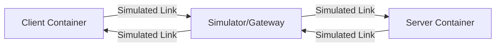

# QUIC Interop Runner 深度解析与标准规范

本文档面向开发者详细解析 [quic-interop-runner](https://github.com/marten-seemann/quic-interop-runner) 的工作原理和测试标准。它不涉及语言对比，而是关注测试框架本身的机制。

## 1. 架构原理 (Architecture)

Interop Runner 旨在创建一个完全隔离、可控的网络环境，用于验证不同 QUIC 实现之间的互操作性。

### 1.1 组件模型

测试运行在一个 Docker Compose 定义的虚拟网络中，包含三个主要角色：

1.  **Client 容器** (Left): 运行待测的 Client 实现（如 quicX-client, quic-go-client）。
2.  **Server 容器** (Right): 运行待测的 Server 实现。
3.  **Simulator/Gateway** (Middle): 连接 Client 和 Server 的网络网关。

所有的流量 **强制** 经过中间的 Simulator。Client 和 Server 并不直接连通。

### 1.2 网络模拟 (Network Simulation)

Runner 不依赖不可靠的公网，而是使用 `ns-3` (或者简单的 Linux `tc` + NetEm) 来精确模拟网络特征：
*   **带宽限制**: 例如 10 Mbps。
*   **延迟 (RTT)**: 例如 20ms。
*   **丢包率**: 例如 1%。
*   **队列大小**: 模拟 Bufferbloat。
*   **Reordering**:乱序发送。

这使得它能测试复杂的拥塞控制算法和丢包恢复机制。

## 2. 接口规范 (Interface Specification)

为了让 Runner 能通过一套脚本驱动所有不同的实现，所有的 Docker 镜像必须严格遵守以下“黑盒协议”。

### 2.1 容器启动协议 (Bootstrap)

Runner 通过环境变量注入配置。你的程序启动时必须读取这些变量：

| 变量名 | 适用方 | 必选 | 描述 |
| :--- | :--- | :--- | :--- |
| `SSLKEYLOGFILE` | Both | Yes | 输出 TLS secrets 的文件路径。用于 Wireshark 解密和分析。 |
| `QLOGDIR` | Both | Yes | 输出 QLog (.qlog) 文件的目录。用于 qvis 可视化。 |
| `Role` | - | - | 你的 entrypoint 脚本通常根据传参 (`client` 或 `server`) 决定启动模式。 |

### 2.2 Server 端规范

*   **监听端口**: 默认 **443** (UDP)。也可以通过 `PORT` 环境变量覆盖。
*   **文件根目录 (`WWW`)**:
    *   环境变量 `WWW` 指定静态文件的根目录（如 `/www`）。
    *   Server **必须** 能读取该目录下的文件并提供下载。
    *   **预置文件**: 测试开始前，Runner 会挂载包含随机数据文件的卷到该目录。文件名通常标示大小，如 `1MB`, `10MB`, `1GB`。
*   **证书**:
    *   证书通常挂载在 `/certs/cert.pem` 和 `/certs/priv.key`。

### 2.3 Client 端规范

*   **目标地址**: 从环境变量 `SERVER` 读取主机名或 IP。
*   **请求列表 (`REQUESTS`)**:
    *   最核心的参数。
    *   格式：空格分隔的 URL 列表。
    *   示例：`https://server:443/data/1MB https://server:443/data/10MB`
*   **下载目录 (`DOWNLOADS`)**:
    *   Client 必须将下载的文件保存到此目录。
    *   文件名必须从 URL 中推导 (e.g. `1MB`)。
    *   Runner 会在测试结束后比对该目录下的文件 hash 与 Server 原始文件是否一致。

## 3. 测试流程 (Workflow)

一次完整的测试用例（Test Case）执行流程如下：

1.  **环境准备 (Setup)**:
    *   Runner 生成随机数据文件 (Payloads)。
    *   Runner 生成本次测试用的 TLS 证书。

2.  **启动 Server**:
    *   `docker run -v /www:... -v /certs:... quicx-image server`
    *   Runner 等待 Server 端口 (443/UDP) 变为可达状态。

3.  **启动网络模拟器**:
    *   配置路由表，通过 `ns-3` 桥接 Client/Server 网段。
    *   应用特定的网络参数（如 `handshake` 场景可能无损耗，`transfer` 场景可能有丢包）。

4.  **启动 Client**:
    *   `docker run -e REQUESTS="..." -v /downloads:... quicx-image client`
    *   Client 开始解析 URL，发起 QUIC 连接，下载文件，保存到磁盘。

5.  **结果验证 (Verification)**:
    *   **退出码**: Client 进程必须返回 0 表示成功。
    *   **文件完整性**: Runner 计算 `/downloads` 中文件的 MD5/SHA256，与 `/www` 中的源文件比对。如果不同，测试失败。

6.  **日志收集与分析**:
    *   收集 `qlog` 和 `pcap`。
    *   如果是特定测试（如 Resumption），Runner 实际上会运行 Client 两次，并检查第二次握手是否用到了 Session Ticket（通过分析 pcap/keylog）。

## 4. 关键测试用例 (Test Cases)

理解标准要求的关键场景：

*   **`handshake`**:
    *   Client 下载一个小文件。验证基础连接建立。
*   **`transfer`**:
    *   下载不同大小的文件（1MB, 10MB）。验证流控、分包、重组。
*   **`retry`**:
    *   Server 配置为要求 Retry (Stateless Retry)。验证 Client 是否能处理 Retry Packet 并重发 Initial。
*   **`resumption`**:
    *   Client 请求一次 -> 关闭 -> 再次请求。
    *   验证是否实现了 0-RTT 或 1-RTT 的 Session Resumption。
*   **`multiconnect`**:
    *   Client 发起连接 -> 用完 -> 再发起新连接。
*   **`zerortt`**:
    *   验证 0-RTT 数据传输（Early Data）。
*   **`http3`**:
    *   更复杂的 H3 交互（Header compression 等）。
*   **`ecn`**:
    *   验证 Explicit Congestion Notification 支持。

## 5. 你的实现 (`interop_*.cpp`) 是如何适配的

回到你的 C++ 代码，它之所以写成那个样子，就是为了**精确匹配**上述规范：

*   **读取 `REQUESTS` 环境变量** -> 为了知道 Runner 想要Client下载什么。
*   **挂载 `Handle` 回调 / `fopen`** -> 为了满足 Server 端必须服务 `/www` 目录下任意文件的要求。
*   **`DownloadHandler` 写文件** -> 为了让 Runner 能在 `/downloads` 卷里找到文件进行哈希比对。

这就是官方 Interop 的核心原理：**通过标准化的容器接口和文件系统副作用，实现黑盒的一致性验证。**
