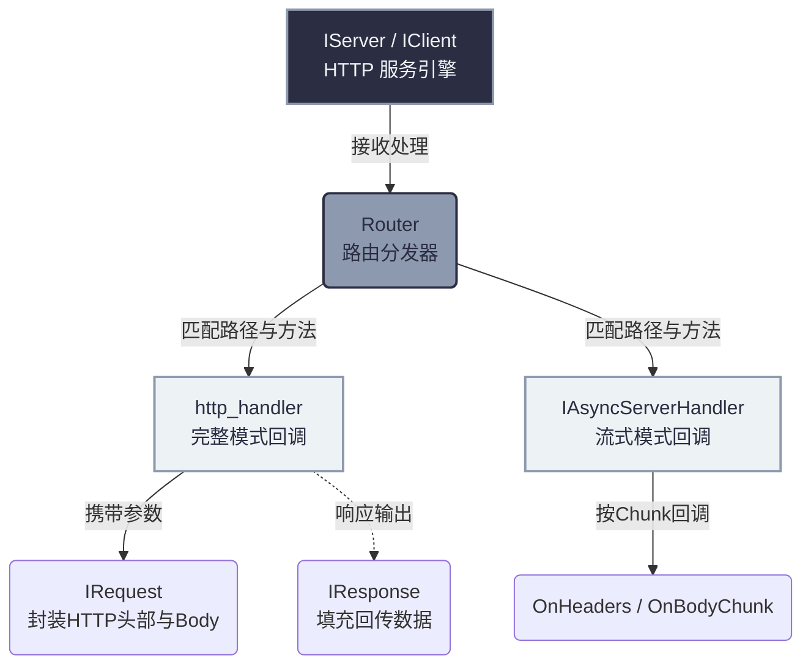

# HTTP/3 应用层 API 核心指南

如果你使用 `quicX` 是为了提供常规的 Web 服务、API 接口或是高吞吐的文件下载。那么你**不需要**直接使用位于 `src/quic/` 的底层接口，而是直接使用 `src/http3/` 提供的开箱即用的应用层 API 模型。

在这里，没有复杂的 Stream 流转、各种底层的控制帧，只有你在传统 Web 框架（如 Express.js / Go Gin / Spring Boot）中非常熟悉的 **服务引擎 (IServer/IClient)**、**处理器 (Handler)**、**请求 (Request)** 和 **响应 (Response)**。

同时，`quicX` 将 HTTP/3 独有的一些强大特性（例如 `Server Push`、无需握手即可开始的 `0-RTT` 以及海量无队头阻塞的多路复用）完全封装在了这套 API 之下。

---

## 架构概览图

在 HTTP/3 层，`quicX` 为你铺平了一切底层的多路复用细节：



---

## 一、 服务端 API：引擎、路由与中间件

对于服务端开发者，你的核心工作面就是 `quicx::IServer` 接口。它承担了配置、路由注册、运行态拦截的功能。

### 1. 启动与配置特性
相比底层的 `QuicConfig`，HTTP/3 提供了一个特殊的包装配置 `Http3ServerConfig`，用于控制应用层边界：

```cpp
auto server = quicx::IServer::Create();

quicx::Http3ServerConfig config;
// -- 1. 底层证书与传输参数配置 (HTTPS/3 强制需要 TLS 1.3 证书) --
config.quic_config_.cert_pem_ = "...";
config.quic_config_.key_pem_ = "...";

// -- 2. HTTP/3 专属限制与特性 --
// 限制恶意客户端不要同时开太多疯狂的请求
config.max_concurrent_streams_ = 200; 

// 是否允许服务器使用 PUSH_PROMISE 帧主动向客户端推送关联资源
config.enable_push_ = true;          

server->Init(config);
server->Start("0.0.0.0", 7001);       // 阻塞当前线程开始接客
```

### 2. 强大的路由分发系统 (Router)
这是 `quicX` 最具业务生产力的地方。内部实现了基于 Trie 树或高效 Hash 表的路由引擎，支持 **精确匹配** 和 **RESTful 风格匹配**。

> [!TIP]
> **路由匹配优先级**：精确匹配 > 命名参数匹配 > 通配符匹配。

```cpp
// ==== A. 精确路径匹配 ====
server->AddHandler(quicx::HttpMethod::kGet, "/api/v1/user", handler);

// ==== B. 后缀通配匹配 ====
// 只要以 /static/ 开头的请求（如 /static/js/app.js），都会自动跌落到这个回调中
server->AddHandler(quicx::HttpMethod::kGet, "/static/*", handler);

// ==== C. RESTful 命名参数捕获 ====
// 可以安全地把 URL 路径中特定的字段提取为变量
server->AddHandler(quicx::HttpMethod::kGet, "/api/v1/user/:id",
    [](std::shared_ptr<quicx::IRequest> req, std::shared_ptr<quicx::IResponse> resp) {
        // 请求为 /api/v1/user/10086 时，可取出参数 "id" -> "10086"
        auto path_params = req->GetPathParams();
        std::string user_id = path_params.count("id") ? path_params.at("id") : "";
    });
```

### 3. 中间件拦截器 (Middleware)
如果你所有的 API 接口都需要校验 Token、或者都需要输出请求耗时、跨域(CORS)处理，就可以使用 `AddMiddleware`。

```cpp
server->AddMiddleware(quicx::HttpMethod::kPost, quicx::MiddlewarePosition::kBefore, 
    [](std::shared_ptr<quicx::IRequest> req, std::shared_ptr<quicx::IResponse> resp) {
        
        // 此回调会发生在真正路由的 Handler 被调用 "**之前 (kBefore)**"
        std::string auth_header;
        if (!req->GetHeader("Authorization", auth_header)) {
            resp->SetStatusCode(401);
            resp->AppendBody("Unauthorized");
            // 只要你提前塞了内容或错误码，后续的真实业务处理将被切断/跳过！
        }
    });
```

---

## 二、 两种处理数据的模式 (Handler / AsyncHandler)

HTTP 世界的 Body 载荷千变万化，有短短几字节的 JSON，也有长达几 GB 的文件上传。为此，`quicX` 贴心地设计了**完整模式** 和 **流式模式**。

### 1. 完整模式（Complete Mode）：针对普通 API / JSON
**痛点特征：** 请求包很小，你想一次性拿到全部的 Header 和 Body，处理完再回去。
**工作机制：** 只要客户端没有发完，这个 Lambda 回调就绝对不会被触发；引擎会在内部缓冲数据，直到拼完全部数据才会发给你。

```cpp
server->AddHandler(quicx::HttpMethod::kPost, "/api/login",
    [](std::shared_ptr<quicx::IRequest> req, std::shared_ptr<quicx::IResponse> resp) {
        
        // 1. 读取已经用 QPACK 解压好的头部
        std::string content_type;
        req->GetHeader("Content-Type", content_type);
        
        // 2. 读取完整请求体 (警告: 这对于大文件会引发内存耗尽或 OOM)
        std::string credentials = req->GetBodyAsString();
        
        // 3. 安全快速填充响应，无需理会何时真正发给网卡
        resp->AddHeader("X-Internal-Token", "abcd");
        resp->SetStatusCode(200);
        resp->AppendBody(std::string("{\"msg\": \"success\"}"));
    });
```

### 2. 流式模式（Streaming Mode）：大文件 / 音视频推流
**痛点特征：** 客户端上传 10GB 蓝光原盘 或者 服务端要长连接喂数据（类似 ChatGPT打字机 / SSE流）。
**工作机制：** 继承 `IAsyncServerHandler` 或向 Request/Response 注册 Provider。来一部分数据就推给你，内存零占用。

**【以服务端接收超大文件为例】**：
```cpp
class FileUploadHandler : public quicx::IAsyncServerHandler {
public:
    // 第 1 步：客户端刚把 HTTP Headers 传过来就触发了。Body 还没开始。
    void OnHeaders(std::shared_ptr<quicx::IRequest> req,
                   std::shared_ptr<quicx::IResponse> resp) override {
        file_ = fopen("upload.dat", "wb"); // 赶紧开个句柄准备接客
        resp->SetStatusCode(200);
    }

    // 第 2 步：网卡上每收到一个流的 Chunk 碎片就抛给你一次
    void OnBodyChunk(const uint8_t* data, size_t len, bool is_last) override {
        if (file_) fwrite(data, 1, len, file_);
        
        if (is_last) { 
            // is_last == true 意味着对端已经发出了 FIN 信号
            if (file_) { fclose(file_); file_ = nullptr; }
        }
    }

    // 第 3 步：意外中止。比如客户端突然拔网线了，连接断卡了。
    void OnError(uint32_t error) override {
        if (file_) { fclose(file_); file_ = nullptr; }
    }
private:
    FILE* file_ = nullptr;
};

server->AddHandler(quicx::HttpMethod::kPost, "/upload", std::make_shared<FileUploadHandler>());
```

---

## 三、 请求体与响应体接口 (IRequest / IResponse)

`IRequest` 和 `IResponse` 不是简单的字典数据结构，它们负责桥接底层的协议栈转换。

### IRequest: 操作入参的利器
* **提取查询参数 (Query)**：对于 `/api?page=1&limit=10`，可直接通过 `GetQueryParams()` 获取到以键值对存好的哈希表。
* **自定义 Provider 控制上传** (主要在 Client 请求层面)：
  如果客户端想发一个超大文件，切忌 `AppendBody` 把文件读进内存，而是提供一个生成器回调（`body_provider`）。
  ```cpp
  FILE* upload = fopen("upload.dat", "rb");
  // 当底层协议栈需要发包而发现没有包可发时，就会跑来问你要
  req->SetRequestBodyProvider([upload](uint8_t* buf, size_t size) -> uint32_t {
      size_t read = fread(buf, 1, size, upload);
      if (read == 0) fclose(upload);
      return read; // 如果返回 0，底层就知道这个 HTTP 流发完了。
  });
  ```

### IResponse: 包装回包的利器
除了常规的 `SetStatusCode` 和 `AddHeader`，它还具备 **Server Push (服务端主动推送)** 的能力！
* **Push Promise 原理**：当客户端请求 `index.html` 时，服务端不仅返回 HTML，还可以通过 `AppendPush()` 预测客户端一会儿需要请求 `style.css`，于是提前把 css 的响应准备好，随主请求一起压过去。客户端浏览器在解析完 html 时，会发现缓存里已经躺着 css 数据了。

```cpp
auto push_resp = quicx::IResponse::Create();
push_resp->SetStatusCode(200);
push_resp->AppendBody("body { color: red; }");
push_resp->AddHeader("content-type", "text/css");
// ... 设置更多的 push_resp 属性

// 把这个预备好的 css 响应塞进给客户的 html 主响应中
resp->AppendPush(push_resp);
```

---

## 总结

你不需要成为一个 QUIC 协议专家也能用 `quicX` 写出高性能的内网 Web 接口。这套接口为你隔离了如下残酷真相：
- **无感知的 QPACK 压缩**：无论你 `GetHeader` 还是 `AddHeader`，底层都是用基于静态字典和动态哈希表的 Huffman 树在全自动编解码。
- **并发与队头阻塞**：一个客户端不管同时并行向你发起 200 个文件请求，底层的传输通道是一路畅通完全无队头排队的。因为每个请求背后都被隔离在了 QUIC 独立的 Stream 状态机里。你要做的，只是单纯且快刀斩乱麻地处理每一个你的 `Handler` 即可。
