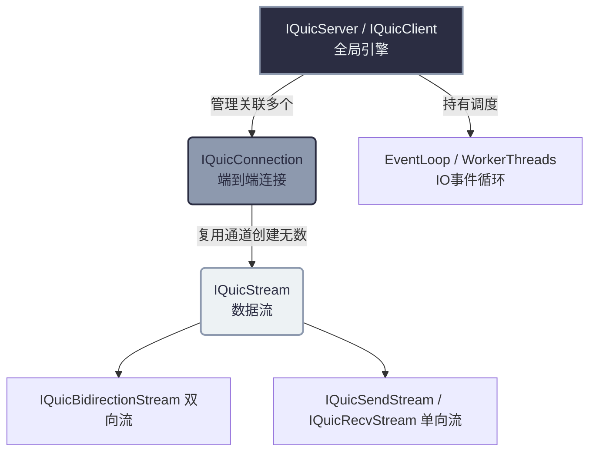

# QUIC 传输层 API 核心指南

如果你希望基于 `quicX` 裸跑 QUIC 协议（而不是 HTTP/3），去开发高度定制的私有 RPC、游戏加速通道或是物联网协议，那么你需要直接接触其底层的 **QUIC 传输层 API**。

在这篇指南中，我们将从接口抽象到配置详解，深入介绍 `quicX` 最核心的抽象概念：**Engine (引擎)**、**Connection (连接)** 和 **Stream (流)**。

---

## 架构概览图

在 `quicX` 的世界里，资源和生命周期的从属关系如下：



---

## 一、 核心配置与参数调优体系

控制 QUIC 行为的配置体系分为**三大层级**，这也体现了 QUIC 协议本身高度可定制的特点。

### 1. `QuicConfig`：全局运行态配置
决定 `quicX` 本身的运作方式，如线程模型、日志机制、以及高级 TLS 特性。
```cpp
quicx::QuicConfig config;

// --- 线程模型 ---
// kSingleThread: 适合极低延迟场景，没有线程间切换开销。
// kMultiThread: 适合高并发，底层的连接会根据 hash 被平摊到多个 worker 上。
config.thread_mode_ = quicx::ThreadMode::kMultiThread;
config.worker_thread_num_ = 4; // 启动 4 个 Worker 线程

// --- 高级网络与安全特性 ---
config.enable_0rtt_ = true;        // 开启 0-RTT（需要之前有过连接留下了 session ticket）
config.enable_key_update_ = false; // 密钥自动轮换 (RFC 9001)
config.quic_version_ = quic::kQuicVersion2; // 使用 QUIC v2 (RFC 9369)
config.keylog_file_ = "keys.log";  // 强烈建议在开发中配置！使用 Wireshark 解密包必需。
```

### 2. `QuicTransportParams`：传输层参数配置 (握手时协商)
这些参数会在握手时被打包进 TLS Certificate 阶段告诉对端。它主要控制**流量控制 (Flow Control)** 和 **超时策略**。这直接影响你可以发多快的数据：
```cpp
quicx::QuicTransportParams tp;

// 最大空闲时间 (如果不发保活包 KeepAlive，多久后连接断开)
tp.max_idle_timeout_ms_ = 120000; // 默认 2 分钟

// 初始流量控制窗口 —— 非常关键！如果你想做大文件传输，必须调大！
tp.initial_max_data_ = 64 * 1024 * 1024;                    // 整个连接维度的窗口 (64MB)
tp.initial_max_stream_data_bidi_local_ = 16 * 1024 * 1024;  // 单个本地发起的流窗口 (16MB)

// 流数量限制：连接建立后你可以同时开多少个并发 Stream
tp.initial_max_streams_bidi_ = 200;
```

### 3. `MigrationConfig`：连接迁移配置
QUIC 最牛逼的特性之一——哪怕你的 Wi-Fi 切换到了 5G 移动网络（IP/端口变了），连接也不断。
```cpp
quicx::MigrationConfig mc;
mc.enable_active_migration_ = true;       // 允许客户端主动发起迁移
mc.enable_nat_rebinding_ = true;          // 允许被动检测 NAT 映射变化
```

---

## 二、 核心对象 API 全解

### 1. The Engine: `IQuicServer` / `IQuicClient`
这是全局单例引擎。无论是服务端还是客户端，逻辑上只应该实例化一次。

* **连接调度**：它内部管理 UDP Socket。当一个新连接握手成功时，会抛出事件。
```cpp
auto server = quicx::IQuicServer::Create(tp); // 在 Create 时带入传输层配置 tp

server->SetConnectionStateCallBack(
    [](std::shared_ptr<quicx::IQuicConnection> conn, 
       quicx::ConnectionOperation op, uint32_t error, const std::string& reason) {
        if (op == quicx::ConnectionOperation::kConnectionCreate && error == 0) {
            std::cout << "握手成功, 证书验证通过!" << std::endl;
        }
    });

quicx::QuicServerConfig server_config;
server_config.config_ = config; // 带入上面的 QuicConfig
server_config.cert_pem_ = "..."; // 放入证书
server_config.key_pem_ = "...";  // 放入私钥

server->Init(server_config);
server->ListenAndAccept("0.0.0.0", 7001);
```

### 2. The Channel: `IQuicConnection`
这代表了一个安全的加密端到端连接。**请记住：你不能直接向 Connection 写业务数据！**

它主要有以下妙用：
* **透传用户状态**：通过 `conn->SetUserData(void*)` 将你自己的 `PlayerContext` 绑定在上面。
* **挂载轻量定时器**：利用 `conn->AddTimer(callback, timeout_ms)` 可以不依赖外部定时器，精准在当前连接的生命周期内执行逻辑。
* **核心动作——创造流**：
```cpp
// 监听对方开的流
conn->SetStreamStateCallBack(
    [](std::shared_ptr<quicx::IQuicStream> stream, uint32_t err) {
        if (err == 0 && stream->GetDirection() == quicx::StreamDirection::kBidi) {
            // 我们拿到了一条对方发起的双向流
        }
    });

// 我方主动开流开辟通道
auto my_stream = conn->MakeStream(quicx::StreamDirection::kBidi);
```

### 3. The Carrier: `IQuicBidirectionStream`
这是真正承载你应用层比特流的货车。请把它当作一个支持 0-RTT 取消了队头阻塞的、独立而且廉价的 TCP 连接。

```cpp
auto bidi_stream = std::dynamic_pointer_cast<quicx::IQuicBidirectionStream>(my_stream);

// ----------------- 发送端工作流 -----------------
std::string msg = "Ping Protocol Version 1";
bidi_stream->Send((uint8_t*)msg.data(), msg.length());

// ----------------- 接收端工作流 -----------------
bidi_stream->SetStreamReadCallBack(
    [](std::shared_ptr<quicx::IBufferRead> buffer, bool is_last, uint32_t error) {
        if (error != 0) return; // 流出错了

        char recv_buf[1024] = {0};
        uint32_t len = buffer->Read((uint8_t*)recv_buf, sizeof(recv_buf));
        std::cout << "Read Data: " << std::string(recv_buf, len) << std::endl;

        if (is_last) {
            std::cout << "这是发送方发来的最后一块数据 (对端发送了 FIN)!" << std::endl;
        }
    });
```

> [!WARNING]
> **线程安全警告：绝不要阻塞底层的 I/O Worker！**
> `SetStreamReadCallBack` 中的回调代码，是由内部 Worker 线程**同步调用**的。
> 请绝对不要在这个回调中执行系统调用阻塞（如 `sleep()`、阻塞查库 `mysql.query()`）、甚至长时间计算（比如人脸识别），否则引擎将在该线程上完全挂起，收不到任何后续的 QUIC 包。请将耗时任务投递到你自己的 `ThreadPool` 中执行。
